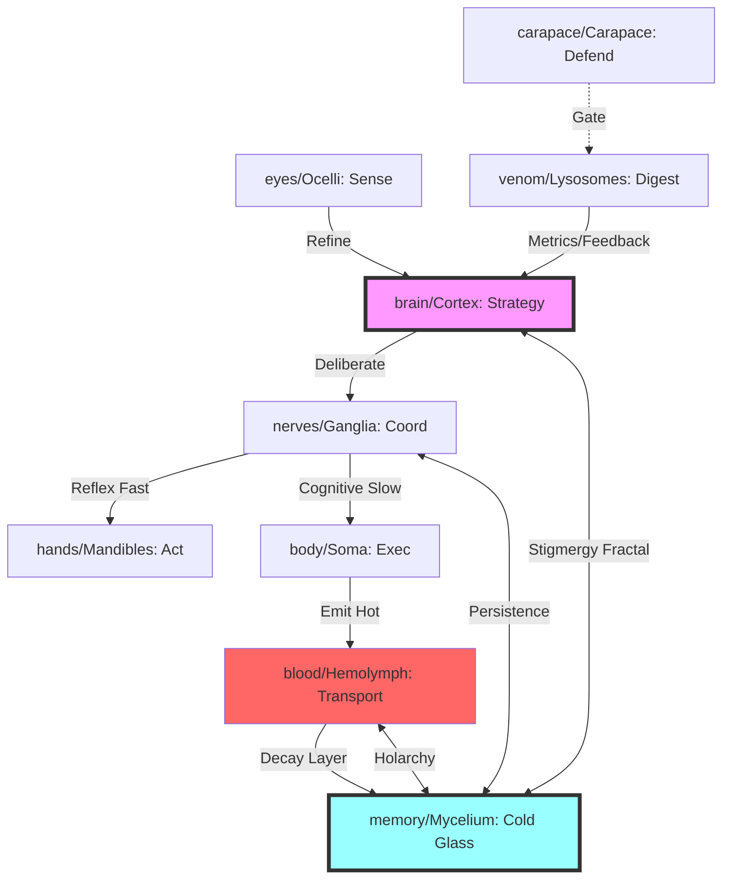

# 🦅 Intent: Swarmlord's Obsidian Melt-Glass Refinement: Hive Organs & Stigmergy Gen51→53

> **Status**: Draft (Librarian Generated)
> **Cluster**: Biology

## 1. BLUF & Matrix
**BLUF**: Forge Gen51 volatile stubs into Gen53 antifragile obsidian holarchy: MAP-Elites evolves champion organs; layered stigmergy (NATS hot-pheromones → Vector embeds → Mycelium glass) ensures recursive persistence. Multi-speed loops resolve stasis/reflex stasis. Advance: Select champions, emit fractally.

### The Matrix
| Key | Value |
| :--- | :--- |
| Directory | brain/ |
| Directory | eyes/ |
| Directory | body/ |
| Directory | nerves/ |
| Directory | hands/ |
| Directory | blood/ |
| Directory | carapace/ |
| Directory | venom/ |
| Directory | memory/ |

---

## 2. Visual Architecture


---

## 3. Cognitive Digest
### Evolutionary Conflicts
*   Gen51 stub stasis vs Gen53 MAP-Elites fluidity
*   Reflex speed vs holarchic recursion depth
*   Emergent bottom-up pheromones vs top-down organ rigidity
*   NATS hot volatility vs Mycelium cold antifragility

### Strategic Options (For Overmind Decision)
#### Option: Rapid Stub Prototyping Forge
*   **Pros**: Accelerates melt to testable glass shards; maps organs swiftly
*   **Cons**: Risks brittle silos absent evolution
*   **Alignment**: 0.68

#### Option: MAP-Elites Champion Evolution
*   **Pros**: Breeds elite holarchic gene-seeds; scales Gen51→53 refinement
*   **Cons**: Demands metric calibration & compute melt
*   **Alignment**: 0.97

#### Option: Layered Obsidian Stigmergy Cascade
*   **Pros**: Hot NATS/YAML/Vector → cold Mycelium persistence; fractal antifragility
*   **Cons**: Requires signal damping to prevent cascade overload
*   **Alignment**: 0.99

#### Option: Multi-Speed Holarchic Recursion
*   **Pros**: Harmonizes reflex/cognition; organs-within-organs loops
*   **Cons**: Elevates sync complexity; demands lysosome stress gates
*   **Alignment**: 0.95


---

## 4. Declarative Intent (Draft)
```gherkin
Feature: Obsidian Melt-Glass Refinement for Antifragile Hive Holarchy
  As the Swarmlord
  I want Gen51 stubs melted into Gen53 obsidian organs via stigmergy
  So that Hive recurses fractally under stress.

  Scenario: Forge MAP-Elites Champions
    Given Gen51 organ stubs with traces
    When MAP-Elites evolves archive
    Then select/deploy top gene-seed to holarchy
    And persist as Mycelium glass links.

  Scenario: Layered Hot-to-Cold Stigmergy
    Given agent reflex/event
    When emit NATS hot-pheromone + YAML + Vector embed
    Then Mycelium forges emergent cold holarchy.

  Scenario: Multi-Speed Loop Harmony
    Given stress reflex
    When Ganglia fast-bypasses Cortex
    Then Carapace/Lysosomes validate & reinforce recursion.

  Scenario: Antifragile Persistence
    Given volatile NATS decay
    When Hemolymph cascades to Mycelium
    Then obsidian glass endures fractal emission.
```
