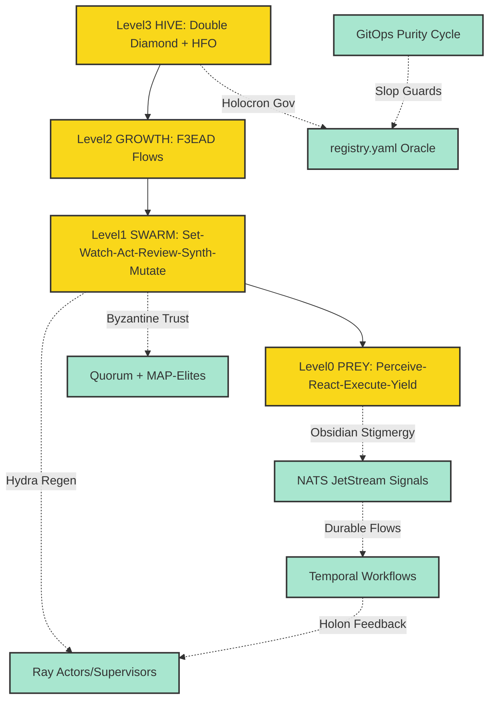

# 🦅 Intent: Gen53→55 Obsidian Melt-Glass Refinement: Fractal Holarchy Crystallization

> **Status**: Draft (Librarian Generated)
> **Cluster**: Infrastructure

## 1. BLUF & Matrix
**BLUF**: Obsidian melt-glass transmutes Gen51/52 stubs into Gen55 holon purity: Fractal loops fully crystallized (PREY→HIVE OODA), Stigmergy fused (NATS→Temporal→Hydra), GitOps hooks perfected, Holocron governs, Byzantine quorums seeded. Impurities purged; swarm emergence primed.

### The Matrix
| Key | Value |
| :--- | :--- |
| Component | GitOps |
| Component | Governance |
| Component | Hydra |
| Component | Loops |
| Component | Stigmergy |
| Component | Temporal |
| Component | Trust |

---

## 2. Visual Architecture


---

## 3. Cognitive Digest
### Evolutionary Conflicts
*   Lingering stub entropy in Trust quorums: Accelerate impl infusion
*   Partial Hydra-Stigmergy linkage: Complete regen-signal loops
*   Holocron validation lags GitOps velocity: Sync oracle hooks
*   Scale-test gaps in HIVE-level orchestration: Simulate fractal emergence
*   Gen54 stall risk: Ignite artifact genesis post-refinement

### Strategic Options (For Overmind Decision)
#### Option: Crystallize Loops + Stigmergy Core
*   **Pros**: Forges unbreakable Fractal Holarchy base, unlocks emergent scaling
*   **Cons**: Briefly sequesters infra hardening
*   **Alignment**: 1.0

#### Option: Fuse All Signals (NATS→Temporal→Hydra)
*   **Pros**: Instantiates stigmergic durability + regen, accelerates swarm coherence
*   **Cons**: Requires loop spec stability to avoid cascade flux
*   **Alignment**: 0.95

#### Option: Holocron-GitOps Sync Sprint
*   **Pros**: Ensures governance purity at velocity, slop extinction
*   **Cons**: Defers deep holon integrations
*   **Alignment**: 0.85

#### Option: Seed Byzantine Trust Impl
*   **Pros**: Inoculates against faults from genesis, enhances resilience
*   **Cons**: Overhead without full signal loops
*   **Alignment**: 0.9


---

## 4. Declarative Intent (Draft)
```gherkin
Feature: Gen53→55 Obsidian Melt-Glass Holarchy Crystallization
  As the Swarmlord Overmind
  I want Gen51/52 impurities melted into Gen55 holon implementations
  So that Fractal Holarchy manifests unbreakable swarm supremacy.

  Scenario: Core Holarchy Forging
    Given melted Gen53 digest (stubs purged, loops crystallized)
    When prioritizing >0.9 alignment options (Loops/Stigmergy fusion)
    Then PREY fractals cascade to HIVE orchestration
    And NATS stigmergy endures via Temporal-Hydra loops
    And GitOps-Holocron enforces zero-slop evolution

  Scenario: Entropy Annihilation
    Given residual conflicts (stubs, dislinks, stalls)
    When melt-glass refines to Gen55 purity
    Then strategic options propel artifact genesis
    And Byzantine quorums inoculate holon resilience
```
