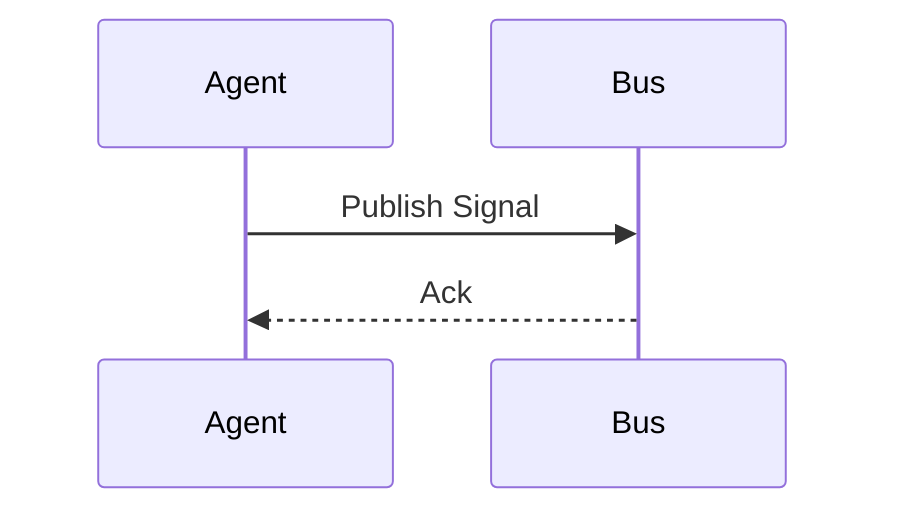

# 📜 The HFO Literate Spec: The Unified Truth

> **Context**: This document defines the **Single Source of Truth** for Gen 53. It combines Human Context (Digest/Map) with Machine Intent (Gherkin) in a single `.md` file.

## 1. The Structure (The 4 Layers)

Every Spec file (`brain/intents/*.md`) must follow this structure:

### Layer 1: The BLUF & Matrix (The "What")
*   **BLUF**: 1-2 sentences summarizing the intent.
*   **The Matrix**: A table defining the key entities, roles, or data structures involved.

### Layer 2: The Visuals (The "Where")
*   **Mermaid Diagrams**: Diverse formats (Flowchart, Sequence, Class, State, Mindmap).
*   **Blurb Notes**: Short, punchy annotations explaining *why* the diagram looks this way.

### Layer 3: The Cognitive Digest (The "Why")
*   **Executive Summary**: A 1-page synthesis of the strategy.
*   **Research Vectors**: A list of "Next Steps" or "Keywords" to explore if this spec is insufficient.

### Layer 4: The Declarative Intent (The "How")
*   **Gherkin Block**: The formal `Feature` and `Scenario` definitions.
*   **Machine Parseable**: This block is extracted by `extract_specs.py` for testing.

---

## 2. The Template

```markdown
# 🦅 [Title]: [Subtitle]

> **Status**: [Active/Draft]
> **Octet**: [Ontos ID] | [Chronos Date] | [Telos Purpose]

## 1. BLUF & Matrix
**BLUF**: [The single most important takeaway.]

| Entity | Role | Description |
| :--- | :--- | :--- |
| **Agent** | Actor | The doer of things. |
| **NATS** | Bus | The carrier of signals. |

---

## 2. Visual Architecture
> **Note**: This flow represents the "Happy Path".



---

## 3. Cognitive Digest
### Executive Summary
[The strategic narrative. Why this matters. How it fits into the Octet.]

### Research Vectors
*   [ ] **Keyword 1**: [Context]
*   [ ] **Topic 2**: [Context]

---

## 4. Declarative Intent (Gherkin)
```gherkin
Feature: [Feature Name]
  As [Role]
  I want [Action]
  So that [Benefit]

  Scenario: [Scenario Name]
    Given [Context]
    When [Event]
    Then [Outcome]
```
```
