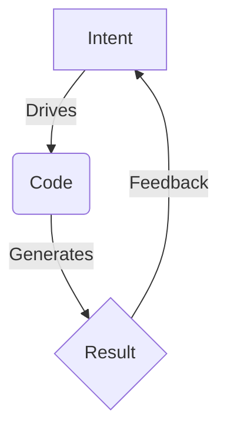

# 🦅 The Swarmlord Digest: The Cognitive Global Workspace

> **Context**: This is the **Canonical Format** for all HFO outputs. It combines **Intent (Gherkin)**, **Visualization (Mermaid)**, and **Synthesis (Digest)** into a single "Second Brain" artifact.

## 1. The Structure (The Triad)

Every major artifact must contain these three sections in order:

### A. The Executive Summary (The Digest)
*   **BLUF**: Bottom Line Up Front. 1-2 sentences.
*   **The Matrix**: A table summarizing the key data/decisions.
*   **The Why**: The strategic reasoning.

### B. The Visualization (The Map)
*   **Mermaid Diagram**: A visual representation of the concept, flow, or architecture.
*   **Type**: Flowchart, Sequence, Class, or Mindmap.

### C. The Intent (The Spec)
*   **Gherkin Feature**: The formal BDD specification.
*   **Traceability**: Links to the specific code files that implement this intent.

---

## 2. The Template

```markdown
# 🦅 [Title]: [Subtitle]

> **Status**: [Active/Draft]
> **Octet**: [Ontos ID] | [Chronos Date] | [Telos Purpose]

## 1. Executive Summary (Digest)
**BLUF**: [The single most important takeaway.]

### The Matrix
| Concept | Value | Note |
| :--- | :--- | :--- |
| **Key 1** | Value 1 | Context |
| **Key 2** | Value 2 | Context |

**Strategic Rationale**:
[Why we are doing this. The trade-offs considered.]

---

## 2. Visualization (Map)


---

## 3. Formal Intent (Spec)
```gherkin
Feature: [Feature Name]
  As [Role]
  I want [Action]
  So that [Benefit]

  Scenario: [Scenario Name]
    Given [Context]
    When [Event]
    Then [Outcome]
```
```
