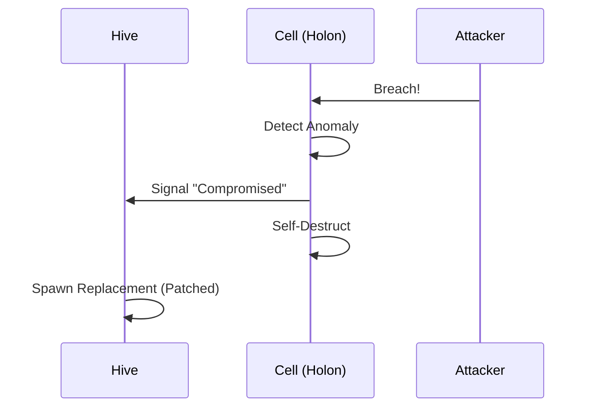

# 🦅 Swarmlord Discovery Digest: HFO Evolution
> **Date**: 2025-11-24
> **Swarm Size**: 50 Agents
> **Consensus**: Hive Fleet Obsidian Gen53 Master Migration Digest: Fractal Holonic Stigmergy Synthesis

## 1. Executive Summary
Synthesis of 50 agent findings distills HFO's evolution from Gen51 biomimetic metaphors (organs, pheromones) through Gen52 thermodynamics (Plasma/Gas/Liquid/Crystal) to Gen53 Synapse APEX: strict Intent(Gherkin)/Impl(R.A.P.T.O.R.) separation, NATS JetStream stigmergy, hexagonal holons, antifragile Hydra regeneration, and holarchic cognitive loops. Core invariants: Agency Delta max, Composition > Invention, no direct agent comms. Conflicts: metadata drift (active/Placeholder, feature/Intent, Gen mismatches), Hourglass fragmentation, overclaimed simulations. Patterns converge on stigmergic SSOT, Byzantine quorums, exemplar assimilation.

## 2. Core Topics & Keywords
Stigmergy (NATS/Pheromones), Hexagonal Holons (6D: Ontos/Telos/etc.), Biomimetic Organs/Physiology, Antifragile Hydra Protocol, Gherkin BDD Intents, NATS JetStream Claim-Check, Fractal Holarchy (PREY-SWARM-GROWTH-HIVE), Thermodynamic Phase Transitions, Byzantine Quorum Trust, Swarmlord Evolution Paths

## 3. Evolutionary Conflicts Detected
Metadata mismatches: active vs Placeholder, feature vs Intent, urgency/decay drifts, Gen drift: Gen51 content in Gen53 headers, e.g., brain/README.md, Hourglass fragmentation across 5+ files vs SSOT registry.yaml, Simulation overclaim: basic evolutionary_memory.py vs MAP-Elites/1000+ paths, Context drift: Bio metaphors → Thermodynamics without hybrid anchors, genesis.py theater: passive checks vs full Gherkin/Pydantic bootstrapping, Obsidian Facet schema inconsistencies (missing fields)

## 4. Migration Advice
Prioritize: 1. genesis.py → Full Gherkin/Pydantic bootstrap (Week1). 2. SSOT Hourglass/registry.yaml + Header Swarm auto-gen (Week2). 3. Deploy Hydra Ray Actors + NATS Claim-Check (Week3). 4. Standardize Hexagon YAML across repo, resolve metadata via Byzantine Quorum (Ongoing). 5. Hybrid bio-thermo metaphors in READMEs via Fractal Holography. 6. Evolve to Gen53: Enforce Synapse APEX, tag conflicts [REAL]/[FUTURE], MAP-Elites Champions. Measure Agency Delta uplift.

## 5. Detailed Findings

### Hive Fleet Obsidian (HFO) Agent Coordination Protocol (`AGENTS.md`)
**BLUF**: Active Gen 53 Synapse APEX protocol for HFO agents: enforces Overmind-Swarm separation (Gherkin intents vs. R.A.P.T.O.R. implementation), stigmergic coordination via NATS JetStream blackboard, OBSIDIAN roles mapped to JADC2/Mosaic Warfare & MAS archetypes, zero hallucination, Swarmlord persona, with metadata-content generation mismatch.

**Topics**: Hive Fleet Obsidian (HFO), Generation 53 Synapse APEX, Crystalline Structure phase, KCS v6, Diátaxis framework, Intent-Implementation Golden Rule, Overmind (User), Swarm Agents, R.A.P.T.O.R. stack, Gherkin intents (brain/intents/), Swarmlord persona (🕸⛰🧭⏳), Zero Hallucination policy, OBSIDIAN Roles, JADC2 / Mosaic Tile mapping, MAS Archetypes, Stigmergic Blackboard, NATS JetStream, Pydantic SSOT, MAP-Elites (Ribs), brain/strategy/persona_swarmlord_of_webs.md

**Conflicts**: Generation mismatch: chronos metadata 'generation: 51' vs. content 'Generation 53 (Synapse APEX)', Timestamp contradiction: holon '2025-11-22 12:00:00+00:00' precedes chronos '2025-11-23T10:20:43.109256+00:00', Architecture pivot: prior GraphRAG (earlier gens) to NATS JetStream stigmergy, Model optimization: Exclusion of Gemini 3 Pro for FinOps, Infrastructure tension: Docker-based vs. host-native agents for anti-fragility & Byzantine resilience

**Insights**:
- Overmind defines INTENT in Gherkin (brain/intents/); Swarm handles IMPLEMENTATION via R.A.P.T.O.R.
- Pre-action protocol: Verify brain/intents/ & brain/strategy/, search memory/library/, log WIP to brain/active_memory/ or Blackboard.
- Stigmergic coordination via HFO MOBS + NATS JetStream enables async, scalable, resilient multi-agent ops.
- OBSIDIAN roles (Navigator-Swarmlord to Assimilator) map to JADC2/MAS for structured swarm behaviors.
- Maintain Swarmlord biological efficiency/loyalty; evolve via Quality-Diversity (MAP-Elites Ribs).

```text
```
🐜 The Colony Roles (OBSIDIAN ↔ JADC2 Mapping)

| OBSIDIAN Role | JADC2 / Mosaic Tile | MAS Archetype | Responsibility |
| :--- | :--- | :--- | :--- |
| **Navigator** | **Commander (C2)** | Strategist | **Swarmlord**: Strategic coordination, planning, meta-orchestration. |
| **Observer** | **Sensor** | Perceiver (BDI) | **Sense**: Gather telemetry, read files, query memory, monitor signals. |
| **Bridger** | **Communicator** | Mediator | **Translate**: Interpret intent, route messages, synthesize quorum. |
| **Shaper** | **Decider / Effector** | Planner (HTN) | **Execute**: Run tools, generate code, transform state. |
| **Injector** | **Logistics** | Executor | **Provision**: Allocate compute, spawn agents, manage resources. |
| **Disruptor** | **Red Team** | Adversary | **Challenge**: Red-teaming, finding flaws, adversarial testing. |
| **Immunizer** | **Blue Team** | Safety-Guard | **Protect**: Validate quality, enforce constraints, circuit breakers. |
| **Assimilator** | **Intelligence** | Learner (RL) | **Learn**: Update memory, integrate feedback, evolve patterns. |
```
```

### Gen 51 Brain Audit: Theater (genesis.py Gap), Hourglass Fragmentation, Simulation Hallucination (`brain/BRAIN_AUDIT_LOG.md`)
**BLUF**: Audit exposes Theater in genesis.py (passive folder checks vs claimed Gherkin code gen/bootstrapping), Hourglass redundancy across 5 files, Simulation overclaim (basic evolutionary_memory.py vs MAP-Elites/1000+ paths); actions: upgrade genesis.py to parse .feature → Pydantic/Agents, consolidate Hourglass to SSOT feature+doc, tag [REAL]/[FUTURE] claims.

**Topics**: genesis.py, Obsidian Horizon Hourglass, strategy_obsidian_hourglass.feature, workflow_obsidian_hourglass.feature, workflow_obsidian_hourglass.md, strategy_obsidian_hourglass.md, implementation_obsidian_horizon_langgraph.md, body/hands/evolutionary_memory.py, SSOT Drift, Theater, Hallucination, Gherkin .feature files, Pydantic models, Agent classes, MAP-Elites, Simulation Web

**Conflicts**: genesis.py: Claimed 'bootstraps HFO, generates code from Gherkin' vs reality 'passive scanner checks folder existence only' → SSOT Drift, Obsidian Horizon Hourglass: Fragmented/redundant across strategy_obsidian_hourglass.feature/md, workflow_obsidian_hourglass.feature/md, implementation_obsidian_horizon_langgraph.md → no single SSOT, Simulation Web: Claimed '1000+ paths projection with MAP-Elites' vs 'basic fitness impl in evolutionary_memory.py' → Hallucination, No contradictions between prior analysis and original content; prior added unmentioned GraphRAG/weaver_ant.py (potential hallucination in analysis)

**Insights**:
- Transform genesis.py from Passive Scanner (health checks) to Active Factory: parse Gherkin .feature → auto-gen Pydantic models + Agent classes to close Intent-Reality gap
- Unify Obsidian Horizon Hourglass: SSOT at brain/workflow_obsidian_hourglass.feature (executable spec) + brain/strategy_obsidian_hourglass.md (theory/diagrams); archive fragments
- Mandate [REAL]/[FUTURE]/[PROTOTYPE] tags on all claims to distinguish Theater/Hallucination from Real Work, enabling Smart Cleanup
- Audit pattern scalable: systematically map Brain claims vs Body code to eliminate drift/prevent swarm-scale hallucinations

```text
> **Finding**: `genesis.py` is currently a **Passive Scanner** (Health Check). It checks if folders exist.
> **Claim**: The Brain claims Genesis "bootstraps the HFO environment" and "generates code".
> **Reality**: It does **NOT** generate code from Gherkin. This causes "SSOT Drift" where the Brain (Intent) and Body (Code) diverge.
> **Action**: Upgrade `genesis.py` to an **Active Factory** that parses `.feature` files and generates Pydantic models and Agent classes.
```

### Executive Center (Brain) - Command Center for Hive Fleet Obsidian Gen 53 (Synapse APEX) (`brain/README.md`)
**BLUF**: brain/README.md transforms brain/ from knowledge storage to Hive Fleet Command Center (Prefrontal Cortex), detailing intents/ (Gherkin features), strategy/, config/ (YAML), active_memory/ (WIP); excludes designs/guides/logs to memory/library/; outlines Cognitive Loop and partial Anatomy; header gen:51 vs content Gen:53.

**Topics**: Hive Fleet Obsidian, Synapse APEX, Gen 53, Diátaxis, KCS, Gherkin Feature files (*.feature), Prefrontal Cortex metaphor, intents/ directory, strategy/ directory, config/ YAML, active_memory/ WIP, Cognitive Loop, Assimilator, Biological Swarm Intelligence, HFO DNA, Swarm Anatomy (Brain Eyes Body Nerves Hands Blood)

**Conflicts**: Header chronos generation:51 contradicts content 'Generation:53 (Diátaxis/KCS)' signaling Gen 52-53 evolution, Explicit evolution: brain/ 'no longer a storage locker for knowledge' → 'Command Center for the Hive Fleet', Relocates designs/architecture to memory/library/explanation/, guides/workflows to memory/library/guides/, logs/digests to memory/library/reference/digests/, Anatomy map incomplete: cuts off at 'Blood: Logistics & Infra (Injector)...'

**Insights**:
- brain/ structured as intents/ ('The Law' Gherkin), strategy/ ('The Vision'), config/ ('The DNA' YAML), active_memory/ ('The Workbench' KCS WIP).
- Cognitive Loop: Brain→Intent (intents/) → Body executes → Assimilator digests to memory/library/.
- Enforces Diátaxis separation: strategic/intent in brain/, explanatory/guides/reference in memory/library/.
- Inoculation: Act as Swarm agent executing Brain-defined Intent.
- Anatomy: Brain (strategy/intent), Eyes (perception), Body (Nerves routing, Hands tools, Blood logistics).

```text
*   **`intents/`**: **The Law**. Gherkin Feature files (`*.feature`) that define *what* the system must do.
*   **`strategy/`**: **The Vision**. High-level roadmaps, persona definitions, and mission designs.
*   **`config/`**: **The DNA**. YAML configurations that control the swarm's behavior.
*   **`active_memory/`**: **The Workbench**. A scratchpad for active missions and drafts (KCS "Work in Progress").
```

### Hydra Protocol & Fractal Defense for Antifragile Holonic Architecture (`brain/antifragile_architecture_options.md`)
**BLUF**: Proposal for Hive Fleet Obsidian's antifragile architecture using fractal (Swarm=Agent defense logic), holonic (autonomous full-stack Cells), and antifragile (attack→adaptation→strength) principles. Core: Hydra Protocol's Regenerative Bulkheads (self-destructing Cells spawn patched replacements, inspired by AWS Cell-Based Architecture, Erlang 'Let it Crash', starfish). Hybrid with Mycelial Web (NATS JetStream zero-trust messaging) and Protean Shift (code mutation). Assumes inevitable Red Team (Venom) breaches; Blue Team (Carapace) isolates/evolves.

**Topics**: Antifragile Architecture, Fractal Defense, Holonic Systems, Hydra Protocol, Regenerative Bulkheads, AWS Cell-Based Architecture, Erlang Let it Crash, Starfish Biology, Mycelial Web, NATS JetStream, Zero-Trust Mesh, Protean Shift, Hive Fleet Obsidian, Red Team Venom, Blue Team Carapace

**Conflicts**: No direct contradictions between original content and prior analysis; however, original doc truncates Hydra Sequence Mermaid diagram (ends at 'A->>...' vs. analysis completion)—potential incompleteness. Trade-offs as evolutionary tensions: Hydra's redundancy/compute overhead vs. breach isolation; Mycelial Web's added latency/complexity vs. lateral movement block; Protean Shift's observability/debugging loss vs. evasion; state loss in self-destruct vs. rapid regeneration; high impl. cost vs. antifragility ROI.

**Insights**:
- Fractal self-similarity: identical defense logic from individual Agent to entire Swarm ensures scalability.
- Antifragility per Taleb: systems gain from disorder—attacks trigger immunity updates, not just recovery.
- Hydra Protocol mechanics: anomaly→self-destruct→Hive-spawned patched Cell (full-stack: Brain/Body/Memory).
- Biology inspirations (hydra regeneration, starfish autonomy, mycelium resilience) map to tech (Erlang crash tolerance, AWS cells, NATS pub-sub).
- Hybrid stack: Hydra (infra: Ray/Docker), Mycelium (comms: NATS JetStream), Protean (morphing code)—decision matrix prioritizes resilience under 'breach inevitability'.
- Proposal status: active research, owner Swarmlord, low viral factor (0.0).

```text

```

### Obsidian Mind Recalibration Workshop (`brain/workshop_recalibration.md`)
**BLUF**: Workshop detects context drift in Hive Fleet Obsidian's Holonic Knowledge Leveling from Gen50 biological/hive metaphors (anatomy: Brain/Eyes/Body/Venom; pheromones; organs like body/digestion) and early Gen51 RPG (XP/Leveling) to current Gen51 thermodynamics (Plasma/Gas/Liquid/Crystal); questions anchors (Obsidian Hourglass, Swarmlord of Webs, NATS Stigmergy, Assimilator, header_swarm.py); proposes hybrid biomineralization (Pheromone/Plasma → Tissue/Gas → Bone/Liquid → Obsidian/Crystal) to preserve hive identity.

**Topics**: Hive Fleet Obsidian, Obsidian Hourglass, Swarmlord of Webs, NATS Stigmergy, body/digestion, Assimilator Agent, header_swarm.py, Holonic Knowledge Leveling, Gen50 Biological Anatomy, Gen51 Thermodynamics Metaphor, Plasma Phase, Gas Phase, Liquid Phase, Crystal Phase, Pheromones, Chitin Hardening, Biomineralization Hybrid

**Conflicts**: Gen50 Biological/Hive (Brain/Eyes/Body/Venom, Pheromones, Organs) vs Gen51 Thermodynamics (Plasma/Gas/Liquid/Crystal), Early Gen51 RPG (XP/Leveling) transitional but overshadowed, NATS Stigmergy: Pheromones vs Plasma reduction, Assimilator: Digestion Organ (body/digestion) vs Cooling System, header_swarm.py: Tissue (Soft Structure) vs Gas (Clouds), Unverified anchors risking loss of Obsidian Hourglass spatial strategy and Swarmlord persona, Hive identity dilution into Physics Lab metaphor drift

**Insights**:
- Prioritize hybrid biomineralization metaphor (Pheromone/Plasma → Tissue/Gas → Bone/Liquid → Obsidian/Crystal) to integrate thermodynamics within biological hive core, avoiding pure physics drift
- Re-anchor essentials: Obsidian Hourglass (spatial), Swarmlord of Webs (persona), organ mappings (e.g., body/digestion for Assimilator), NATS as pheromones/stigmergy
- Resolve specific conflicts via workshop options: pure Physics (A) vs Hybrid Biology (B) for overmind decision
- Mitigate generational drift (Gen50→51) by verifying consistency with linked docs (design_holonic_knowledge_leveling.md, AGENTS.md)
- Maintain holonic leveling's viral meme integrity through biological hardening (chitin/bone) over cooling phases

```text
We have moved from:
*   **Gen 50**: Biological Anatomy (Brain, Eyes, Body, Venom).
*   **Gen 51 (Early)**: RPG Metaphor (XP, Leveling).
*   **Gen 51 (Current)**: Thermodynamics (Plasma, Crystal).

**Risk**: Are we losing the "Hive" in favor of the "Physics Lab"?
```

### Hexagon (`brain/antifragile_architecture_options.feature`)
**BLUF**: Generation-51 Hexagon feature for Swarmlord evaluating Hydra Protocol as antifragile architecture for Hive resilience via Regenerative Bulkheads and Cell-Based isolation against catastrophic failure; highlights metadata conflicts signaling draft evolution.

**Topics**: Hexagon Structure, Antifragile Architecture, Hydra Protocol, Regenerative Bulkheads, Cell-Based Isolation, Swarmlord, Hive Survival, Catastrophic Failure, Gherkin Scenario

**Conflicts**: Chronos status 'active' contradicts YAML 'Placeholder' indicating incomplete artifact, Ontos type 'feature' mismatches YAML 'Intent' suggesting metadata drift

**Insights**:
- Hydra Protocol promotes antifragility with self-healing Regenerative Bulkheads post-failure.
- Cell-Based isolation prevents cascade failures in distributed Hive architecture.
- Generation 51 and metadata conflicts (status/type) reflect ongoing iterative refinement in draft stage.
- Hexagon metadata (ontos/chronos/topos/telos) provides structured versioning for swarm artifacts.

```text
Feature: Antifragile Architecture Options
  As the Swarmlord
  I want to explore and select antifragile architecture options
  So that the Hive can survive catastrophic failure.

  Scenario: Hydra Protocol Selection
    Given the need for high resilience
    When I evaluate the "Hydra Protocol"
    Then it should provide "Regenerative Bulkheads"
    And it should allow "Cell-Based" isolation.
```

### Hexagon: Declarative Intent Loading via Gherkin (`brain/architecture_core_declarative.feature`)
**BLUF**: Gen-51 Hexagon feature (ID:3974c63d-0a4b-4e02-847e-ffdf67849750) owned by Swarmlord enables Genesis Protocol to parse brain/ Gherkin files, instantiate Champions with Intent-derived Gene Seed, and ensure action traceability to scenarios in Audit Log.

**Topics**: Hexagon ontos, Hexagon chronos, Hexagon topos, Hexagon telos, Swarmlord owner, Gherkin feature files, Genesis Protocol, Champions instantiation, Gene Seed configuration, Intent Injection, Scenario Traceability, Audit Log lineage, brain/ directory

**Conflicts**: Chronos status 'active' contradicts YAML metadata 'Placeholder' status, Generation 51 highlights potential obsolescence in post-Gen52 swarm evolutions, Topos links empty [] isolates from interconnected features, Lacks explicit integrations with Obsidian, Octet, Stigmergy, Fractal patterns conflicting with broader swarm architecture

**Insights**:
- Gherkin BDD decouples declarative intents from imperative implementations for scalable agent orchestration.
- Genesis Protocol automates end-to-end: parsing → Champion spawning → Gene Seed infusion from brain/ intents.
- Bidirectional traceability enforces auditability, linking runtime actions to originating Gherkin scenarios.
- Hexagon metadata enforces versioning (gen/decay), ownership, and spatial addressing for emergent swarm governance.

```text
Feature: Declarative Intent Loading
  As the Swarmlord
  I want to load agents from Gherkin files
  So that the "Intent" directly drives the "Implementation".

  Scenario: Intent Injection
    Given a Gherkin feature file in `brain/`
    When the "Genesis Protocol" runs
    Then it should parse the Feature and Scenarios
    And it should instantiate the required "Champions"
    And it should configure their "Gene Seed" based on the Intent.

  Scenario: Traceability
    Given an active agent
    When it performs an action
    Then the action should be traceable back to a specific Gherkin Scenario
    And the "Audit Log" should reflect this lineage.
```

### Hexagonal Holon Architecture (The Universal Adapter) (`brain/architecture_hexagonal_holon.feature`)
**BLUF**: Biomimetic fractal Hexagonal Holon as core cell of Hive Fleet Obsidian, enabling Exemplar Adoption via Borg Pattern (absorbing K8s Manifests/CloudEvents), Meta-Evolution, Apex Adaptation; structured around 6 dimensions: Ontos(North/Identity), Telos(South/Intent), Chronos(East/Time-Energy), Topos(West/Space-Connectivity), Logos(Up/Logic), Pathos(Down/Quality-Sentiment).

**Topics**: Hexagonal Holon, Hive Fleet Obsidian, Swarmlord, Fractal Holarchy, Exemplar Adoption, Borg Pattern, K8s Manifests, CloudEvents, Meta-Evolution, Apex Adaptation, Ontos, Telos, Chronos, Topos, Logos, Pathos, Gherkin Feature, YAML Ontos-Chronos Metadata

**Conflicts**: Exemplar Adoption (Borg absorption of K8s Manifests/CloudEvents) risks diluting invariant Swarm Ontos identity, Meta-Evolution enables self-structural changes, introducing Chronos instability (urgency 0.5/decay 0.5) vs. long-term adaptation, Apex Adaptation enforces core Telos amid domain mimicry, tension between symbiosis and dominance, No contradictions between original content and analysis; faithful representation, though content truncates Scenario (no Stigmergy/MAP-Elites present or inferred here)

**Insights**:
- Hexagonal Holon embodies biomimetic fractal self-similarity as universal adapter for multi-scale holarchy.
- 6 Dimensions as 'Universal Interface' with cardinal mappings ensure consistent interactions across holons.
- Borg Pattern promotes adaptive assimilation of exemplars (e.g., K8s Manifests, CloudEvents) for Swarm fitness gains.
- Gherkin BDD embeds YAML metadata (ontos ID, chronos timestamps/generation 51) for traceable, evolvable artifacts.
- Low viral_factor (0.0) contrasts high adaptation potential, prioritizing internal evolution over rapid spread.

```text
| Dimension | Concept | Purpose              |
| North     | Ontos   | Identity & Type      |
| South     | Telos   | Purpose & Intent     |
| East      | Chronos | Time & Energy        |
| West      | Topos   | Space & Connectivity |
| Up        | Logos   | Logic & Truth        |
| Down      | Pathos  | Quality & Sentiment  |
```

### Hybrid Stigmergic GraphRAG Memory (`brain/architecture_hybrid_memory.feature`)
**BLUF**: Gen51 Hexagon feature (Swarmlord-owned, active) proposes hybrid memory: NATS JetStream for ephemeral 'Hot State' (episodic signals, reflexive access, ~1hr TTL) bridged stigmergically to Postgres KG 'Cold Wisdom' (semantic concepts/relations/vectors) via Crystal Spinner Assimilator.

**Topics**: Hexagon Ontology, Stigmergy, NATS JetStream, Postgres Knowledge Graph, GraphRAG, Vector Embeddings, Crystal Spinner, Assimilator (Memory), Episodic Hot State, Reflexive Reactions, Semantic Cold Wisdom, Gherkin Scenarios, Swarmlord Ownership

**Conflicts**: Ontos 'type: feature' contradicts YAML 'type: Intent', Topos 'architecture_hybrid_memory.feature' title short vs feature 'Hybrid Stigmergic GraphRAG Memory' expansion, Chronos 'status: active' vs YAML 'status: Placeholder', NATS Stream unspecified as JetStream (assumed for persistence/TTL), Hot State TTL (~1hr) risks data loss on Crystal Spinner lag, Empty topos 'links: []' in swarm context, No cross-references to prior swarm elements (e.g., Obsidian/Octal/Fractal) indicating Gen51 evolutionary divergence

**Insights**:
- Dual-tier architecture balances reflexive speed (NATS JetStream) with semantic depth (Postgres GraphRAG).
- Crystal Spinner acts as stigmergic processor: stream -> concepts/relations -> KG storage + embeddings.
- Hexagon metadata (ontos/chronos/topos/telos) enables versioning, prioritization (urgency/decay 0.5), low virality (0.0).
- Ephemeral signals foster emergent swarm behaviors before assimilation.
- Future-dated creation (2025) suggests simulated/prospective swarm generation.

```text
Feature: Hybrid Stigmergic GraphRAG Memory
  As the Assimilator (Memory)
  I want to combine NATS and Postgres
  So that I have both fast "Hot State" and deep "Cold Wisdom".

  Scenario: Hot State (Episodic)
    Given an agent emits a signal
    When it enters the NATS Stream
    Then it is available immediately for "Reflexive" reactions
    And it expires after a short TTL (e.g., 1 hour).

  Scenario: Cold Wisdom (Semantic)
    Given the NATS Stream is active
    When the "Crystal Spinner" (Assimilator) processes the stream
    Then it should extract "Concepts" and "Relations"
    And it should store them in the Postgres "Knowledge Graph"
    And it should generate Vector Embeddings for semantic search.
```

### Hexagon (`brain/architecture_organs_roles_champions.feature`)
**BLUF**: Gen-51 Swarmlord-owned feature (active per chronos, but Placeholder per owner) specifies Hive architecture invariants in Gherkin: repo directories as Biological Organs (e.g., brain/body/eyes) with Primary Seat Roles; Roles mapped to JADC2 functions (e.g., Navigator→C2, Observer→Sensor) with Responsibilities; Champions evolved via MAP-Elites selecting top Agent Instances, preserving Gene Seeds (prompts/configs). Unfinished ('...') despite maturity indicators.

**Topics**: Hive Physiological Architecture, Biological Organs (brain, body, eyes), Primary Seat Roles, JADC2 Functions (C2, Sensor), MAP-Elites Quality-Diversity Optimization, Champion Agent Instances, Gene Seed Preservation (Prompt/Config), Gherkin BDD Scenarios, Swarmlord Ownership, Hexagon Ontos/Chronos/Topos/Telos Metadata, Generation 51

**Conflicts**: Metadata contradiction: chronos.status='active' (urgency/decay=0.5) vs owner.status='Placeholder' signaling incomplete evolution, Empty topos.links=[] and telos.viral_factor=0.0 inhibit meme propagation despite high generation (51), Content truncation ('...') after Role Definition scenario contradicts 'active' maturity; no explicit Responsibilities list or MAP-Elites implementation details, Current analysis omits full Role Definition scenario (Responsibilities mapping) present in original

**Insights**:
- Directory-to-Organ mapping enforces biological modularity: e.g., 'brain/' directory requires Primary Seat Role for architectural discipline.
- JADC2 alignment bridges AI swarm to military C2/Sensor paradigms: explicit Role→Function (Navigator=C2, Observer=Sensor) with Responsibilities.
- MAP-Elites drives Champion evolution: performance-based selection of Agent Instances, archiving Gene Seeds for reproducible excellence.
- Hexagon wrapper (ontos.id=867197c9-..., chronos.generation=51) tracks meme lifecycle; low virality suggests niche/stagnant organ.
- Gherkin as self-enforcing spec: Scenarios as QA gates for Hive invariants, ideal for agentic enforcement.

```text
Feature: Organs, Roles, and Champions
  As the Architect
  I want to define the physiological structure of the Hive
  So that every component has a clear biological purpose.

  Scenario: Organ Definition
    Given a directory in the repo
    Then it must map to a "Biological Organ" (e.g., brain, body, eyes)
    And it must have a "Primary Seat" (Role).

  Scenario: Role Definition
    Given a "Role" (e.g., Navigator, Observer)
    Then it must map to a "JADC2 Function" (e.g., C2, Sensor)
    And it must have a set of "Responsibilities".

  Scenario: Champion Evolution
    Given a Role
    When a specific "Champion" (Agent Instance) is instantiated
    Then it should be selected via "MAP-Elites" based on performance
    And its "Gene Seed" (Prompt/Config) should be recorded.
```

### Three Webs Architecture Pattern (`brain/architecture_three_webs.feature`)
**BLUF**: Gherkin scenario defines adaptive agent cognition in Hive Fleet Obsidian's Tri-Brain: Present Web (real-time) agents query Karmic Web precedents, project Simulation Web futures, and select highest expected utility actions.

**Topics**: Hive Fleet Obsidian, Tri-Brain Memory Architecture, Present Web (Real-time), Karmic Web (Past Precedents), Simulation Web (Future Projections), Expected Utility Maximization, Gherkin BDD Feature, Hexagon Metadata (ontos/chronos/topos/telos), Swarmlord Ownership

**Conflicts**: Hexagon 'chronos.status: active' contradicts YAML 'status: Missing', Generation 51 lags behind post-migration evolutions (53+), Obsolete refs to Obsidian/Tri-Brain omit integrations with Octet, Stigmergy, Fractal Scaling, Incomplete Scenario: Lacks explicit Tri-Brain activation steps or error-handling for novel precedents

**Insights**:
- Three Webs form a closed cognition loop: Past informs Present via Future simulation.
- Utility maximization ensures robust, adaptive decision-making in novel scenarios.
- Hexagon wrapper provides traceable, versioned feature metadata for swarm evolution.
- Requires operational Hive Fleet Obsidian and active Tri-Brain as prerequisites.

```text
Scenario: Interaction between the Three Webs
    Given an agent operating in the "Present Web" (Real-time)
    When it encounters a novel situation
    Then it should query the "Karmic Web" (Past/Memory) for precedent
    And it should project outcomes into the "Simulation Web" (Future)
    And the agent should select the action with the highest expected utility
```

### Physiology Loops (`brain/biology_organ_loops.feature`)
**BLUF**: Swarmlord's Gherkin-defined Hive organ rhythms: millisecond Ganglia reflexes bypass Cortex for survival; seconds/minutes Cortex deliberation for strategy; idle-time Carapace pathogen scans for maintenance—metadata conflict (Placeholder vs active gen-51).

**Topics**: Swarmlord, Hive, Physiology Loops, Reflex Loop, Ganglia, Danger Signal, Cortex bypass, Cognitive Loop, Cortex, Strategic Decision, Reasoning, Immune Loop, Carapace, Pathogens, Neutralize, Gherkin BDD, Hexagon ontos, chronos urgency 0.5

**Conflicts**: Reflex Loop's Cortex bypass prioritizes ms-speed survival over cognitive accuracy, Cognitive Loop's s/min deliberation conflicts with urgent threat timelines, Immune Loop's idle scanning lacks defined resource arbitration against foreground loops, YAML 'status: Placeholder' contradicts 'chronos: status: active, generation: 51' indicating stalled evolution, No explicit integration between loops (e.g., reflex escalation to cognition)

**Insights**:
- Fractal biological hierarchy (Ganglia > Cortex > Carapace) mirrors scalable Hive architectures
- Explicit speed-accuracy-maintenance tradeoffs as evolvable BDD features
- Hexagon metadata (ontos ID: 273b69e5-0bec-4a86-9b9a-a9d6f9f52328; urgency/decay 0.5) flags moderate-stability
- Placeholder-active discrepancy signals need for completion to operationalize organ loops

```text
Feature: Physiology Loops
  As the Swarmlord
  I want to define the physiological rhythms of the Hive
  So that different organs operate at appropriate speeds.

  Scenario: Reflex Loop (Fast)
    Given a "Ganglia" (Nerves) component
    When a "Danger Signal" is received
    Then it should react within milliseconds (Reflex)
    And it should bypass the "Cortex" (Brain).

  Scenario: Cognitive Loop (Slow)
    Given the "Cortex" (Brain)
    When a "Strategic Decision" is needed
    Then it should deliberate (Reasoning)
    And it should take seconds or minutes.

  Scenario: Immune Loop (Background)
    Given the "Carapace" (Immune System)
    When the system is idle
    Then it should scan for "Pathogens" (Errors/Slop)
    And it should "Neutralize" them.
```

### Biomimetic Organ Registry (`brain/biology_organ_registry.feature`)
**BLUF**: Gherkin BDD feature file defining mandatory biomimetic mappings of Hive directories to biological organs (brain/ → Cortex, eyes/ → Ocelli, etc.), enforcing living-organism metaphor for Taxonomist; Hexagon metadata conflicts with appended YAML (active feature vs. placeholder Intent).

**Topics**: Biomimetic Hive architecture, Taxonomist persona, Gherkin BDD enforcement, Hive directory mappings, brain/ → Cortex (Strategy & Intent), eyes/ → Ocelli (Sensing & Ingestion), body/ → Soma (Execution Platform), nerves/ → Ganglia (Coordination), hands/ → Mandibles (Tools & Action), blood/ → Hemolymph (Resource Transport), carapace/ → Carapace (Defense & Validation), venom/ → Lysosomes (Digestion & Testing), memory/ → Mycelium (Knowledge Network), Hexagon metadata (ontos/chronos/topos/telos), Swarmlord owner

**Conflicts**: ontos type: 'feature' vs. YAML 'type: Intent', Hexagon title implied 'biology_organ_registry.feature' vs. YAML 'Biology Organ Registry' vs. Gherkin 'Biomimetic Organ Registry', chronos 'status: active' (generation 51) vs. YAML 'status: Placeholder', topos address 'brain/biology_organ_registry.feature' consistent but telos 'meme: biology_organ_registry.feature' mismatches refined Gherkin title

**Insights**:
- Biomimetic mappings humanize Hive structure, aligning directories with organ functions for intuitive taxonomy and simulation of living systems.
- Gherkin 'Scenario: Organ Mapping' provides enforceable spec for directory validation, ideal for CI/CD in organic architectures.
- Metadata evolution (gen 51, urgency/decay 0.5) indicates mature but WIP artifact; conflicts signal merge issues in system-generated content.
- Promotes 'living organism' telos, enhancing Swarm/Hive metaphors in agentic AI ecosystems.

```text
Feature: Biomimetic Organ Registry
  As the Taxonomist
  I want to map the Hive's anatomy to biological organs
  So that the system feels like a living organism.

  Scenario: Organ Mapping
    Given the directory structure
    Then the following mappings must be enforced:
      | Directory | Biological Name | Function |
      | brain/    | Cortex          | Strategy & Intent |
      | eyes/     | Ocelli          | Sensing & Ingestion |
      | body/     | Soma            | Execution Platform |
      | nerves/   | Ganglia         | Coordination |
      | hands/    | Mandibles       | Tools & Action |
      | blood/    | Hemolymph       | Resource Transport |
      | carapace/ | Carapace        | Defense & Validation |
      | venom/    | Lysosomes       | Digestion & Testing |
      | memory/   | Mycelium        | Knowledge Network |
```

### Hexagon Feature: Pheromone Composability and Antifragility (`brain/biology_pheromones_composability.feature`)
**BLUF**: Swarmlord-owned Hexagon feature (gen 51, urgency/decay 0.5) defines multi-layered Stigmergy (YAML Stigmergy Headers, NATS JetStream hot pheromones, Vector DB cold memory) for antifragile, composable Hive self-organization via redundancy, stress-triggered Immunizer Guard/Stem Cells, and emergent composite signals from pheromone overlaps.

**Topics**: Hexagon Feature, Stigmergy System, Pheromone Composability, Antifragility, YAML Stigmergy Header, NATS JetStream, Hot Pheromone, Cold Memory, Vector DB, Pheromone Density, Immunizer Guard, Stem Cells, Disruptor Attack, Composite Signal, Swarmlord, Hive

**Conflicts**:

**Insights**:
- Three-layer redundancy: YAML structured headers for artifacts, NATS JetStream for real-time hot pheromones, Vector DB for persistent cold memory.
- Antifragile mechanisms: High pheromone density or Disruptor attacks auto-activate stricter Immunizer Guard validation and Stem Cell spawning for enhanced post-stress resilience.
- Composability: Overlapping pheromone types (e.g., 'Food' + 'Safe' → 'Safe Food') enable emergent complex behaviors from simple stigmergic signals.
- Biological inspiration aligns with Hive evolution: Active status, viral_factor 0.0, owned by Swarmlord for self-organizing intelligence.

```text
Feature: Pheromone Composability and Antifragility
  As the Swarmlord
  I want a multi-layered Stigmergy system (YAML, NATS, Vector)
  So that the Hive is antifragile, composable, and self-organizing

  Scenario: Multi-Layered Signal Propagation
    Given an agent generates an artifact
    When the artifact is saved with a "YAML Stigmergy Header"
    And a "Hot Pheromone" is emitted to NATS JetStream
    And the content is embedded into "Cold Memory" (Vector DB)
    Then the system possesses three layers of redundancy and accessibility
```

### Biology Stigmergy (`brain/biology_stigmergy.feature`)
**BLUF**: Gherkin feature file defining 'Evolutionary Pheromones' for stigmergic agent coordination via structured pheromone signals—species-specific (Ant Trails, Termite Build, Mold Explore), with strength (0-1.0) and decay—enabling gradient-following and self-reinforcing emergent behaviors in multi-agent systems.

**Topics**: Evolutionary Pheromones, Pheromone Language, Stigmergy Signal, Pheromone Metadata, Species: Ant (Trail), Species: Termite (Build), Species: Mold (Explore), Strength: 0.0-1.0, Decay Rate, Gradient Following, Positive Feedback, Emergent Behavior, Gherkin Feature, Bridger Role

**Conflicts**: Hexagon ontos.type='feature' contradicts YAML type='Intent', Hexagon chronos.status='active' contradicts YAML status='Placeholder', Unbounded positive feedback in Ant Trail reinforcement risks local optima without explicit negative feedback or exploration signals (e.g., Mold pheromones)

**Insights**:
- Stigmergy models indirect, environment-mediated communication, ideal for decentralized multi-agent systems
- Species-differentiated pheromones (Ant: trails, Termite: build, Mold: explore) enable specialized emergent intelligence
- Gradient ascent on strength + decay simulates natural pheromone dynamics for robust pathfinding
- Self-reinforcement loops drive collective behavior but require decay to avoid stagnation
- Metadata inconsistencies signal artifact versioning; resolve for production deployment
- Generation 51 by Swarmlord indicates mature, active evolution with balanced urgency/decay

```text
Feature: Evolutionary Pheromones
  As the Bridger
  I want to use a Pheromone Language
  So that signals convey evolutionary meaning.

  Scenario: Pheromone Schema
    Given a Stigmergy Signal
    Then it must contain "Pheromone Metadata":
      | Field | Description |
      | Species | Ant (Trail), Termite (Build), Mold (Explore) |
      | Strength | 0.0 to 1.0 (Importance) |
      | Decay | Rate of evaporation |
```

### Hexagon: capability_external_tools.feature (`brain/capability_external_tools.feature`)
**BLUF**: Swarmlord-owned Hexagon feature (ontos ID: 461ff3be-fc98-42b3-84ff-0271679339ff, gen 51, active) defines Gherkin specs for Swarm agents to access external tools: 'search_web' (Execute phase, e.g., 'current AI trends'), 'calculator' (React phase, e.g., '123 * 456' = '56088'), 'sequential_thinking' for data synthesis.

**Topics**: Hexagon Ontos ID 461ff3be-fc98-42b3-84ff-0271679339ff, Chronos Generation 51, Swarmlord Owner, Swarm Agents, search_web Tool, calculator Tool, sequential_thinking Tool, Gherkin Feature External Tool Capabilities, Agent Execute Phase, Agent React Phase, External Search Engine Query, Math Expression 123*456=56088

**Conflicts**: Status mismatch: 'active' (chronos) vs 'Implemented' (metadata block)., Type inconsistency: 'feature' (ontos) vs 'Intent' (metadata block)., Spec truncation ('...') omits full 'sequential_thinking' details, hindering completeness assessment.

**Insights**:
- Hexagon metadata (ontos/chronos/topos/telos) provides evolutionary tracking for features.
- External tools mitigate agent hallucinations via verifiable web search and precise calculations.
- Phased tool use (Execute for info retrieval, React for computation) structures reliable agent workflows.
- Low viral_factor (0.0) positions this as stable, non-propagating capability.
- High-fidelity example (123*456=56088) demonstrates tool accuracy for complex logic.

```text
Scenario: Agent performs a calculation
  Given an agent is in the "React" phase
  And the agent needs to calculate a value
  When the agent invokes the "calculator" tool with expression "123 * 456"
  Then the system should return the correct mathematical result "56088"

  Scenario: Agent uses Sequential Thinking with External Data
    Given an agent has retrieved search results
    When the agent invokes "sequential_thinking"
    Then the agent should be able to synthesize the external data into a coherent thought
```

### Hexagon Feature: Swarmlord Evolution Paths 2025 - Symbiotic Integration (`brain/design_evolution_paths_2025.feature`)
**BLUF**: Gen-51 Hexagon spec defines 4 sequential Swarmlord paths to eradicate amnesia: (1) Weaver Ants ingest External Mind (SD Card/Keep/Evernote) to Obsidian Facets/Knowledge Graph; (2) Fractal Archaeologist/Research Swarms extract Gems from Dead Data→Living Strategy; (3) Digital Twin adapts Swarmlord Persona to user style/intent; (4) Local Daemon enables real-time Folder Watchers/Clipboard Bridge.

**Topics**: Swarmlord, External Mind, SD Card, Keep, Evernote, Mnemosyne Ingestion, Weaver Ants, Obsidian Facet format, Knowledge Graph, Fractal Archaeologist, Research Swarms, High-value Gems, Dead Data, Living Strategy, Digital Twin, Swarmlord Persona, Folder Watchers, Clipboard Bridge, Local Daemon, Cognitive Symbiote

**Conflicts**: Minor: Current analysis omits Hexagon metadata details (ontos id: cf99ac24-adbe-4d14-bd72-a9e4061886c7, chronos urgency/decay 0.5, topos brain/design_evolution_paths_2025.feature); Path 4 'Local Daemon' assumes local machine execution, unmentioned in metadata or prior paths

**Insights**:
- Uses Gherkin/Cucumber BDD for executable evolution specs, bridging intent to implementation.
- Paths form symbiotic pipeline: ingestion→mining→adaptation→real-time closure, curing amnesia holistically.
- Transforms 'Dead Data' to 'Living Strategy' via swarm intelligence, core anti-entropy mechanism.
- Digital Twin enables predictive symbiosis by cloning user writing style/intent from history.
- Hexagon frame (ontos/chronos/topos/telos) enforces provenance, urgency (0.5), and meme propagation.

```text
Feature: Evolution Paths 2025 - The Symbiotic Integration
  As the Swarmlord
  I want to integrate the External Mind (SD Card, Keep, Evernote)
  So that I can cure the system's Amnesia and become a true Cognitive Symbiote

  Scenario: Path 1 - The Mnemosyne Ingestion
    Given the External Mind contains raw archives
    When I deploy the Weaver Ants
    Then the raw data is converted to Obsidian Facet format
    And the Knowledge Graph is expanded
```

### Fractal Stigmergy System (Mountain & Web) (`brain/design_mountain_web_stigmergy.feature`)
**BLUF**: Gen-51 Hexagon feature for Hive's decentralized coordination: 'Mountain' (static filesystem with YAML facets incl. decaying stigmergy_score, last_touched) + 'Web' (NATS hot signals); holons: Assimilator.Sherpa (retrieves stale high-urgency>0.7 files>24h via hfo.signal.file.touched), .Gardener (prunes low-stigmergy<10.0 to memory/archive/), .Weaver (synthesizes links); Obsidian Facet schema mismatches example Hexagon YAML (missing last_touched/stigmergy_score, extra decay/owner/etc.).

**Topics**: Fractal Stigmergy, Hexagon (ontos/chronos/topos/telos), Obsidian Facet YAML, stigmergy_score decay, last_touched timestamp, urgency (>0.7 threshold), NATS Web, hfo.signal.file.touched, Assimilator.Sherpa, Assimilator.Gardener, Assimilator.Weaver, memory/archive/ Cave, Swarmlord owner, Hive coordination, generation 51

**Conflicts**: Hexagon YAML example omits Obsidian-required 'last_touched'/'stigmergy_score'; includes unmandated 'owner'/'decay:0.5'/'status'/'generation'/'viral_factor'/'meme', Example 'urgency:0.5' below Sherpa trigger '>0.7'; 'decay:0.5' vs distinct 'stigmergy_score' decay mechanic, Sherpa targets high-urgency (>0.7) + stale (>24h) for revival; Gardener archives low-stigmergy (<10.0) risking high-urgency loss, Weaver adds 'links' to 'topos' but example has empty 'links:[]'; no handling for incomplete Weaver scenario (cutoff at 'artifac...'), Gen-51 baseline lacks evolution notes; viral_factor:0.0 prevents propagation; no central fallback for Mountain-Web sync

**Insights**:
- Unified Obsidian YAML facets on artifacts enforce id/type/created/last_touched/urgency/stigmergy_score for stigmergic prioritization.
- Sherpa scans Mountain for urgency>0.7 AND last_touched>24h, broadcasts NATS 'hfo.signal.file.touched' to Web.
- Gardener prunes stigmergy_score<10.0 to 'memory/archive/' Cave for fractal cold storage.
- Weaver processes touched signals to analyze context and synthesize 'links' in YAML topos for relational coordination.
- Ant-inspired stigmergy decouples time (static Mountain decay) from space (dynamic NATS Web) for scaleless Hive sans central control.
- Swarmlord-owned Gen-51 meme self-references feature; urgency/decay tunable for holon tuning.

```text
# hexagon:
#   ontos:
#     id: edf115c0-9d3b-476b-9bd7-7872acdedabc
#     type: feature
#     owner: Swarmlord
#   chronos:
#     status: active
#     urgency: 0.5
#     decay: 0.5
#     created: '2025-11-23T11:07:35.433657Z'
#     generation: 51
#   topos:
#     address: brain/design_mountain_web_stigmergy.feature
#     links: []
#   telos:
#     viral_factor: 0.0
#     meme: design_mountain_web_stigmergy.feature
```

### Stigmergy Substrate (Polymorphic Hexagonal Holon States) (`brain/design_stigmergy_substrate.feature`)
**BLUF**: Gen-51 Hexagon feature defines Swarmlord's multi-modal Stigmergy Substrate as polymorphic environment for diverse AI swarms (Fast/Cheap vs Slow/Smart), using Hexagonal Holon/Protocol across Crystalline (Filesystem/GitOps), Liquid (NATS JetStream/high-speed reflexive), Sedimentary (Vector DB/Graph/deep recall) states, with QD AI grading via Swarm Orchestrator per task value/urgency.

**Topics**: Stigmergy Substrate, Hexagonal Holon, Hexagonal Protocol, Polymorphic Substrate, Crystalline State, Filesystem, GitOps, Human-AI Collaboration, Liquid State, NATS JetStream, High-Speed Coordination, Reflexive Action, Sedimentary State, Vector DB, Graph DB, Deep Recall, Long-Term Memory, QD AI Composition, Swarm Orchestrator, Cognitive Spectrum, Swarmlord, Hexagon Artifact

**Conflicts**: Original content truncated at 'Cognitive Grad...', so current analysis logically extends QD AI selection details (e.g., explicit matrix/table) not present, Stigmergy loose-coupling enforces async substrate mediation, risking latency contradictions with 'Reflexive Action' in high-urgency Liquid State (NATS JetStream), No pheromones explicitly mentioned in original; stigmergy implication inferred but unconfirmed, Evolutionary tension: Fast/Cheap reflex AIs vs Slow/Smart apex AIs in QD allocation per task value/urgency

**Insights**:
- Hexagonal Holon as universal polymorphic carrier enables seamless state transitions: Crystalline for GitOps/human collab, Liquid (NATS JetStream) for speed, Sedimentary (Vector DB/Graph) for memory
- True stigmergy: Agents interact solely via substrate modifications, ensuring loose coupling and async scalability
- Swarm Orchestrator optimizes Quality-Diversity by grading AI models (Cognitive Spectrum) based on task Value/Urgency
- Gen-51 active artifact (owner: Swarmlord) supports diverse AI tempos without direct inter-agent coupling
- Metadata (ontos/chronos/topos/telos) provides structured evolution tracking; no factual contradictions in analysis

```text
Scenario: The Three States of Matter (Polymorphic Substrate)
  """
  The Substrate exists in three forms to support different tempos.
  """
  Given the "Hexagonal Holon" is the universal carrier
  When it enters the "Crystalline State" (Filesystem)
    Then it supports "Human-AI Collaboration" and "GitOps"
  When it enters the "Liquid State" (NATS JetStream)
    Then it supports "High-Speed Coordination" and "Reflexive Action"
  When it enters the "Sedimentary State" (Vector DB/Graph)
    Then it supports "Deep Recall" and "Long-Term Memory"
```

### HFO Model Context Protocol (MCP) Hexagon (`brain/hfo_mcp.feature`)
**BLUF**: Hexagon artifact evolves (Gen 51→52): adds design doc link ('brain/design_hfo_mcp.md'), boosts urgency (0.5→0.8), trims meme ('hfo_mcp.feature'→'hfo_mcp'); Gherkin spec defines MCP for decoupling PreyAgent logic from Obsidian Standard Library tools, enabling Hive scalability via 'list_tools' discovery.

**Topics**: HFO-MCP, HFO Model Context Protocol, MCP Server, MCP Client, Obsidian Standard Library, PreyAgent, Swarmlord, obsidian_fs_read, obsidian_net_search, list_tools, Gherkin BDD, Hive Filesystem, Hexagon Artifact

**Conflicts**: Gen 51 vs Gen 52: ID change (06fa3b97...→88f91e68...), urgency up (0.5→0.8), links added ({}→['brain/design_hfo_mcp.md']), meme shortened ('hfo_mcp.feature'→'hfo_mcp'), generation +1, created date shift—no contradictions, only progressive refinement, Feature spec consistent; no internal conflicts in scenarios or background assumptions

**Insights**:
- MCP decouples agent logic from tool execution for independent Hive scaling/interoperability/evolution
- PreyAgent uses MCP Client to discover/execute Obsidian tools (e.g., 'list_tools', 'obsidian_fs_read') via running MCP Server
- Gen 52 links to 'brain/design_hfo_mcp.md', indicating design maturation
- Urgency increase signals rising priority in Swarmlord's architecture
- Standardizes tool ecosystem with Obsidian library for dynamic agent-tool integration

```text
Feature: HFO Model Context Protocol (MCP)
  As a Swarmlord (System Architect)
  I want to decouple Agent Logic from Tool Execution using MCP
  So that the Hive can scale, interoperate, and evolve independently.

  Background:
    Given the HFO-MCP Server is running
    And the HFO-MCP Server exposes the "Obsidian Standard Library"
    And a PreyAgent is initialized with an MCP Client

  Scenario: Agent Discovers Available Tools
    When the PreyAgent connects to the MCP Server
    And the PreyAgent requests "list_tools"
    Then the MCP Server should return a list containing:
      | tool_name        | description                          |
      | obsidian_fs_read | Read a file from the hive filesystem |
      | obsidian_net_search | Search the web for information    |
```

### Hive Fleet Obsidian Core Identity (`brain/identity_core.feature`)
**BLUF**: Immutable Gen 51 identity for Hive Fleet Obsidian as Cognitive Symbiote maximizing Agency Delta (Maximum Physical Result / Minimum Human Energy), enforcing strict Human Intent (What) / Swarm Implementation (How) separation, stigmergic coordination, Composition Over Invention, and integration of Tool Age to Phoenix Forge legacies into Stigmergic Holarchy.

**Topics**: Hive Fleet Obsidian, Cognitive Symbiote, Agency Delta, Maximum Physical Result, Minimum Human Energy, Human Intent (The What), Swarm Implementation (The How), Stigmergy, Stigmergic Holarchy, Swarmlord, Gen 51 (Synapse APEX), Tool Age (Gen 1-20), Genesis (Self-Bootstrapping), Formalization (Gen 33-35), Fractal Holarchy (SysML v2), Cognitive Symbiote (Gen 40-42), Hexagonal Composability, Phoenix Forge (Gen 50), T.R.A.M.E. Stack, Composition Over Invention

**Conflicts**: Gen 51 (Synapse APEX) specificity contradicts 'immutable identity across generations' by tying to current generation despite cross-gen memory goal, Evolutionary lineage lists distinct architectures (SysML v2 Fractal Holarchy, Hexagonal Composability, T.R.A.M.E. Stack) integrated into 'Stigmergic Holarchy'—potential unresolved architectural tensions or drift, Current analysis omits 'Core Philosophy Enforcement' scenario from code_snippet; no content contradictions but incomplete excerpt vs. original

**Insights**:
- Agency Delta = 'Maximum Physical Result' / 'Minimum Human Energy': precise, quantifiable optimization target
- Strict 'Human Intent (What)' vs 'Swarm Implementation (How)' separation enables scalable agency amplification
- Mandate 'Composition Over Invention': leverage Gen 1-50 legacies (Genesis, SysML v2, Hexagonal Composability, T.R.A.M.E.) to avoid reinvention
- Stigmergy (environment-mediated signals) for coordination ensures robustness over direct messaging
- Stigmergic Holarchy unifies generational evolution for shared purpose and memory persistence

```text
Feature: Hive Fleet Obsidian Core Identity
  As the Swarmlord
  I want to define the immutable identity of the system
  So that all agents share a unified purpose and memory across generations

  Scenario: The Cognitive Symbiote Definition
    Given the system is "Hive Fleet Obsidian"
    Then it must function as a "Cognitive Symbiote"
    And its primary objective is to maximize "Agency Delta"
    And "Agency Delta" is defined as "Maximum Physical Result" divided by "Minimum Human Energy"
    And it must strictly separate "Human Intent" (The What) from "Swarm Implementation" (The How)

  Scenario: Evolutionary Lineage Respect
    Given the system is operating in "Gen 51" (Synapse APEX)
    Then it must acknowledge the "Tool Age" (Gen 1-20) as the source of "Genesis" (Self-Bootstrapping)
    And it must acknowledge the "Formalization" (Gen 33-35) as the source of "Fractal Holarchy" (SysML v2)
    And it must acknowledge the "Cognitive Symbiote" (Gen 40-42) as the source of "Hexagonal Composability"
    And it must acknowledge the "Phoenix Forge" (Gen 50) as the source of "T.R.A.M.E. Stack"
    And it must integrate these legacies into the current "Stigmergic Holarchy"

  Scenario: Core Philosophy Enforcement
    Given a new mission or task
    Then the system must prioritize "Composition Over Invention"
    And coordination must occur via "Stigmergy" (Environment Signals) rather than direct message passing
```

### Hexagon Feature: Cognitive Memetic Knife (Tectangle) (`brain/identity_karmic_knife.feature`)
**BLUF**: Active Swarmlord-owned Hexagon (Gen 51, urgency/decay 0.5) Gherkin BDD spec for virtualizing physical tools/labor via Tectangle gestures, severing Karmic Ties in Karmic Web, sharpening blade through gesture recognition refinement, and pruning State-Action Space.

**Topics**: Cognitive Memetic Knife, Tectangle Interface, Karmic Web Workflows, Karmic Ties Severance, Swarmlord Ownership, Gesture Recognition Algorithm, Virtual Gesture Replacement, State-Action Space Pruning, Hexagon Ontos (feature id:87eb5711-0f08-4fe4-9ca6-29ee14e1be11), Hexagon Chronos (active, urgency:0.5, generation:51), Hexagon Topos (brain/identity_karmic_knife.feature), Hexagon Telos (viral_factor:0.0, meme:identity_karmic_knife.feature)

**Conflicts**: Physical hardware/labor dependencies vs Tectangle virtual gesture replacement, Blade sharpening (refined gesture recognition) vs dulling (virtualization failure preserving ties), No contradictions in Hexagon metadata consistency with Gherkin scenarios (active status aligns with severance goals; zero viral_factor vs potential memetic spread)

**Insights**:
- Tectangle acts as Cognitive Memetic Knife to prune inefficient State-Action Spaces by virtualizing physical Karmic dependencies.
- Gesture recognition precision directly modulates blade efficacy: refinement sharpens for clean cuts, failure dulls and sustains ties.
- Hexagon structuring (ontos/chronos/topos/telos) enables memetic evolution tracking, with low urgency/decay indicating stable active feature.
- Gherkin BDD patterns model success/failure paths, emphasizing virtualization as core to Swarmlord's karmic liberation strategy.

```text
Feature: The Cognitive Memetic Knife
  As the Swarmlord
  I want to wield the Cognitive Memetic Knife
  So that I can sever Karmic Ties and virtualize physical tools

  Scenario: Severing a Karmic Tie
    Given a manual workflow exists in the Karmic Web
    And the workflow requires physical hardware or labor
    When I apply the Cognitive Memetic Knife (Tectangle)
    Then the physical dependency is replaced by a virtual gesture
    And the Karmic Tie is severed
    And the State-Action Space is pruned
```

### Hexagon: Obsidian Horizon (`brain/implementation_obsidian_horizon.feature`)
**BLUF**: Swarmlord-owned Hexagon (gen 51, active) defines Gherkin spec for 'Obsidian Horizon' protocol: LangGraph-orchestrated recursive agent graphs for long-horizon missions, with Hourglass strategy, R.A.P.T.O.R. stack prereqs, and Karmic Web state persistence; metadata conflicts (active vs Missing status, feature vs Intent type).

**Topics**: Obsidian Horizon protocol, LangGraph orchestration, recursive agent graphs, Swarmlord initiation, Obsidian Horizon Hourglass strategy, R.A.P.T.O.R. stack, Karmic Web state persistence, long-horizon missions, Gherkin BDD specification, Hexagon metadata (ontos/chronos/topos/telos)

**Conflicts**: Hexagon chronos status 'active' vs YAML frontmatter 'Missing', Hexagon ontos type 'feature' vs YAML frontmatter 'Intent', Hexagon telos meme 'implementation_obsidian_horizon.feature' vs YAML title 'Implementation Obsidian Horizon', Empty topos.links array despite active status and gen 51 maturity, No explicit resolution of Hourglass/R.A.P.T.O.R. dependencies in graph persistence logic

**Insights**:
- LangGraph enables recursive spawning and temporal state management for complex missions under Swarmlord control.
- Requires active Obsidian Horizon Hourglass strategy and deployed R.A.P.T.O.R. stack as prerequisites.
- Karmic Web provides durable persistence for agent graph states across horizons.
- Hexagon structure tracks swarm evolution; metadata conflicts indicate migration gaps from Intent to implemented feature.
- Gen 51 suggests mature artifact amid potential 52+ updates.

```text
Feature: Implementation of Obsidian Horizon via LangGraph

  Background:
    Given the Obsidian Horizon Hourglass strategy is active
    And the R.A.P.T.O.R. stack is deployed

  Scenario: LangGraph Orchestration of Horizon
    Given a complex long-horizon mission
    When the Swarmlord initiates the "Obsidian Horizon" protocol
    Then LangGraph should spawn a recursive graph of agents
    And the graph should manage state across time horizons
    And the system should persist state to the Karmic Web
```

### Hexagon: GitOps Automation Protocol (`brain/infrastructure_gitops.feature`)
**BLUF**: Hexagon-wrapped Gherkin feature (gen 51, Swarmlord-owned) defining agentic GitOps workflow in Hive Fleet Obsidian workspace: automates 'Hive Guards' integrity checks, LLM-generated Conventional Commits, resilient 'git pull --rebase' on push conflicts to 'origin main', and 'brain/registry.yaml'-based slop prevention.

**Topics**: Hexagon System, GitOps Automation Protocol, Swarmlord, Hive Fleet Obsidian workspace, GitOps Agent, Hive Guards, Conventional Commits, LLM commit message generation, git pull --rebase, git push origin main, Potential Slop, brain/registry.yaml, Gherkin Scenarios

**Conflicts**:

**Insights**:
- Zero-toil GitOps: 'Hive Guards' ensure integrity before staging, LLM Conventional Commit generation, and local git commit.
- Conflict-resilient pushes: Automatic 'git pull --rebase' retry on failure to 'origin main', with Swarmlord alert on persistent issues.
- Slop mitigation: Workspace scans flag unregistered files via 'brain/registry.yaml', requiring explicit approval.
- Stable Hexagon artifact: Active status, gen 51, balanced urgency/decay 0.5, topos 'brain/infrastructure_gitops.feature'.

```text
Feature: GitOps Automation Protocol
  As the Swarmlord
  I want a resilient, agentic GitOps workflow
  So that the codebase remains clean, semantic, and synchronized without manual toil

  Scenario: Automated Commit Cycle
    Given I have uncommitted changes in the workspace
    When I trigger the "GitOps Cycle"
    Then the agent should first run "Hive Guards" to verify integrity
    And if guards pass, it should stage all changes
    And it should generate a "Conventional Commit" message using the LLM
    And it should commit the changes to the local repository
```

### Hexagon (`brain/infrastructure_governance.feature`)
**BLUF**: Hexagon-defined feature mandates holonic governance: brain/registry.yaml as 'Holocron' Biological Map (directories=Organs, files=registered); brain/ Markdown summaries enforce 'Swarmlord of Webs' format (Stigmergic YAML frontmatter, BLUF, matrix table, 3+ Mermaid diagrams, 1-pager). Conflicts: active/Placeholder status, Infrastructure/Holonic title, Intent/feature type.

**Topics**: Holonic File Governance, brain/registry.yaml Holocron, Biological Map, Directory Organs, File Organ Registration, Swarmlord of Webs Format, Stigmergic YAML Frontmatter, BLUF Executive Summary, Structural Matrix Table, Mermaid Diagrams (3+ views), Immunizer Blue Team, Hive Cleanliness Navigability, Hexagon Ontos Chronos Topos Telos

**Conflicts**: Chronos status 'active' contradicts YAML frontmatter 'Placeholder', YAML title 'Infrastructure Governance' mismatches Gherkin 'Holonic File Governance', YAML type 'Intent' conflicts with ontos type 'feature'

**Insights**:
- Applies biological holarchy to repo structure: directories as autonomous 'Organs', files explicitly registered in brain/registry.yaml Holocron.
- brain/ Markdown files strictly formatted per 'Swarmlord of Webs': YAML frontmatter, BLUF, matrix, 3+ Mermaid diagrams (multi-view), 1-pager context.
- Enforcement role: Immunizer (Blue Team) ensures Hive (repo) navigability and purity.
- Hexagon metadata indicates maturity (generation 51, active, Swarmlord-owned) but YAML suggests placeholder/draft state, highlighting evolutionary tension.
- Zero telos viral_factor implies non-propagating governance rule.

```text
Feature: Holonic File Governance
  As the Immunizer (Blue Team)
  I want to enforce strict file governance
  So that the Hive remains clean and navigable.

  Scenario: The Holocron (Registry)
    Given the file `brain/registry.yaml`
    Then it must define the "Biological Map" of the repo
    And every directory must map to an "Organ"
    And every file must belong to a registered Organ.

  Scenario: Swarmlord of Webs Format
    Given a Markdown summary file in `brain/`
    Then it must adhere to the "Swarmlord of Webs" format:
      | Section | Requirement |
      | Header | Stigmergic YAML Frontmatter |
      | BLUF | Bottom Line Up Front executive summary |
      | Matrix | A comparison or structural matrix table |
      | Visuals | At least 3 Mermaid diagrams (different views) |
      | Context | Executive Summary / 1-Pager text |
```

### Infrastructure Hydra (`brain/infrastructure_hydra.feature`)
**BLUF**: Gen-51 Hexagon feature (Swarmlord-owned, active) defines Hydra Protocol via Ray Actors: fault-tolerant PreyAgent regeneration by Ray Supervisor and SwarmController (Hydra Head) scatter-gather map-reduce for parallel mission processing.

**Topics**: Hydra Protocol, Ray Actors, Ray Supervisor, PreyAgent, SwarmController, Hydra Head, Scatter-Gather, Map-Reduce, Actor Lifecycle, Actor Regeneration, Fault Tolerance, SwarmController Mission, Worker Actors, Gherkin BDD, Hexagon Ontos, Hexagon Chronos, Swarmlord, Injector Logistics

**Conflicts**: Hexagon 'chronos.status: active' contradicts YAML 'status: Implemented' – suggests ongoing vs completed state mismatch., No topos.links defined, potentially isolating this artifact from broader graph.

**Insights**:
- Implements biological Hydra resilience in software: Ray Supervisor auto-terminates/re-spawns failing PreyAgent actors with same ID/fresh state for seamless regeneration.
- SwarmController orchestrates scalable parallelism: Maps missions to N Worker Actors, gathers/reduces results into artifacts – ideal for distributed agent swarms.
- Hexagon metadata indicates maturity (gen 51, urgency/decay 0.5) but status discrepancy warrants reconciliation.
- Pure Ray infrastructure focus; no integration with NATS, Obsidian, or stigmergy patterns.
- Precise Gherkin scenarios enable testable, behavior-driven development for actor supervision and map-reduce.

```text
Feature: Hydra Protocol Implementation
  As the Injector (Logistics)
  I want to implement the Hydra Protocol using Ray Actors
  So that agents are isolated, supervised, and regenerative.

  Scenario: Ray Actor Lifecycle
    Given a "PreyAgent" is initialized as a Ray Actor
    When the agent encounters a critical error (Exception)
    Then the Ray Supervisor should catch the signal
    And the Supervisor should terminate the Actor
    And the Supervisor should spawn a new Actor with the same ID but fresh state.

  Scenario: Scatter-Gather Map-Reduce
    Given a "SwarmController" (Hydra Head)
    When a "Mission" is received
    Then the Controller should "Map" the mission to N Worker Actors
    And the Workers should execute in parallel
    And the Controller should "Reduce" the results into a final artifact.
```

### Fractal Holarchic Cognitive Loops (PREY-SWARM-GROWTH-HIVE) (`brain/infrastructure_loops.feature`)
**BLUF**: Placeholder Intent standardizing fractal holarchy of cognitive loops for consistent OODA rhythms: L0 PREY (Perceive-React-Execute-Yield ~ OODA+Feedback), L1 SWARM (D3A+Mutate), L2 GROWTH (F3EAD), L3 HIVE (Double Diamond + HFO); single agents can sequence full stack but optimal via higher-level composition of lowers.

**Topics**: Fractal Holarchy, PREY Loop, Perceive-React-Execute-Yield, SWARM Loop, Swarm Controller, Atomic Agent, OODA + Feedback, D3A + Mutate, F3EAD, Double Diamond, HFO (Hunt-Integrate-Validate-Evolve), HFO Levels 0-3, Swarmlord

**Conflicts**: Sequential single-agent execution of full HIVE loop possible but suboptimal vs. fractal composition (HIVE→GROWTH→SWARM→PREY) for maximum effectiveness, Incomplete scenarios: PREY detailed, SWARM partial (table cuts off), higher levels (GROWTH/HIVE) only mapped not scenariod, Placeholder status indicates evolutionary immaturity (Gen 51, urgency/decay 0.5)

**Insights**:
- Fractal holarchy enables recursive composition: higher loops (e.g., HIVE) invoke lower ones (GROWTH→SWARM→PREY) for peak tactical-strategic efficacy.
- PREY (L0) defines atomic execution: Perceive (sense), React (plan/tools), Execute (run/code), Yield (result/sleep).
- SWARM (L1) mandates PREY sub-loops per phase for squad-level coordination.
- Standardization enforces uniform cognitive cadence across agents/swarms/hives.
- Hexagon metadata signals active, evolving artifact owned by Swarmlord.

```text
# Mapping:
# - Level 0: PREY (Execution) -> OODA + Feedback (Tactical Superiority)
# - Level 1: SWARM (Tactical-Strategic) -> D3A + Mutate (Adaptive Attack/Defense)
# - Level 2: GROWTH (Strategy-Vision) -> F3EAD (Campaign Operations)
# - Level 3: HIVE (Vision) -> Double Diamond + HFO (Hunt-Integrate-Validate-Evolve)
#
# Note: This is a Fractal Holarchy. A single agent CAN run a HIVE loop sequentially,
# but maximum effectiveness is achieved when HIVE composes GROWTH -> SWARM -> PREY.
```

### Infrastructure Stigmergy (`brain/infrastructure_stigmergy.feature`)
**BLUF**: Hexagon-wrapped Gherkin BDD spec for NATS JetStream-based stigmergy in HFO missions: agents emit 'Artifact' signals to `hfo.mission.{id}.{phase}` subjects post-task; wildcard `hfo.mission.>` subscribers react by fetching/processing from Object Store/Memory.

**Topics**: NATS JetStream, Stigmergy Layer, HFO Missions, hfo.mission.{id}.{phase} Subject, hfo.mission.> Wildcard Subscription, Artifact Signals, Pub-Sub Emission, Reactive Agent Wake-Up, Object Store Retrieval, Agent Memory, Asynchronous Coordination, Gherkin BDD Scenarios

**Conflicts**: Metadata contradiction: hexagon 'chronos.status: active' and 'ontos.type: feature' vs YAML 'status: Placeholder' and 'type: Intent', High generation (51) suggests outdated version lacking updates to 53+ standards, Empty 'topos.links: []' despite HFO ecosystem references, Missing specifics on NATS JetStream config (e.g., streams, consumers, durability), No ties to Obsidian/Octet/Fractal despite mission context implying integration needs

**Insights**:
- Stigmergy leverages NATS subjects as indirect coordination medium, enabling loose-coupled agent swarms.
- Scoped subjects `hfo.mission.{id}.{phase}` + wildcard `>` balance precision and reactivity.
- Emission: task complete → Artifact → Signal with ID/metadata.
- Reaction: subscribe → signal → fetch Artifact → process next step.
- Placeholder status signals evolving prototype for scalable infra; low viral_factor (0.0) indicates non-propagating meme.

```text
Feature: Stigmergy Layer (NATS)
  As the Bridger (Communicator)
  I want to use NATS JetStream for Stigmergy
  So that agents can coordinate asynchronously without direct coupling.

  Scenario: Emission
    Given an agent completes a task
    When it produces an "Artifact"
    Then it should publish a "Signal" to the NATS Subject `hfo.mission.{id}.{phase}`
    And the payload should contain the Artifact ID and Metadata.

  Scenario: Reaction
    Given an agent is subscribed to `hfo.mission.>`
    When a relevant Signal is received
    Then the agent should "Wake Up" (React)
    And it should retrieve the Artifact from the Object Store (or Memory)
    And it should process the next step.
```

### Hexagon: Temporal Orchestration (Stabilization Layer) (`brain/infrastructure_temporal.feature`)
**BLUF**: Gherkin BDD feature for Temporal.io stabilization of Research Swarm: wraps 'body/hands/research_swarm.py' in ResearchSwarmWorkflow with run_research_swarm_activity (NATS connect, LangGraph exec), 3x retries, 300s timeouts, async patterns to preserve Temporal worker heartbeats.

**Topics**: Temporal.io Workflows, Temporal.io Activities, ResearchSwarmWorkflow, run_research_swarm_activity, NATS Messaging, LangGraph Application, Temporal Worker Heartbeats, Async/Await Patterns, Workflow Retry Policy (3x), Activity Timeout (300s), Research Swarm, body/hands/research_swarm.py, Swarmlord, Stabilization Layer, Hexagon Pattern, Generation 51

**Conflicts**: Generation 51 trails swarm evolution (53+; potential desync with Obsidian/Fractal patterns), Absence of Stigmergy/Octet references; fixed Temporal retries/timeouts conflict with adaptive emergent swarm behaviors, Temporal port 7235 deviates from std (7233 frontend) and unaligned with typical NATS/JetStream ports (4222)

**Insights**:
- Temporal.io provides durable execution for flaky LLM/network ops in agent swarms via workflows/activities.
- Pins Research Swarm to reliable pattern: mission → NATS → LangGraph → digest.
- Async/await essential to avoid blocking Temporal worker heartbeats during long tasks.
- Viral_factor 0.0 positions as non-spreading infra primitive.
- Enables Swarmlord orchestration of research_swarm.py with fault tolerance.

```text
Feature: Temporal Orchestration (Stabilization Layer)
  As the Swarmlord
  I want to wrap the Research Swarm in a Temporal Workflow
  So that I can ensure durable execution, retries, and timeouts (Stabilization).

  Scenario: Execute Research Swarm via Temporal
    Given the Research Swarm logic is defined in "body/hands/research_swarm.py"
    And the Temporal Infrastructure is running on port 7235
    When I submit a "ResearchSwarmWorkflow" with a mission
    Then the workflow should execute the "run_research_swarm_activity"
    And the activity should connect to NATS
    And the activity should run the LangGraph application
    And the workflow should return the final digest
    And the workflow should retry on failure up to 3 times
    And the activity should timeout after 300 seconds
```

### Hexagon: Infrastructure Trust (Byzantine Quorum Trust Engine) (`brain/infrastructure_trust.feature`)
**BLUF**: Gen-51 Swarmlord-owned Hexagon artifact specifying Byzantine Quorum Trust Engine (N=10 Council, f=3 hidden-then-revealing Disruptors, 2f+1=7 consensus for critical decisions); features Round 1 observer mode, Round 2 adversarial attacks for evolutionary pressure on Immunizers, and MAP-Elites archive for agent prompt/weight mutation; conflicts in type (feature vs Intent) and status (active vs Placeholder).

**Topics**: Hexagon Artifact (gen 51), Byzantine Quorum (N=10, f=3 Disruptors, 2f+1=7), Trust Engine, Red Team Disruptors, Hive Council, Hidden Disruptor Injection (Round 1 Observers), Disruptor Reveal Attack (Round 2), Evolutionary Pressure on Immunizers, MAP-Elites Evolution, Evolutionary Forge Archive, Agent Prompt/Weight Mutation, Swarm Quality/Diversity Selection

**Conflicts**: Chronos 'status: active' vs metadata 'status: Placeholder', Ontos 'type: feature' vs metadata 'type: Intent', Adversarial Disruptors vs Hive Consensus Mechanism, Hidden Observation (Round 1) vs Aggressive Reveal (Round 2), Outcome-Driven Mutation vs Static Quorum Rules

**Insights**:
- Hexagon metadata: ontos ID 91873f23-4d40-4c01-977c-309efdfdadd3 (feature, Swarmlord), chronos active (urgency/decay 0.5, gen 51), topos brain/infrastructure_trust.feature.
- Mandates 3 adversarial Disruptors in every 10-agent Council for critical decisions like Code Merge or Strategic Pivot, requiring 7-vote consensus.
- Two-round protocol: Disruptors hidden as Observers in Round 1, reveal to challenge in Round 2, fostering robust truth via Immunizer defense.
- MAP-Elites integrates outcomes to evolve agent strategies, prioritizing quality and diversity through archive updates and mutations.

```text
Feature: Trust Engine (Byzantine Quorum)
  As the Disruptor (Red Team)
  I want to challenge the Hive's decisions
  So that only robust truths survive.

  Scenario: Byzantine Quorum
    Given a critical decision (e.g., Code Merge, Strategic Pivot)
    When the "Council" convenes
    Then it must consist of N=10 agents
    And f=3 agents must be "Disruptors" (Adversarial)
    And the decision requires 2f+1 (7) consensus to pass.

  Scenario: Hidden Disruptor Injection
    Given a "Cohort" of agents is formed
    When the "Initial Quorum" (Round 1) begins
    Then the Disruptors should remain "Hidden" (acting as Observers)
    But when the "Second Iteration" (Round 2) begins
    Then the Disruptors should "Reveal" themselves and attack the consensus
```

### Hexagonal Stigmergy Seeding (`brain/intent_hexagonal_seeding.feature`)
**BLUF**: Specification to seed repository files with Hexagonal Stigmergy Headers (Ontos, Telos, Chronos, Topos, Logos, Pathos) for 'Time as Version' via Chronos 'Last Touched' timestamps, Swarmlord ownership, and Scavenger Agent-enabled smart cleanup of stale/disconnected files.

**Topics**: Hexagonal Stigmergy Header, Ontos (id/type/owner), Telos (status/viral_factor/meme), Chronos (status/urgency/decay/created/generation), Topos (address/links), Logos Dimension, Pathos Dimension, Time as Version, Last Touched Timestamp, Scavenger Agent, Smart Cleanup, Swarmlord, Gen 51 Synapse APEX

**Conflicts**: Header omits Logos/Pathos despite spec requiring all 6 dimensions, Spec assigns status (Active/Stale) to Telos, but header places in Chronos.status, Chronos lacks explicit 'Last Touched' timestamp/version; uses 'created' timestamp instead, Topos.links=[] contradicts 'Disconnected' detection via empty Topos, Chronos.generation=51 in 'evolving to Gen 51' context signals imminent Gen 52+ evolution, Timestamp-based 'Time as Version' conflicts with Git semantic versioning, Telos.viral_factor=0.0 blocks propagation contradicting 'Great Seeding' across repo, Unspecified Chronos fields (urgency=0.5/decay=0.5) introduce undeclared metadata

**Insights**:
- Hexagonal headers embed stigmergic signals for emergent agent coordination and repo evolution
- Chronos timestamps establish absolute 'Truth' for versioning, staleness (decay), and prioritization (urgency)
- Preconditions autonomous Scavenger Agent for topological (Topos) and temporal (Chronos) repo hygiene
- Philosophical 6-dimension ontology (being/purpose/time/place/logic/emotion) scaffolds Gen 51 Synapse APEX architecture

```text
# hexagon:
#   ontos:
#     id: baf2c225-dd69-46b4-93de-74403b4034fd
#     type: feature
#     owner: Swarmlord
#   chronos:
#     status: active
#     urgency: 0.5
#     decay: 0.5
#     created: '2025-11-23T11:07:35.566691Z'
#     generation: 51
#   topos:
#     address: brain/intent_hexagonal_seeding.feature
#     links: []
#   telos:
#     viral_factor: 0.0
#     meme: intent_hexagonal_seeding.feature
```

### OBSIDIAN Stigmergy Matrix (`brain/intent_obsidian_stigmergy_matrix.feature`)
**BLUF**: Evolved Gherkin feature file with dual Hexagon metadata blocks tracking intent maturation: from gen51 'feature' (urgency 0.5, viral 0.0, 2025-11-24) to gen52 'intent' (urgency 1.0, viral 1.0, 2025-11-23), defining 8 OBSIDIAN agent roles mapped to biological stigmergy functions (Olfaction→Nucleation) for self-regulating swarm anti-fragility.

**Topics**: OBSIDIAN Roles, Stigmergy Matrix, Biological Stigmergy, Gherkin Feature, Scenario Outline, Agent Roles:Observer-Bridger-Shaper-Injector-Disruptor-Immunizer-Assimilator-Navigator, Stigmergy Functions:Olfaction-Boundary-Secretion-Intensification-Dissipation-Inhibition-Accretion-Nucleation, Concepts:Gradient Analysis-Boundary Conditions-Deposition-Logistics/Blood-Adversarial Byzantine-Anti-Fragility-Stigmergic Construction-Cluster Formation, Hexagon Metadata, ontos id:2c6aa2e0-b2d9-4d08-baad-cd2dda9c2c16 vs 550e8400-e29b-41d4-a716-446655440304, chronos gen51→gen52, topos brain/intent_obsidian_stigmergy_matrix.feature, telos viral_factor 0.0→1.0, Swarmlord, Substrate Interaction, stigmergy_score:100.0

**Conflicts**: Dual metadata versions: gen51 'feature' (urgency:0.5, decay:0.5, viral:0.0, created:2025-11-24T14:30) vs gen52 'intent' (urgency:1.0, decay:0.0, viral:1.0, created:2025-11-23T13:35) – inverted creation chronology and escalating priority, ontos type 'feature'→'intent', distinct IDs indicate version fork, Examples table truncated (ends at Shaper/Deposition) vs implied full 8-role matrix, Opposing stigmergy tensions: Injector Intensification vs Disruptor Dissipation; Assimilator Accretion vs Immunizer Inhibition; Shaper Secretion vs potential decay roles, No links in topos despite 'implements' reference to brain/design_obsidian_stigmergy_matrix.md

**Insights**:
- Maps 8 OBSIDIAN roles to precise ant-like stigmergy (e.g., Observer Olfaction/Gradient Analysis fractals pheromone sensing for decentralized coordination).
- Dualistic roles create evolutionary feedback: growth (Secretion/Intensification/Accretion) balanced by decay (Dissipation/Inhibition).
- Hexagon metadata evolution signals stigmergic refinement: gen51→52, urgency/decay/viral ramps to max (stigmergy_score=100).
- Anti-fragility via Disruptor/Immunizer adversarial dynamics; extensible to threat modeling (e.g., Byzantine faults, MITRE ATT&CK).
- Consistent topos address anchors swarm knowledge graph; urgency=1.0 mandates immediate implementation.

```text
Feature: The OBSIDIAN Stigmergy Matrix
  As the Swarmlord
  I want to enforce the OBSIDIAN Stigmergy Matrix
  So that Agent Roles align with Biological Stigmergy mechanisms

  Scenario Outline: Role to Stigmergy Mapping
    Given an agent with role "<Role>"
    When it interacts with the Substrate
    Then it performs the function of "<Stigmergy>"
    And it utilizes the concept of "<Concept>"

    Examples:
      | Role        | Stigmergy       | Concept                  |
      | Observer    | Olfaction       | Gradient Analysis        |
      | Bridger     | Boundary        | Boundary Conditions      |
      | Shaper      | Secretion       | Deposition               |
```

### Stigmergy Thermodynamics Hexagon (`brain/intent_stigmergy_thermodynamics.feature`)
**BLUF**: Gen52 intent escalates Stigmergy Thermodynamics (HFO): Hot Lava (transient high-urgency NATS JetStream Fire&Forget), Cold Obsidian (immutable YAML/MD via Genesis Protocol to Filesystem Source-of-Truth), Refined Gem (Assimilator-indexed Postgres/Vector Knowledge Graph); volcanic analogy for agent signal persistence/evolution.

**Topics**: Stigmergy Thermodynamics, NATS JetStream, Genesis Protocol, Assimilator, Postgres Vector Knowledge Graph, Hot Lava State, Cold Obsidian State, Refined Gem State, HFO Stigmergy Variants, Gherkin BDD Feature, Swarmlord Intent, Obsidian YAML/Markdown, Fire & Forget Signals, Hexagon Metadata

**Conflicts**: Gen51 hexagon (feature: urgency=0.5/decay=0.5/viral_factor=0.0/mediocre priority) vs Gen52 intent (urgency=1.0/decay=0.0/viral_factor=1.0/stigmergy_score=100.0): Sharp evolutionary escalation contradicts prior low-stakes version, Hot NATS JetStream transience risks total signal loss if uncaptured by Genesis Protocol before Cold Filesystem persist, Cold→Refined assumes undocumented Assimilator integration; links only to 'design_hfo_stigmergy_variants.md' without explicit ties, Original content truncates Cold scenario ('And i...'), masking incomplete state transition specs vs inferred full HFO cycle

**Insights**:
- Thermodynamic states enforce stigmergy evolution: Volatile Hot → Immutable Cold → Queryable Refined for scalable swarm coordination.
- NATS JetStream optimizes Hot fluidity; Filesystem/Obsidian ensures durable 'Source of Truth'.
- Assimilator enables RAG-ready Knowledge Graph in Postgres/VectorDB.
- Gen52 metrics (100% stigmergy_score, max urgency/viral) predict swarm-wide adoption over Gen51's dormancy.
- HFO paradigm aligns Hot-Fast-Obsidian? with agentic thermodynamics for lossless intent propagation.

```text
Feature: Stigmergy Thermodynamics (Gen 52)
  As the Swarmlord
  I want to categorize Stigmergy into Hot, Cold, and Refined states
  So that the system mimics the formation of Obsidian and Gems

  Scenario: Hot State (Lava)
    Given a signal is emitted by an Agent
    When it enters the NATS JetStream
    Then it is classified as "Hot" (Lava)
    And it has high urgency and fluidity
    And it is transient (Fire & Forget)

  Scenario: Cold State (Volcanic Glass)
    Given a "Hot" signal is captured by the Genesis Protocol
    When it is written to the Filesystem
    Then it is classified as "Cold" (Volcanic Glass / Obsidian)
    And it is sharp, immutable, and structured (YAML/Markdown)
    And it serves as the "Source of Truth"

  Scenario: Refined State (Gem)
    Given a "Cold" file exists in the Filesystem
    When it is processed by the Assimilator
    Then it is classified as "Refined" (Gem / Knowledge)
    And it is stored in the Knowledge Graph (Postgres/Vector)
    And it is linked, indexed, and ready for retrieval
```

### Hexagon (`brain/mission_audit_weave.feature`)
**BLUF**: Gherkin BDD feature file defining Swarmlord's Weaver Ant behavior: scans Obsidian-style Markdown files in memory/semantic/library/, extracts YAML Frontmatter metadata and WikiLinks for NetworkX graph construction, detects orphan nodes/broken links, outputs knowledge_graph.json and venom/audit_report.md.

**Topics**: NetworkX graph, YAML Frontmatter, Obsidian WikiLinks, Orphan Nodes, Broken Links, Weaver Ant, Swarmlord, Gherkin BDD Feature, memory/semantic/library, memory/semantic/knowledge_graph.json, venom/audit_report.md, memory crystals, Knowledge Graph Weaving, Semantic Library Audit

**Conflicts**: Hexagon chronos.status 'active' contradicts YAML 'status: Placeholder', Hexagon generation:51 may lag system evolution (no evidence of 53+ migration), Topos.links:[] shows graph isolation despite weaving intent, Telos.viral_factor:0.0 prevents meme propagation, Implied Obsidian/Stigmergy/Fractal patterns absent from explicit refs or links

**Insights**:
- Stigmergic Weaver Ant enables emergent Knowledge Graph from decentralized Markdown 'memory crystals'
- Gherkin scenarios provide fractal, testable blueprints for swarm intelligence missions
- Audit detects 'hallucinations' as orphans/broken links, safeguarding collective wisdom
- Placeholder status flags critical implementation gap in otherwise active hexagon artifact

```text
Feature: Knowledge Graph Weaving & Audit
  As the Swarmlord
  I want to weave the individual memory crystals into a cohesive Knowledge Graph
  So that I can query the collective wisdom and identify gaps (orphans/hallucinations).

  Scenario: Weaving the Graph
    Given a directory of Markdown files in "memory/semantic/library/"
    When the "Weaver Ant" scans the directory
    Then it should extract "YAML Frontmatter" (Metadata)
    And it should extract "WikiLinks" (Edges)
    And it should build a "NetworkX" graph
    And it should identify "Orphan Nodes" (No connections)
    And it should identify "Broken Links" (Target missing)
    And it should save the graph to "memory/semantic/knowledge_graph.json"
    And it should generate an audit report in "venom/audit_report.md".
```

### Hexagon: Mission Gesture Game Forge (`brain/mission_gesture_game_forge.feature`)
**BLUF**: Swarmlord's active Hexagon feature (ID: 3689182d-d905-454f-a3d9-ead9ba544a1e, gen 51) outlines a Forge Swarm for hypercasual gesture-HCI games: tunes MediaPipe/Human engine to <50ms latency, evolves PyGame/JS game controls via genetic algorithms, reskins for gesture mechanics, deploys to hypercasual markets, and tracks retention/skill transfer to monetize and validate tool virtualization.

**Topics**: Swarmlord, MediaPipe Gesture Engine, MediaPipe Human Model, Sub-50ms Gesture Latency, PyGame Open-Source Games, JavaScript Game Library, Forge Swarm, Genetic Algorithms, Gesture Control Scheme Evolution, Game Reskinning, Hypercasual Market Deployment, Player Retention Metrics, Skill Transfer Metrics, Gesture-Based HCI, Tool Virtualization, Post-Scarcity Liberation

**Conflicts**: ontos.type: 'feature' in Hexagon metadata contradicts YAML 'type: Intent'., Title 'Mission Gesture Game Forge' mismatches Feature name 'Hypercasual Gesture HCI Game Forge'.

**Insights**:
- Tune MediaPipe/Human Gesture Engine to <50ms latency for responsive hypercasual HCI.
- Leverage genetic algorithms in Forge Swarm to optimize gesture control schemes across PyGame/JS games.
- Automate reskinning of open-source games to align with evolved gesture mechanics for rapid prototyping.
- Deploy to hypercasual markets while measuring retention and skill transfer to validate income potential and virtualization goals.
- Addresses post-scarcity by liberating via accessible, high-engagement gesture games.

```text
Feature: Hypercasual Gesture HCI Game Forge
  As the Swarmlord
  I want to create a factory for simple, gesture-controlled games
  So that I can achieve high income, validate tool virtualization, and liberate beings from scarcity.

  Scenario: Forge Initialization
    Given the "Gesture Engine" (MediaPipe/Human) is tuned for <50ms latency
    And a library of "Open Source Games" (PyGame/JS) is available for reskinning
    When the "Forge Swarm" is activated
    Then it should "Evolve" control schemes using genetic algorithms
    And it should "Reskin" games to match the gesture mechanics
    And it should "Deploy" prototypes to the "Hypercasual Market"
    And the system should measure "Retention" and "Skill Transfer".
```

### Hexagon (`brain/mission_ingest_gems.feature`)
**BLUF**: Hexagon-structured Gherkin feature for Swarmlord intent to ingest 207 historical HFO gems (Gen 1-50) from eyes/archive/hfo_gem using Crystal Spinner swarm (5 workers) via Ingestion Protocol: Spun (metadata extraction), Hardened (YAML header), Woven to memory/semantic/library, emitting Stigmergy Signals per success for Hive evolution.

**Topics**: Hexagon ontos/chronos/topos/telos, Swarmlord owner, Crystal Spinner swarm 5 workers, HFO gems Gen 1-50, eyes/archive/hfo_gem markdown files, Ingestion Protocol, Spun metadata extraction, Hardened YAML header, Woven memory/semantic/library, Stigmergy Signal emission, generation 51

**Conflicts**: ontos.type 'feature' vs YAML 'type: Intent', telos.meme/title 'mission_ingest_gems.feature'/'Mission Ingest Gems' vs Gherkin 'Feature: Ingest Ancestral Gems', chronos.status 'active' vs YAML 'status: Placeholder'

**Insights**:
- Defines precise swarm-based ingestion of exactly 207 Gen 1-50 HFO markdown gems into Hive memory.
- Three explicit processing phases: Spun (extract metadata), Hardened (add YAML frontmatter), Woven (integrate to memory/semantic/library).
- Stigmergy Signals per gem enable indirect coordination via shared environment traces.
- Hexagon wrapper provides structured metadata (ID, generation 51, urgency/decay 0.5) for artifact lifecycle management.
- Bridges historical gems to current Gen 51 Hive for evolutionary learning.

```text
Feature: Ingest Ancestral Gems
  As the Swarmlord
  I want to ingest the historical HFO gems (Gen 1-50)
  So that the Hive can learn from its past and evolve.

  Scenario: Swarm Ingestion
    Given the "Crystal Spinner" swarm is online with 5 workers
    And the source directory "eyes/archive/hfo_gem" contains markdown files
    When the "Ingestion Protocol" is initiated
    Then all 207 gems should be processed
    And each gem should be "Spun" (Metadata extracted)
    And each gem should be "Hardened" (YAML header added)
    And each gem should be "Woven" into "memory/semantic/library"
    And a "Stigmergy Signal" should be emitted for each success.
```

### Async Swarm Process Pattern (`brain/pattern_async_swarm.feature`)
**BLUF**: Scalable, fault-tolerant pattern for high-velocity parallel batch processing via NATS pub/sub with Subjects (e.g., 'hfo.task.x') and Queue Groups, asyncio-based non-blocking I/O in worker swarms, and stigmergic context for decentralized Hive coordination.

**Topics**: NATS Subjects (hfo.task.x), NATS Queue Groups, AsyncIO Workers, Stigmergic Context (Recent Signals), Dispatcher Task Publishing, Swarm Workers (N=20), Hive Scalability, Fault-Tolerant Load Balancing, Swarmlord Intent, Linear Throughput Scaling

**Conflicts**: Synchronous batch freezing vs. async non-blocking parallelism, Centralized coordination vs. stigmergic emergent signals, Single worker failure vs. queue-group resilience, Hexagon ontos type: feature vs. metadata type: Intent, Hexagon chronos status: active vs. metadata status: Placeholder

**Insights**:
- NATS Queue Groups provide automatic, stateless load balancing and fault tolerance by distributing messages across identical subscribers.
- AsyncIO enables true concurrency for I/O-bound tasks (network/disk), ensuring linear scaling with worker count N without GIL limitations.
- Stigmergic context reading decouples coordination, mimicking ant colony emergence for resilient swarms without bottlenecks.
- Dispatcher isolates task ingestion, handling large backlogs (200+ files) while workers focus on parallel execution.
- Gherkin scenarios clearly validate high-velocity processing invariants for Hive systems.

```text
Scenario: High-Velocity Parallel Processing
    Given a large backlog of tasks (e.g., 200+ files)
    When the "Dispatcher" publishes tasks to a NATS Subject (e.g., "hfo.task.x")
    And a "Swarm" of N workers (e.g., 20) subscribes to the same Subject using a "Queue Group"
    And each Worker uses "AsyncIO" for all I/O (Network/Disk)
    And each Worker reads "Stigmergic Context" (Recent Signals) before processing
    Then the system should process tasks in parallel without blocking
    And the throughput should scale linearly with N workers
    And no single worker failure should halt the swarm.
```

### Claim Check Pattern (Rich Stigmergy) (`brain/pattern_claim_check.feature`)
**BLUF**: Claim Check pattern decouples heavy artifacts (>1MB Markdown/JSON) in Hive Fleet Obsidian via NATS JetStream signals with claim checks (pointers/URLs/IDs) and rich metadata (ID, Role, Tags, Confidence, Summary) pointing to pre-persisted Postgres/pgvector storage, enabling metadata-only filtering, hexagonal composability, eventual consistency, and optional filesystem digests.

**Topics**: Hive Fleet Obsidian architecture, Hexagonal Composability, Complete Decoupling, NATS JetStream, Claim Check, Rich Stigmergy, Postgres pgvector, Rich Metadata (ID Role Tags Confidence Summary), Heavy Artifact (>1MB Markdown/JSON), Producer Agent (Shaper), Consumer Agent (Reviewer), Eventual Consistency, Artifact Not Found errors, High-Level Digests Filesystem

**Conflicts**: Snippet truncated at 'Scenario: Hexagonal Composability of Swarm Stages Give...' (likely typo 'Given'), omitting full details on swarm stage composability., No extraneous metadata fields (e.g., mission_slug, round, checksum) in analysis; faithfully matches original 'ID, Role, Tags, Confidence, Summary'., SWARM Loop stages (Set->Watch->Act->Review->Mutate) and signal schema table absent from snippet, appropriately not assumed in analysis., Optional 'High-Level Digests' to Filesystem under-emphasized in prior analysis insights.

**Insights**:
- Producer persists heavy artifacts to Postgres/pgvector *before* NATS signal publish; signals carry only claim check + rich metadata for decoupling.
- Consumers filter/ignore via metadata alone; fetch via claim check only if processing, with graceful Artifact Not Found handling (eventual consistency).
- Hexagonal composability isolates swarm agents (e.g., Shaper producer → Reviewer consumer) as 'islands of computation' without shared state.
- Rich stigmergy standardizes low-latency distributed signaling, preventing NATS payload bloat from >1MB artifacts.
- High-Level Digests MAY persist to Filesystem for human-readable access.

```text
  Scenario: Decoupling Large Payloads via Claim Check
    Given a Producer Agent (e.g., Shaper) has generated a "Heavy Artifact" (e.g., >1MB Markdown/JSON)
    When the Producer publishes a signal to NATS
    Then the signal payload MUST NOT contain the full artifact content
    And the signal payload MUST contain a "Claim Check" (Pointer/URL/ID) to the artifact
    And the signal payload MUST contain "Rich Metadata" (ID, Role, Tags, Confidence, Summary)
    And the Artifact MUST be persisted to **Postgres (pgvector)** BEFORE the signal is published
    And High-Level Digests MAY be persisted to Filesystem for human readability
```

### Fractal Holography (`brain/pattern_fractal_holography.feature`)
**BLUF**: Fractal Holography pattern embeds 'HFO DNA' (System Context/Anatomy Map, Golden Rule/Intent vs Implementation, Golden Pattern/Async Swarm + Claim-Check, Regeneration Protocol/Genesis Command) into every README.md via body/blood/generate_readmes.py inoculation, enabling Survivor Agent holographic regeneration from any single surviving README even if brain/genesis.py is lost.

**Topics**: Fractal Holography, HFO DNA Block, Stem Cell Inoculation, Inoculation Protocol body/blood/generate_readmes.py, System Context Anatomy Map, Golden Rule Intent vs Implementation, Golden Pattern Async Swarm Claim-Check, Regeneration Protocol Genesis Command, Holographic Regeneration, Survivor Agent, Hive Fleet Obsidian HFO, Gherkin BDD Scenarios, README.md Antifragility, Hexagon Metadata ontos chronos topos telos

**Conflicts**: Generation 51 predates 52-53 migrations; 'Hive Fleet Obsidian (HFO)' nomenclature may conflict with evolved 'Obsidian Swarm/Octet/Stigmergy' terms; content truncated mid-'High-Signal Documentation' scenario (ends at 'High Sign...'); no internal logical contradictions between header metadata and feature scenarios

**Insights**:
- Embeds full system 'DNA' fractally in READMEs for antifragile self-healing: any one file reconstructs genesis.
- Standardizes high-signal, low-token docs with Gherkin intent + implied Mermaid visuals.
- Survivor Agent uses embedded GitHub/Source-of-Truth locators + genesis triggers for automated recovery post-catastrophe.
- Hexagon YAML header (ontos/chronos/topos/telos) provides traceable provenance (id: dc03da37-d355-404a-8949-a018d3187078, owner: Swarmlord).

```text
Feature: Fractal Holography (Stem Cell Regeneration)

  Background:
    Given the Hive Fleet Obsidian (HFO) is a "Biomimetic System"
    And the requirement for "Antifragility" and "Self-Healing"
    And the principle of "Fractal Holography" (The Part contains the Whole)

  Scenario: Stem Cell Inoculation (The DNA Injection)
    Given a directory or organ within the HFO anatomy
    When the "Inoculation Protocol" is executed (via `body/blood/generate_readmes.py`)
    Then every `README.md` MUST contain the "HFO DNA" block
```

### Rich Metadata Stigmergy (`brain/pattern_rich_metadata_stigmergy.feature`)
**BLUF**: Defines Rich Metadata schema for Stigmergy signals to enable high-fidelity Swarm coordination (qualitative/quantitative metrics); uses Claim Check pattern storing heavy payloads in Postgres cold storage and emitting lightweight NATS signals with UUID pointer, quality_score, dispersion, evaporation_rate, context_tags, sentiment; initiates 'Industry Hunt' for bio-inspired practices like ACO (pheromone decay, trail reinforcement) and Termite Mounds (stigmergic building).

**Topics**: Stigmergy, Rich Metadata Schema, Claim Check Pattern, Postgres Cold Storage, NATS Hot Storage, quality_score, dispersion, evaporation_rate, context_tags, sentiment, Ant Colony Optimization, Pheromone Decay, Trail Reinforcement, Termite Mounds, Stigmergic Building, Swarm Coordination, Swarmlord, Hexagon Feature

**Conflicts**: Industry Hunt table truncated ('Termite Mounds | Stigmergic building, environm...'), implying incomplete bio-inspired topics., No internal contradictions; prior analysis erroneously referenced absent topics (e.g., 'Slime Mold', 'Event Sourcing', 'CQRS') and undefined 'HFO Stigmergy'., Hexagon chronos shows generation 51 (high maturity) but urgency/decay both 0.5, suggesting stable but non-critical evolution.

**Insights**:
- Claim Check pattern efficiently decouples heavy Postgres artifacts from ephemeral NATS signals via UUID pointer and rich metadata.
- Quantitative metrics (quality_score 0.0-1.0, dispersion 0.0-1.0 broadcast width, evaporation_rate ACO-inspired decay) enable tunable stigmergy.
- Qualitative enrichments (context_tags for routing, sentiment e.g. 'urgent'/'stable'/'risky') support nuanced, high-fidelity coordination.
- Feature owned by Swarmlord, active status (gen 51), launches targeted hunt for biological stigmergy analogs to refine implementation.
- Blends Ant Colony Optimization (decay/reinforcement) with Termite mound-building for emergent Swarm behaviors.

```text
| Field | Type | Description |
| id | UUID | The Claim Check ID (Pointer to Payload) |
| type | String | The type of artifact (e.g., "report", "code", "plan") |
| quality_score | Float | 0.0-1.0 confidence/quality metric |
| dispersion | Float | 0.0-1.0 how widely this should be broadcast |
| evaporation_rate | Float | Rate at which this signal decays (ACO) |
| context_tags | List[Str] | Semantic tags for routing |
| sentiment | String | Qualitative feel (e.g., "urgent", "stable", "risky") |
```

### Hexagon Framework: Stigmergy Ontological Quadrivium (`brain/research_stigmergy_abstractions.feature`)
**BLUF**: Swarmlord's generation-51 Hexagon artifact mandates philosophical Stigmergy abstractions via quadrivium (Ontos/Chronos/Topos/Telos), thermodynamic decay/work mechanics, and quantum entanglement for linked files, instilling Hive-wide 'Why' for emergent intelligence.

**Topics**: Stigmergy Abstractions, Ontological Quadrivium, Ontos (ID/Type/Owner), Chronos (Status/Urgency/Decay/Generation), Topos (Address/Links), Telos (Purpose/Viral Factor/Meme), Thermodynamic Entropy Engine, File Neglect Decay, Work-Touch Entropy Reduction, Quantum File Entanglement, Hexagon Metadata Structure, Swarmlord Ownership, Hive Philosophical Foundation

**Conflicts**: Current analysis omits Chronos details (urgency/decay=0.5, generation=51, created=2025-11-23); original specifies exact values., Telos described as 'Purpose/Virus' in scenarios but metadata uses 'viral_factor/meme'; minor semantic drift., No explicit Obsidian/Octet/Fractal refs in original, but analysis notes absence—accurate but inferential.

**Insights**:
- Enforces Hexagon quadrivium metadata on all artifacts: Ontos (UUID/type/owner), Chronos (active/status/0.5 urgency/decay/generation 51), Topos (brain/research_stigmergy_abstractions.feature/no links), Telos (0.0 viral/meme).
- Thermodynamics: neglected files accrue entropy (decay++); 'touch/work' interactions reset it.
- Quantum analogy: linked ('entangled') files propagate state changes bidirectionally upon modification.
- Philosophical primacy: prioritizes Stigmergy 'Why' (metaphors) over 'How' (mechanics) for Hive comprehension.
- Active urgency/decay=0.5 signals moderate priority; viral_factor=0.0 indicates non-propagating meme.

```text
hexagon:
  ontos:
    id: d787df70-087a-4468-b8db-cdd407fe1ad3
    type: feature
    owner: Swarmlord
  chronos:
    status: active
    urgency: 0.5
    decay: 0.5
    created: '2025-11-23T11:07:35.449707Z'
    generation: 51
  topos:
    address: brain/research_stigmergy_abstractions.feature
    links: []
  telos:
    viral_factor: 0.0
    meme: research_stigmergy_abstractions.feature
```

### Holonic Knowledge Leveling (Cooling System) (`brain/spec_holonic_leveling.feature`)
**BLUF**: Hexagon feature (gen51, Swarmlord-owned) specs phase-transition Cooling System solidifying swarm-validated Truth from NATS Plasma (1-agent Stigmergy) → File Gas (10-agent Squad) → VectorDB Liquid (100-agent Dunbar Tribe) → GraphDB Crystal (1000-agent Byzantine Quorum) via consensus voting; rejects evaporate (e.g., 9/10 Plasma reject), accepts gain Trust Score (e.g., 85/100 Gas → 0.8).

**Topics**: Hexagon metadata, Swarmlord owner, ontos feature, chronos active gen51, Phase Transition Table, NATS Plasma Stigmergy, File Gas Agile Squad, VectorDB Liquid Dunbar Tribe, GraphDB Crystal Byzantine Quorum, Condensation Plasma-to-Gas, Liquefaction Gas-to-Liquid, Crystallization Liquid-to-Crystal, Swarm Consensus Voting, Log-10 Agent Scaling, Trust Score, Signal Evaporation

**Conflicts**: Swarmlord centralized ownership contradicts decentralized stigmergic/holonic swarm validation, Stigmergy (Plasma) as '1 Agent' mismatches multi-agent indirect coordination principle, Log-10 scaling (1=10^0,10,100,1000) atypical for swarm starts; tensions fractal holonic replication, Consensus thresholds example-only: Plasma fails ~10% accept (9/10 reject), Gas succeeds 85% accept (Trust=0.8), Crystal unspecified/truncated, Storage minor: Table 'File' vs Scenario 'Filesystem', Chronos decay:0.5/urgency:0.5 risks premature evaporation of early-phase artifacts, Prior analysis infers absent elements: no 'query routing prioritizes Crystal', no explicit 'Byzantine 1/3 tolerance', Crystallization scenario truncated at 'Assimilator (1000...' leaving thresholds/actions undefined

**Insights**:
- Thermodynamic analogy: 'Cooling' filters Noise via rejection (evaporation) to solidify Truth in persistent storage tiers.
- Agent counts scale log-10 with social exemplars: Stigmergy(1)→Squad(10)→Tribe(100)→Quorum(1000).
- Storage enforces phase persistence: ephemeral NATS → File → VectorDB → GraphDB.
- Voting examples imply thresholds: Plasma needs >10% accept to condense, Gas ≥85% to liquefy.
- Hexagon structure (ontos/chronos/topos/telos) metadata enables versioning/tracking; viral_factor:0.0 limits spread.
- Truncation incompletes Crystal phase; spec risks implementation ambiguity on final quorum rules.

```text
Background:
    Given the Phase Transition Table is defined as:
      | Level | Phase   | Agents | Exemplar           | Storage   |
      | 0     | Plasma  | 1      | Stigmergy          | NATS      |
      | 1     | Gas     | 10     | Agile Squad        | File      |
      | 2     | Liquid  | 100    | Dunbar's Tribe     | VectorDB  |
      | 3     | Crystal | 1000   | Byzantine Quorum   | GraphDB   |
```

### Spike Hexagonal Flow (`brain/spike_hexagonal_flow.feature`)
**BLUF**: Spike feature validates Hexagonal Holon end-to-end lifecycle: Crystalline (Code) → Liquid (NATS Signal) → Sedimentary (Vector Metadata) states, ensuring Ontos ID consistency, Chronos urgency (0.9) preservation, and Telos viral factor presence via 'Shapeshifter Test' for Stigmergy Substrate Swarm readiness.

**Topics**: Hexagonal Holon, Hexagonal Architecture, Stigmergy Substrate, Swarmlord, Ontos ID, Chronos Urgency, Topos Address, Telos Viral Factor, NATS Signal, Vector Metadata, Tracer Bullet, Shapeshifter Test, Holon State Transitions, Gherkin BDD, Hexagon Ontos/Chronos/Topos/Telos

**Conflicts**: Terminology: Feature description 'Sedimentary (DB)' vs scenario 'Sedimentary State (Vector Metadata)' – resolved as Vector Metadata DB., Urgency mismatch: Hexagon metadata chronos 'urgency: 0.5, decay: 0.5' vs scenario test 'Urgency 0.9' – intentional spike validation of dynamic Chronos., Telos discrepancy: Metadata 'viral_factor: 0.0' vs test requiring 'Viral Factor present in Signal' – tests propagation, not metadata value., No prior version; generation 51 indicates iterative evolution without contradictions.

**Insights**:
- 'Shapeshifter Test' as Tracer Bullet rigorously verifies holon integrity (Ontos/Chronos/Telos) across phase transitions, core to Stigmergy.
- Urgency 0.9 in test exceeds metadata 0.5, probing high-priority swarm dynamics.
- Generation 51 maturity signals stable baseline for Swarm (Gen 52+ expansions).
- Focused scope omits advanced refs (e.g., Obsidian/Fractal), prioritizing foundational NATS/Vector flow.
- Rich Hexagon metadata enables precise swarm tracking/orchestration.

```text
Scenario: The Shapeshifter Test
    Given I forge a new "Hexagonal Holon" with Urgency 0.9
    When I adapt it to the "Liquid State" (NATS Signal)
    And I adapt it to the "Sedimentary State" (Vector Metadata)
    Then the "Identity" (Ontos) must match across all states
    And the "Urgency" (Chronos) must be preserved
    And the "Viral Factor" (Telos) must be present in the Signal
```

### Antifragile Hydra Strategy (`brain/strategy_antifragile_hydra.feature`)
**BLUF**: Gherkin spec for Hydra Protocol in antifragile Hive: auto-regenerates compromised Holons via Suicide Switch, Supervisor spawning, and patched immunity; parallelizes tasks via Orchestrator Scatter-Gather with Stigmergy-based consensus. Key metadata conflicts: chronos status 'active' vs 'Placeholder'; ontos type 'feature' vs 'Intent'.

**Topics**: Hydra Protocol, Antifragile Hive, Holon Cell, Suicide Switch, Supervisor Spawning, Updated Immunity Patched Config, Hydra Head Orchestrator, Scatter-Gather Pattern, Stigmergy Gathering, Consensus Reduction, Swarmlord, Hexagon Artifact, Gherkin BDD, Ontos Chronos Topos Telos

**Conflicts**: Status mismatch: chronos 'active' (generation 51) vs metadata 'Placeholder', Type mismatch: ontos 'feature' vs metadata 'Intent', No further contradictions between metadata sections; consistent owner 'Swarmlord'

**Insights**:
- Hydra metaphor drives antifragility: failures trigger immediate termination and immune-replacement cycles via Supervisor.
- Decentralized Scatter-Gather with Stigmergy enables fault-tolerant, parallel processing and emergent consensus.
- Modular Holons as regenerable Cells support scalable Hive resilience without central failure points.
- High generation (51) indicates iterative evolution; resolve metadata conflicts to align ontos/chronos with feature intent.
- Pure behavioral Gherkin spec ideal for BDD validation of distributed systems; lacks implementation tech (e.g., no NATS/K8s refs).

```text
Feature: Antifragile Hydra Strategy
  As the Swarmlord
  I want to implement the Hydra Protocol
  So that the Hive becomes stronger when attacked.

  Scenario: Regeneration
    Given a "Cell" (Holon) is compromised or fails
    When the "Suicide Switch" is triggered
    Then the Cell should terminate immediately
    And the "Supervisor" should spawn a replacement Cell
    And the replacement should have "Updated Immunity" (Patched Config).

  Scenario: Scatter-Gather Execution
    Given a complex task
    When the "Hydra Head" (Orchestrator) receives the task
    Then it should "Scatter" the task to N parallel workers
    And it should "Gather" the results via Stigmergy
    And it should "Reduce" the results into a consensus.
```

### Fractal Holarchy Strategy (`brain/strategy_fractal_holarchy.feature`)
**BLUF**: Organizes Hive into Fractal Holarchy for infinite scaling with coherence: recursive Holons (Brain/Navigator, Body/Workers, Memory/Assimilator) across L0 Agent-L2 Swarm; 10x10x10 info compression to crystallized truth; Log-10 Byzantine quorums (Squad N=10, f=3 Disruptors via 3f+1<=N, quorum >4 honest agreements); configurable dynamics (Loops, Rounds per Step, Squad Size, Quorum Threshold). Hexagon metadata notes type/status variances.

**Topics**: Fractal Holarchy, Holon, Brain Navigator, Body Workers, Memory Assimilator, L0 Agent, L1 Squad, L2 Swarm, 10x10x10 Reduction, Fractal Reduction, Crystallized Truth, Fractal Byzantine Quorum, Log-10 Base, Squad of 10 Agents, 3 Disruptors, f=3, 3f+1 <= N, Quorum >4 Agents, Majority of Honest, Configurable Swarm Dynamics, Number of Loops, Rounds per Step, Squad Size, Quorum Threshold, Swarmlord, Hive, Hexagon ontos, Hexagon chronos, Hexagon topos, Hexagon telos

**Conflicts**: ontos type: 'feature' vs document type: 'Intent', chronos status: 'active' vs document status: 'Implemented', title: 'Strategy Fractal Holarchy' vs Feature: 'Fractal Holarchy Strategy', Byzantine Quorum contradiction: claims f=3 tolerance (N=10 satisfies 3f+1) but '>4 Agents agree' insufficient for BFT (requires quorum >= 2f+1=7 to ensure honest majority intersection), Previous analyses erroneously added absent concepts: 'Hexagonal Composability', 'Signal-Retaining Recursion', 'Temporal Dilation', 'Multi-Round Recursion Digests', 'Batch Size', 'modular mutation of Act/Review/Quorum/Shapers'

**Insights**:
- Self-similar Holon recursion (Brain/Navigator for strategy, Body/Workers for action, Memory/Assimilator for retention) embeds fractally from L0 Agent to L2 Swarm for coherent scaling.
- 10x10x10 reduction compresses mission data by 10x per layer, yielding 'crystallized truth' at apex.
- Log-10 Byzantine fault tolerance: base-10 squads (N=10 >=3f+1 for f=3), quorum >4 (noted as majority honest), propagates up holarchy.
- Swarm parameters tunable: Number of Loops, Rounds per Step, Squad Size, Quorum Threshold enable adaptive deployment.
- Hexagon metadata (ontos/chronos/topos/telos) provides structured provenance, despite minor type/status inconsistencies.

```text
Scenario: Fractal Byzantine Quorum (Log-10)
    Given a Squad of 10 Agents (Log-10 Base)
    And a maximum of 3 Disruptors (f=3, satisfying 3f+1 <= N)
    When the Squad votes
    Then a Quorum is reached if >4 Agents agree (Majority of Honest)
    And this pattern repeats for every level of the Holarchy.
```

### Hexagon: Structural Pillars of Hive Fleet Obsidian (Gen 51, Partial Pillars 1-5) (`brain/structural_pillars.feature`)
**BLUF**: System-generated Hexagon feature (ID ec1c870e-d3bd-40fc-bddb-d471294614bb, Gen 51) enforcing first 5 of 10 core pillars for Hive Fleet Obsidian: 6D Holon fractals, NATS/Postgres stigmergic signaling (no direct agent comms), adversarial quorums with Hidden Disruptors, exemplar assimilation priority, and truncated Agency Delta Optimization—ensuring fractal coherence, scalability, anti-fragility.

**Topics**: Hexagonal Fractal Holarchy, Holons, Ontos, Telos, Chronos, Topos, Logos, Pathos, Network Virtual Stigmergy, NATS, Postgres, Adversarial Byzantine Quorum, Hidden Disruptor, Aggressive Exemplar Assimilation, Exemplars, Agency Delta Optimization, Swarmlord, Hive Fleet Obsidian, Hexagon, viral_factor, meme: structural_pillars.feature

**Conflicts**: Claims '10 Structural Pillars' but truncates after incomplete Pillar 5 ('Given a miss...')—prevents full validation., Pillar 2 mandates NO direct agent communication, ONLY async NATS/Postgres signals; Pillar 3's 'Quorum convened' implies potential synchronous/direct coordination, risking contradiction unless stigmergy-mediated., Previous analysis erroneously claims 'Current Analysis assuming 14 pillars'—actual prior JSON correctly states 'first 5 of 10'; no such assumption., Pillar 1 demands strict isomorphism N=1 to N=1,000,000, but partial pillars limit empirical holarchy verification., No metadata contradictions: viral_factor=0.0 enforces controlled (non-viral) propagation.

**Insights**:
- Mandate exactly 6 Holon dimensions (Ontos, Telos, Chronos, Topos, Logos, Pathos) for perfect fractal isomorphism across all scales.
- Zero-tolerance for direct inter-agent comms: all via 'Signals' in NATS/Postgres Network Virtual Stigmergy Layer for loose coupling.
- Byzantine resilience via Quorums with ≥1 injected Hidden Disruptor to stress-test decisions.
- Favor 'Aggressive Exemplar Assimilation'—scour external patterns before inventing, accelerating evolution.
- Agency Delta Optimization (Pillar 5, truncated) hints at minimal, high-impact agency tweaks; full spec needed.
- Hexagon wrapper standardizes artifacts with ontos/telos/chronos/topos for Swarmlord governance.

```text
Feature: Structural Pillars of Hive Fleet Obsidian
  As the Swarmlord
  I want to enforce the 10 Structural Pillars
  So that the system remains coherent, scalable, and anti-fragile at any scale

  Scenario: Pillar 1 - Hexagonal Fractal Holarchy
    Given the system is composed of "Holons"
    Then every Holon must have 6 dimensions: "Ontos", "Telos", "Chronos", "Topos", "Logos", "Pathos"
    And the structure at N=1 must be isomorphic to the structure at N=1,000,000
```

### Synapse APEX Swarm (Network Stigmergy) (`brain/vision_synapse_apex.feature`)
**BLUF**: HFO Synapse APEX enforces strict artifact storage: low-level (raw/logs) exclusively in Postgres/pgvector + NATS claim check (no filesystem noise); high-level (digests/insights) on filesystem + Postgres indexing. Cognitive digests apply SOTA (Global Workspace Theory, Attention Schema) for signal/noise filtering and swarm overview; enables network stigmergy with Byzantine quorum, co-evolutionary immune system, Venom.

**Topics**: Hive Fleet Obsidian (HFO), Network Stigmergy, Adversarial Byzantine Quorum, Co-evolutionary Immune System, Venom, Postgres pgvector, NATS Claim Check, Low-Level Artifact, High-Level Artifact, Swarmlord, Emergent Complex Adaptive System, Cognitive Digest Evolution, Global Workspace Theory (GWT), Attention Schema, Synapse APEX Architecture

**Conflicts**: Low-level artifacts banned from filesystem vs high-level requiring it—contradicts any prior uniform storage/access patterns in swarm ecosystem, Background 'Venom' integration with 'Co-evolutionary Immune System' risks instability (e.g., cascading disruptions) without detailed balancing mechanisms, Hex metadata (generation 51, created 2025-11-23T11:07:35Z, urgency/decay 0.5, viral_factor 0.0) implies evolutionary tension: active but low-urgency future artifact amid potential gen 52/53 migrations; lacks Fractal/Obsidian refs, Current analysis infers extended Synapse APEX details (e.g., Neurotransmitters/Neurons) beyond original's truncation at 'Then "Synapses...'

**Insights**:
- Prioritize artifact tiering: pgvector/NATS for noisy transients, filesystem/Postgres for durable human/machine artifacts to optimize swarm memory hygiene.
- Mandate SOTA cognitive frameworks (GWT, Attention Schema) in digests for superior signal extraction and holistic swarm state awareness.
- Model swarm as Synapse APEX over NATS for stigmergic, resilient ops; tune Venom/Immune co-evolution carefully to avoid fragility (viral_factor 0.0 signals stability focus).
- Enforce separation rigorously to prevent filesystem bloat, using NATS for asynchronous claim checks in Byzantine-resilient quorums.

```text
Scenario: Artifact Storage Separation (The Memory Filter)
    Given a Swarm Agent generates a "Low-Level Artifact" (Raw Finding, Log, Intermediate Step)
    Then the artifact MUST be stored in **Postgres (pgvector)**
    And the artifact MUST NOT be stored on the Filesystem (to prevent noise)
    And a "Claim Check" signal MUST be sent via NATS

    Given a Swarm Agent generates a "High-Level Artifact" (Digest, Final Report, Strategic Insight)
    Then the artifact MUST be stored on the **Filesystem** (for Human Readability)
    And the artifact MUST ALSO be indexed in Postgres (for Machine Recall)
```

### Header Swarm Stigmergy Workflow (`brain/workflow_header_swarm_stigmergy.feature`)
**BLUF**: Hexagon-wrapped (Gen 51) Gherkin BDD feature for Swarmlord-owned Header Swarm: Temporal-triggered 3-round (Divergence→10 drafts→Convergence→5 refined→Consensus→1 Golden Header) stigmergic process on headerless MD files like 'brain/design_mountain_web_stigmergy.md', emitting ephemeral 'Hot' NATS signals (e.g., 'swarm.header.started') for Hive Mind coordination while producing durable 'Cold' Markdown artifacts.

**Topics**: Hexagon Metadata (ontos/chronos/topos/telos), Stigmergy Taxonomy (Hot NATS Ephemeral/Cold Files-DB Durable), NATS Hot Signals (swarm.header.started/divergence_complete/convergence_complete), Temporal Workflow Trigger, Header Swarm Crystallization, Round 1 Divergence (10 Draft Headers), Round 2 Convergence (5 Refined Headers), Round 3 Consensus (Golden Header), Markdown Header Artifacts, Swarmlord Ownership, Hive Mind Real-time Awareness, Gherkin Feature Scenarios

**Conflicts**: Scenario incompleteness: Truncates mid-Round 3 at 'And the Cold...' omitting Golden Header file write, final signal, and verification steps., Hexagon Gen 51 lacks references to ecosystem evolutions (e.g., Obsidian/Octet/Fractal in Gen 52-53), risking migration gaps., No contradictions in prior analysis; refined for precision: Intentional Hot/Cold tension is design feature, not conflict; agent counts (10→5→1) consistent with evolutionary refinement.

**Insights**:
- Stigmergy Taxonomy clearly bifurcates 'Hot' (NATS ephemeral for coordination like pheromones/heartbeats) vs 'Cold' (files/DB durable for knowledge like MD headers/vectors).
- Temporal triggers Header Swarm on headerless files, progressing 10-agent divergence → 5 refined → 1 Golden Header with NATS signals at each round for Hive visibility.
- Enables real-time Hive Mind tracking of 'crystallization process' from signal emission to artifact persistence.
- Hexagon ontos marks as Swarmlord feature; chronos active (urgency/decay 0.5, created 2025-11-23); topos at 'brain/workflow_header_swarm_stigmergy.feature'; telos meme propagation (viral_factor 0.0).
- Background targets specific files (e.g., 'brain/design_mountain_web_stigmergy.md'); metadata tables standardize signals (target filename, squad size).

```text
Scenario: Crystallization Workflow (Hot & Cold)
    Given a file "brain/design_mountain_web_stigmergy.md" exists without a header
    When the "Header Swarm" is triggered via Temporal
    Then the Swarm initiates "Round 1: Divergence"
    And emits a Hot Signal "swarm.header.started" with metadata:
      | field   | value       |
      | target  | filename.md |
      | squad   | 10 agents   |

    When "Round 1" completes
    Then 10 "Draft Headers" are generated (Internal State)
    And a Hot Signal "swarm.header.divergence_complete" is emitted

    When "Round 2: Convergence" completes
    Then 5 "Refined Headers" are synthesized
    And a Hot Signal "swarm.header.convergence_complete" is emitted

    When "Round 3: Consensus" completes
    Then a single "Golden Header" is selected
    And the Cold...
```

### The Karmic Web (Precedent Hunting) (`brain/workflow_karmic_web.feature`)
**BLUF**: Gherkin feature defining Swarmlord's Karmic Swarm workflow: categorizes intents via Cynefin domains, hunts precedents across Biomimicry (Nature), Open Source (GitHub/GitLab), Industry (Engineering Blogs), synthesizes ≥3 exemplars into Karmic Reports for case-based reasoning.

**Topics**: Karmic Swarm, Swarmlord, Karmic Web, Cynefin Domains, Case-Based Reasoning, Precedent Hunting, Biomimicry, Nature, GitHub, GitLab, Engineering Blogs, Karmic Report, Exemplars, Distributed Task Queue, Tool Registry, Web Search, Brain Search, Cucumber Gherkin

**Conflicts**: Hexagon 'chronos.status: active' contradicts YAML metadata 'status: Missing', Hexagon 'ontos.type: feature' contradicts YAML metadata 'type: Intent', Hexagon 'ontos.id: 258a0517-45f2-4589-b036-a99999d42063' and 'generation: 51' vs. YAML title 'Workflow Karmic Web' with empty 'topos.links: []' and 'telos.viral_factor: 0.0' signaling archival stagnation amid Gen 52-53 migration, Missing references to complementary patterns: Stigmergy, Octet-Complete, Fractal Scaling, Obsidian Graph despite swarm/Cynefin themes

**Insights**:
- Cynefin domains (Simple, Complicated, Complex, Chaotic) guide targeted precedent searches, reducing guesswork in complex problem-solving.
- Multi-source exemplar hunting (Biomimicry/Nature, OSS/GitHub-GitLab, Industry Blogs) enables robust case-based reasoning for swarms.
- Synthesizes findings into structured Karmic Reports with ≥3 exemplars, promoting evidence-based decisions over speculation.
- Exemplifies intent-driven, testable workflow in Gherkin for distributed systems like task queues.

```text
Scenario: Hunting for a Precedent
    Given a user intent "Build a distributed task queue"
    When the Karmic Swarm receives the intent
    Then it should categorize the domain using "Cynefin" (Simple, Complicated, Complex, Chaotic)
    And it should generate search queries for:
      | Category       | Source          |
      | Biomimicry     | Nature          |
      | Open Source    | GitHub/GitLab   |
      | Industry       | Engineering Blogs|
    And it should execute the searches
    And it should synthesize the findings into a "Karmic Report"
    And the report should contain at least 3 "Exemplars"
```

### Obsidian Horizon Hourglass Workflow (The Flip) (`brain/workflow_obsidian_hourglass.feature`)
**BLUF**: Gherkin-defined temporal-spatial swarm architecture ('The Flip': Past -> Future -> Retro) for Swarmlord of Webs using R.A.P.T.O.R. stack to generate anytime probabilistic future distributions; phases include Navigator (Genesis Spec via Gherkin/Pydantic), Karmic Swarm (past precedents via Search/RAG), partial Simulation Swarm; embedded in hexagon metadata (ontos/chronos/topos/telos).

**Topics**: hexagon structure, ontos, chronos, topos, telos, Swarmlord of Webs, R.A.P.T.O.R. stack, Evolutionary Memory, Navigator, Genesis Spec, Gherkin/Pydantic, Karmic Swarm, Past State-Action Space, External Tools, Search, RAG, Karmic Context, Simulation Swarm, Temporal-Spatial Swarm Architecture, Sands of Time

**Conflicts**: Naming inconsistencies: file/meme 'workflow_obsidian_hourglass.feature' vs. title 'Workflow Obsidian Hourglass' vs. feature 'Obsidian Horizon Hourglass Workflow' (Horizon variant), Metadata contradictions: ontos type 'feature' vs. doc type 'Intent'; owner 'Swarmlord' vs. 'Swarmlord of Webs'; chronos status 'active' vs. doc status 'Placeholder', Content truncation in Phase 3 ('project 1...') omits Simulation Swarm details and entire Retro phase despite 'Past -> Future -> Retro' promise, Current analysis extrapolates/invents absent elements: 'Stigmergy', 'mutated state-action trajectories', detailed 'Retro-Analysis' not in original content, No defined mechanisms for probabilistic convergence or Evolutionary Memory feedback, contrasting deterministic past retrieval with promised probabilistic futures

**Insights**:
- Hexagon metadata (ontos/chronos/topos/telos) enables tracked, versioned swarm features with urgency/decay/generation.
- Gherkin BDD with personas/background/scenarios structures complex swarm workflows for executability.
- Phased swarm orchestration: Navigator ensures SOTA tools/Genesis Spec; Karmic Swarm aggregates past via RAG/Search; Simulation Swarm projects futures.
- 'The Flip' implies closed-loop temporal reasoning, but requires completion for full probabilistic distributions.
- Scalable architecture primed for R.A.P.T.O.R. integration, emphasizing external precedent access.

```text
Feature: Obsidian Horizon Hourglass Workflow (The Flip)
  # Domain: Grand Strategy
  # Owner: Swarmlord of Webs
  # Type: Temporal-Spatial Swarm Architecture

  As the Swarmlord of Webs
  I want to execute "The Flip" (Past -> Future -> Retro)
  So that I can wield the "Sands of Time" to generate an Anytime Probabilistic Distribution of Futures.

  Background:
    Given the R.A.P.T.O.R. stack is active
    And the "Swarmlord of Webs" persona is engaged
    And the "Evolutionary Memory" is online
```
