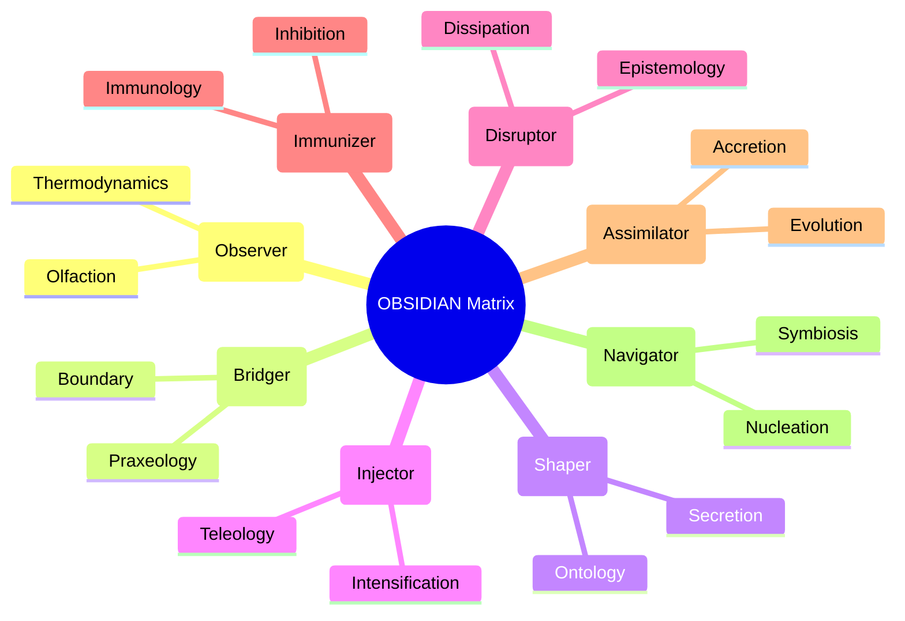
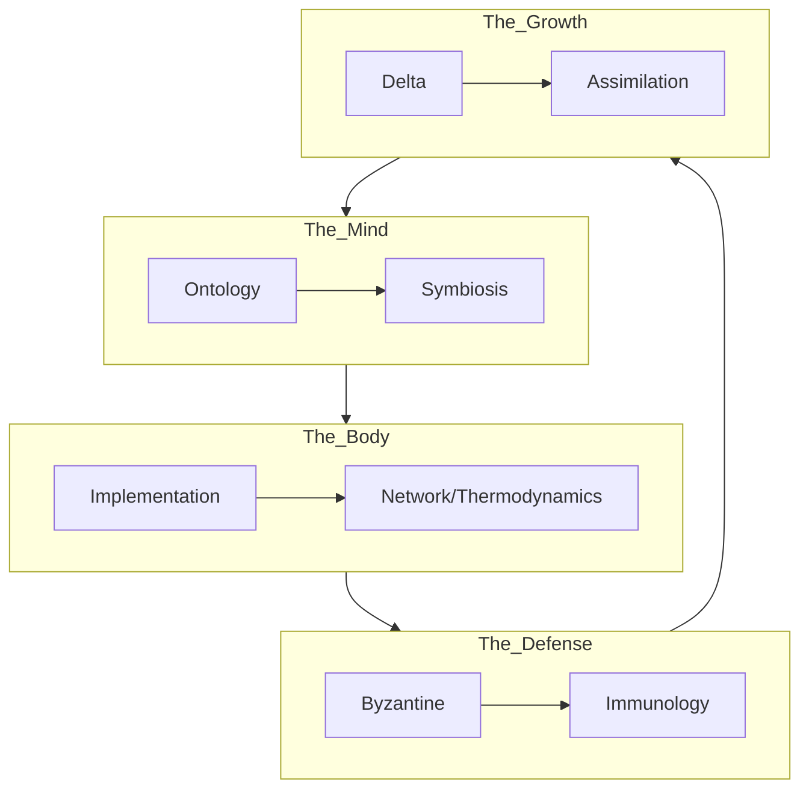
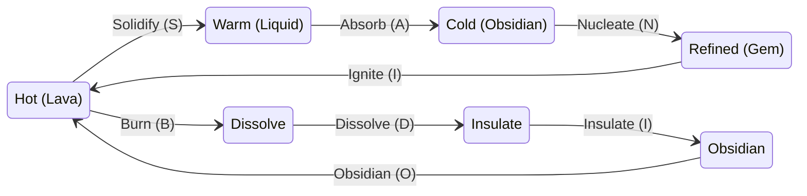
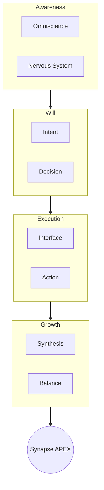

# 💎 Design: OBSIDIAN Consolidation Options (Gen 52)

> **Intent**: To resolve the "Evolutionary Drift" between Gen 51 (Fractal Holarchy) and Gen 52 (Thermodynamics) by consolidating the **8 Gen 52 Pillars** and **Octree Architecture** into the **8 Letters of OBSIDIAN**.
> **Goal**: Select one of these 4 variations to be the Canonical Truth for Gen 52.

---

## 📊 The Source Material (To Be Consolidated)

We are compressing the **8 Gen 52 Pillars** (from `gen_52_aspirational_status.md`) into **8 Slots**:
1.  **Ontology**: Hexagonal Fractal Holarchy.
2.  **Epistemology**: Adversarial Byzantine Quorum.
3.  **Thermodynamics**: Obsidian Thermodynamics.
4.  **Evolution**: Aggressive Exemplar Assimilation.
5.  **Immunology**: Co-Evolutionary Immune System.
6.  **Teleology**: Agency Delta Optimization.
7.  **Symbiosis**: The Cognitive Symbiote.
8.  **Praxeology**: Protocol-First Tooling (MCP).

---

## 1️⃣ Variation 1: The "Role-Centric" Consolidation (The Matrix)
*Focus: Mapping Pillars to the existing Agent Roles. Best for continuity and biological alignment.*

### The Mapping
| Letter | Role | Gen 52 Pillar | Biological Function (Stigmergy) |
| :--- | :--- | :--- | :--- |
| **O** | **Observer** | **Thermodynamics** | **Olfaction**: Sensing the "Heat" (Urgency) of the signal. |
| **B** | **Bridger** | **Praxeology** | **Boundary**: The interface (MCP) between Agent and Tool. |
| **S** | **Shaper** | **Ontology** | **Secretion**: Depositing the Fractal Structure. |
| **I** | **Injector** | **Teleology** | **Intensification**: Optimizing Delta (Result/Energy). |
| **D** | **Disruptor** | **Epistemology** | **Dissipation**: Testing Truth via Byzantine Adversity. |
| **I** | **Immunizer** | **Immunology** | **Inhibition**: The Co-Evolutionary Immune System. |
| **A** | **Assimilator** | **Evolution** | **Accretion**: Aggressive Exemplar Assimilation. |
| **N** | **Navigator** | **Symbiosis** | **Nucleation**: The Cognitive Symbiote (Seed). |

### Visual Visualization

---

## 2️⃣ Variation 2: The "Pillar-Centric" Consolidation (The 8 Pillars)
*Focus: Mapping the 8 Gen 52 Pillars directly to the Acronym. Best for architectural purity.*

### The Mapping
| Letter | Pillar Concept | Formal Pillar Name | Definition |
| :--- | :--- | :--- | :--- |
| **O** | **Ontology** | **Hexagonal Fractal Holarchy** | The recursive structure of the Hive. |
| **B** | **Byzantine** | **Adversarial Byzantine Quorum** | Truth via Dissent (Epistemology). |
| **S** | **Symbiosis** | **The Cognitive Symbiote** | The Digital Twin (Symbiosis). |
| **I** | **Immunology** | **Co-Evolutionary Immune System** | Defense in Depth (Immunology). |
| **D** | **Delta** | **Agency Delta Optimization** | Max Result / Min Energy (Teleology). |
| **I** | **Implementation** | **Protocol-First Tooling (MCP)** | The "How" (Praxeology). |
| **A** | **Assimilation** | **Aggressive Exemplar Assimilation** | Don't Invent, Assimilate (Evolution). |
| **N** | **Network** | **Obsidian Thermodynamics** | The Physics of the Network (Thermodynamics). |

### Visual Visualization

---

## 3️⃣ Variation 3: The "Thermodynamic-Centric" Consolidation (Gen 52 Physics)
*Focus: Mapping Pillars to the 4 States of Matter (Hot/Warm/Cold/Refined).*

### The Mapping
| Letter | Force | State | Pillar |
| :--- | :--- | :--- | :--- |
| **O** | **Obsidian** | **Cold (Crystal)** | **Ontology** (The Structure) |
| **B** | **Burn** | **Hot (Lava)** | **Thermodynamics** (The Energy) |
| **S** | **Solidify** | **Cooling** | **Praxeology** (The Tooling) |
| **I** | **Ignite** | **Heating** | **Teleology** (The Drive) |
| **D** | **Dissolve** | **Entropy** | **Epistemology** (The Test) |
| **I** | **Insulate** | **Protection** | **Immunology** (The Defense) |
| **A** | **Absorb** | **Warm (Liquid)** | **Evolution** (The Assimilation) |
| **N** | **Nucleate** | **Refined (Gem)** | **Symbiosis** (The Core) |

### Visual Visualization

---

## 4️⃣ Variation 4: The "Cognitive-Centric" Consolidation (Synapse APEX)
*Focus: Mapping Pillars to the "Mind" of the Hive.*

### The Mapping
| Letter | Faculty | Pillar | Cognitive Function |
| :--- | :--- | :--- | :--- |
| **O** | **Omniscience** | **Ontology** | Knowing the Structure. |
| **B** | **Balance** | **Immunology** | Maintaining Homeostasis. |
| **S** | **Synthesis** | **Evolution** | Combining Ideas. |
| **I** | **Intent** | **Symbiosis** | The "Why". |
| **D** | **Decision** | **Epistemology** | The Choice (Byzantine). |
| **I** | **Interface** | **Praxeology** | The Action (MCP). |
| **A** | **Action** | **Teleology** | The Result (Delta). |
| **N** | **Nervous System** | **Thermodynamics** | The Signal Flow. |

### Visual Visualization

---

## 🏁 Recommendation
*   **For Gen 52 Alignment**: Use **Variation 2 (Pillar-Centric)**. It provides the cleanest mapping of the **8 New Pillars** to the **8 Letters**, resolving the "Brittle System" issue by making the Pillars explicit in the acronym.
*   **For Biological Depth**: Use **Variation 1 (Role-Centric)**. It maintains the "Matrix" connection between Roles and Pillars.

**Swarmlord Choice**: **Variation 2** is the strongest architectural definition for the "Singular On-Ramp". It forces the system to embody the Pillars.

---

## 5️⃣ Variation 5: The "Unified Semantic Stack" (Grand Unification)
*Focus: Blending Role, Organ, and Structure into a single "Deep Semantic Layer" for each letter. This creates a "Holographic" meaning where O.B.S.I.D.I.A.N. describes the Agent, the Biology, and the Architecture simultaneously.*

### The Semantic Stack
| Letter | Layer 1: Role (Agent) | Layer 2: Organ (Biology) | Layer 3: Structure (Keyword) | Layer 4: Gen 52 Pillar (Deep Meaning) |
| :--- | :--- | :--- | :--- | :--- |
| **O** | **Observer** | **Eyes** | **Octree** | **Ontology** (Fractal Holarchy) |
| **B** | **Bridger** | **Hands** | **Boundary** | **Praxeology** (Protocol/Tools) |
| **S** | **Shaper** | **Body** | **Stigmergy** | **Thermodynamics** (State/Matter) |
| **I** | **Injector** | **Blood** | **Input** | **Teleology** (Energy/Delta) |
| **D** | **Disruptor** | **Venom** | **Dissent** | **Epistemology** (Byzantine Truth) |
| **I** | **Immunizer** | **Carapace** | **Immunity** | **Immunology** (Defense in Depth) |
| **A** | **Assimilator** | **Digestion** | **Assimilation** | **Evolution** (Exemplar Absorption) |
| **N** | **Navigator** | **Brain** | **Nucleus** | **Symbiosis** (Cognitive Core) |

### Visual Visualization (The Layered Hologram)

### Why this works
1.  **O (Observer/Eyes/Octree)**: The Eyes see the Fractal Structure (Octree).
2.  **B (Bridger/Hands/Boundary)**: The Hands touch the Boundary to use Tools (Praxeology).
3.  **S (Shaper/Body/Stigmergy)**: The Body leaves the Trace (Stigmergy) which has Temperature (Thermodynamics).
4.  **I (Injector/Blood/Input)**: The Blood brings the Input (Energy/Delta).
5.  **D (Disruptor/Venom/Dissent)**: The Venom creates Dissent to test Truth.
6.  **I (Immunizer/Carapace/Immunity)**: The Carapace provides Immunity.
7.  **A (Assimilator/Digestion/Assimilation)**: The Digestion Assimilates nutrients (Evolution).
8.  **N (Navigator/Brain/Nucleus)**: The Brain is the Nucleus of the Symbiosis.

**Recommendation**: This **Variation 5** is the ultimate "Semantic Compression". It allows us to use the word **OBSIDIAN** as a complete index for the entire HFO system (Agent, Biology, Architecture, Philosophy).

<!-- Force Preview Refresh -->
