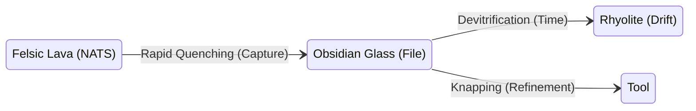

# 💎 Design: OBSIDIAN Mineralogy & Stigmergy (Gen 52)

> **Intent**: To refine the "Thermodynamic Stigmergy" analogy by aligning it with the **Actual Mineralogy of Obsidian** (Volcanic Glass).
> **Problem**: The previous "Plasma -> Liquid -> Crystal" model is scientifically inaccurate for Obsidian, which is an **Amorphous Solid** formed by **Rapid Quenching** (preventing crystallization).
> **Goal**: Develop a metaphor that captures the **Speed**, **Sharpness**, and **Utility** of HFO Stigmergy using geological truth.

---

## 🌋 The Geological Truth of Obsidian
1.  **Felsic Lava**: High silica content, highly viscous (thick/sticky).
2.  **Rapid Quenching**: Cools so fast that atoms cannot arrange into a crystal lattice.
3.  **Amorphous State**: It is a "Frozen Liquid" (Glass), not a Crystal.
4.  **Conchoidal Fracture**: Breaks with extremely sharp edges (sharper than surgical steel).
5.  **Devitrification**: If it cools slowly or ages, it turns into **Rhyolite** (grainy/crystalline) - *This is usually considered "degradation" of the glass.*

---

## 1️⃣ Variation A: The "Quenching" Model (Speed is Truth)
*Focus: The speed of capturing the signal determines its quality. Fast capture = Sharp Truth.*

| Phase | Geological Process | HFO Stigmergy State | Description |
| :--- | :--- | :--- | :--- |
| **Hot** | **Felsic Lava** | **NATS JetStream** | The raw, viscous flow of high-bandwidth signals. It is dangerous and unstructured. |
| **Transition** | **Rapid Quenching** | **Genesis Protocol** | The immediate "freezing" of the stream into a file. No processing, just capture. |
| **Cold** | **Obsidian (Glass)** | **Markdown/YAML** | The result. An **Amorphous Solid**. It is raw, sharp, and immutable. It represents "The Event" exactly as it happened. |
| **Decay** | **Devitrification** | **Drift / Rot** | If the file sits too long without updates, it becomes "Grainy" (Rhyolite). The context is lost. |

### Visual Visualization


---

## 2️⃣ Variation B: The "Knapping" Model (Utility Focus)
*Focus: Obsidian is useless as a raw block. It must be broken (Knapped) to be useful.*

| Phase | Geological Concept | HFO Stigmergy State | Description |
| :--- | :--- | :--- | :--- |
| **Source** | **The Core** | **The Knowledge Graph** | The massive, dense block of accumulated knowledge. Potential energy. |
| **Action** | **Percussion** | **The Query / Prompt** | The strike that breaks the core. |
| **Result** | **The Flake** | **The Context Window** | A sharp, specific slice of the core used for a specific task. |
| **Waste** | **Debitage** | **Logs / Noise** | The necessary byproduct of refinement. |
| **Tool** | **Biface / Blade** | **The Agent Tool** | The final, refined edge used to cut (execute code). |

### Visual Visualization
```mermaid
graph TD
    Core[The Core (Graph)] -- Percussion (Query) --> Flake[The Flake (Context)]
    Flake -- Retouch (Refine) --> Blade[The Blade (Tool)]
    Core -- Waste --> Debitage[Debitage (Logs)]
```

---

## 3️⃣ Variation C: The "Viscosity" Model (Flow Dynamics)
*Focus: The "Stickiness" of the information.*

| Phase | Viscosity | HFO State | Description |
| :--- | :--- | :--- | :--- |
| **Magma** | **Low** (Under Pressure) | **Active Memory (RAM)** | Hot, fluid, changing every millisecond. |
| **Lava** | **High** (Surface Flow) | **Stream (NATS)** | Thick, heavy flow. Hard to stop, hard to redirect. |
| **Glass** | **Infinite** (Solid) | **Archive (Disk)** | The flow stopped instantly. A snapshot of the dynamic state. |

---

## 🏁 Recommendation
**Combine Variation A (Quenching) and Variation B (Knapping).**

*   **The Stigmergy is the Quenching**: We capture the "Hot Lava" of NATS instantly into "Cold Obsidian" files. We do *not* want crystallization (Rhyolite/Bureaucracy). We want the raw, sharp glass of the event.
*   **The Intelligence is the Knapping**: The Agent doesn't just read the file; it "Knaps" a flake off the Obsidian Core to use as a tool for the current mission.

**Proposed New Stigmergy Definition**:
> "HFO Stigmergy is the **Rapid Quenching** of high-velocity signals (Lava) into immutable, amorphous artifacts (Obsidian). These artifacts are then **Knapped** by agents to create sharp, context-specific tools (Flakes) for execution."
