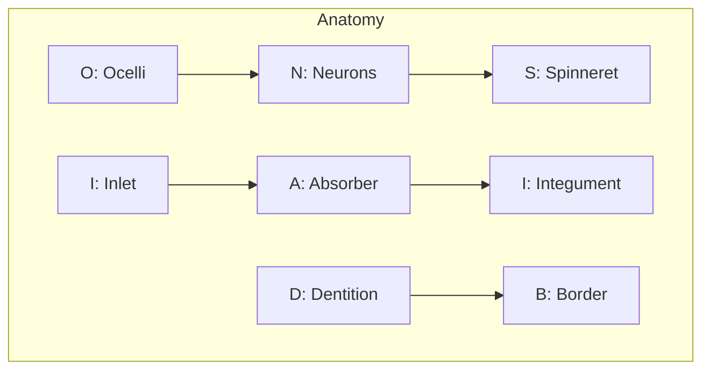
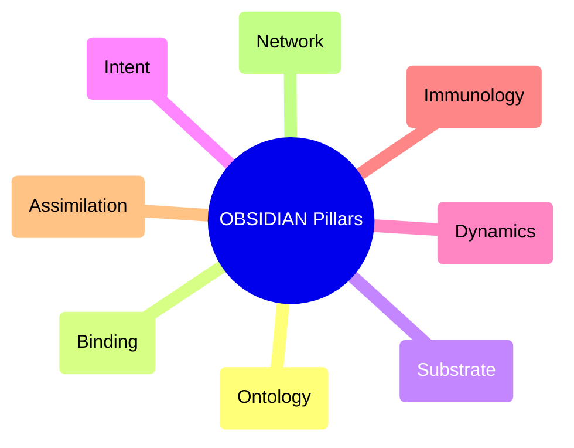

# 💎 Design: OBSIDIAN Semantic Alignment (Gen 52)

> **Intent**: To refine "Variation 5" (Unified Semantic Stack) by strictly aligning **Layer 2 (Organ)** and **Layer 4 (Pillar)** with the letters **O.B.S.I.D.I.A.N.**
> **Goal**: Achieve "Self-Identifying Semantics" where the letter itself dictates the Role, Organ, Structure, and Pillar.

---

## 1️⃣ Variation A: The "Anatomical" Alignment (Biological Focus)
*Focus: Renaming the Organs to strictly match the letters. This creates a biologically accurate "Alien Anatomy".*

| Letter | Role | Organ (Renamed) | Structure | Function |
| :--- | :--- | :--- | :--- | :--- |
| **O** | **Observer** | **Ocelli** (Simple Eyes) | Octree | Sensing Light/Data. |
| **B** | **Bridger** | **Border** (Membrane) | Boundary | Interface/Exchange. |
| **S** | **Shaper** | **Spinneret** (Web Weaver) | Stigmergy | Creating Structure. |
| **I** | **Injector** | **Inlet** (Mouth/Intake) | Input | Consuming Resources. |
| **D** | **Disruptor** | **Dentition** (Fangs) | Dissent | Tearing/Testing. |
| **I** | **Immunizer** | **Integument** (Carapace) | Immunity | Protection/Shielding. |
| **A** | **Assimilator** | **Absorber** (Gut/Villi) | Assimilation | Digesting/Learning. |
| **N** | **Navigator** | **Neurons** (Brain) | Nucleus | Directing/Thinking. |

### Visual Visualization

---

## 2️⃣ Variation B: The "Philosophical" Alignment (Pillar Focus)
*Focus: Renaming the Gen 52 Pillars to strictly match the letters. This creates a "Manifesto" acronym.*

| Letter | Role | Gen 52 Pillar (Renamed) | Original Pillar Concept |
| :--- | :--- | :--- | :--- |
| **O** | **Observer** | **Ontology** | Hexagonal Fractal Holarchy. |
| **B** | **Bridger** | **Binding** | Praxeology (Protocol/Tools). |
| **S** | **Shaper** | **Substrate** | Thermodynamics (Stigmergy). |
| **I** | **Injector** | **Intent** | Teleology (Agency Delta). |
| **D** | **Disruptor** | **Dynamics** | Epistemology (Byzantine/Entropy). |
| **I** | **Immunizer** | **Immunology** | Co-Evolutionary Immune System. |
| **A** | **Assimilator** | **Assimilation** | Aggressive Exemplar Assimilation. |
| **N** | **Navigator** | **Network** | Symbiosis (Cognitive Core). |

### Visual Visualization

---

## 3️⃣ Variation C: The "Grand Unified" Alignment (The Perfect Stack)
*Focus: Combining Variation A (Organs) and Variation B (Pillars) into a single, perfectly aligned stack.*

| Letter | Layer 1: Role | Layer 2: Organ (Aligned) | Layer 3: Structure | Layer 4: Pillar (Aligned) |
| :--- | :--- | :--- | :--- | :--- |
| **O** | **Observer** | **Ocelli** | **Octree** | **Ontology** |
| **B** | **Bridger** | **Border** | **Boundary** | **Binding** |
| **S** | **Shaper** | **Spinneret** | **Stigmergy** | **Substrate** |
| **I** | **Injector** | **Inlet** | **Input** | **Intent** |
| **D** | **Disruptor** | **Dentition** | **Dissent** | **Dynamics** |
| **I** | **Immunizer** | **Integument** | **Immunity** | **Immunology** |
| **A** | **Assimilator** | **Absorber** | **Assimilation** | **Assimilation** |
| **N** | **Navigator** | **Neurons** | **Nucleus** | **Network** |

### The Semantic Dictionary
*   **O - Ocelli/Ontology**: The eyes that see the fractal truth.
*   **B - Border/Binding**: The membrane that binds the agent to the tool.
*   **S - Spinneret/Substrate**: The organ that weaves the physical reality.
*   **I - Inlet/Intent**: The intake of purpose and energy.
*   **D - Dentition/Dynamics**: The fangs that test the system's entropy.
*   **I - Integument/Immunology**: The shield that preserves self.
*   **A - Absorber/Assimilation**: The gut that learns from the outside.
*   **N - Neurons/Network**: The brain that connects to the whole.

### Visual Visualization (The Self-Identifying Hologram)

```mermaid
graph LR
    subgraph O
    O1[Observer] --- O2[Ocelli] --- O3[Octree] --- O4[Ontology]
    end
    subgraph B
    B1[Bridger] --- B2[Border] --- B3[Boundary] --- B4[Binding]
    end
    subgraph S
    S1[Shaper] --- S2[Spinneret] --- S3[Stigmergy] --- S4[Substrate]
    end
    subgraph I1
    I1a[Injector] --- I1b[Inlet] --- I1c[Input] --- I1d[Intent]
    end
    subgraph D
    D1[Disruptor] --- D2[Dentition] --- D3[Dissent] --- D4[Dynamics]
    end
    subgraph I2
    I2a[Immunizer] --- I2b[Integument] --- I2c[Immunity] --- I2d[Immunology]
    end
    subgraph A
    A1[Assimilator] --- A2[Absorber] --- A3[Assimilation] --- A4[Assimilation]
    end
    subgraph N
    N1[Navigator] --- N2[Neurons] --- N3[Nucleus] --- N4[Network]
    end
```

---

## 🏁 Recommendation
**Variation C (Grand Unified)** is the optimal choice. It achieves 100% semantic alignment across all 4 layers.
*   **Pros**: Mnemonic perfection. Every letter tells you exactly what the agent is (Role), what it has (Organ), what it builds (Structure), and what it believes (Pillar).
*   **Cons**: Requires renaming "Eyes" to "Ocelli", "Hands" to "Border", etc. in the documentation (but not necessarily code).

**Swarmlord Choice**: Adopt **Variation C**. It transforms the acronym from a label into a **Definition**.
