# 🌋 Design: Obsidian Thermodynamics (Melt to Tool)

> **Status**: Active (Gen 52)
> **Source**: `brain/research_obsidian_physics_mapping.md`
> **Core Concept**: **Thermal Capture $\to$ Mechanical Refinement**.

## 🌡️ Phase 1: The Thermal Gradient (Capture)
*From Magma to Glass.*

| Temp ($T$) | State | Physics | HFO Component | Action |
| :--- | :--- | :--- | :--- | :--- |
| **900°C** | **Rhyolitic Melt** | Molten, High Viscosity. | **NATS JetStream** | **Flow** (Stream) |
| **700°C** | **Glass Transition** | $T_g$. Freezing point. | **Redis / Buffers** | **Aggregate** (Batch) |
| **20°C** | **Obsidian** | Amorphous Solid. | **Markdown File** | **Quench** (Write) |

## 🔨 Phase 2: The Mechanical Gradient (Refinement)
*From Core to Flake. Temperature remains constant (20°C).*

| Component | Geological Equivalent | HFO Component | Action |
| :--- | :--- | :--- | :--- |
| **The Core** | **Obsidian Nodule** | **The File** | **Source of Truth**. Bulk storage. |
| **The Striker** | **Hammerstone** | **Assimilator** | **Agent**. Applies force to extract meaning. |
| **The Flake** | **Razor Flake** | **Vector Embedding** | **Search Unit**. 3nm sharp edge. |
| **The Tool** | **Arrowhead** | **Knowledge Graph** | **Utility**. Flakes bound together. |

---

## 📉 Variation 1: The Flash Quench (Direct Capture)
*Magma $\to$ Glass. No Buffer.*

**Physics**: Lava hits water. Instant cooling.
**HFO**: NATS $\to$ Disk.
**Goal**: **Fidelity**. Capture the exact state of the stream.

```mermaid
graph LR
    A((🔥 900°C Magma)) -->|⚡ Quench| B[⬛ 20°C Obsidian Core]
    style A fill:#ff4400,stroke:#333,stroke-width:2px
    style B fill:#000000,stroke:#333,stroke-width:2px,color:#fff
```

---

## 📉 Variation 2: The Knapping Protocol (Refinement)
*Core $\to$ Flake. The HFO Standard.*

**Physics**: A Hammerstone strikes the Core to remove a sharp Flake.
**HFO**: An Assimilator reads the File (Core) and generates a Vector (Flake).
**Goal**: **Utility**. We don't use the whole rock; we use the sharp edge.

```mermaid
graph TD
    subgraph THERMAL [Phase 1: Capture]
        A((🔥 900°C Magma)) -->|⚡ Quench| B[⬛ 20°C Obsidian Core]
    end
    subgraph MECHANICAL [Phase 2: Refinement]
        B -->|🔨 Strike| C[🗡️ Vector Flake]
        C -->|🔗 Haft| D[🏹 Knowledge Graph]
    end
    style A fill:#ff4400,stroke:#333,stroke-width:2px
    style B fill:#000000,stroke:#333,stroke-width:2px,color:#fff
    style C fill:#555,stroke:#333,stroke-width:2px,color:#fff
    style D fill:#555,stroke:#333,stroke-width:2px,color:#fff
```

---

## ⏳ Variation 3: Hydration & Devitrification (Aging)
*The Time Factor.*

**Physics**:
*   **Hydration**: Obsidian absorbs water (Rind).
*   **Devitrification**: Obsidian crystallizes (Snowflake).
**HFO**:
*   **Hydration**: Files gain Backlinks (Context).
*   **Devitrification**: Files lose relevance (Bit Rot).

```mermaid
graph LR
    A[⬛ Fresh Obsidian] -->|💧 Time + Links| B[🌊 Hydrated Core]
    A -->|❄️ Time + Neglect| C[⚪ Devitrified / Snowflake]
    style A fill:#000000,stroke:#333,stroke-width:2px,color:#fff
    style B fill:#000044,stroke:#333,stroke-width:2px,color:#fff
    style C fill:#cccccc,stroke:#333,stroke-width:2px
```

