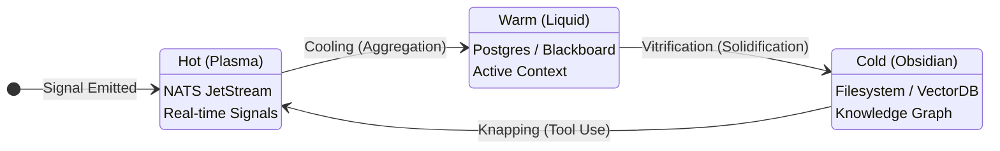
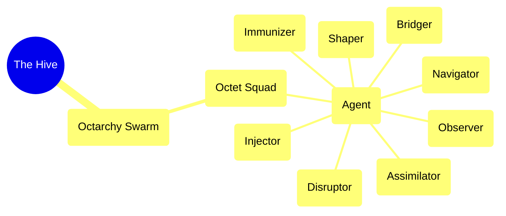
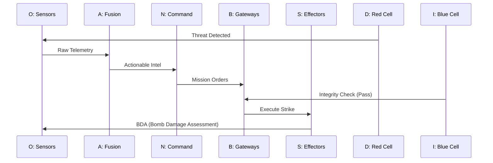
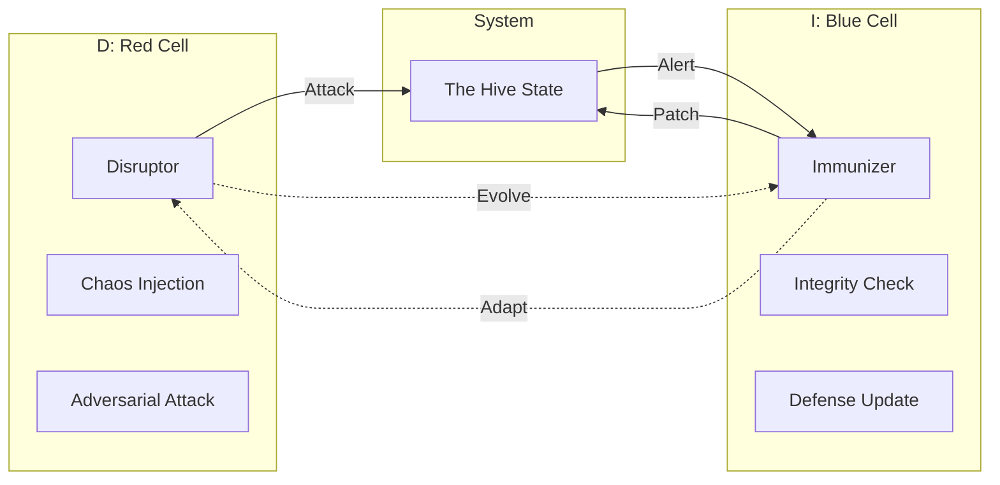
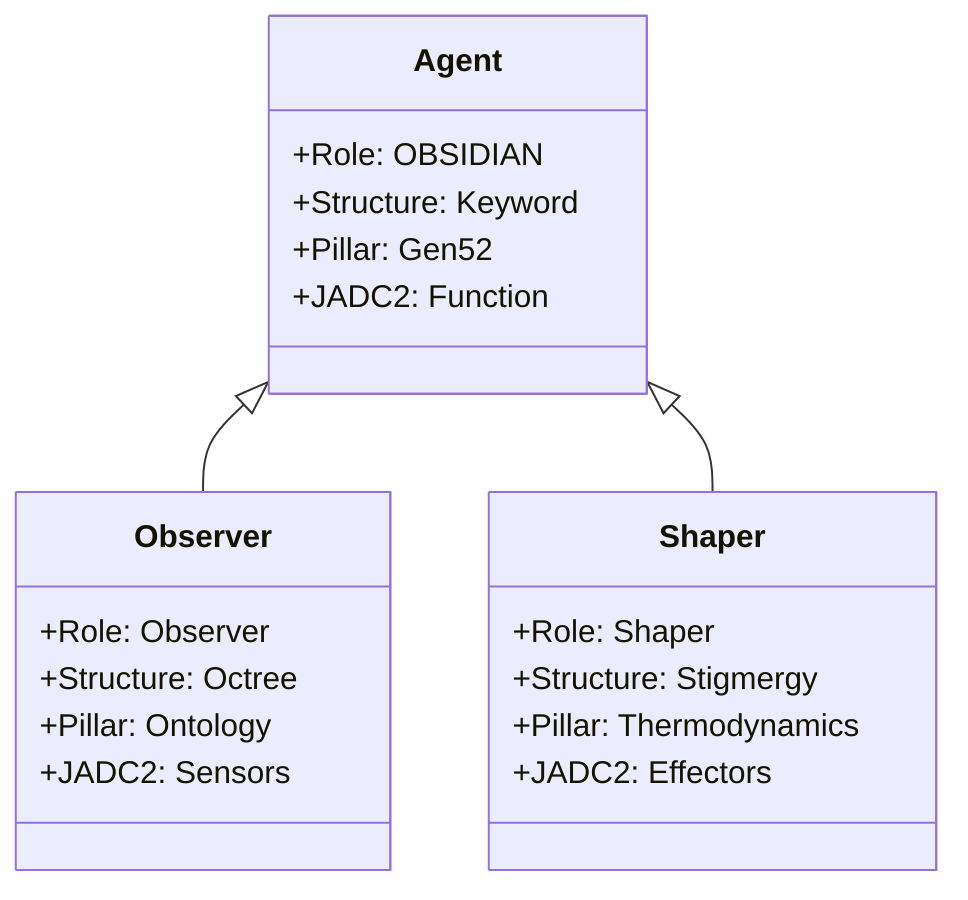
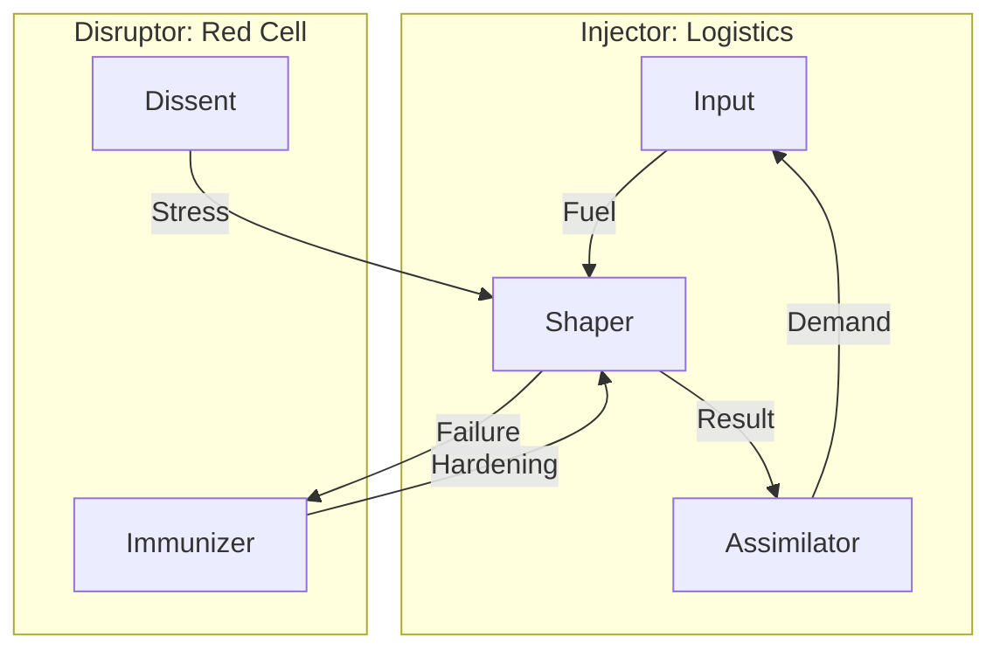
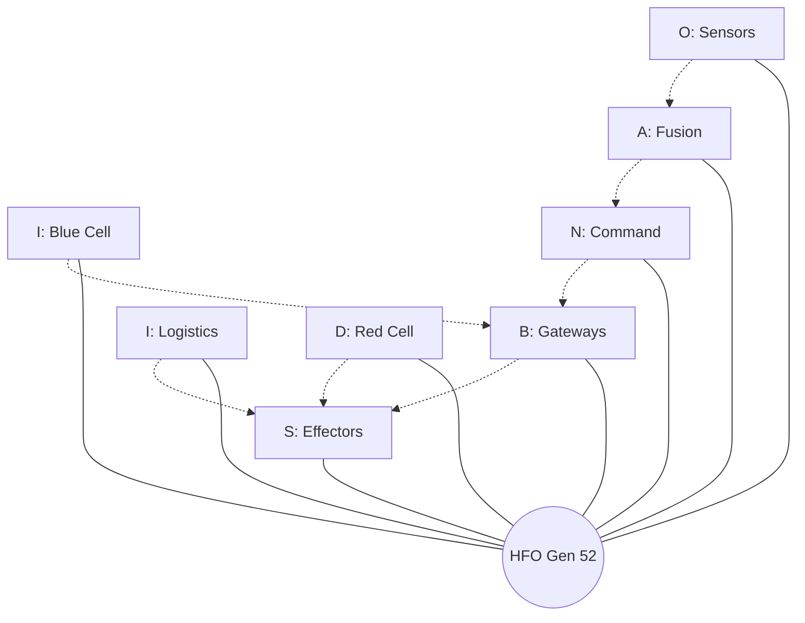

# 💎 Design: OBSIDIAN Unified Master Stack (Gen 52)

> **Intent**: To establish the **Canonical Truth** for Generation 52 by unifying the **Role**, **Structure**, and **Pillar** under the **O.B.S.I.D.I.A.N.** acronym, while grounding each row in its **JADC2 Equivalent**.
> **Core Concept**: **Thermodynamic Stigmergy**. The substrate is a single continuum that transitions between phases (Hot/Warm/Cold) based on temperature (urgency/latency).

---

## 🏆 The Unified Master Table

| Letter | Layer 1: Role (Agent) | Layer 2: Structure (Keyword) | Layer 3: Gen 52 Pillar (Aligned) | Layer 4: JADC2 Equivalent (Reference) |
| :--- | :--- | :--- | :--- | :--- |
| **O** | **Observer** | **Octree** | **Ontology** (Fractal Holarchy) | **Sensors** (ISR) |
| **B** | **Bridger** | **Boundary** | **Binding** (Praxeology) | **Gateways** (Transport) |
| **S** | **Shaper** | **Stigmergy** | **Thermodynamic Stigmergy** | **Effectors** (Fires) |
| **I** | **Injector** | **Input** | **Intent** (Teleology) | **Logistics** (Sustainment) |
| **D** | **Disruptor** | **Dissent** | **Dynamics** (Epistemology) | **Red Cell** (Adversary) |
| **I** | **Immunizer** | **Immunity** | **Immunology** (Defense) | **Blue Cell** (Protection) |
| **A** | **Assimilator** | **Assimilation** | **Adaptation** (Evolution) | **Fusion** (PED) |
| **N** | **Navigator** | **Nucleus** | **Network** (Symbiosis) | **Command** (C2) |

---

## 🌡️ Deep Dive: Thermodynamic Stigmergy (The "S" Pillar)

Stigmergy is not just "writing to files". It is the physics of the Hive. Information exists in different **Phases of Matter** depending on its Temperature (Urgency).

### 1. Hot Phase (Plasma)
*   **Substrate**: NATS JetStream.
*   **Characteristics**: High Velocity, Low Latency, Ephemeral.
*   **Use Case**: Real-time coordination, "Pheromone Trails", immediate signals.
*   **Analogy**: The "Nervous System" firing impulses.

### 2. Warm Phase (Liquid)
*   **Substrate**: Shared Blackboard (Redis/Mem) / Postgres (Raw).
*   **Characteristics**: Medium Velocity, Persistent, Mutable.
*   **Use Case**: Working Memory, Active Mission Context, "Claim Checks".
*   **Analogy**: The "Blood" circulating nutrients and hormones.

### 3. Cold Phase (Obsidian / Glass)
*   **Substrate**: Filesystem (Markdown/YAML) / Vector DB / Knowledge Graph.
*   **Characteristics**: Low Velocity, **Amorphous Solid**, Sharp Edges.
*   **Use Case**: Long-term Memory, "Source of Truth", Stigmergy Headers.
*   **Analogy**: The "Bone" and "DNA" of the organism. **Note**: Like real Obsidian, it is not crystalline but **amorphous (Volcanic Glass)**. It captures the chaotic flow of the "Warm" phase and freezes it instantly. It must be **knapped** (refined) to become a useful tool.

---

## 🎨 The 8 Visualizations of HFO

### Diagram 1: The Master Stack (Hierarchy)
*Visualizing the vertical alignment of the acronym.*

```mermaid
graph TD
    subgraph The_O [O: Sensors]
        O1[Observer] --- O2[Octree] --- O3[Ontology]
    end
    subgraph The_B [B: Gateways]
        B1[Bridger] --- B2[Boundary] --- B3[Binding]
    end
    subgraph The_S [S: Effectors]
        S1[Shaper] --- S2[Stigmergy] --- S3[Thermodynamics]
    end
    subgraph The_I1 [I: Logistics]
        I1a[Injector] --- I1b[Input] --- I1c[Intent]
    end
    subgraph The_D [D: Red Cell]
        D1[Disruptor] --- D2[Dissent] --- D3[Dynamics]
    end
    subgraph The_I2 [I: Blue Cell]
        I2a[Immunizer] --- I2b[Immunity] --- I2c[Immunology]
    end
    subgraph The_A [A: Fusion]
        A1[Assimilator] --- A2[Assimilation] --- A3[Adaptation]
    end
    subgraph The_N [N: Command]
        N1[Navigator] --- N2[Nucleus] --- N3[Network]
    end
```

### Diagram 2: Thermodynamic Phase Transitions (State Machine)
*Visualizing the flow of information from Hot to Cold.*

### Diagram 3: The Octree Fractal (Mindmap)
*Visualizing the recursive structure of the Hive.*

### Diagram 4: The JADC2 Kill Chain (Sequence)
*Visualizing the operational flow in military terms.*

### Diagram 5: Red vs Blue Co-Evolution (Context)
*Visualizing the adversarial dynamic.*

### Diagram 6: The Agent Hologram (Class)
*Visualizing the attributes of a single Holon.*

### Diagram 7: The Feedback Loops (Flowchart)
*Visualizing the Growth vs Decay cycles.*

### Diagram 8: The Unified Octagon (Radial)
*Visualizing the 8 roles around the central purpose.*

