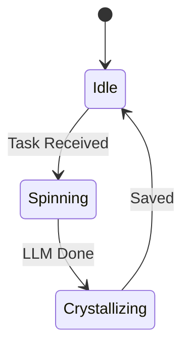

---
hexagon:
  ontos:
    id: e545a071-d7e6-49c8-8f3f-0ecef44b3230
    type: md
    owner: Swarmlord
  chronos:
    status: active
    urgency: 0.5
    decay: 0.5
    created: '2025-11-23T11:07:35.309052Z'
    generation: 51
  topos:
    address: brain/mission_ingest_gems.md
    links: []
  telos:
    viral_factor: 0.0
    meme: mission_ingest_gems.md
---
---
title: Mission: Ingest Gems
status: Active
domain: Memory
owners: [Swarmlord]
type: Mission

# ==================================================================
# 🤖 THE HEXAGON (System Generated)
# ==================================================================
hexagon:
  ontos:
    id: d63df030-df4c-4735-a63c-16578c92ead2
    type: md
    owner: Swarmlord
  chronos:
    status: active
    urgency: 0.5
    decay: 0.5
    created: '2025-11-23T10:21:31.469548+00:00'
  topos:
    address: brain/mission_ingest_gems.md
    links: []
  telos:
    viral_factor: 0.0
    meme: mission_ingest_gems.md

---

# 💎 Mission: Ingest Gems

## ⚡ BLUF
A mission to ingest the ancestral "Gems" (Gen 1-50) into the Semantic Memory.

## 🧬 Intent
*   **Source**: `eyes/archive/hfo_gem/`
*   **Destination**: `memory/semantic/library/`
*   **Method**: Swarm Spinner (Async/NATS)

## 📊 Visualization

```mermaid
graph LR
    Archive[Archive] -->|Read| Swarm[Swarm Spinner]
    Swarm -->|Extract| LLM[LLM]
    LLM -->|Crystal| Memory[Semantic Memory]

### 🔄 Sequence

```mermaid
sequenceDiagram
    participant A as Archive
    participant S as Swarm
    participant L as LLM
    participant M as Memory

    S->>A: Read File
    S->>L: Extract Concepts
    L-->>S: Structured Data
    S->>M: Save Crystal
```

### ⚙️ State Machine


```
