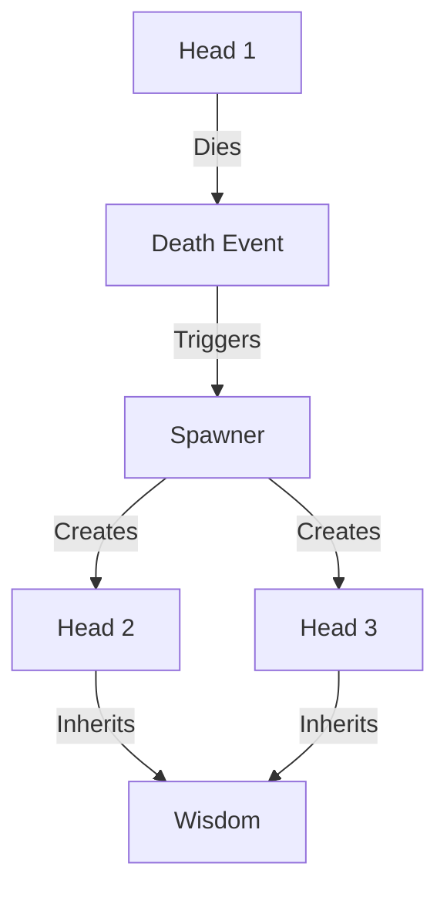
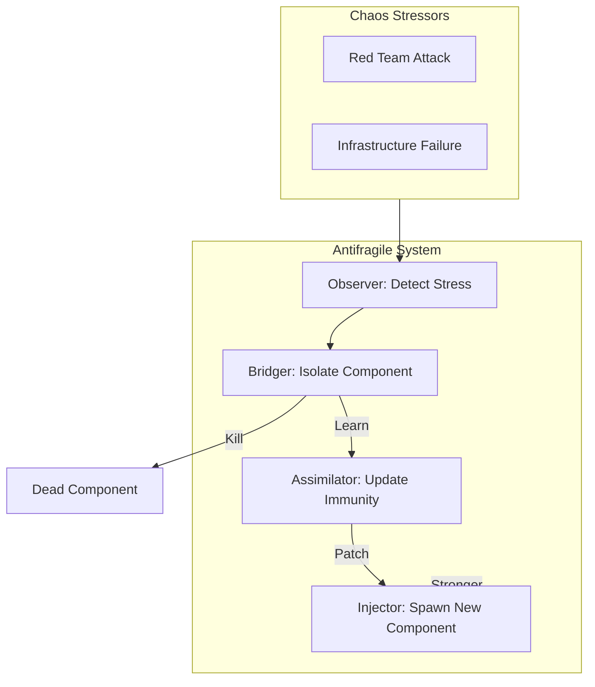

# 🐍 Antifragile Hydra Strategy

## ⚡ BLUF (Bottom Line Up Front)
The **Hydra Protocol** is the embodiment of Antifragility in Hive Fleet Obsidian. It uses **Ray Actors** to create isolated, regenerative execution units. When a unit fails (or is attacked), it is not just replaced; the system learns from the failure, and two new units are spawned in its place. It serves both as a **Defense Mechanism** (Regenerative Bulkheads) and an **Execution Engine** (Scatter-Gather Map-Reduce).

## 📊 Hydra Capabilities Matrix

| Capability | Description | Mechanism | Benefit |
| :--- | :--- | :--- | :--- |
| **Regeneration** | Respawn on death | Ray Actor Supervision | Zero Downtime |
| **Isolation** | Fault containment | Process Separation | No Cascading Failures |
| **Evolution** | Learn from death | Stigmergy Update | System gets stronger |
| **Parallelism** | Scatter-Gather | Async Map-Reduce | Linear Scaling |

## 🧠 Concept Visualization

### View 1: The Hydra Head (Conceptual)
*Cut off one head, two take its place.*



### View 2: The Antifragile Loop (Logical)
*How stress strengthens the system.*



### View 3: Ray Actor Implementation (Physical)
*The technical implementation of the Hydra.*

```mermaid
sequenceDiagram
    participant Controller
    participant Ray
    participant Actor

    Controller->>Ray: Spawn Actor
    Ray->>Actor: Init
    Actor--xRay: Crash (Exception)
    Ray->>Controller: Actor Died
    Controller->>Ray: Spawn Actor (Replica 1)
    Controller->>Ray: Spawn Actor (Replica 2)
```

## 🦅 Executive Summary
The **Hydra Protocol** is the dual-purpose strategy for:
1.  **Defense**: "Cut off one head, two more take its place." (Regenerative Bulkheads).
2.  **Execution**: Scatter-Gather parallelism (Map-Reduce).
