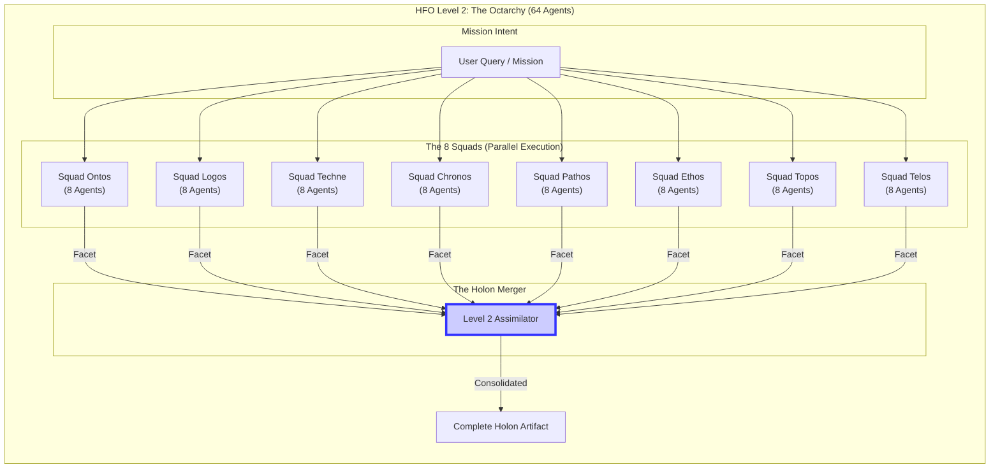
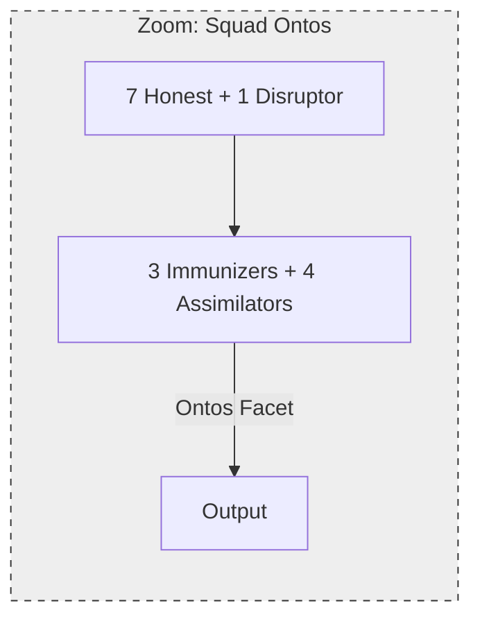

---
octagon:
  ontos:
    id: design-hfo-level2-architecture-v1
    type: design
    owner: Swarmlord
  logos:
    protocol: HFO-L2-Octarchy
    format: markdown
  techne:
    stack:
    - mermaid
    - markdown
    - map-reduce
    complexity: very-high
  chronos:
    status: active
    urgency: 1.0
    decay: 0.0
    created: '2025-11-24T14:15:00Z'
  pathos:
    stress_level: 0.9
    validation: pending
  ethos:
    security_level: internal
    compliance:
    - hfo-fractal-scaling
  topos:
    address: brain/design_hfo_level2_architecture.md
    links:
    - brain/design_hfo_level1_architecture.md
  telos:
    viral_factor: 1.0
    meme: The Whole is the Sum of its Dimensions.
hexagon:
  ontos:
    id: c51164e4-7be1-4b5b-b7af-3621c6a6b095
    type: md
    owner: Swarmlord
  chronos:
    status: active
    urgency: 0.5
    decay: 0.5
    created: '2025-11-24T14:30:05.812767Z'
    generation: 51
  topos:
    address: brain/archive/gen52_drafts/design_hfo_level2_architecture.md
    links: []
  telos:
    viral_factor: 0.0
    meme: design_hfo_level2_architecture.md
---


# 🏯 HFO Level 2: The Octarchy Swarm (64 Agents)

> **Intent**: To visualize the **Fractal Scaling** where 8 Squads of 8 Agents (64 Total) operate concurrently, each dedicated to one dimension of the Stigmergy Octagon.

## 1. The Fractal Concept (8x8)
*   **Level 0**: 1 Agent (Atomic).
*   **Level 1**: 8 Agents (Morphic Octet).
*   **Level 2**: 8 Squads (Octarchy).
*   **Total Concurrency**: $8 \times 8 = 64$ Agents.
*   **Output**: 1 Holistic Artifact (The Holon) composed of 8 Dimensional Facets.

## 2. The Dimensional Assignment (Specialization)
Each Squad runs a full **Level 1 Morphic Octet** cycle, but with a specialized system prompt and objective.

| Squad ID | Dimension | Focus | Output |
| :--- | :--- | :--- | :--- |
| **Squad 1** | **Ontos** | Being, Essence, ID, Type | `ontos: {...}` |
| **Squad 2** | **Logos** | Logic, Protocol, Format | `logos: {...}` |
| **Squad 3** | **Techne** | Tools, Stack, Complexity | `techne: {...}` |
| **Squad 4** | **Chronos** | Time, Status, Decay | `chronos: {...}` |
| **Squad 5** | **Pathos** | Emotion, Stress, Validation | `pathos: {...}` |
| **Squad 6** | **Ethos** | Ethics, Security, Trust | `ethos: {...}` |
| **Squad 7** | **Topos** | Place, Links, Graph | `topos: {...}` |
| **Squad 8** | **Telos** | Purpose, Goal, Meme | `telos: {...}` |

## 3. The Architecture Diagram (The Hive)



## 4. The Friction of Scale (Why Optimization is Needed)
As we scale to Level 2 (64 Agents), we encounter specific frictions that require optimized workflows.

```mermaid
graph LR
    subgraph Friction_Points [Scaling Friction]
        direction TB
        N[Network Noise]
        C[Context Window]
        L[Latency]
        D[Divergence]
    end

    subgraph Solutions [Optimized Workflows]
        direction TB
        S_N[NATS JetStream<br/>(Signal Filtering)]
        S_C[Map-Reduce<br/>(Summarization)]
        S_L[AsyncIO<br/>(Non-Blocking)]
        S_D[Stigmergy<br/>(Shared Memory)]
    end

    N -.->|Requires| S_N
    C -.->|Requires| S_C
    L -.->|Requires| S_L
    D -.->|Requires| S_D
```

### Key Challenges at Level 2
1.  **Context Fragmentation**: 64 Agents generate massive text. The "Merger" cannot read raw logs; it must read **Yield Artifacts** (JSON).
2.  **Byzantine Explosion**: If each Squad has 1 Disruptor, we have 8 Disruptors active. The Level 2 Assimilator must trust the Level 1 Consensus.
3.  **Orchestration Overhead**: Managing 64 concurrent state machines requires robust `asyncio` and `Ray` distribution.

## 5. The Fractal View (Zooming In)
Every box in the "The Swarm" diagram above contains the full **Level 1 Morphic Octet** diagram inside it.


