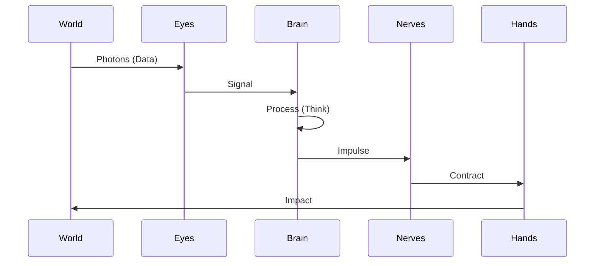

# 🐜 Biomimetic Organ Registry

## ⚡ BLUF (Bottom Line Up Front)
Hive Fleet Obsidian uses **Biomimicry** as its primary architectural metaphor. We map software components to biological organs. This provides immediate intuition about the component's function, latency, and criticality. The **Brain** is slow and smart; the **Ganglia** are fast and reactive; the **Carapace** is hard and protective.

## 📊 Anatomy Matrix

| Organ | Biological Name | Function | Latency | Tech Stack |
| :--- | :--- | :--- | :--- | :--- |
| **Brain** | Cortex | Intent & Strategy | High (Seconds) | Gherkin / LLM |
| **Body** | Soma | Execution & Compute | Medium (ms) | Ray / Python |
| **Eyes** | Ocelli | Perception & Telemetry | Low (Realtime) | LangSmith / Logs |
| **Hands** | Mandibles | Tool Use & I/O | Variable | API / FileSystem |
| **Nerves** | Ganglia | Routing & Reflexes | Ultra-Low (µs) | NATS JetStream |
| **Memory** | Mycelium | Storage & Recall | Mixed | Postgres / Vector |
| **Carapace** | Exoskeleton | Defense & Validation | Pre-Commit | Pytest / Ruff |
| **Venom** | Lysosomes | Testing & Destruction | On-Demand | Pytest / Chaos |

## 🧠 Concept Visualization

### View 1: The Organism (Conceptual)
*The functional anatomy of the Hive.*

```mermaid
graph TD
    Cortex[Cortex (Brain)] -->|Intent| Ganglia[Ganglia (Nerves)]
    Ganglia -->|Signal| Mandibles[Mandibles (Hands)]
    Mandibles -->|Action| World
    World -->|Data| Ocelli[Ocelli (Eyes)]
    Ocelli -->|Telemetry| Cortex
```

### View 2: Support Systems (Logical)
*The systems that keep the organism alive.*

```mermaid
graph TD
    subgraph Support
        Hemolymph[Hemolymph (Blood)] -->|Nutrients| Soma[Body]
        Carapace[Carapace (Defense)] -->|Protects| Soma
        Lysosomes[Lysosomes (Venom)] -->|Digests| Waste
        Mycelium[Mycelium (Memory)] -->|Stores| Wisdom
    end
```

### View 3: Information Flow (Physical)
*From Sensation to Action.*



## 🦅 Executive Summary
The Hive uses **Tyranid/Insectoid** metaphors to describe its components. This is not just flavor; it defines the *behavior* of the component.
*   **Cortex (Brain)**: High latency, high intelligence.
*   **Ganglia (Nerves)**: Low latency, reflex actions.
*   **Mandibles (Hands)**: Interaction with the outside world.
