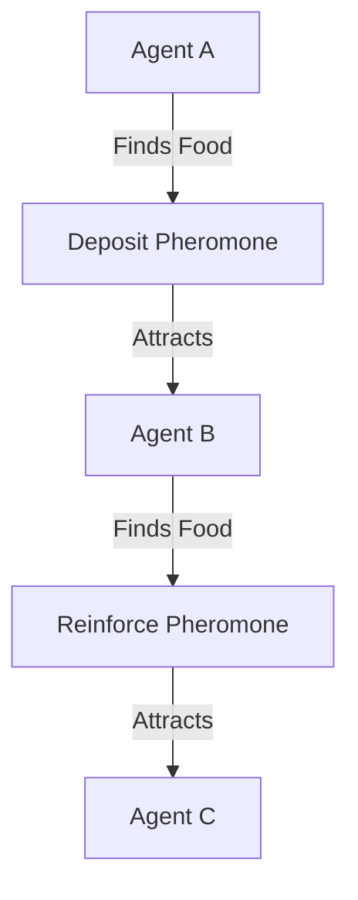
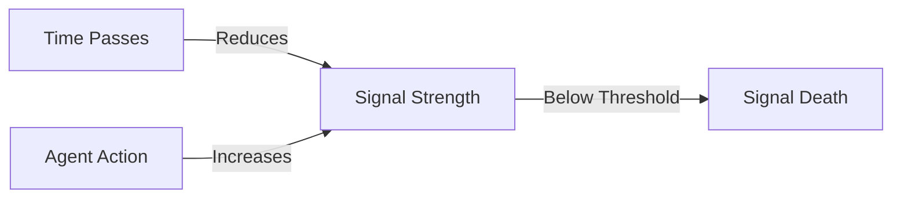
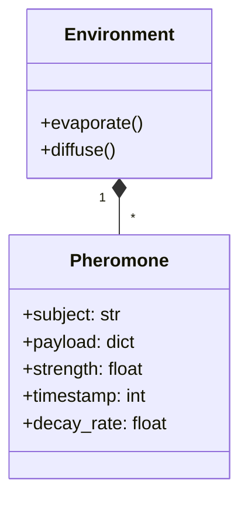

# 🧪 Evolutionary Pheromones

## ⚡ BLUF (Bottom Line Up Front)
In a biological swarm, communication is chemical, not digital. **Pheromones** are signals deposited in the environment that have **Strength** (Priority) and **Decay** (Time-to-Live). This prevents information overload; old, irrelevant signals simply fade away, while important signals are reinforced by other agents.

## 📊 Pheromone Matrix

| Type | Analogue | Meaning | HFO Implementation |
| :--- | :--- | :--- | :--- |
| **Trail** | Ant | "Follow this path" | Success Trace (LangSmith) |
| **Alarm** | Bee | "Danger here" | Error Log / Exception |
| **Aggregation** | Cockroach | "Gather here" | Task Queue (NATS) |
| **Territory** | Wolf | "This is mine" | Lock File / Mutex |

## 🧠 Concept Visualization

### View 1: The Feedback Loop (Conceptual)
*Positive feedback amplifies success.*

### View 2: Signal Decay (Logical)
*Information has a half-life.*

### View 3: Digital Implementation (Physical)
*How we code chemistry.*

## 🦅 Executive Summary
**Pheromones** are the language of Stigmergy. They are not just data; they have **biological properties** like decay and strength.
*   **Ant Pheromone**: "Follow me." (Pathfinding)
*   **Termite Pheromone**: "Build here." (Construction)
*   **Slime Mold Pheromone**: "Explore there." (Search)
