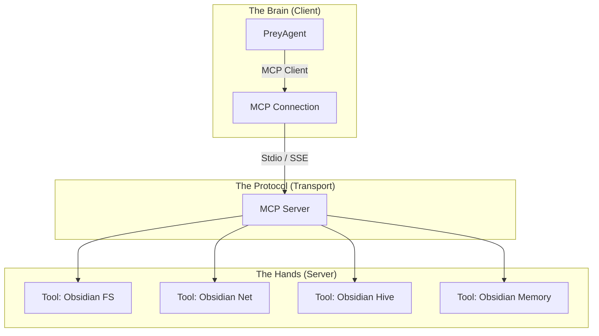

# 🔌 HFO Model Context Protocol (MCP): The Universal Adapter

> **Context**: Gen 51 relied on "Fake Tools" (hardcoded Python functions injected into `PreyAgent`).
> **Gen 52 Goal**: Implement the **Model Context Protocol (MCP)** to decouple "Brain" (LLM) from "Hands" (Tools), enabling universal interoperability between HFO agents and any MCP-compliant tool (local or remote).

## 1. The Problem: The "Hardcoded Hands" Trap

In Gen 51, tools were:
1.  **Tightly Coupled**: `PreyAgent` imported `tools.py` directly.
2.  **Language Locked**: Only Python tools were supported.
3.  **Local Only**: Agents could not easily use tools on a remote server (without custom RPC).
4.  **Fragile**: Adding a tool required modifying the agent's code.

This violates the **Hexagonal Fractal Holarchy** (Pillar 1) because the "Hands" were fused to the "Body".

## 2. The Solution: HFO-MCP (Praxeology)

We adopt the **Model Context Protocol (MCP)** as the standard interface for all Action (Praxeology).

### 2.1. The Architecture

### 2.2. Core Components

1.  **HFO-MCP Server (`body/hands/mcp_server.py`)**:
    *   A standalone process that hosts the HFO Toolset.
    *   Exposes tools via `stdio` (for local agents) or `SSE` (for remote/containerized agents).
    *   **Responsibility**: Security, Validation, Execution.

2.  **HFO-MCP Client Adapter (`body/hands/mcp_client.py`)**:
    *   A lightweight adapter for `PreyAgent`.
    *   **Responsibility**: Discovery (`list_tools`), Execution (`call_tool`), Error Handling.

3.  **The Toolset (Standard Library)**:
    *   `obsidian_fs`: Safe filesystem access (read/write/search) within `hive_fleet_obsidian`.
    *   `obsidian_net`: Web capabilities (Search, Fetch).
    *   `obsidian_hive`: Stigmergy (NATS Publish/Subscribe).
    *   `obsidian_memory`: Long-term recall (Postgres/Vector).

## 3. Implementation Strategy (Gen 52)

### Phase 1: The Local Bridge (Stdio)
*   **Goal**: Replace `tools.py` with `mcp_server.py` running over Stdio.
*   **Why**: Immediate decoupling without networking complexity.
*   **Stack**: `mcp-python-sdk`.

### Phase 2: The Remote Swarm (SSE)
*   **Goal**: Allow agents in Docker containers to access Host tools via SSE.
*   **Why**: Enables the "Hybrid Stability Protocol" (Agents in Docker, Tools on Host).

### Phase 3: The Universal Market
*   **Goal**: Allow HFO agents to use *external* MCP servers (e.g., GitHub MCP, Slack MCP).
*   **Why**: Infinite capability expansion without writing code.

## 4. Security & Governance

*   **Sandboxing**: The MCP Server enforces `root_path` restrictions.
*   **Audit**: Every MCP call is logged to `audit_trail/` (The "Pathos" dimension).
*   **Human-in-the-Loop**: Critical tools (e.g., `delete_file`, `git_push`) require `user_approval` flag (future).

## 5. The "Praxeology" Pillar Alignment

This design satisfies Pillar 8:
*   **Protocol-First**: We define the *interface*, not the implementation.
*   **Decoupling**: Agents are just "MCP Clients".
*   **Scalability**: We can spin up 100 MCP Servers for 100 Agents.

---

## 📋 Implementation Checklist

- [ ] **Define**: `brain/hfo_mcp.feature` (Gherkin Behavior).
- [ ] **Install**: Add `mcp` to `requirements.txt`.
- [ ] **Build**: Create `body/hands/mcp_server.py` (The Server).
- [ ] **Adapt**: Update `PreyAgent` to use `McpClient` instead of `ToolSet`.
- [ ] **Verify**: Run `venom/test_mcp_handshake.py`.
