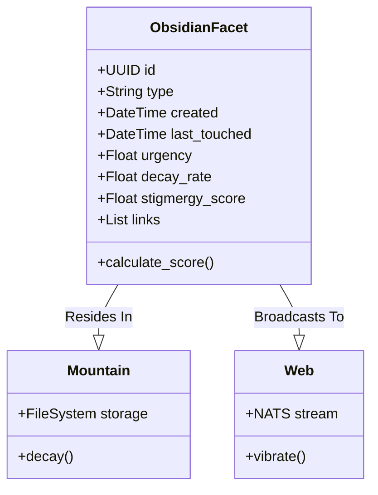
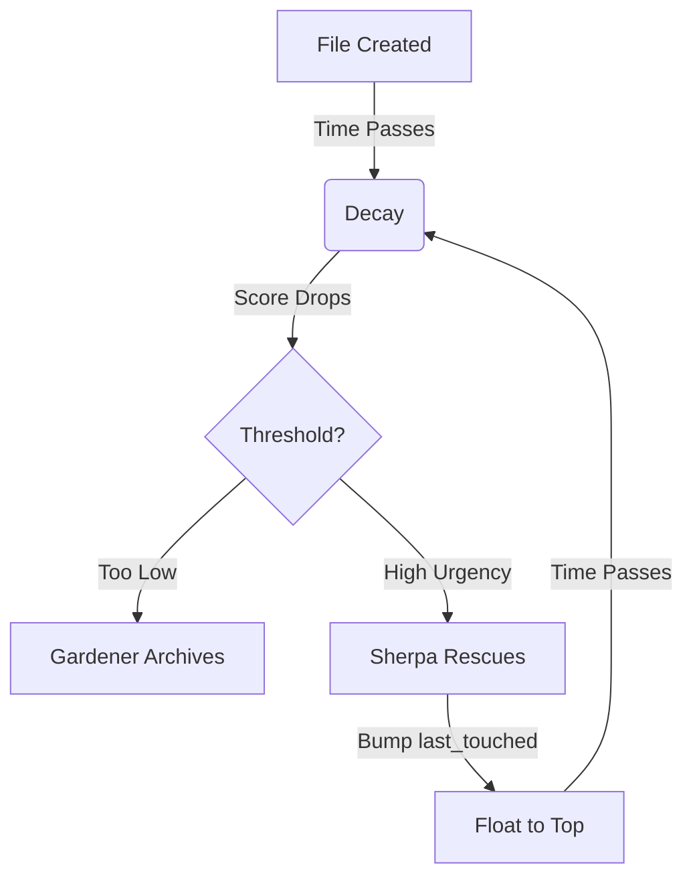

# 🕸️⛰️ The Mountain & The Web: Deep Stigmergy Architecture

> **Symbolism**: 🕸 (The Web: Active/Hot) + ⛰ (The Mountain: Static/Cold)
> **Goal**: Embed stigmergy into the filesystem (Static) and active agents (Hot).
> **Standard**: The "Obsidian Facet" (Unified Metadata Schema).

## 🧠 BLUF (Bottom Line Up Front)
We are replacing "Active Inference" (too complex) with **Fractal Stigmergy**.
1.  **The Mountain (Static)**: The File System is the memory. Files "sink" over time (Decay) and "float" when touched (Uplift).
2.  **The Web (Hot)**: NATS JetStream connects the static points. Agents (Sherpa, Gardener, Weaver) crawl the Mountain and vibrate the Web.
3.  **The Facet (Schema)**: A standardized YAML header (`id`, `urgency`, `last_touched`) makes every file a machine-readable neuron.

---

## 1. The Obsidian Facet (Unified Schema)
To ensure machine readability and dashboard visualization, every artifact on the Mountain must wear the "Obsidian Facet" — a standardized YAML header.

### The Schema (YAML)
```yaml
---
# Identity (The Crystal)
id: "550e8400-e29b-41d4-a716-446655440000"
type: "concept" # concept, pattern, mission, artifact
status: "active" # active, archived, draft
title: "The Mountain & The Web"

# Stigmergy (The Mountain)
created: "2025-11-22T12:00:00Z"
last_touched: "2025-11-22T14:30:00Z" # <--- The "Float" Mechanism
urgency: 0.9 # 0.0 to 1.0 (Intrinsic Importance)
decay_rate: 0.1 # 0.0 to 1.0 (How fast it sinks)
stigmergy_score: 85.5 # Calculated: Urgency / (TimeDelta * Decay)

# Context (The Web)
author: "Swarmlord"
links:
  - "550e8400-e29b-41d4-a716-446655440001": "relates_to"
  - "550e8400-e29b-41d4-a716-446655440002": "implements"
tags: ["architecture", "stigmergy", "core"]
---
```

### Visual: The Facet Structure


---

## 2. The Mountain ⛰ (Static Stigmergy)
The Repository **IS** the Stigmergy. It is a physical accumulation of work over time.

### A. The Strata (File Naming & Structure)
Time is the primary axis of the Mountain.
*   **Naming Convention**: `YYYYMMDD_HHMMSS_{Title}.md`
    *   *Why*: This makes the "Age" of the artifact immediately visible in the file system.
    *   *Calculation*: `Stigmergy = Urgency / (Now - Timestamp)`. Old files naturally "sink" unless bumped.

### B. The "Float" Mechanism (Erosion & Uplift)
*   **Erosion**: Every second, a file's score decays based on `created` timestamp.
*   **Uplift (Bump)**: When a User or Agent interacts with a file, they update `last_touched`.
    *   *Effect*: This resets the decay clock. The file "floats" back to the top of the attention stack.

### Visual: The Float Mechanism


---

## 3. The Web 🕸 (Hot Stigmergy)
The Web connects the static points on the Mountain. It is alive.

### A. The Holonic Roles (The Spiders)
These roles are sub-holons of the **Assimilator** (The Organ of Memory & Digestion). They maintain the Mountain.

| Role | Holon ID | Function | Action |
| :--- | :--- | :--- | :--- |
| **Sherpa** | `Assimilator.Sherpa` | **Retrieval** | Climbs the mountain. Finds high `urgency` but old `last_touched` files. Re-broadcasts to NATS. |
| **Gardener** | `Assimilator.Gardener` | **Pruning** | Finds low `stigmergy_score` files. Moves them to `memory/archive/` (The Cave). |
| **Weaver** | `Assimilator.Weaver` | **Synthesis** | Traces links between files. Adds `links: []` to the YAML header, strengthening the Web. |

### B. The Vibration (NATS)
When a Spider touches a file on the Mountain, it vibrates the Web.
*   **Signal**: `hfo.signal.file.touched`
*   **Payload**: `{"file": "20251122_...", "new_score": 92}`
*   **Result**: Other agents turn their heads. The "Hot" layer directs attention to the "Static" layer.

### Visual: The Holonic Web

```mermaid
sequenceDiagram
    participant Mountain as ⛰ Mountain (Files)
    participant Sherpa as 🧗 Sherpa (Agent)
    participant Web as 🕸 Web (NATS)
    participant Weaver as 🕷 Weaver (Agent)

    Sherpa->>Mountain: Scan for High Urgency / Old Time
    Mountain-->>Sherpa: Found "Ancient_Wisdom.md"
    Sherpa->>Mountain: Update last_touched (Bump)
    Sherpa->>Web: Publish "hfo.signal.file.touched"
    Web->>Weaver: Receive Signal
    Weaver->>Mountain: Read Context
    Weaver->>Mountain: Add Links to Header
```


---

## 4. The Dashboard (Visualizing the Facet)
Because the "Obsidian Facet" is standardized YAML, we can generate instant dashboards.

### A. The Heatmap (Urgency vs. Freshness)
*   **X-Axis**: Time since `last_touched` (Freshness).
*   **Y-Axis**: `urgency` (Importance).
*   **Zone 1 (Top Right)**: **Critical & Active** (The Peak).
*   **Zone 2 (Top Left)**: **Critical but Forgotten** (The Sherpa's Target).
*   **Zone 3 (Bottom Right)**: **Trivial but Active** (Noise).
*   **Zone 4 (Bottom Left)**: **Trivial & Forgotten** (The Gardener's Compost).

### B. The Web Graph
*   **Nodes**: Files (sized by `stigmergy_score`).
*   **Edges**: `links` from the YAML header.
*   **Insight**: Clusters reveal "Knowledge Domains". Isolated nodes are "Orphans" (Weaver's Target).
