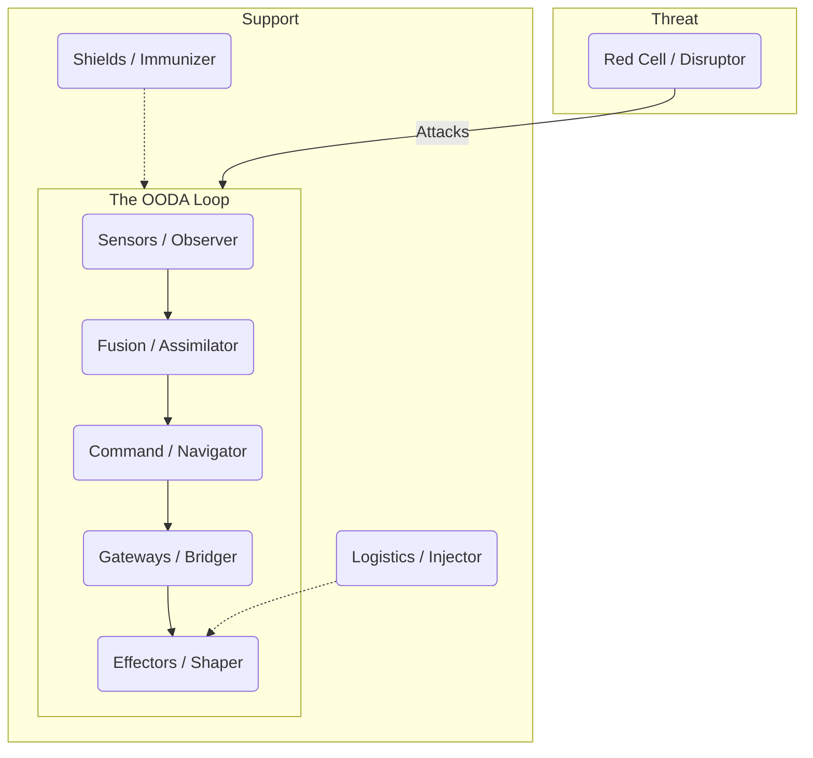
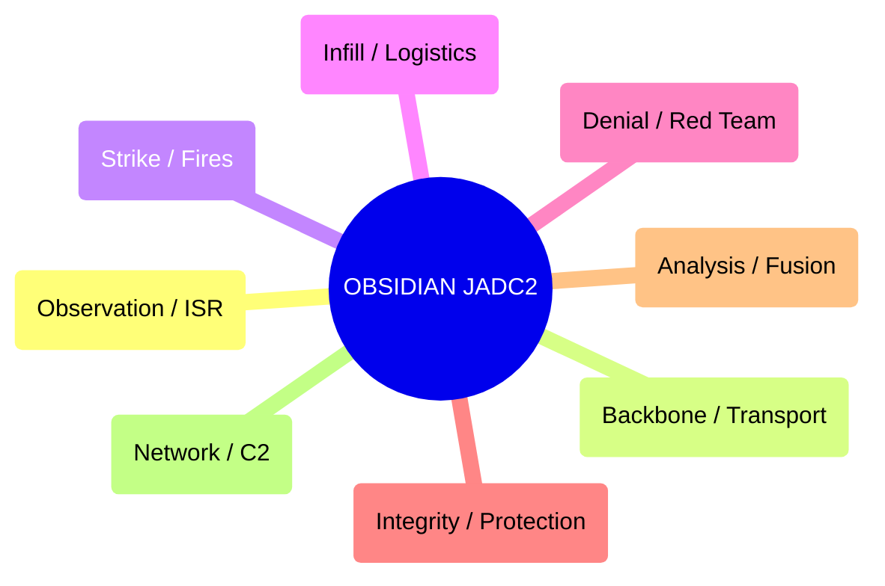

# 💎 Design: OBSIDIAN JADC2 Alignment (Gen 52)

> **Intent**: To replace the "Alien Anatomy" of Variation C with a **"Battle-Tested Anatomy"** derived from **JADC2 (Joint All-Domain Command and Control)**.
> **Goal**: To map the 8 HFO Roles to dense, functional military concepts (Sensors, Effectors, Fusion) that carry heavy semantic weight.

---

## 1️⃣ Variation D: The "Functional JADC2" Stack (Pure Density)
*Focus: Ignoring the letters for the Anatomy layer in favor of the most accurate functional terms.*

| Letter | Role | JADC2 Anatomy (Function) | Military Domain | Definition |
| :--- | :--- | :--- | :--- | :--- |
| **O** | **Observer** | **Sensors** | **ISR** (Intel, Surveillance, Recon) | The eyes and ears. Collecting raw telemetry. |
| **B** | **Bridger** | **Gateways** | **Transport** (Datalinks) | The interface. Cross-domain solutions and APIs. |
| **S** | **Shaper** | **Effectors** | **Fires** (Kinetic/Non-Kinetic) | The hands. Executing the mission (writing code). |
| **I** | **Injector** | **Logistics** | **Sustainment** | The blood. Fueling the fight (compute/tokens). |
| **D** | **Disruptor** | **Red Cell** | **Adversary** (Red Teaming) | The enemy. Simulating threats to test resilience. |
| **I** | **Immunizer** | **Shields** | **Protection** (Cyber/Force Pro) | The armor. Active defense and integrity checks. |
| **A** | **Assimilator** | **Fusion** | **PED** (Processing, Exploit, Dissem) | The brain (processing). Turning raw data into intel. |
| **N** | **Navigator** | **Command** | **C2** (Command & Control) | The brain (deciding). Intent and orchestration. |

### Visual Visualization (The Kill Chain)

---

## 2️⃣ Variation E: The "Aligned JADC2" Stack (Best of Both)
*Focus: Finding JADC2 terms that **start with the correct letter**, preserving the mnemonic while keeping the military density.*

| Letter | Role | JADC2 Anatomy (Aligned) | Concept |
| :--- | :--- | :--- | :--- |
| **O** | **Observer** | **Observation** | The act of sensing (ISR). |
| **B** | **Bridger** | **Backbone** | The comms infrastructure (Transport). |
| **S** | **Shaper** | **Strike** | The delivery of effects (Fires). |
| **I** | **Injector** | **Infill** | The insertion of resources (Logistics). |
| **D** | **Disruptor** | **Denial** | Area Denial / Jamming (Adversary). |
| **I** | **Immunizer** | **Integrity** | Information Assurance (Protection). |
| **A** | **Assimilator** | **Analysis** | Intelligence Analysis (PED). |
| **N** | **Navigator** | **Network** | Net-Centric Warfare (C2). |

### Visual Visualization (The Aligned Stack)

---

## 3️⃣ Variation F: The "Biomimetic JADC2" (The Hybrid)
*Focus: Using biological terms that map to JADC2 functions. This satisfies the "Organ Biomimetic" desire while keeping "Sensors/Effectors" logic.*

| Letter | Role | Biomimetic Organ | JADC2 Equivalent |
| :--- | :--- | :--- | :--- |
| **O** | **Observer** | **Receptors** | Sensors |
| **B** | **Bridger** | **Synapses** | Gateways |
| **S** | **Shaper** | **Actuators** | Effectors |
| **I** | **Injector** | **Vascular** | Logistics |
| **D** | **Disruptor** | **Pathogen** | Red Cell |
| **I** | **Immunizer** | **Antibody** | Shields |
| **A** | **Assimilator** | **Cortex** | Fusion |
| **N** | **Navigator** | **Nucleus** | Command |

---

## 🏁 Recommendation
**Variation D (Functional JADC2)** is the most "Battle-Tested". It uses the standard industry terms (**Sensors**, **Effectors**, **Fusion**, **Command**) which are unambiguous and dense with meaning.

*   **Trade-off**: You lose the "Letter Matching" for the Anatomy layer (e.g., O != Sensors).
*   **Benefit**: You gain instant clarity and professional gravity.

**Swarmlord Choice**: **Variation D**. The clarity of "Sensors" and "Effectors" outweighs the cleverness of matching letters. The **Role** (Observer) provides the 'O', the **Anatomy** (Sensors) provides the 'Function'.
