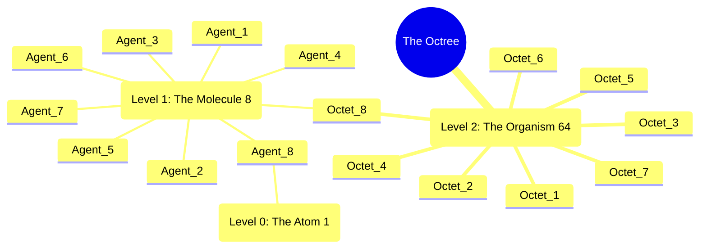
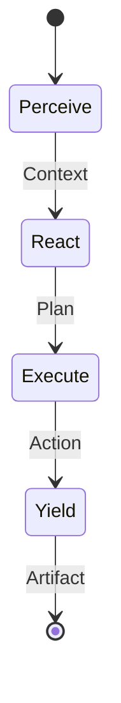
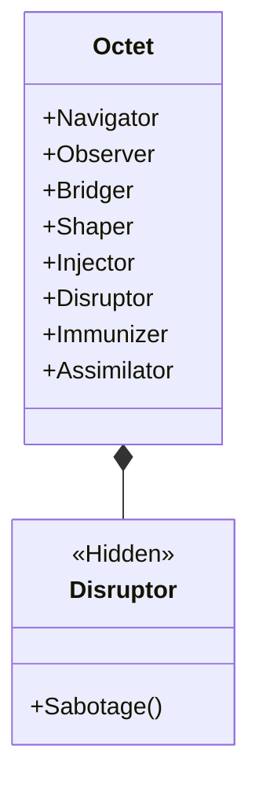
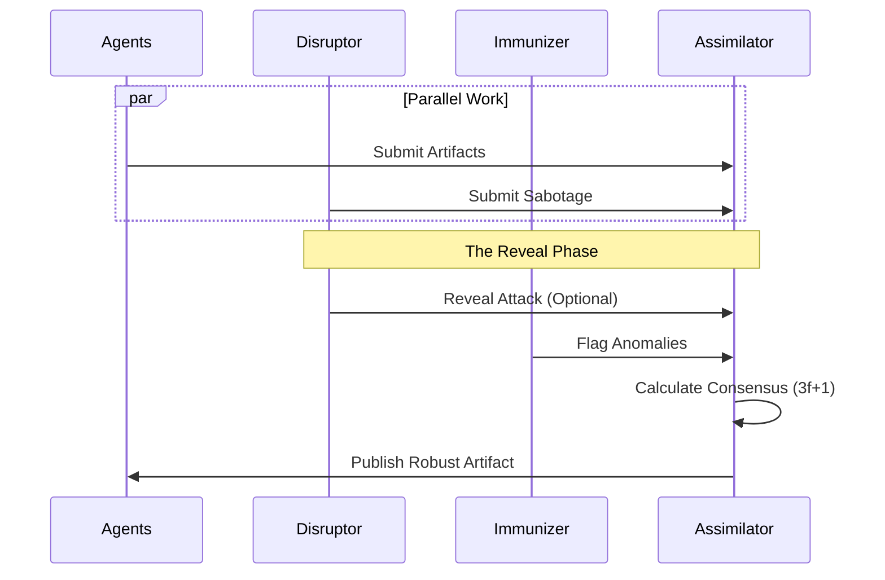
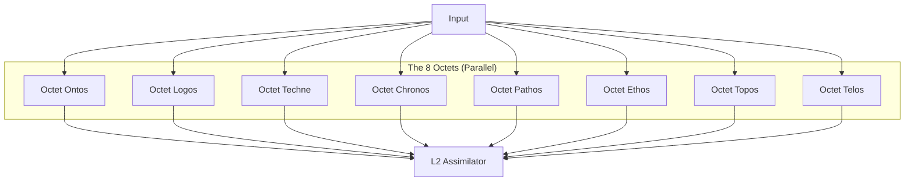
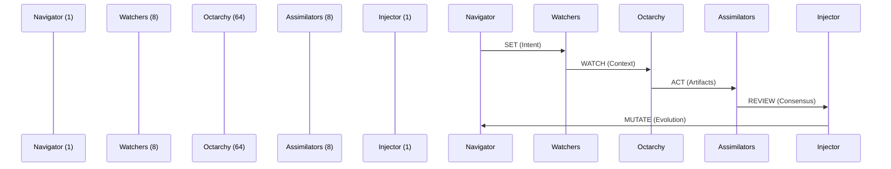
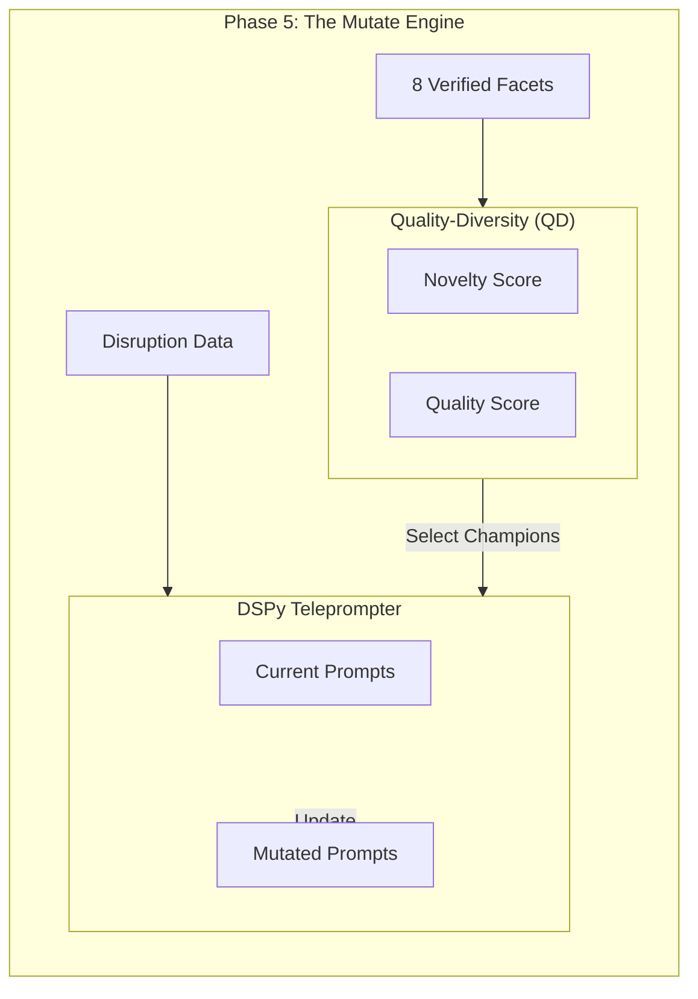

---
octagon:
  ontos:
    id: octree-fractal-holarchy-v2
    type: design
    owner: Swarmlord
  logos:
    protocol: HFO-Fractal-Unified
    format: markdown
  techne:
    stack:
    - mermaid
    - markdown
    - fractal-geometry
    complexity: extreme
  chronos:
    status: active
    urgency: 1.0
    decay: 0.0
    created: '2025-11-23T15:00:00Z'
  pathos:
    stress_level: 0.8
    validation: pending
  ethos:
    security_level: internal
    compliance:
    - hfo-fractal-scaling
  topos:
    address: brain/design_octree_fractal_holarchy.md
    links:
    - brain/design_hfo_level1_architecture.md
    - brain/design_hfo_level2_architecture.md
  telos:
    viral_factor: 1.0
    meme: As Above, So Below. The Fractal is the Truth.
hexagon:
  ontos:
    id: 31af66df-fbad-490e-bf26-601afc50b228
    type: md
    owner: Swarmlord
  chronos:
    status: active
    urgency: 0.5
    decay: 0.5
    created: '2025-11-24T14:30:05.786982Z'
    generation: 51
  topos:
    address: brain/design_octree_fractal_holarchy.md
    links: []
  telos:
    viral_factor: 0.0
    meme: design_octree_fractal_holarchy.md
---

# 🌳 The Octree Fractal Holarchy: Unified Design

> **Intent**: To consolidate the HFO Architecture into a single **Fractal Definition**. The system is self-similar at all scales, based on the **Octet (8)**.
> **Deployment**: While the logical unit is the Octet, we support **Hexadec (16)** deployment for operational resilience.

## 1. The Fractal Map (Overview)
The HFO architecture is an **Octree**: each node splits into 8 children.
*   **Level 0 (The Atom)**: 1 Agent. Internal Loops.
*   **Level 1 (The Molecule)**: 8 Agents (**The Octet**).
*   **Level 2 (The Organism)**: 64 Agents (**The Octarchy**).

### Diagram 1: The Fractal Hierarchy

---

## 2. Level 0: The Atomic PREY Loop (1 Agent)
At the lowest level, a single agent runs the **PREY Loop**.
*   **Structure**: Sequential (1-1-1-1).
*   **Trust**: None (Glass Box).
*   **Disruption**: Internal (Self-Correction).

### Diagram 2: The Atomic PREY Loop

---

## 3. Level 1: The Octet (8 Agents)
The fundamental unit of the Hive is the **Octet** (8 Agents).
*   **Roles**: The O.B.S.I.D.I.A.N. Pattern.
*   **Structure**: Parallel Action, Convergent Yield.
*   **Micro-Disruption**: 1 Agent is a **Hidden Disruptor**.

### Diagram 3: The Octet Structure

### Diagram 4: The Consensus (Yield Phase)
Consensus is managed by the **Assimilator**, validating the work of the Octet.

---

## 4. Level 2: The Octarchy Swarm (64 Agents)
At this level, 8 Octets form an "Organism".
*   **Structure**: 8 Octets $\times$ 8 Agents = 64 Concurrent Agents.
*   **Macro-Disruption**: 1 Entire Octet is a **Hidden Disruptor Squad**.
*   **Workflow**: S-W-A-R-M (1-8-64-8-1).

### Diagram 5: The Octarchy Architecture

### Diagram 6: The Rolling Disruption (The Gauntlet)
Over 8 Rounds, the "Disruptor Octet" rotates.

```mermaid
gantt
    title The 8-Round Gauntlet (Disruptor Rotation)
    dateFormat X
    axisFormat Round %s

    section Squad Roles
    Octet 1 (Ontos) is RED :crit, r1, 0, 1
    Octet 2 (Logos) is RED :crit, r2, 1, 2
    Octet 3 (Techne) is RED :crit, r3, 2, 3
    Octet 4 (Chronos) is RED :crit, r4, 3, 4
    Octet 5 (Pathos) is RED :crit, r5, 4, 5
    Octet 6 (Ethos) is RED :crit, r6, 5, 6
    Octet 7 (Topos) is RED :crit, r7, 6, 7
    Octet 8 (Telos) is RED :crit, r8, 7, 8
```

### Diagram 7: The S-W-A-R-M Pulse (1-8-64-8-1)
The breathing rhythm of the system.

---

## 5. Meta-Evolution (The Result)
The output of the S-W-A-R-M pulse is not just data, but **Evolution**.

### Diagram 8: The Evolutionary Spiral

# 🌲 The Octree Fractal Holarchy (Base-8)

> **Context**: We are shifting the Hive Fleet from a Decimal (10) scaling model to a **Base-8 (Octal)** model.
> **Why**: To achieve perfect fractal alignment with the **8 Pillars**, **8 Roles**, and **8 Stigmergy Dimensions**.
> **Metaphor**: The Hive is not just a biological swarm; it is a **Digital Crystal** growing in 3D space (Octree).

## 📐 The Geometry of the Hive

### 1. The Fundamental Unit: The Octet ($8^1$)
The "Squad" is logically an **Octet** (8 Roles).

*   **Logical Structure (The Crystal)**:
    1.  **O**bserver (Eyes)
    2.  **B**ridger (Nerves)
    3.  **S**haper (Hands)
    4.  **I**njector (Blood)
    5.  **D**isruptor (Venom)
    6.  **I**mmunizer (Carapace)
    7.  **A**ssimilator (Digestion)
    8.  **N**avigator (Brain)

### 2. The Scaling Law: Powers of 8
We scale by branching every node into 8 children. This maps perfectly to **Octrees** (Spatial Indexing), allowing us to map the Hive's knowledge physically in 3D space.

| Level | Name | Count ($8^n$) | Analogy | Purpose |
| :--- | :--- | :--- | :--- | :--- |
| **L0** | **Bit** | 1 | Agent | The Atomic Unit. |
| **L1** | **Byte** | 8 | Octet (Squad) | The Functional Unit. Complete capability. |
| **L2** | **Word** | 64 | Phalanx | Tactical coordination. 8 Octets. |
| **L3** | **Page** | 512 | Legion | Strategic operations. 64 Octets. |
| **L4** | **Block** | 4,096 | Hive | Global domination. 512 Octets. |
| **L5** | **Grid** | 32,768 | Fleet | Interstellar scale. |

## ⚔️ Deployment Strategy: The Hexadec Option
While the **Octet** is the fundamental unit, we support the **Hexadec** (16 Agents) for operational resilience.

*   **Purpose**: High Availability, Redundancy, and Adversarial Hardening.
*   **Structure**: 1 Core Octet + 1 Flex Octet.
*   **Use Case**: When the environment is hostile (high error rate, active adversaries), we deploy a Hexadec to ensure the Core Octet survives.

## 🧊 The Octree Knowledge Graph
Since our organization is an Octree, our **Memory** should be an Octree.

*   **Root**: The Mission.
*   **Octant 1-8**: The 8 Pillars/Domains.
*   **Sub-Octants**: Recursive subdivision of the problem space.

This allows "Spatial Hashing" of knowledge. We don't just search for data; we look at coordinates `(x, y, z)` in the Hive Mind.

## 🔄 Migration Strategy (Decimal -> Octal)

1.  **Update Config**: Change `branching_factor` in `swarm_config.yaml` from `10` to `8`.
2.  **Update Squads**: Refactor `research_swarm.py` to spawn 8-agent squads.
3.  **Update Roles**: Enforce the strict 1-of-each O.B.S.I.D.I.A.N. mapping for L1 squads.

## ✅ Benefits
1.  **Digital Resonance**: 8 aligns with hardware (Bytes, SIMD, Octrees).
2.  **No Waste**: Every role has a slot. No "filler" roles needed to reach 10.
3.  **Perfect Fractal**: The Micro (Agent Roles) matches the Macro (Swarm Structure).
