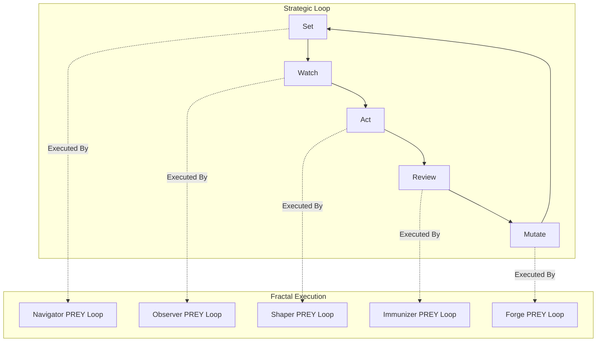
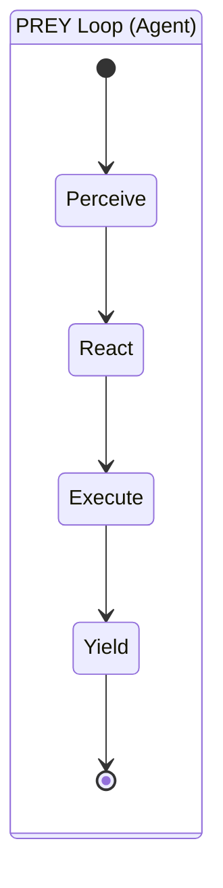
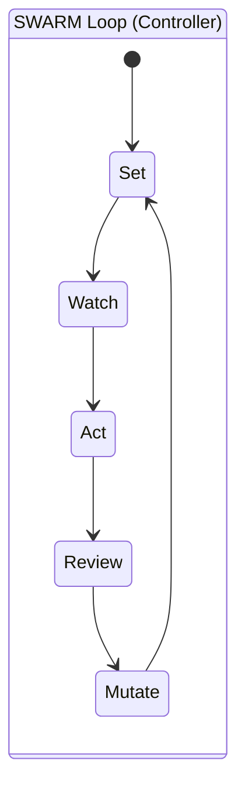

# 🔄 Cognitive Loops: PREY & SWARM

## ⚡ BLUF (Bottom Line Up Front)
Hive Fleet Obsidian operates on a **Fractal Cognitive Architecture**. The **PREY Loop** (Perceive-React-Execute-Yield) is the atomic unit of cognition. The **SWARM Loop** (Set-Watch-Act-Review-Mutate) is the strategic orchestration layer. **Crucially, every phase of the SWARM Loop is executed by agents running their own PREY Loops.** The entire HFO system operates on cyclical PREY cycles at every scale.

## 📐 Strategic Hierarchy & Methodologies

| Loop | Level | Methodology Mapping | Purpose |
| :--- | :--- | :--- | :--- |
| **PREY** | **Execution / Tactical** | **OODA + Feedback** | **Tactical Superiority**. Fast, cyclical execution with immediate feedback. |
| **SWARM** | **Tactical-Strategic** | **D3A + Mutate** | **Adaptive Attack/Defense**. Decide, Detect, Deliver, Assess + Evolutionary Mutation. |
| **GROWTH** | **Strategy-Vision** | **F3EAD** | **Campaign Operations**. Find, Fix, Finish, Exploit, Analyze, Disseminate. (Formalizing) |
| **HIVE** | **Vision** | **Double Diamond + HFO** | **Meta-Evolution**. Hunt, Integrate, Validate, Evolve. |

> **Fractal Note**: Because this is a **Fractal Holarchy**, any loop can technically be executed by a single agent (sequentially). For example, a single agent can run a HIVE workflow. However, the system achieves **Emergent Intelligence** only when the higher loops (HIVE/GROWTH) are composed of lower loops (SWARM/PREY) running in parallel.

## 📊 Loop Comparison Matrix

| Feature | PREY Loop | SWARM Loop |
| :--- | :--- | :--- |
| **Level** | Atomic (L0) | Holonic (L1+) |
| **Timeframe** | Seconds | Minutes/Hours |
| **Focus** | Task Execution | Coordination & Strategy |
| **Output** | Artifacts | Directives |
| **Analogue** | Reflexes | Planning |
| **Implementation** | **The Engine** | **The Pattern** |

## 🧠 Concept Visualization

### View 1: The Nested Loops (Conceptual)
*Every SWARM phase is a container for PREY cycles.*

### View 3: The Canonical SWARM Workflow (Implementation)
*The specific "1-1-1-N-N-1" flow for the Research Swarm.*

1.  **Set (Orchestrator)**: **Navigator** sets the Intention. Defines the "What" and "Why" (Mission Intent).
2.  **Watch (Observability)**: **Observers** monitor the system asynchronously. Provides observability and telemetry.
3.  **Act (Map-Reduce)**: **Shapers** execute tasks in parallel (Map) with hidden **Disruptors** injecting adversarial noise.
4.  **Review (Byzantine Quorum & Reveal)**:
    *   **Observers** inject telemetry and monitoring data.
    *   **Immunizers** and **Assimilators** reach Quorum and Safety via Stigmergy, unaware of the Disruptors' identities.
    *   **Disruptors** self-identify via Stigmergy *only* to the **Navigator**, reporting their success rates vs. the Quorum.
    *   **Navigator** synthesizes the **Swarmlord of Webs Digest**, using the Disruptor metrics to bias the final report. This ensures every role is heard and improves the Signal-to-Noise Ratio (SNR) via Recursive Reduction.
5.  **Mutate (Evolution)**: **Evolutionary Forge** uses MAP-Elites QD Optimization to spawn a spread of SOTA exemplar compositions. No single best; diversity is the goal.
6.  **Context**: All steps occur in a **Network Virtual Stigmergy Layer** on NATS JetStream using the HFO Holarchy Fractal Obsidian architecture.

### View 2: The PREY State Machine (Logical)
*The internal logic of a single agent.*

### View 3: The SWARM State Machine (Logical)
*The internal logic of a controller.*

## 📈 The GROWTH Loop (Campaign Strategy)
*Methodology: HFO GROWTH (Growth-Gather, Root, Optimize, Weave, Test, Harvest)*
*Mapping to F3EAD: Find, Fix, Finish, Exploit, Analyze, Disseminate*
> **Note**: This loop is "Sparse" by design. It operates at the **Campaign Level**, managing two critical flows: **Knowledge** and **Personnel (Champions)**.
> **Fractal Note**: Every step of the GROWTH loop is executed by **Swarms running PREY loops**.

### 1. Knowledge Acquisition & Dispersal (The Learning Flow)
*How the Hive learns from the outside world.*
1.  **Growth-Gather** (Find): Identify knowledge gaps or external data sources (The "What").
2.  **Root** (Fix): Pinpoint the specific documents or URLs (The "Where").
3.  **Optimize** (Finish): Ingest and process the data via **SWARM Loops** (The "How").
4.  **Weave** (Exploit): Extract high-value insights (Gems) from the raw data.
5.  **Test** (Analyze): Assess the relevance and impact of the new knowledge.
6.  **Harvest** (Disseminate): Broadcast the findings to the Hive via Stigmergy (The "Why").

### 2. Champion Orchestration (The Roster Flow)
*How the Hive assigns the right AI to the right seat.*
1.  **Growth-Gather** (Find): Identify the Mission requirements (e.g., "Need high creativity").
2.  **Root** (Fix): Select the optimal **Champion** (e.g., `Claude-3-Opus`) for the **Role** (e.g., `Navigator`).
3.  **Optimize** (Finish): Deploy the Champion into the **Organ** (Seat).
4.  **Weave** (Exploit): Leverage the Champion's unique strengths (e.g., large context window).
5.  **Test** (Analyze): Monitor the Champion's performance (Fitness Score).
6.  **Harvest** (Disseminate): Update the **Gene Pool** with the Champion's success metrics.

## 💎 The HIVE Loop (Vision & Meta-Evolution)
*Methodology: Double Diamond + HFO (Hunt, Integrate, Validate, Evolve)*
> **Note**: This is the **Vision Level**. It governs the evolution of the Hive itself.
> **Fractal Note**: Every step of the HIVE loop is a **GROWTH Cycle**. The architecture is a **Hexagonal Fractal Holarchy** with Aggressive Exemplar Adoption and Byzantine Quorum with Hidden Disruptors, all operating on a **Network Virtual Stigmergy Layer** (which is also fractal).

### The HFO Twist
Standard Design Thinking (Discover/Define/Develop/Deliver) is adapted for a predatory, evolutionary swarm:

1.  **Hunt (Discover/Define)**:
    *   **Input**: Vague intuition or strategic gap.
    *   **Action**: Launch **Research Swarms** to explore the problem space.
    *   **Output**: A crystallized **Intent** or **Mission Spec**.

2.  **Integrate (Develop)**:
    *   **Input**: The Mission Spec.
    *   **Action**: **Assimilators** and **Builders** merge new capabilities into the codebase.
    *   **Output**: A new **Feature** or **Skill**.

3.  **Validate (Deliver)**:
    *   **Input**: The New Feature.
    *   **Action**: **Immunizers** and **Disruptors** test for resilience and alignment.
    *   **Output**: A **Verified Capability**.

4.  **Evolve (Meta-Feedback)**:
    *   **Input**: The Verified Capability.
    *   **Action**: The **Swarmlord** updates the **Global Memory** and spawns new generations of agents.
    *   **Output**: **System-Wide Evolution**.

## 🦅 Executive Summary
HFO uses a **Hexagonal Fractal Holarchy** of cognitive loops, strictly mapped to the Holonic Levels:

1.  **Level 0 (Atomic)**: **PREY Loop**. The engine of individual agency. Fast, tactical, tool-using.
2.  **Level 1 (Squad)**: **SWARM Loop**. The coordination of multiple L0 agents. Strategic, orchestrating.
3.  **Level 2 (Campaign)**: **GROWTH Loop**. The management of multiple L1 Swarms. Sparse, managing Knowledge & Champions.
4.  **Level 3 (Hive)**: **HIVE Loop**. The meta-evolution of the entire system. Composed of GROWTH cycles.

The entire system runs on a **Network Virtual Stigmergy Layer** (NATS JetStream) that mirrors this fractal structure, enabling **Aggressive Exemplar Adoption** and **Byzantine Quorum** with **Hidden Disruptors** at every scale (from 1 agent to 1 million).
