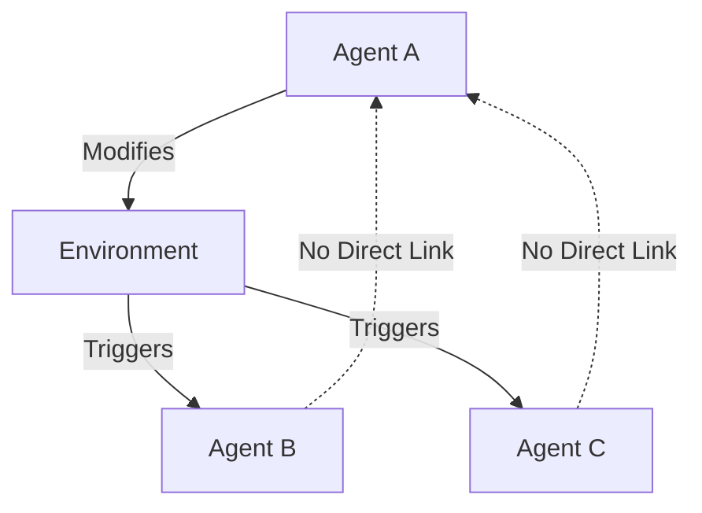
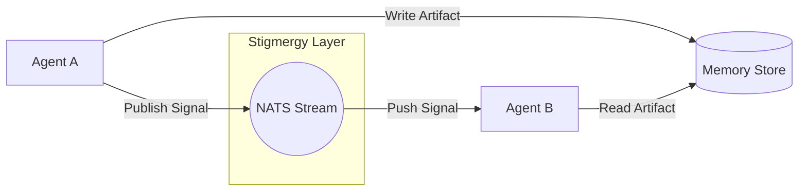
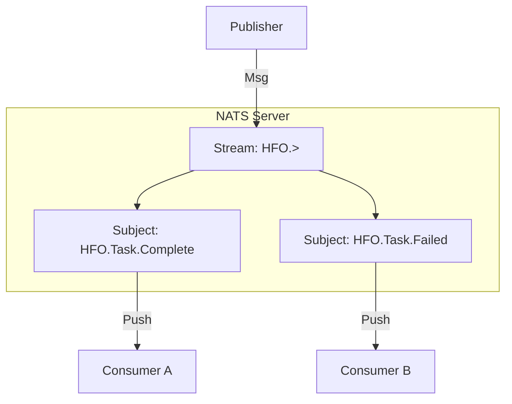

# 📡 Stigmergy Layer: NATS JetStream

## ⚡ BLUF (Bottom Line Up Front)
**Stigmergy** is the principle of indirect coordination through the environment. In Hive Fleet Obsidian, we implement this using **NATS JetStream**. Agents do not talk to each other; they modify the environment (publish messages), and other agents react to those modifications. This decouples the Swarm and allows for massive scalability.

## 📊 Stigmergy Matrix

| Component | Concept | Implementation | Purpose |
| :--- | :--- | :--- | :--- |
| **Pheromone** | Signal | JSON Message (Subject) | Trigger Action |
| **Artifact** | Heavy Object | S3 / Postgres / File | Persist State |
| **Environment** | Medium | NATS JetStream | Transport Signals |
| **Decay** | Cleanup | Stream Retention Policy | Prevent Clutter |

## 🧠 Concept Visualization

### View 1: Indirect Coordination (Conceptual)
*Agents talk to the environment, not each other.*

### View 2: The Signal-Artifact Pattern (Logical)
*Lightweight signals carry pointers to heavy artifacts.*

### View 3: JetStream Architecture (Physical)
*Streams, Consumers, and Subjects.*

## 🦅 Executive Summary
**Stigmergy** is indirect coordination via the environment. In HFO, the "Environment" is the **NATS JetStream** message bus.
*   **Signals**: Lightweight JSON messages (Pheromones).
*   **Artifacts**: Heavy data stored in Memory/Object Store.
*   **Decoupling**: Agents do not know who consumes their output.
