# 💎 Unified Header Options: 4 Paths to Stigmergy

> **BLUF**: Four distinct architectural choices for the "Unified Header". Each optimizes for a different variable: Meaning, Speed, Structure, or Evolution.
> **Recommendation**: **Option 1 (The Quadrivium)** aligns best with your "Intent-Based Engineering" goal.

## Option 1: The Quadrivium (The Philosopher) 🏛️
*Optimized for: **Meaning & Intent**.*
*The current proposal. Maps to the 4 fundamental abstractions.*

```yaml
---
# 🏛️ ONTOS (Identity)
id: "uuid-v4"
type: "intent"
title: "Mission Alpha"

# ⏳ CHRONOS (Time)
urgency: 1.0
decay: 0.0

# 📍 TOPOS (Space)
fractal_address: "1.1.0"
links:
  - { id: "uuid-target", rel: "requires" }

# 🎯 TELOS (Purpose)
bluf: "Why this exists."
meme: "Intent is King."
---
```

| Tradeoff | Verdict |
| :--- | :--- |
| **Pros** | **Deepest Context**. Forces "Why" before "How". Perfect for LLM understanding. |
| **Cons** | **Verbose**. High cognitive load for quick scripts. Requires discipline. |
| **Best For** | **Intent-Based Engineering**, Long-term Knowledge Graphs. |

---

## Option 2: The Lean Holon (The Engineer) ⚡
*Optimized for: **Speed & Friction**.*
*Standard DevOps metadata. No philosophy, just facts.*

```yaml
---
id: "uuid-v4"
type: "script"
owner: "DevOps"
status: "active"
description: "Deploys the stack."
dependencies: ["uuid-target"]
tags: ["deploy", "fast"]
---
```

| Tradeoff | Verdict |
| :--- | :--- |
| **Pros** | **Fast**. Low friction. Developers won't hate writing it. Standard YAML. |
| **Cons** | **Shallow**. Loses the "Fractal" and "Viral" properties. No "Why". |
| **Best For** | **CI/CD Pipelines**, Quick prototyping, Human-only teams. |

---

## Option 3: The Graph Node (The Cartographer) 🕸️
*Optimized for: **Structure & Connectivity**.*
*Treats every file as a node in a graph database.*

```yaml
---
node_id: "uuid-v4"
node_type: "vertex"
coordinates: "1.1.0" (Fractal Address)
edges:
  - { to: "uuid-target", type: "directed", weight: 1.0 }
  - { to: "uuid-other", type: "bidirectional", weight: 0.5 }
properties:
  title: "Mission Alpha"
  layer: "Brain"
---
```

| Tradeoff | Verdict |
| :--- | :--- |
| **Pros** | **Machine Readable**. Instantly ingestible by Neo4j/NetworkX. Perfect topology. |
| **Cons** | **Human Unreadable**. Hard to write manually. Feels like database entry. |
| **Best For** | **Automated Systems**, GraphRAG-heavy architectures. |

---

## Option 4: The Living Cell (The Biologist) 🧬
*Optimized for: **Evolution & Metabolism**.*
*Treats files as living organisms with energy costs.*

```yaml
---
dna_id: "uuid-v4"
metabolism:
  energy_cost: 1.0 (Compute/Token cost)
  decay_rate: 0.5 (Rot speed)
viral_payload:
  meme: "Intent is King"
  infectivity: 0.8 (Replication priority)
symbiosis:
  - { partner: "uuid-target", type: "mutualism" }
---
```

| Tradeoff | Verdict |
| :--- | :--- |
| **Pros** | **Evolutionary**. Enables "Survival of the Fittest" code. Self-cleaning. |
| **Cons** | **Abstract**. Hard to map to "File Path" or "Git Commit". Metaphor overload. |
| **Best For** | **Genetic Algorithms**, Artificial Life simulations. |

---

## 🧠 Visual Comparison


## 📊 Feature Matrix

```mermaid
graph LR
    subgraph Quadrivium
        Q_Ontos[Ontos]
        Q_Chronos[Chronos]
        Q_Topos[Topos]
        Q_Telos[Telos]
    end

    subgraph Lean
        L_ID[ID]
        L_Status[Status]
        L_Tags[Tags]
    end

    Q_Ontos --- L_ID
    Q_Chronos --- L_Status
    Q_Topos -.-> L_Tags
    Q_Telos -.-> Missing[❌ Missing]

    style Quadrivium fill:#eef,stroke:#333
    style Lean fill:#fee,stroke:#333
    style Missing fill:#f99,stroke:#333
```



## 🧬 Evolutionary Path


## 💡 Recommendation

Since your stated goal is **"Intent based engineering using declarative gherkin"** and you liked the **"Ontology"**, **Option 1 (The Quadrivium)** is the clear winner.

It is the only option that explicitly captures **TELOS (Purpose)** and **ONTOS (Identity)** as first-class citizens, which is required for an Intent-Based system.
