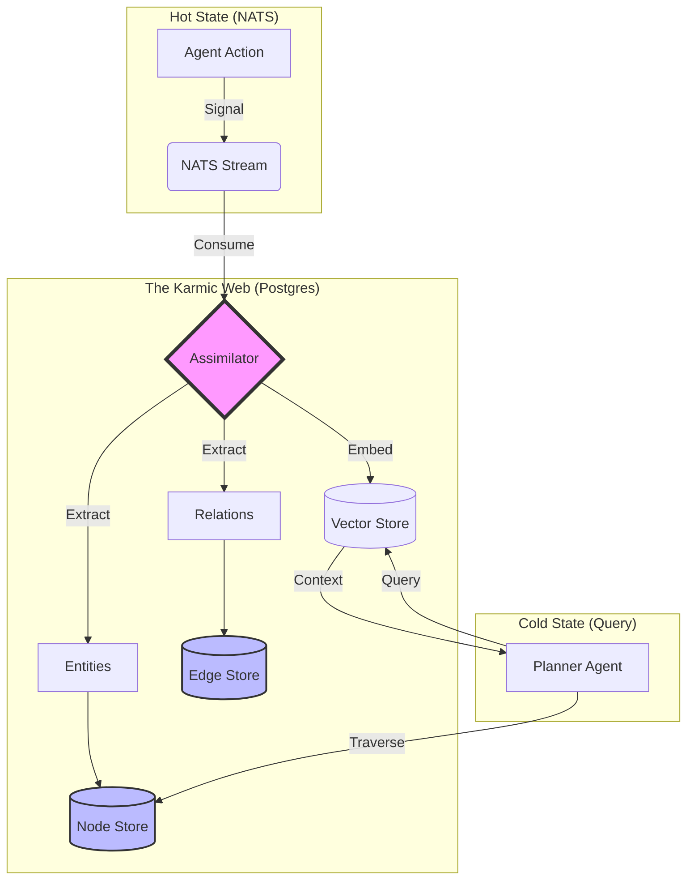
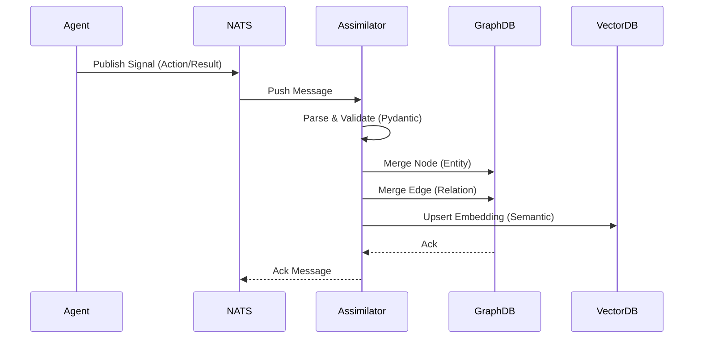
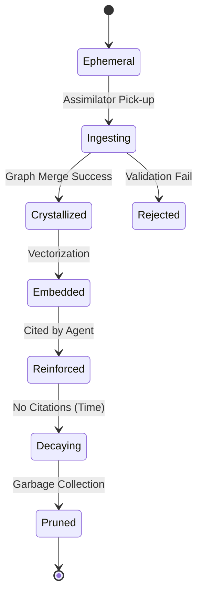

# 🕸️ Karmic Web Workflow

## ⚡ BLUF (Bottom Line Up Front)
The **Karmic Web** is the "Deep Memory" system of Hive Fleet Obsidian. Unlike the "Hot State" (NATS), which is ephemeral, the Karmic Web persists knowledge into a **Stigmergic Graph** (Postgres + NetworkX + pgvector). This workflow defines how the **Assimilator** agent consumes ephemeral signals, crystallizes them into nodes/edges, and allows other agents to query this "Ancestral Wisdom" for long-horizon planning. It is the bridge between *doing* (Action) and *knowing* (Wisdom).

---

## 1. Context & Architecture

The Karmic Web sits at the center of the **Tri-Brain Architecture**, mediating between the fast-twitch "Reflex" brain and the slow-twitch "Reasoning" brain.

## 2. The Assimilation Process

How raw signals become crystallized wisdom.

## 3. State Transitions

The lifecycle of a piece of information within the Karmic Web.

