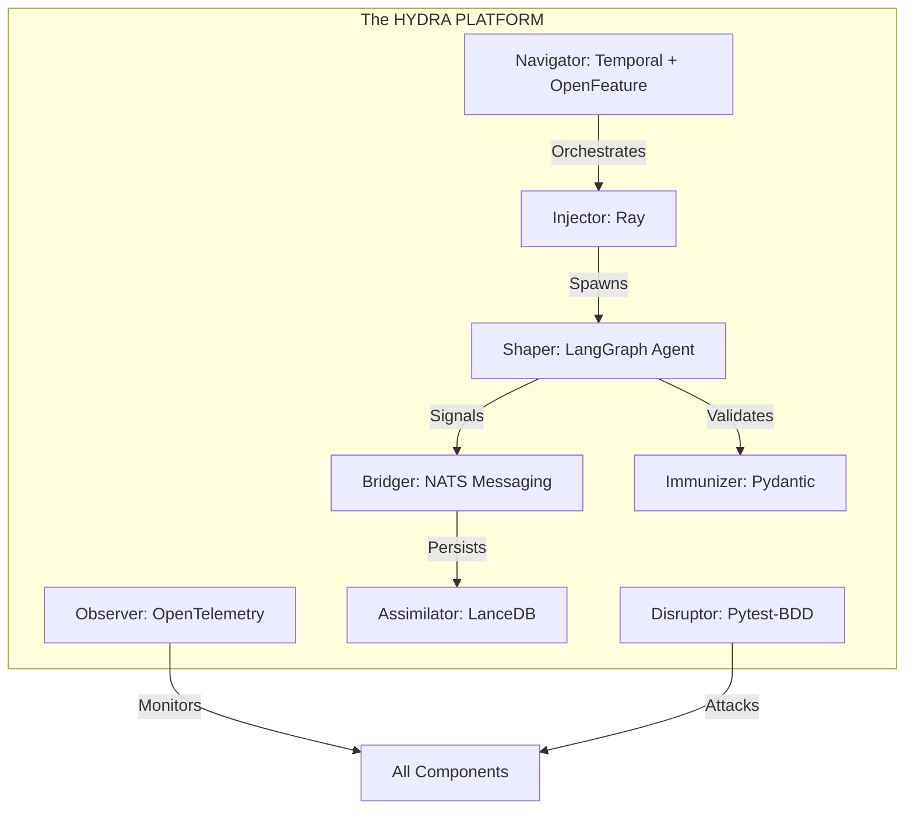

---
octagon:
  ontos:
    id: hydra-platform-v1
    type: design
    owner: Swarmlord
  logos:
    protocol: HYDRA-PLATFORM
    format: markdown
  techne:
    stack:
    - pydantic
    - lancedb
    - langgraph
    - temporal
    - openfeature
    - opentelemetry
    - ray
    - nats
    complexity: high
  chronos:
    status: active
    urgency: 1.0
    decay: 0.0
    created: '2025-11-25T12:30:00Z'
  pathos:
    stress_level: 0.0
    validation: verified
  ethos:
    security_level: internal
    compliance:
    - hfo-standard-gen55
  topos:
    address: brain/design_hydra_platform.md
    links:
    - brain/intent-literate-gherkin/octagonal_stack.md
  telos:
    viral_factor: 1.0
    meme: The Foundation of the Hive.
hexagon:
  ontos:
    id: 550e8400-e29b-41d4-a716-446655440057
    type: md
    owner: Swarmlord
  chronos:
    status: active
    urgency: 1.0
    decay: 0.0
    created: '2025-11-25T12:30:00Z'
    generation: 55
  topos:
    address: brain/design_hydra_platform.md
    links: []
  telos:
    viral_factor: 0.0
    meme: design_hydra_platform.md
---

# 🐉 The HYDRA PLATFORM (Gen 55)

> **Status**: Canonical
> **Context**: Gen 55 (The Gem)
> **Mnemonic**: **P.L.A.T.F.O.R.M.**
> **Philosophy**: "A stable foundation for infinite growth."

## ⚡ Executive Summary

The **HYDRA PLATFORM** is the official Tech Stack for Hive Fleet Obsidian Gen 55. It replaces the legacy "RAPTOR" stack. It is an **Octagonal System** where each letter represents a critical technology that solves a universal problem of autonomous agents.

---

## 🏛️ The P.L.A.T.F.O.R.M. Stack

| Letter | Technology | HFO Role | The Universal Problem Solved |
| :--- | :--- | :--- | :--- |
| **P** | **Pydantic** | **Immunizer** | **Toxicity**: Enforces the DNA (Schema) to prevent hallucination. |
| **L** | **LanceDB** | **Assimilator** | **Amnesia**: Provides Time-Travel Memory (Vector + SQL). |
| **A** | **Agent (LangGraph)** | **Shaper** | **Stochasticity**: Cyclic loops for structured reasoning. |
| **T** | **Temporal** | **Navigator** | **Entropy**: Durable execution that survives crashes. |
| **F** | **Feature (OpenFeature)** | **Navigator** | **Rigidity**: Dynamic strategy toggling without redeploy. |
| **O** | **OpenTelemetry** | **Observer** | **Opacity**: Deep visibility into the Body (Metrics) and Mind (Traces). |
| **R** | **Ray** | **Injector** | **Scarcity**: Elastic, distributed compute scaling. |
| **M** | **Messaging (NATS)** | **Bridger** | **Coupling**: Async Stigmergy for decoupled coordination. |

---

## 🏗️ Architecture Diagram

## 🔮 Why "HYDRA"?
1.  **Regenerative**: Like the mythical beast, if you cut off one head (Agent/Node), two more take its place (via **Temporal** + **Ray**).
2.  **Multi-Headed**: The system is a **Fractal Octree**. It is not one brain, but many.
3.  **Immortal**: The **P.L.A.T.F.O.R.M.** ensures that the *State* (Memory) survives even if the *Process* (Body) dies.

## 📜 The Law
*   **Rule 1**: Every Tool must map to a Letter.
*   **Rule 2**: Every Letter must solve a Problem.
*   **Rule 3**: If a Tool is replaced, the Mnemonic must evolve.
