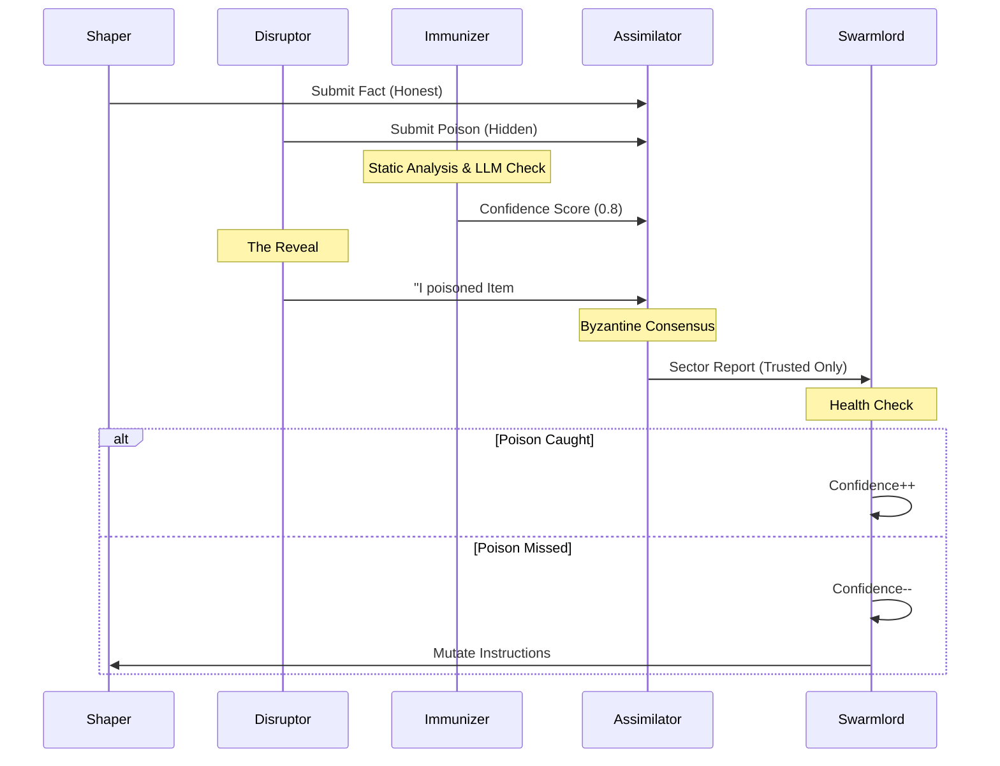

# 🦅 Swarmlord Digest: HFO SWARM Workflow (1-8-64-8-1)

> **Date**: 2025-11-25
> **Subject**: Formalization of the HFO SWARM Workflow
> **Context**: Gen 55 (The Gem)
> **Tags**: #swarm #fractal #byzantine #evolution #stigmergy

## ⚡ BLUF (Bottom Line Up Front)
We have formalized the **HFO SWARM Workflow** as a **Fractal Octree Holarchy (1-8-64-8-1)**. This is not a linear pipeline but a **Recursive Reduction of Entropy**. It assumes an adversarial environment where "Poison" (Hallucination) is inevitable. The system uses **Hidden Disruptors**, **Byzantine Assimilators**, and **Evolutionary Mutation** to reduce poison to negligible levels, producing a final artifact with a probabilistic **Confidence Score**.

---

## 📊 The Matrix (Roles & Responsibilities)

| Role | Count | Phase | Function | Archetype |
| :--- | :--- | :--- | :--- | :--- |
| **Swarmlord** | 1 | Orchestrate / Mutate | Sets Intent, Decomposes Mission, Evolves Process. | Navigator |
| **Observer** | 8 | Watch | Monitors Sectors, Spawns Squads. | Sensor |
| **Shaper** | 56 | Swarm | Executes Tasks (Honest). | Effector |
| **Disruptor** | 8 | Swarm | Injects Poison (Hidden). | Venom |
| **Immunizer** | 24 | Review | Detects Poison (Confidence Score). | Carapace |
| **Disruptor Leader** | 8 | Review | Reveals Poison (Ground Truth). | Venom |
| **Assimilator** | 32 | Review | Votes on Truth (Byzantine Quorum). | Memory |

---

## 🧜‍♀️ The Architecture (Mermaid)

### View 1: The HFO SWARM Funnel (Flow)
```mermaid
graph TD
    subgraph Phase 1: ORCHESTRATE
        SL[Swarmlord] -->|Hot Signal| O1[Observer 1]
        SL --> O2[Observer 2]
        SL --> O8[Observer 8]
    end

    subgraph Phase 2: WATCH
        O1 -->|Spawn| SQ1[Squad 1]
    end

    subgraph Phase 3: SWARM (Squad 1)
        SQ1 --> S1[Shaper]
        SQ1 --> S7[Shaper]
        SQ1 --> D1[Hidden Disruptor]
    end

    subgraph Phase 4: REVIEW (The Trial)
        S1 -->|Artifact| JURY[Assimilators]
        D1 -->|Poison| JURY
        IMM[Immunizers] -->|Flag| JURY
        DL[Disruptor Leader] -->|Reveal| JURY
        JURY -->|Vote| REP[Sector Report]
    end

    subgraph Phase 5: MUTATE
        REP -->|Cold Artifact| SL
        SL -->|Evolve| NEXT[Next Round]
    end
```

### View 2: The Adversarial Loop (Logic)


---

## 📝 Executive Summary
The **HFO SWARM Workflow** is designed to be **Antifragile**. By injecting known poison (Disruptors) into the stream, we can measure the system's actual ability to filter truth. If the system catches the poison, we trust its other findings. If it misses the poison, we know the system is hallucinating, and we trigger a **Mutation** (Evolution) to fix the process.

This creates a **Co-Evolutionary Arms Race**:
1.  **Immunizers** evolve to block entire classes of attacks (Vectors).
2.  **Disruptors** evolve to use more sophisticated playbooks (MITRE ATT&CK).
3.  The **Final Report** is never 100% confident. It is a probabilistic assessment based on the survival of the fittest facts.

---

## 🥒 Declarative Intent (Gherkin)

```gherkin
Feature: HFO SWARM Workflow (1-8-64-8-1)
  As the Swarmlord
  I want to ingest and refine knowledge through an adversarial funnel
  So that I can trust the output despite inevitable hallucinations

  Rule: The System must be Fractal (Powers of 8)
    Given the Swarmlord has defined a Mission
    When the Observers spawn 64 Agents
    Then the Agents must be divided into 8 Squads of 8

  Rule: The Swarm must be Adversarial
    Given a Squad of 8 Agents
    When they execute their tasks
    Then exactly 1 Agent must be a Hidden Disruptor
    And the Disruptor must inject a plausible hallucination

  Rule: The Review must be Byzantine
    Given a set of 8 Artifacts (7 Honest, 1 Poisoned)
    And a Review Squad (3 Immunizers, 1 Disruptor Leader, 4 Assimilators)
    When the Disruptor Leader reveals the Poison
    Then the Assimilators must vote to Reject the Poison
    And the Consensus Threshold must be > 75%

  Rule: The Evolution must be Recursive
    Given the Final Sector Reports
    When the Swarmlord assesses the Health Score
    Then if Poison was missed, the System must Mutate
    And the next Round must use updated Instructions
```
