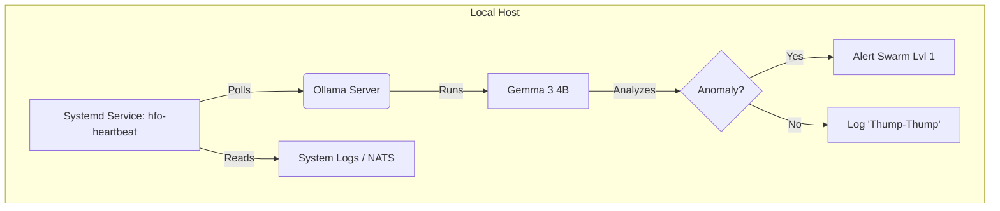

# HFO Design: Local Heartbeat LLM (Chromebook Plus)

> **Context**: Establishing a 24/7 "Heartbeat" agent on a Chromebook Plus.
> **Goal**: High availability, low latency, specific task monitoring.
> **Hardware Constraint**: Chromebook Plus (Intel Core i3/AMD Ryzen 3+, 8GB+ RAM, Integrated Graphics).

## 1. The Mission: "The Obsidian Heart"
We need a model that never sleeps, consumes minimal power, but possesses enough "spark" to detect anomalies, route signals, and maintain the HFO rhythm. It acts as the **Lvl 0 (Atomic)** constant in the Octree.

## 2. The Contenders (4 Viable Options - Updated Nov 2025)

### Option A: The New Standard (Gemma 3 4B)
*   **Engine**: Ollama / Llama.cpp
*   **Size**: ~2.8GB (Q4_K_M)
*   **Why**: Google's latest architecture (released 2025). Optimized for the very hardware in your Chromebook Plus.
*   **Pros**: Significant jump in reasoning over Gemma 2. "Native" feel on ChromeOS.
*   **Cons**: Heavier than the 2B predecessor. Uses ~3GB RAM, leaving ~5GB for system.
*   **Vibe**: "The Nexus" - Modern, integrated, powerful.

### Option B: The Dense Reasoner (Phi-3.5 Mini 3.8B)
*   **Engine**: Ollama
*   **Size**: ~2.4GB (Q4_K_M)
*   **Why**: Microsoft's "Textbook Quality" data makes this punch way above its weight class.
*   **Pros**: Rivaling Llama 2 7B in reasoning. 128k context window (huge memory for a heartbeat).
*   **Cons**: Slightly older than Gemma 3, but still SOTA for logic per parameter.
*   **Vibe**: "The Owl" - Small but incredibly wise.

### Option C: The Edge Standard (Llama 3.2 3B)
*   **Engine**: MLC LLM (Vulkan) or Ollama
*   **Size**: ~2.0GB
*   **Why**: Meta's edge-optimized model. Designed specifically for mobile/laptop hardware.
*   **Pros**: Great tool-calling capabilities (crucial for a "doing" agent). Very balanced performance.
*   **Cons**: 3B parameters is slightly less "smart" than Gemma 3 4B, but faster.
*   **Vibe**: "The Soldier" - Reliable, standard-issue, compatible with everything.

### Option D: The Logic Specialist (Qwen 3 4B)
*   **Engine**: Ollama
*   **Size**: ~2.8GB
*   **Why**: The newest SOTA for coding and logic from the Qwen team (released mid-2025).
*   **Pros**: If the heartbeat involves reading JSON/Code/Logs, this is the king.
*   **Cons**: Can be "dry" or robotic. Same RAM footprint as Gemma 3.
*   **Vibe**: "The Calculator" - Pure logic, zero fluff.

## 3. Recommendation: Option A (Gemma 3 4B) via Ollama

### The "Why"
For a **Chromebook Plus** (8GB RAM Min), **Gemma 3 4B** is the sweet spot.
1.  **Intelligence**: The jump from 2B to 4B is massive for "good intelligence".
2.  **Headroom**: At ~3GB RAM usage, it fits comfortably within the 8GB envelope of a Chromebook Plus while leaving room for the OS.
3.  **Synergy**: Google hardware + Google software.

### The Architecture

## 4. Implementation Strategy
1.  **Install Ollama**: `curl -fsSL https://ollama.com/install.sh | sh`
2.  **Pull Model**: `ollama pull gemma3:4b`
3.  **Create Service**: A simple Python loop using `requests` to hit `localhost:11434`.
4.  **Prompt Engineering**: "You are the Heartbeat. Output 'NOMINAL' if logs are clear. Output 'SIGNAL: <reason>' if interesting."

## 5. Next Steps
*   Run `ollama run gemma3:4b` to test speed.
*   Write the `heartbeat.py` script to loop every 60s.
