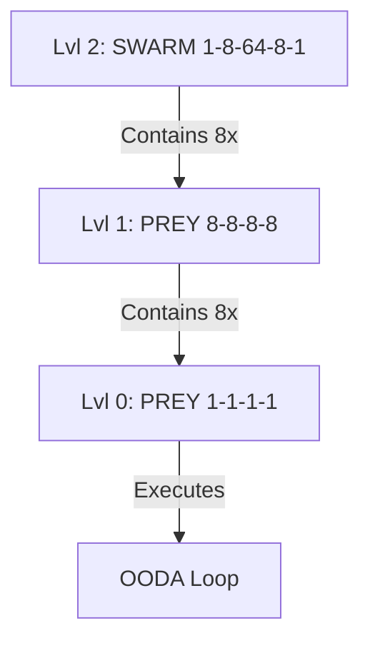

---
hexagon:
  ontos:
    id: design-octree-holarchy-v2
    type: md
    owner: Swarmlord
  chronos:
    status: active
    urgency: 1.0
    decay: 0.0
    created: '2025-11-26T13:30:00+00:00'
    generation: 55
  topos:
    address: buds/hfo_gem_gen_55/brain/design-markdown/design_octree_fractal_holarchy_v2.md
    links:
      - swarm-186481-design-v1
      - prey-8888-design-v2
      - prey-1111-design-v1
  telos:
    viral_factor: 1.0
    meme: The Nested Octree Holarchy
---

# 🦅 Design: The Nested Octree Fractal Holarchy

> **Context**: Gen 55 "Synapse APEX"
> **Structure**: Recursive Containment (Matryoshka Dolls)
> **Math**: Base-8 Scaling (Octal)

## 1. The Hierarchy of Patterns
The Hive Fleet is structured as a **Fractal Holarchy**, where each level contains the level below it. This ensures that the same "PREY" logic applies from the single neuron to the entire brain.

### 🔴 Level 2: The Body (Strategic)
*   **Pattern**: **SWARM 1-8-64-8-1**
*   **Entity**: The Hive Fleet (or a Mission Swarm).
*   **Composition**:
    *   1 Commander
    *   8 Squad Leaders
    *   **8 Squads** (The "64" layer is actually 8x8)
    *   8 Synthesizers
    *   1 Apex
*   **Contains**: 8 instances of **Level 1**.

### 🟡 Level 1: The Arm (Tactical)
*   **Pattern**: **PREY 8-8-8-8**
*   **Entity**: The Squad (Octarchy).
*   **Composition**:
    *   8 Concurrent Agents acting in synchronized phases (Perceive, React, Execute, Yield).
    *   Includes specialized roles (Disruptors, Guards).
*   **Contains**: 8 instances of **Level 0**.

### 🟢 Level 0: The Hand (Atomic)
*   **Pattern**: **PREY 1-1-1-1**
*   **Entity**: The Agent (The Atomic Unit).
*   **Composition**:
    *   A single state machine cycling through 4 Hats (Observer, Bridger, Shaper, Assimilator).
*   **Contains**: The actual LLM Inference and Tool Execution.

## 2. The Fractal Map

## 3. Why This Makes Sense
1.  **Self-Similarity**: The logic at the top (Mission Intent) is processed by the same fundamental OODA loop as the logic at the bottom (Tool Execution).
2.  **Scalability**: To scale up, we don't add complexity; we just add more "Octants" (Squads).
3.  **Resilience**: If a Level 0 Agent fails, the Level 1 Squad absorbs the error (via Probabilistic Yield). If a Level 1 Squad fails, the Level 2 Swarm absorbs it (via Domain Synthesis).
