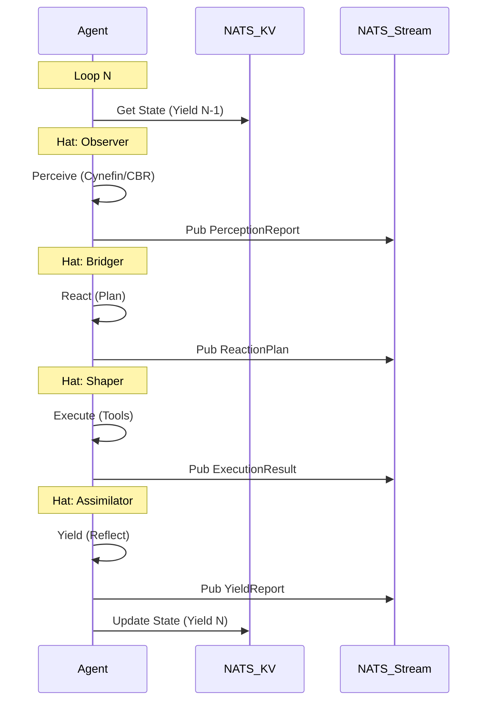

---
hexagon:
  ontos:
    id: prey-1111-design-v1
    type: md
    owner: Swarmlord
  chronos:
    status: active
    urgency: 0.9
    decay: 0.1
    created: '2025-11-26T12:00:00+00:00'
    generation: 55
  topos:
    address: buds/hfo_gem_gen_55/brain/design-markdown/design_prey_1111_loop.md
    links: []
  telos:
    viral_factor: 0.8
    meme: 1-1-1-1 PREY Loop
---

# 🦅 Design: The 1-1-1-1 PREY Loop (Atomic Squad Level)

> **Context**: Gen 55 "Synapse APEX"
> **Pattern**: Sequential Single Agent (State Machine)
> **Stigmergy**: Hot Loop (NATS JetStream + KV)

## 1. The Core Concept
The **1-1-1-1 Pattern** defines the atomic unit of the Hive Fleet. A single agent (running on a low-resource node like a Chromebook) sequentially adopts four distinct "Cognitive Hats" to complete one full OODA loop (Perceive-React-Execute-Yield).

### The "Hats" (Biases)
1.  **Observer (Perceive)**:
    *   **Bias**: Objective, Sensory, Data-Driven.
    *   **Framework**: Cynefin (Is this Simple, Complicated, Complex, or Chaotic?) + Case-Based Reasoning (CBR).
    *   **Input**: Raw signals, environment state.
    *   **Output**: `PerceptionReport` (What is happening?).
2.  **Bridger (React)**:
    *   **Bias**: Strategic, Planning, Connecting.
    *   **Action**: Formulates a plan based on the `PerceptionReport`.
    *   **Input**: `PerceptionReport`.
    *   **Output**: `ReactionPlan` (What should we do?).
3.  **Shaper (Execute)**:
    *   **Bias**: Tactical, Action-Oriented, Tool-User.
    *   **Action**: Executes the `ReactionPlan` using available tools.
    *   **Input**: `ReactionPlan`.
    *   **Output**: `ExecutionResult` (What did we do?).
4.  **Assimilator (Yield)**:
    *   **Bias**: Reflective, Critical, Synthesizing.
    *   **Action**: Reviews the `ExecutionResult` and updates the Stigmergic State.
    *   **Input**: `ExecutionResult`.
    *   **Output**: `YieldReport` (What did we learn? / New State).

## 2. Stigmergic State Management
*   **Stateless Execution**: The agent process itself can be stateless. It retrieves its context from the **Hot Stigmergy Layer** (NATS KV) using its **Secure ID** and **Timestamp**.
*   **The Chain**:
    *   `Yield(N)` -> **NATS** -> `Perceive(N+1)`
*   **Artifacts**: Each phase generates a discrete, small report published to NATS JetStream.

## 3. Security & Permissions
*   **Read Access**: Full access to File System, Web, Memory (LanceDB).
*   **Write Access**: **Restricted**. The agent can ONLY write to **NATS JetStream**. It cannot directly modify the codebase or database (Assimilators handle that downstream).

## 4. Data Flow (The Hot Loop)

