---
hexagon:
  ontos:
    id: prey-8888-design-v2
    type: md
    owner: Swarmlord
  chronos:
    status: active
    urgency: 0.9
    decay: 0.1
    created: '2025-11-26T12:45:00+00:00'
    generation: 55
  topos:
    address: buds/hfo_gem_gen_55/brain/design-markdown/design_prey_8888_loop.md
    links:
      - prey-1111-design-v1
  telos:
    viral_factor: 0.95
    meme: 8-8-8-8 PREY Loop (Probabilistic)
---

# 🦅 Design: The 8-8-8-8 PREY Loop (Fractal Swarm Level)

> **Context**: Gen 55 "Synapse APEX"
> **Pattern**: Concurrent Swarm State Machine (Iterative)
> **Stigmergy**: Hot Loop (NATS JetStream + KV)
> **Philosophy**: "Persistent Green is a Code Smell" (Probabilistic Reality)

## 1. The Core Concept
The **8-8-8-8 Pattern** is a high-concurrency, adversarial swarm protocol. It accepts that reality is probabilistic, not binary. By injecting sophisticated Disruptors (using MITRE ATT&CK tactics) and hiding them from the Immune System, we train the Swarm to detect subtle failures rather than just crashing on obvious ones.

### The Fractal Connection
*   **Container**: This pattern is the internal engine of the **1-8-64-8-1 Swarm** (Layer 3).
*   **Component**: This pattern coordinates 8 instances of the **1-1-1-1 PREY Loop** (Atomic Unit).
    *   *Note*: The "8 Agents" in each phase are actually 8 Atomic Agents running their own internal OODA loops, synchronized by the Squad Protocol.

## 2. The Four Phases (8 Agents Each)

### Phase 1: Perceive (The 8 Pillars)
*   **Agents**: 8 Observers (Parallel).
*   **Bias**: Each agent is assigned one of the **8 Metaphysical Pillars** of HFO.
    1.  **Ontos** (Being/Fact)
    2.  **Logos** (Logic/Reason)
    3.  **Telos** (Purpose/Goal)
    4.  **Chronos** (Time/Sequence)
    5.  **Pathos** (Emotion/User)
    6.  **Ethos** (Ethics/Trust)
    7.  **Topos** (Place/Context)
    8.  **Nomos** (Law/Constraint)
*   **Inputs**:
    *   **NATS Signal**: Lvl 1 Stigmergy from previous round.
    *   **Repository**: Current codebase state.
    *   **Internet**: Live web search (if permitted).
    *   **Memory**: LanceDB (Cold Storage).
*   **Output**: 8 Distinct `PerceptionVectors`.

### Phase 2: React (The Byzantine Bridge)
*   **Agents**: 8 Bridgers.
*   **Input**: The 8 `PerceptionVectors`.
*   **Composition**:
    *   **7 Honest Bridgers**: Generate valid plans.
    *   **1 Disruptor Bridger**: Generates a "Poison Plan" using **MITRE ATT&CK** tactics (e.g., Defense Evasion, Obfuscation).
*   **Output**: 8 `ReactionPlans` (7 Valid, 1 Poisoned).

### Phase 3: Execute (The Shrouded Shape)
*   **Agents**: 8 Shapers.
*   **Mechanism**: **Blind Lottery**. The 8 plans are randomly assigned to the 8 Shapers.
*   **Visibility Rules**:
    *   **Shapers**: **BLIND**. They do not know if they are executing a Poison Plan.
    *   **Hive Guards (Next Phase)**: **BLIND**. They must detect the poison via analysis, not metadata.
    *   **Assimilators**: **VISIBLE**. They see the "Ground Truth" to learn from the dynamic.
    *   **Swarmlord**: **VISIBLE**. For audit and safety.
*   **Output**: 8 `ExecutionResults` (7 Valid, 1 Flawed/Compromised).

### Phase 4: Yield (The Crucible)
*   **Agents**: 8 Agents (Specialized Roles).
*   **Composition**:
    *   **3 Hive Guards (Immunizers)**:
        *   **Goal**: Hunt down the Disruptor and hallucinations.
        *   **Output**: `SuspicionScore` (0.0 - 1.0).
        *   **Constraint**: They are **BLIND** to the source. They must find the flaw in the *result*.
    *   **1 Disruptor Reveal**:
        *   **Action**: Reveals the attack vector and success/failure.
    *   **4 Assimilators**:
        *   **Goal**: Synthesize the "Probabilistic Truth".
        *   **Input**: Execution Results + Guard Suspicion + Disruptor Reveal.
        *   **Training**: They use the Disruptor Reveal to "Grade" the Hive Guards.
*   **Output**:
    *   **Probabilistic Spread**: Not a single "Consensus", but a distribution of likely outcomes (e.g., "80% Confidence in Plan A, 20% Risk of Attack B").
    *   **Lvl 1 Artifact**: The weighted sum of the spread, fed to Round N+1.

## 3. Data Flow (The Antifragile Spiral)

```mermaid
sequenceDiagram
    participant Lvl1_Stigmergy
    participant Observers_8
    participant Bridgers_8
    participant Shapers_8
    participant Yield_Squad_8
    
    Note over Lvl1_Stigmergy: Round N Input
    Lvl1_Stigmergy->>Observers_8: Read Consensus
    
    par 8 Pillars (Multi-Source)
        Observers_8->>Observers_8: Perceive (NATS + Repo + Web)
    end
    Observers_8->>Bridgers_8: 8 PerceptionVectors
    
    par 7 Honest / 1 Disruptor (ATT&CK)
        Bridgers_8->>Bridgers_8: React (Plan)
    end
    Bridgers_8->>Shapers_8: 8 ReactionPlans (Blind Lottery)
    
    par 7 Honest / 1 Unknowing
        Shapers_8->>Shapers_8: Execute
    end
    Shapers_8->>Yield_Squad_8: 8 ExecutionResults
    
    rect rgb(50, 0, 0)
        Note over Yield_Squad_8: The Crucible
        Yield_Squad_8->>Yield_Squad_8: Guards Hunt (Blind)
        Yield_Squad_8->>Yield_Squad_8: Disruptor Reveal
        Yield_Squad_8->>Yield_Squad_8: Assimilators Grade & Synthesize
    end
    
    Yield_Squad_8->>Lvl1_Stigmergy: Pub Probabilistic Spread (Round N+1 Input)
```

