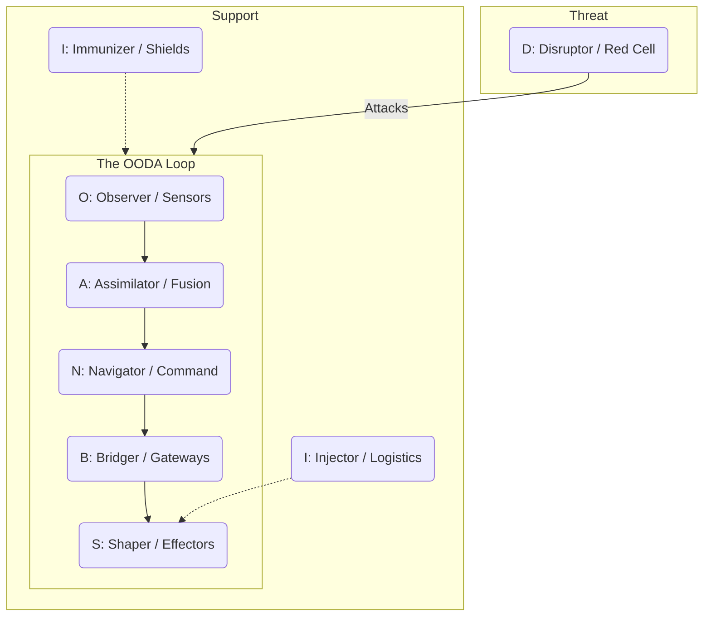
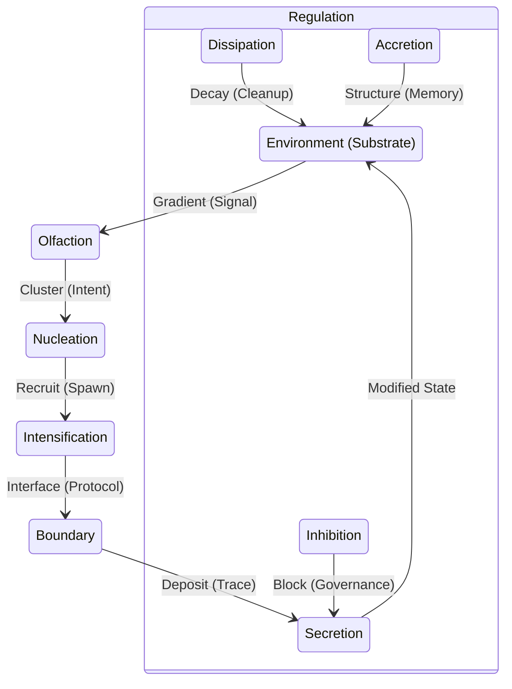

# 💎 Design: OBSIDIAN Roles & Stigmergy Matrix

> **BLUF**: This design canonizes the **OBSIDIAN** mnemonic as the "Physics" of the Hive. It maps the 8 Operational Roles (JADC2/MAS) to their Biological Stigmergy counterparts, creating a "Semantically Fractal Layered Mnemonic" that governs all agent interactions.

---

## 1. The OBSIDIAN Matrix

This matrix defines the **Immutable Soul** of the Hive. Every agent must map to one of these 8 archetypes.

| Letter | Role | JADC2 Function (MAS) | Stigmergy Mechanism (Biology) | Description |
| :--- | :--- | :--- | :--- | :--- |
| **O** | **Observer** | **Sensors** (ISR) | **Olfaction** (Gradient Analysis) | The Eyes. Detects signals and reads the environment. |
| **B** | **Bridger** | **Gateways** (Transport) | **Boundary** (Boundary Conditions) | The Interface. Translates between internal state and external substrate. |
| **S** | **Shaper** | **Effectors** (Fires) | **Secretion** (Deposition) | The Hands. Modifies the environment (writes code/files). |
| **I** | **Injector** | **Logistics** (Sustainment) | **Intensification** (Positive Feedback) | The Blood. Allocates resources and spawns new agents. |
| **D** | **Disruptor** | **Red Cell** (Adversary) | **Dissipation** (Entropy/Decay) | The Test. Simulates failure and challenges assumptions. |
| **I** | **Immunizer** | **Shields** (Protection) | **Inhibition** (Negative Feedback) | The Shield. Prevents errors and enforces governance. |
| **A** | **Assimilator** | **Fusion** (PED) | **Accretion** (Stigmergic Construction) | The Memory. Synthesizes raw data into wisdom (GraphRAG). |
| **N** | **Navigator** | **Command** (C2) | **Nucleation** (Cluster Formation) | The Will. Sets the intent and orchestrates the swarm. |

---

## 2. The Fractal Layered Mnemonic

The **OBSIDIAN** framework is not just a list of roles; it is the base layer of a fractal mnemonic system that scales from the single agent to the entire fleet.

### 🦅 HIVE (Vision)
*   **H**unt (The Goal)
*   **I**ntegrate (The Method)
*   **V**erify (The Standard)
*   **E**volve (The Outcome)

### 🌳 GROWTH (Strategy)
*   **G**ather (Input)
*   **R**oot (Grounding)
*   **O**ptimize (Planning)
*   **W**eave (Execution)
*   **T**est (Validation)
*   **H**arvest (Output)

### 🐝 SWARM (Tactics)
*   **S**et (Context)
*   **W**atch (Observe)
*   **A**ct (Execute)
*   **R**eview (Verify)
*   **M**utate (Adapt)

### 🛸 FLEET (Lifecycle)
*   **F**orge (Creation)
*   **L**aunch (Deployment)
*   **E**ngage (Operation)
*   **E**ndure (Maintenance)
*   **T**erminate (Retirement)

### 💎 OBSIDIAN (Properties)
*   **O**bserver
*   **B**ridger
*   **S**haper
*   **I**njector
*   **D**isruptor
*   **I**mmunizer
*   **A**ssimilator
*   **N**avigator

---

## 3. Visualizations

### The JADC2 Kill Chain (Operational View)



### The Stigmergy Cycle (Biological View)



---

## 4. Digest: Hybrid Memory Integration

To support these roles, the **Assimilator** utilizes a **Hybrid Memory** architecture:

*   **Hot Memory (Stigmergy)**:
    *   **Tech**: NATS JetStream + KV Store.
    *   **Role**: Fast, ephemeral coordination signals (Pheromones).
    *   **TTL**: Short (Hours/Days).
    *   **Use Case**: "I am working on file X", "Task Y is pending".

*   **Cold Memory (Wisdom)**:
    *   **Tech**: LanceDB (Vector) + Postgres (Relational).
    *   **Role**: Long-term, crystallized knowledge (GraphRAG).
    *   **TTL**: Infinite (Archival).
    *   **Use Case**: "What is the OBSIDIAN Matrix?", "History of Gen 53".

---

## 5. Gherkin Specification

```gherkin
Feature: OBSIDIAN Role Validation
  As the Swarmlord
  I want to ensure every agent is assigned a valid OBSIDIAN role
  So that the Hive maintains semantic integrity

  Scenario Outline: Validate Agent Role Mapping
    Given an agent with role "<Role>"
    When the agent initializes
    Then it should inherit the "<JADC2_Function>" capability
    And it should utilize the "<Stigmergy_Mechanism>" behavior

    Examples:
      | Role        | JADC2_Function | Stigmergy_Mechanism |
      | Observer    | Sensors        | Olfaction           |
      | Bridger     | Gateways       | Boundary            |
      | Shaper      | Effectors      | Secretion           |
      | Injector    | Logistics      | Intensification     |
      | Disruptor   | Red Cell       | Dissipation         |
      | Immunizer   | Shields        | Inhibition          |
      | Assimilator | Fusion         | Accretion           |
      | Navigator   | Command        | Nucleation          |
```
