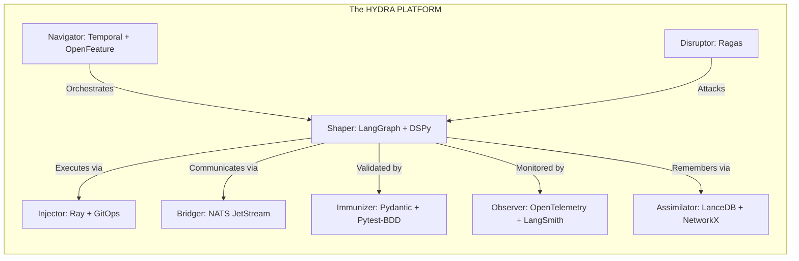
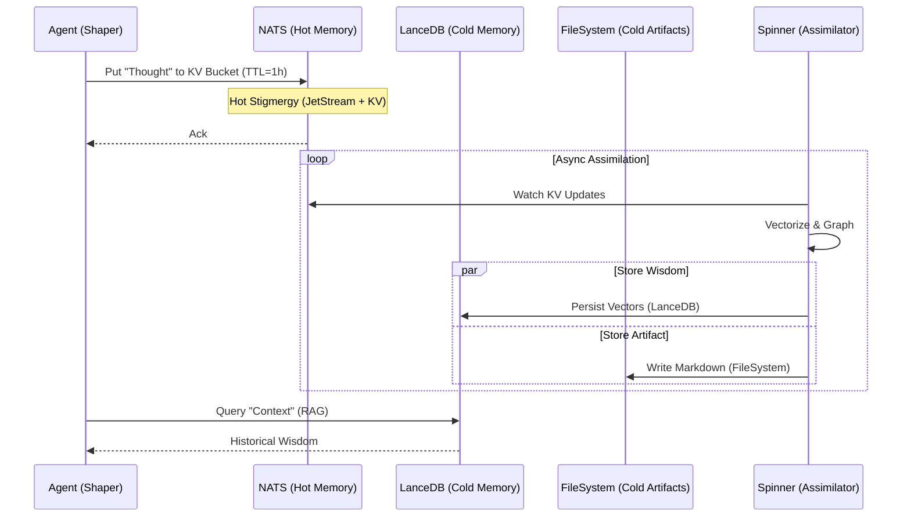
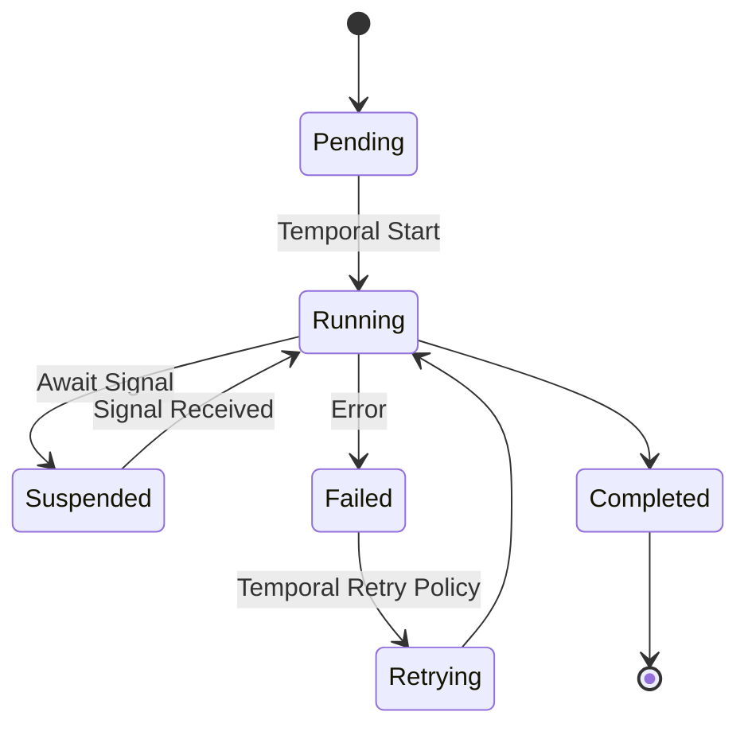

---
octagon:
  ontos:
    id: hydra-platform-v1
    type: intent
    owner: Swarmlord
  logos:
    protocol: HYDRA-PLATFORM
    format: literate-gherkin
  techne:
    stack:
    - pydantic
    - lancedb
    - langgraph
    - temporal
    - openfeature
    - opentelemetry
    - ray
    - nats
    complexity: high
  chronos:
    status: active
    urgency: 1.0
    decay: 0.0
    created: '2025-11-25T13:00:00Z'
  pathos:
    stress_level: 0.0
    validation: verified
  ethos:
    security_level: internal
    compliance:
    - hfo-standard-gen55
  topos:
    address: brain/intent-literate-gherkin/hydra_platform.md
    links:
    - brain/intent-literate-gherkin/swarm_workflow.md
  telos:
    viral_factor: 1.0
    meme: The Foundation of the Hive.
---

# 🐉 Intent: The HYDRA PLATFORM (P.L.A.T.F.O.R.M.)

> **Context**: Gen 55 (The Gem)
> **Philosophy**: "The Need defines the Organ. The Organ selects the Tool."
> **Objective**: To enforce the P.L.A.T.F.O.R.M. stack as the canonical implementation of the HFO Octree.

## ⚡ BLUF (Bottom Line Up Front)
The **HYDRA PLATFORM** is the unified Tech Stack for Gen 55. It replaces the legacy "RAPTOR" stack by integrating the "Missing Pieces" (LangSmith, GitOps, Pytest-BDD) into a single **Octagonal Mnemonic**. It solves the 8 Universal Problems of Autonomous Agents (Entropy, Opacity, Scarcity, Coupling, Stochasticity, Amnesia, Toxicity, False Confidence) using 8 Best-in-Class tools.

---

## 📊 The P.L.A.T.F.O.R.M. Matrix

| Letter | Mnemonic | HFO Role | Primary Tool | Secondary Tool | The Universal Problem Solved |
| :--- | :--- | :--- | :--- | :--- | :--- |
| **P** | **Protocol** | **Immunizer** | **Pydantic** | **Pytest-BDD** | **Toxicity**: Enforces Schema (SSOT) & Behavioral Contracts. |
| **L** | **Learning** | **Assimilator** | **LanceDB** | **LangSmith** | **Amnesia**: Provides Vector Memory & Execution Traces. |
| **A** | **Agents** | **Shaper** | **LangGraph** | **DSPy** | **Stochasticity**: Cyclic loops & Prompt Optimization. |
| **T** | **Time** | **Navigator** | **Temporal** | - | **Entropy**: Durable execution that survives crashes. |
| **F** | **Features** | **Navigator** | **OpenFeature** | **GitOps** | **Rigidity**: Dynamic strategy toggling & Infra State. |
| **O** | **Observability** | **Observer** | **OpenTelemetry** | - | **Opacity**: Deep visibility into Metrics & Traces. |
| **R** | **Resources** | **Injector** | **Ray** | **Ragas** | **Scarcity**: Elastic compute & Adversarial Evals. |
| **M** | **Messaging** | **Bridger** | **NATS** | - | **Coupling**: Async Stigmergy for decoupled coordination. |

---

## 📈 Visuals (The Architecture)

### View 1: The Octagonal Stack (C4 Context)



### View 2: The Hybrid Memory Flow (Sequence)



### View 3: The Durable Execution Loop (State)



---

## 🦅 Executive Digest

### The Strategic Shift
We are moving from "Tool-First" (using Ray because it's cool) to "Problem-First" (using Ray because we have a Scarcity problem). The **P.L.A.T.F.O.R.M.** mnemonic forces us to justify every tool against a specific biological need.

### The "Missing Pieces"
Previous generations ignored the "Day 2" problems:
1.  **Debugging**: Solved by **LangSmith** (L).
2.  **Drift**: Solved by **GitOps** (F).
3.  **Testing**: Solved by **Pytest-BDD** (P).
4.  **Evaluation**: Solved by **Ragas** (R).

### Note: The Hybrid Memory Strategy
We use a **Hot/Cold** memory architecture to solve the "Stigmergy" problem:
*   **Hot Memory (NATS JetStream + KV)**: Agents write ephemeral "Thoughts" and "Signals" here. It is fast, low-latency, and has a TTL (e.g., 1 hour). It acts as the "Short-Term Working Memory" of the Swarm.
*   **Cold Memory (LanceDB / Files / KG)**: The **Assimilator** (Spinner) watches the Hot Memory and crystallizes important data into permanent storage. It turns a "Stream of Consciousness" into "Hard Facts" (Vectors, Markdown Files, or Knowledge Graph Edges).

### Next Actions
1.  **Migration**: Port existing Gen 53 scripts to use `langgraph` instead of raw `langchain`.
2.  **Infrastructure**: Deploy the `docker-compose.yml` with NATS, Temporal, and LanceDB.
3.  **Validation**: Run the `verify_nats_connection.py` to confirm the "M" pillar.

---

## 📜 Declarative Intent (Gherkin)

```gherkin
@gen55 @stack @canonical
Feature: The HYDRA PLATFORM (P.L.A.T.F.O.R.M.)
  As the Swarmlord
  I want a consolidated, octagonal Tech Stack
  So that I can solve the 8 Universal Problems of Autonomous Agents with a unified mnemonic

  Background:
    Given the context is "Gen 55 (The Gem)"
    And the architectural goal is "Cognitive Simplicity"

  Scenario: The P.L.A.T.F.O.R.M. Mnemonic Definition
    The stack must follow the P.L.A.T.F.O.R.M. acronym, integrating the "Missing Pieces" (LangSmith, GitOps, Pytest-BDD) into the primary letters.

    Given the mnemonic "P.L.A.T.F.O.R.M."
    Then "P" shall stand for "Protocol & Protection"
      And it shall implement "Pydantic" for Intent/Schema (SSOT)
      And it shall implement "Pytest-BDD" for Behavioral Contracts (Disruptor)
      And it shall implement "NeMo Guardrails" for Runtime Safety (Immunizer)

    And "L" shall stand for "Learning & Logs"
      And it shall implement "LanceDB" for Vector/SQL Memory (Assimilator)
      And it shall implement "LangSmith" for LLM Traces/Observability (Observer)
      And it shall implement "NetworkX" for Graph Relationships (Assimilator)
      And it shall support "Hybrid Memory" (Hot NATS -> Cold Postgres/LanceDB)

    And "A" shall stand for "Agents & Adaptation"
      And it shall implement "LangGraph" for Cyclic State Machines (Shaper)
      And it shall implement "DSPy" for Prompt Optimization (Shaper)

    And "T" shall stand for "Time & Transactions"
      And it shall implement "Temporal" for Durable Execution (Navigator)

    And "F" shall stand for "Features & Flux"
      And it shall implement "OpenFeature" for Dynamic Strategy Toggles (Navigator)
      And it shall implement "GitOps" for Infrastructure State (Injector)

    And "O" shall stand for "Observability"
      And it shall implement "OpenTelemetry" for System Metrics (Observer)

    And "R" shall stand for "Resources & Resilience"
      And it shall implement "Ray" for Distributed Compute (Injector)
      And it shall implement "Ragas" for Adversarial Evaluation (Disruptor)

    And "M" shall stand for "Messaging"
      And it shall implement "NATS JetStream" for Async Stigmergy (Bridger)
      And it shall implement "NATS KV" for Ephemeral State (Hot Memory)
      And the "Assimilator" shall move data from "Hot NATS" to "Cold LanceDB/Files"

  Scenario: Mapping Tools to the 8 Octagonal Pillars
    The stack must map cleanly to the biological organs of the Hive.

    Given the "Octagonal Pillars"
    Then the "Navigator" (Brain) shall use "Temporal" and "OpenFeature"
    And the "Observer" (Eyes) shall use "OpenTelemetry" and "LangSmith"
    And the "Injector" (Heart) shall use "Ray" and "GitOps"
    And the "Bridger" (Nerves) shall use "NATS JetStream"
    And the "Shaper" (Hands) shall use "LangGraph" and "DSPy"
    And the "Assimilator" (Memory) shall use "LanceDB" and "NetworkX"
    And the "Immunizer" (Skin) shall use "Pydantic" and "NeMo Guardrails"
    And the "Disruptor" (Venom) shall use "Pytest-BDD" and "Ragas"
```
