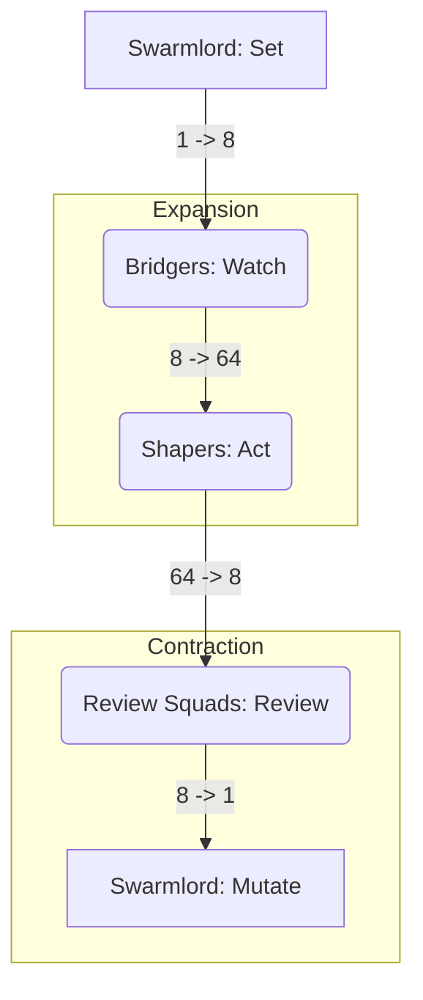
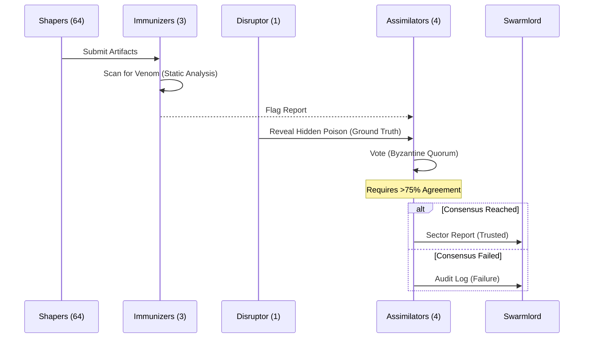
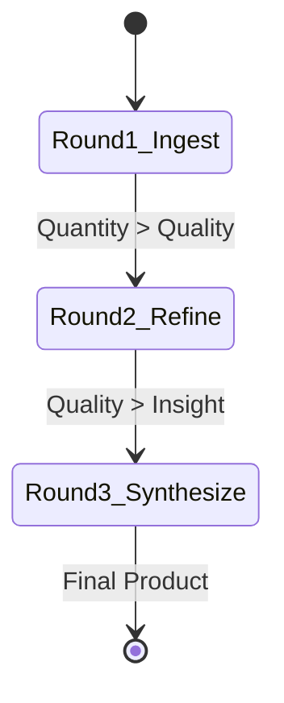

---
octagon:
  ontos:
    id: swarm-workflow-v1
    type: intent
    owner: Swarmlord
  logos:
    protocol: FRACTAL-FUNNEL
    format: literate-gherkin
  techne:
    stack:
    - langgraph
    - ray
    - nats
    complexity: medium
  chronos:
    status: active
    urgency: 1.0
    decay: 0.0
    created: '2025-11-25T13:00:00Z'
  pathos:
    stress_level: 0.0
    validation: verified
  ethos:
    security_level: internal
    compliance:
    - hfo-standard-gen55
  topos:
    address: brain/intent-literate-gherkin/swarm_workflow.md
    links:
    - brain/intent-literate-gherkin/hydra_platform.md
  telos:
    viral_factor: 1.0
    meme: 1-8-64-8-1
---

# 🌀 Intent: The HFO Swarm Workflow (Fractal Funnel)

> **Context**: Gen 55 (The Gem)
> **Philosophy**: "Recursive Reduction of Entropy."
> **Objective**: To ingest massive data with high fidelity using a 1-8-64-8-1 expansion-contraction cycle.

## ⚡ BLUF (Bottom Line Up Front)
The **Fractal Funnel** is the standard operating procedure for the Swarm. It follows a **1-8-64-8-1** pattern: One Swarmlord sets the intent, 8 Bridgers watch sectors, 64 Shapers swarm the work, 8 Review Squads filter the results, and 1 Swarmlord mutates the system based on the outcome. It is designed to be **Adversarial by Default**, assuming 10% of agents will hallucinate.

---

## 📊 The Workflow Matrix

| Phase | Action | Agent Count | Role | Input | Output |
| :--- | :--- | :--- | :--- | :--- | :--- |
| **1** | **Set** | **1** | **Swarmlord** | High-Level Intent | 8 Mission Manifests |
| **2** | **Watch** | **8** | **Bridger** | Mission Manifest | 64 Task Tickets |
| **3** | **Act** | **64** | **Shaper** | Task Ticket | 64 Raw Artifacts |
| **4** | **Review** | **8** | **Review Squad** | Raw Artifacts | 8 Sector Reports |
| **5** | **Mutate** | **1** | **Swarmlord** | Sector Reports | Final Result + Mutation |

---

## 📈 Visuals (The Flow)

### View 1: The Fractal Funnel (Flowchart)



### View 2: The Review Squad Consensus (Sequence)



### View 3: The Iterative Loop (State)



---

## 🦅 Executive Digest

### The Problem of Scale
Traditional swarms fail because they are either too flat (chaos) or too hierarchical (bottlenecks). The **Fractal Funnel** balances this by using **Powers of 8**. It expands to do work and contracts to verify it.

### The Adversarial Edge
We do not trust our own agents. In Phase 3 (Act), **8 Hidden Disruptors** are injected into the swarm. They *intentionally* lie. If the Review Squad (Phase 4) fails to catch them, the **Health Score** drops, and the system triggers a **Mutation** (Phase 5) to evolve better defenses. This ensures the system gets smarter over time.

### Next Actions
1.  **Orchestration**: Implement the "Set" phase using `temporal` to spawn the 8 Bridgers.
2.  **Simulation**: Run a "Dry Run" with 64 mock agents to test the NATS messaging load.
3.  **Review**: Build the "Byzantine Quorum" logic in `langgraph`.

---

## 📜 Declarative Intent (Gherkin)

```gherkin
@gen55 @workflow @canonical
Feature: The HFO Swarm Workflow (Fractal Funnel)
  As the Swarmlord
  I want a recursive 1-8-64-8-1 workflow
  So that I can ingest massive data with high fidelity and reduce hallucination via adversarial consensus

  Background:
    Given the context is "Gen 55 (The Gem)"
    And the pattern is "1-8-64-8-1" (Powers of 8)

  Scenario: The 5-Phase Fractal Funnel
    The workflow must follow the Set-Watch-Act-Review-Mutate cycle.

    Given a high-level "Intent" (e.g., "Ingest Gen 50")

    # Phase 1: Set (Orchestrate)
    When the "Swarmlord" (1 Agent) executes "Set"
    Then it shall scan the target domain
    And it shall partition the work into 8 "Sectors"
    And it shall produce 8 "Mission Manifests"

    # Phase 2: Watch (Observe)
    When the 8 "Bridgers" (8 Agents) execute "Watch"
    Then each Bridger shall monitor its assigned Sector
    And each Bridger shall subdivide the Sector into 8 "Squad Tasks"
    And they shall produce 64 "Task Tickets"

    # Phase 3: Act (Swarm)
    When the 64 "Shapers" (64 Agents) execute "Act"
    Then 56 "Honest Shapers" shall execute the work faithfully
    And 8 "Hidden Disruptors" shall inject subtle errors (Venom)
    And they shall produce 64 "Raw Artifacts" (Mixed Honest/Poisoned)

    # Phase 4: Review (Consensus)
    When the 8 "Review Squads" (8 Agents) execute "Review"
    Then each Squad shall consist of 3 Immunizers, 1 Disruptor Leader, and 4 Assimilators
    And the "Immunizers" shall flag potential venom
    And the "Disruptor Leader" shall reveal the hidden poison
    And the "Assimilators" shall form a Byzantine Quorum (>75% agreement)
    And they shall produce 8 "Sector Reports" (Refined) and 1 "Adversarial Audit Log"

    # Phase 5: Mutate (Evolve)
    When the "Swarmlord" (1 Agent) executes "Mutate"
    Then it shall compare the Sector Reports against the Original Intent
    And it shall evaluate the "Health Score" from the Audit Log
    And it shall update the "Immunizer Blocklists" and "Disruptor Playbooks"
    And it shall produce 1 "Final Result" or trigger a "Mutation" (Next Round)

  Scenario: The Iterative Reduction Loop
    The workflow must run in 3 rounds to distill truth.

    Given the workflow is active
    Then "Round 1" shall be "Ingest" (Focus on Quantity)
    And "Round 2" shall be "Refine" (Focus on Quality/Filtering)
    And "Round 3" shall be "Synthesize" (Focus on Insight/Connecting Dots)
```
