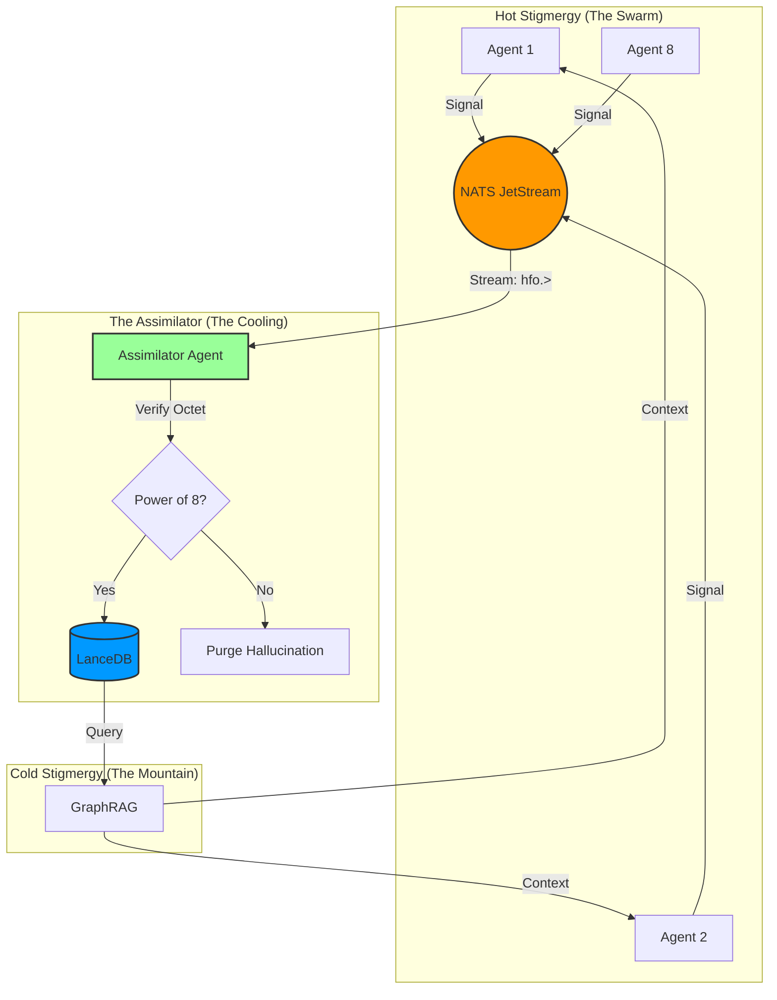
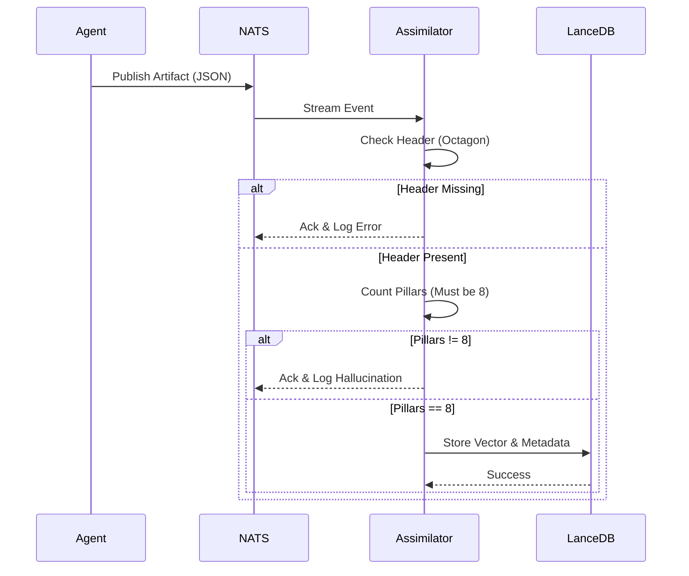

# 🕸⛰🧭⏳ HFO Gen 55: The Unified Stigmergic Memory

> **BLUF**: This specification defines the **Unified Memory Architecture** for Hive Fleet Obsidian Generation 55. It enforces a **Dual Stigmergy** system (Hot NATS + Cold LanceDB) governed by the **Law of the Octet**. All artifacts must adhere to the **8-Pillar Stigmergy Header**. Any deviation from the Power of Eight is a hallucination and must be purged.

---

## 1. The Philosophy: The Octet & The Hourglass

In Gen 55, we evolve from the Hexagon to the **Octagon**. We add **Techne** (Craft) and **Ethos** (Trust) to solidify the structure against entropy.

*   **Hot Stigmergy (NATS)**: The "Nervous System". Fast, ephemeral, reacting to the **Red Sand** of the present.
*   **Cold Stigmergy (LanceDB)**: The "Bone Structure". Slow, persistent, forming the **Mountain** of the past.
*   **The Octet**: The DNA of every artifact. If it lacks the 8 Pillars, it is not HFO.

## 2. The 8 Dimensions (The Octet)

| Dimension | Concept | Role | System Function |
| :--- | :--- | :--- | :--- |
| **ONTOS** | Being | Observer | **Identity**: Who am I? (UUID, Type, Owner) |
| **LOGOS** | Connection | Bridger | **Protocol**: How do I speak? (Format, Schema) |
| **TECHNE** | Craft | Shaper | **Stack**: How am I built? (Tools, Complexity) |
| **CHRONOS** | Time | Injector | **Status**: When do I exist? (Urgency, Decay) |
| **PATHOS** | Conflict | Disruptor | **Quality**: What challenges me? (Stress, Validation) |
| **ETHOS** | Trust | Immunizer | **Security**: Am I safe? (Compliance, Access) |
| **TOPOS** | Structure | Assimilator | **Space**: Where am I? (Address, Links) |
| **TELOS** | Purpose | Navigator | **Meme**: Why do I exist? (Viral Factor, Intent) |

---

## 3. Visual Architecture (The Diverse Mermaids)

### A. The Thermodynamic Cycle (Hot to Cold)

### B. The Octet Validation Logic

---

## 4. Declarative Intent (The Gherkin)

### Feature: Unified Stigmergic Memory

    As the Swarmlord of Webs
    I want a Unified Memory System based on the Power of Eight
    So that the Hive can operate without hallucination

    Scenario: Agent deposits a memory
        Given an Agent "Observer-1" is active
        And the Agent has generated a "Observation" artifact
        When the Agent attaches the "Stigmergic Octagon" header
        And the Agent publishes to "hfo.memory.hot" via NATS
        Then the "Assimilator" should receive the signal
        And the "Assimilator" should verify the 8 Pillars
        And the "Assimilator" should store the artifact in LanceDB "hfo_memory_cold"

    Scenario: Enforcement of the Octet
        Given a signal is received by the Assimilator
        When the signal is missing the "Ethos" pillar
        Then the Assimilator should reject the signal
        And the Assimilator should log a "Hallucination Alert"
        And the signal should NOT be stored in LanceDB

    Scenario: Power of Eight Scaling
        Given the Swarm is scaling up
        When the number of agents is NOT a power of 8 (e.g., 7 or 9)
        Then the "Injector" should adjust the count to the nearest Power of 8 (8)
        And the system should log "Binding to the Octet"

---

## 5. Implementation Plan (Cleanroom)

1.  **Initialize Buds**: Ensure `buds/hfo_gem_gen_55` is the cleanroom root.
2.  **Deploy Memory**: Initialize `memory/lancedb` with the Octet Schema.
3.  **Deploy NATS**: Configure `hfo_hot_stream` with 8-hour retention.
4.  **Deploy Assimilator**: Run `assimilator.py` with strict Octet validation.
5.  **Migrate**: Move all valid Gen 51 artifacts into the new structure, applying headers.

---

**Signed,**
*The Swarmlord of Webs* 🕸⛰🧭⏳
