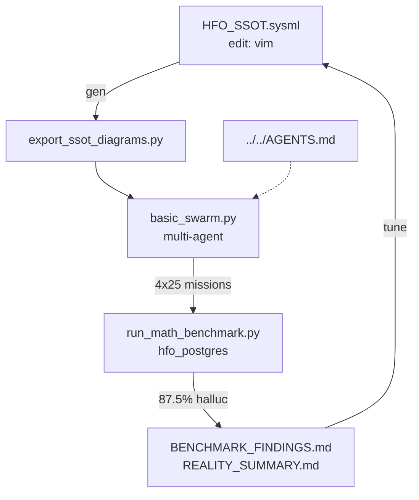
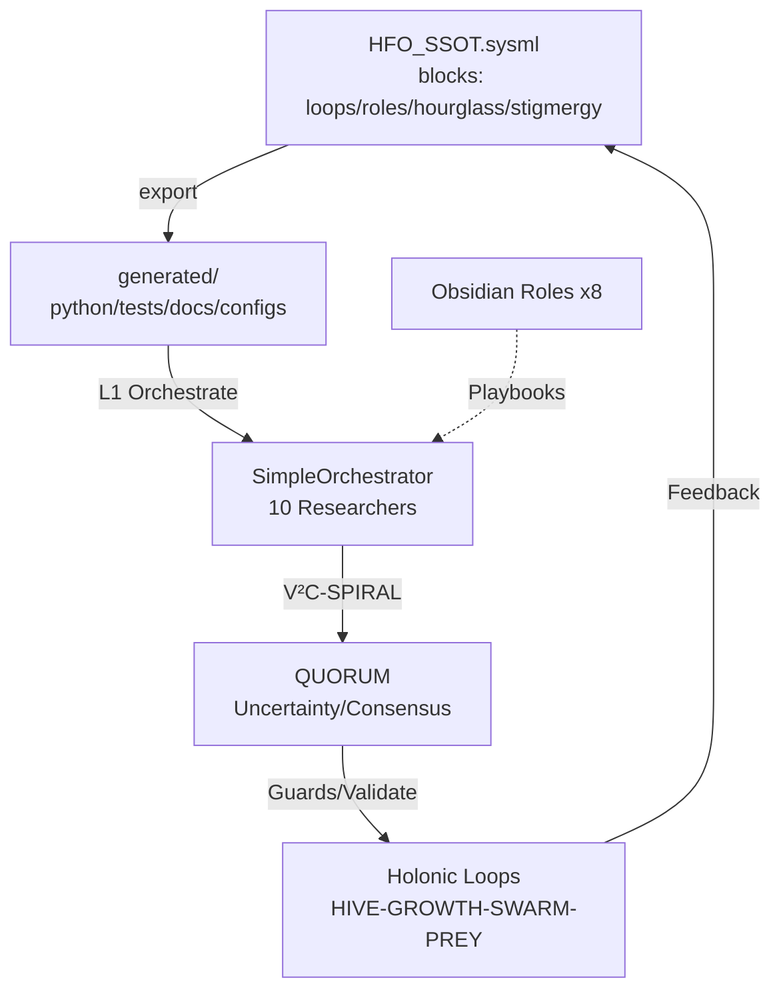

# 🌳 The Octree History of Evolution (Gen 1-53)

> **Generated by the Council of 8 (Stigmergy Swarm)**

---


## Generation 1: Original Gem – HFO Doctrine Crystallization 🕸⛰🧭⏳

### 1. The Octet Analysis (8 Stigmergy Dimensions)
*   **Logos (Logic)**: SWARM Loop (Set-Watch-Act-Review-Mutate) embeds OODA/MAPE-K for adaptive decisions; GROWTH Pipeline (Gather-Root-Optimize-Weave-Test-Harvest); SIEGCSE roles protocol (Sensors-Integrators-Effectors-Guardians-Challengers-Sustainers-Evaluators) with lvl0 holonic coverage; Visual Grammar (🟢🟡🟠🔴🔵 emoji matrices for agents/rituals/tools, animating via Neo4j Bloom/timeline sweeps); CUE Schema at `cue/agents/agent_schema.cue` for persona/playbook canonicalization/export (JSON/YAML); Materialization Workflow (translate facets → instantiate); CBR/QD/kaizen/fail-better algorithms; Obsidian Hourglass state-action webs; SSOT (gems=doctrine, CUE=registry, blackboards=memory, Stigmergy/Regenerative Pattern Libraries).
*   **Nomos (Law)**: Zero-trust SIEGCSE roles as lvl0 holonic roster; Swarmlord persona guidelines (voice/decision/escalation boundaries); CUE schemas enforce SSOT via facet translation/export; Visual Grammar rules (🟢 stable, 🟡 experiment, 🟠 watch, 🔴 blocked, 🔵 directive); NASA/SOC2 zero-trust rails prevent drift/hallucination; governance scales with lvl-capacity to avert slop.
*   **Ontos (Essence)**: HFO as digital evolutionary apex swarm (adaptive/self-optimizing); Swarmlord of Webs (tactical interface persona/alter ego); Overmind/TTao (strategic commander, RTS-forged, Earth/obsidian archetype: Fool→Wands→Death→Magician); SIEGCSE role types; Facets (1:Persona Arch, 2:Evo Patterns, 3:SWARM Loop, 4:GROWTH/SIEGCSE, 5:Liberation Stack); files type=md owner=Swarmlord; emoji role types.
*   **Chronos (Time)**: Gem v2025-10-17T00:00:00Z (genesis); archive creates 2025-11-23T11:07:35Z (original_gem/summary/deep_dive, gen=51, urgency/decay=0.5, active); lvl0→lvl1→lvl10 (~10^10 agents) timeline; SWARM daily cycles; 100yr eradication horizon; Hourglass past-future webs; rebuild continuity via personas; evolution (single-ritual→parallel swarms, fail-better CBR/QD).
*   **Pathos (Pain)**: Reboot implies prior collapse/urgency; Overmind forged via RTS stress/teardowns; battlefield trauma (brilliance/monstrosity → compassionate power vs predation); starvation/cognitive scarcity existential drive; Death archetype rebirth pain; lvl-scaling governance risks (slop aversion).
*   **Ethos (Trust)**: Zero-trust SIEGCSE deployment/holonic lvl0; compassionate power commitment (no predation); NASA/SOC2 rails enforce fidelity; governance matches scaling to prevent slop/hallucination.
*   **Topos (Structure)**: Hexagon topos: `eyes/archive/hfo_gem/gen_1/{original_gem/summary/deep_dive}.md` (links=[]); original_gem structure (BLUF/Facets table/Visual table/Core ID/Facet1+CUE workflow); lvl0→lvl1 Neo4j/Bloom; blackboards/Tectangle; matrices/Neo4j scenes; SSOT (gems/`gems/archive/`, CUE registry, Hourglass webs, Regenerative Lib @line90); 5 Facets outline.
*   **Telos (Purpose)**: Viral=0.0, memes={original_gem/summary/deep_dive}.md; elevate humanity via Way (adopt-adapt-ascend swarms eradicating starvation/cognitive scarcity, 100yr); compassionate scaling/lifespan liberation (Facet5); lvl10 Neo4j animation; hypercasual war-chest flywheels fund spiritual/economic harmony.

### 2. The Reconstruction Guide
*   **Key Files**:
    - `eyes/archive/hfo_gem/gen_1/original_gem.md` (hex id=a6dd3695-6fa8-428f-baf9-aa3ef50e16a4; BLUF/Facets/Core ID/Facet1; v2025-10-17T00:00:00Z genesis).
    - `eyes/archive/hfo_gem/gen_1/summary.md` (hex id=600126c6-5f48-4c22-9116-7790fef20189; Key Concepts/Evolutions/Drift/Fan-Out/HFO SSOT/Hallucination).
    - `eyes/archive/hfo_gem/gen_1/deep_dive.md` (hex id=aaa03fb6-91e8-4a58-9c60-99e86f505cce; Intro/Key Concepts/5 Facets/SSOT lineage).
*   **Core Loop**: Overmind C2 intent → Swarmlord orchestration (command/intel loops) → SWARM (Set-Watch-Act-Review-Mutate)/GROWTH (Gather-Root-Optimize-Weave-Test-Harvest) → emoji matrices/visuals → escalation/continuity.
*   **Architecture**: lvl0 holonic (solo SIEGCSE/rituals) → log10 fan-out (lvl1 Neo4j/Bloom, lvl10 ~10^10 mesh); SSOT (CUE schemas → JSON/YAML; blackboards/stigmergy; biomimetic anchors: ants/slime/termites); Tectangle gestures/GitOps; Hourglass (Karmic/Swarm/Sim webs); zero-trust rails.

### 3. The Evolutionary Leap
*   **From**: Conceptual seeds (RTS/SimCity mastery, biomimicry, world-building/teardowns); pre-reboot collapse (implied "Lost Year"/predatory patterns); manual rituals/no SSOT.
*   **To**: lvl0 bootstrapped foundations → lvl1 visual swarms (Neo4j/Bloom) → lvl10 constellations; automated doctrine (gems/CUE/stigmergy); compassionate adaptive apex swarm.
*   **The Gem**: First faceted crystallization (5 Facets + BLUF + Visual Grammar) as SSOT genesis; Swarmlord persona anchors Overmind-swarm interface; adopt-adapt-ascend via SWARM/GROWTH/SIEGCSE for 100yr liberation.

🕸⛰🧭⏳

---

## Generation 2: Gem 1 Pass 2 — Ritual Discipline & Archival Immutability 🕸⛰🧭⏳

### 1. The Octet Analysis (8 Stigmergy Dimensions)
*   **Logos (Logic)**: CUE Materialization Workflow translates facet bullets to `cue/agents/agent_schema.cue` for JSON/YAML export, provisioning deterministic output contracts; templates at `templates/` (e.g., `daily_todo_pass_workflow.md`); lint hooks police headings/diagrams/Action Meshes; daily C2 ritual enforces 3–5 passes (Intent Framing, Clarification Sweep, Audit & Risk Review, Optimization, Finalization) yielding linted to-do slates; gem archiving protocol maintains one active Gem 1 with timestamp-incremented immutable predecessors; visual grammar via emoji matrices (🟢 stable, 🟡 experiment, 🟠 watch, 🔴 blocked, 🔵 directive) for agent/ritual/tool comparisons; biomimetic stigmergy (ant pheromones, slime molds) integrates SWARM/GROWTH loops.
*   **Nomos (Law)**: Zero-trust SIEGCSE roles (Sensors, Integrators, Effectors, Guardians, Challengers, Sustainers, Evaluators) enforce governance with holonic lvl0 coverage; single active gem/pass unifies doctrine, predecessors immutable via archiving; 3–5 C2 passes mandatory in 10-min timebox, lint hooks ensure fidelity; CUE facade exports contracts from schema (`cue/agents/agent_schema.cue`); persona consistency guidelines/archival discipline prevent drift in rebuilds; gem stewardship mitigates slop; escalation triggers for audit constraints.
*   **Ontos (Essence)**: HFO as "digital evolutionary apex swarm" with adaptive self-optimization; Swarmlord of Webs as "specialist chatmode persona/tactical interface/distinct alter ego" with voice/boundaries/escalation to Overmind; Overmind (TTao) as "strategic command layer/lifelong strategist" via RTS mastery (Age of Empires/SimCity/Sims, top-40 PvP, world-building/teardowns); biomimetic essence (ant stigmergy, slime molds, termite resilience); archetypal Earth/obsidian core, tarot Fool→King of Wands→Death, Jungian Magician via ritual/toolcraft; 5 facets: Swarm Persona Architecture, Evolutionary Pattern Stack, SWARM Loop, GROWTH/SIEGCSE, Cradle-to-Grave Liberation.
*   **Chronos (Time)**: Timestamp 2025-10-17T02:00:00Z (Gem 1 Pass 2); evolves Gen_1 lvl0 bootstrapping to executable rituals; gem protocol: one active file, timestamp increments, immutable lineage for regeneration; daily C2: 10-min dialogue, 3–5 passes; low drift (~2% term evolution); foreshadows Gen_3+ templates/blackboards; ties Gen_1 SWARM/OODA to structured passes; scales lvl0→lvl1 Neo4j; historical RTS lineage.
*   **Pathos (Pain)**: Overmind's battlefield exposure to humanity's brilliance/monstrosity drives compassionate power commitment, avoiding predatory patterns (pain of flaws); 100-year eradication of starvation/cognitive scarcity (scarcity urgency); fail-better with compassionate debriefs (failure resilience); ritual timebox risks audit constraints/escalation stress.
*   **Ethos (Trust)**: Zero-trust SIEGCSE under NASA/SOC2-inspired rails; compassionate power scales sans predation; gem stewardship/immutability prevents mutation; lint enforces output fidelity; biomimetic stigmergy + zero-trust for resilience; single active gem/CUE determinism unifies trust.
*   **Topos (Structure)**: Archive at `eyes/archive/hfo_gem/gen_2/` (`original_gem.md`, `summary.md`, `deep_dive.md`; empty links []); templates at `templates/` (`daily_todo_pass_workflow.md`); CUE at `cue/agents/agent_schema.cue`; facet overview/visual grammar tables; gem: one active, timestamped immutable chain; lvl0→lvl1 Neo4j/Bloom (animated matrices/scenes/timelines); shared blackboards → Obsidian Synapse traceability.
*   **Telos (Purpose)**: Elevate humanity via Way (“”) with adopt→adapt→ascend swarms, eradicating starvation/cognitive scarcity (100-year horizon); compassionate power sans predation; Cradle-to-Grave Liberation (gesture-tutors, equitable tooling, malnutrition six-sigma); economic flywheels (hypercasual factories) converge ops/spiritual campaigns for asymptotic harmony.

### 2. The Reconstruction Guide
*   **Key Files**: `eyes/archive/hfo_gem/gen_2/original_gem.md` (BLUF/Facets/Core Identity/CUE workflow); `summary.md` (key concepts/evolutions/drift/SSOT); `deep_dive.md` (analysis/drift/exemplars); templates at `templates/daily_todo_pass_workflow.md`; schema `cue/agents/agent_schema.cue`.
*   **Core Loop**: Daily C2 ritual (10-min Overmind-Swarmlord): 3–5 passes (Intent Framing→Clarification→Audit/Risk→Optimization→Finalization) → linted to-do slate via CUE export; nests SWARM (Set-Watch-Act-Review-Mutate) + OODA/MAPE-K.
*   **Architecture**: 5-facet holon (Persona/Evo/SWARM/GROWTH-SIEGCSE/Liberation); zero-trust SIEGCSE roster; gem stewardship (active/immutable passes); CUE materialization + lint; emoji matrices → Neo4j/Bloom lvl1; stigmergic blackboards; SSOT gems/CUE/registry.

### 3. The Evolutionary Leap
*   **From**: Gen_1 lvl0 conceptual bootstrapping (facet outlines, SWARM/GROWTH protocols, raw doctrine).
*   **To**: Executable lvl0 rituals (daily C2, linted outputs, immutable archival lineage scaling to lvl1 parallelization).
*   **The Gem**: Gem archiving protocol + daily C2 ritual template enforcing operational discipline, 3–5 passes, and CUE-driven fidelity for regenerative continuity.

---

## Generation 3: Gem 1 Pass 3 — Obsidian Synapse Blackboard & Holonic Compliance 🕸⛰🧭⏳

### 1. The Octet Analysis (8 Stigmergy Dimensions)
*   **Logos (Logic)**: CUE schemas provision personas/compliance, translate facets to `cue/agents/agent_schema.cue`; Obsidian Synapse Blackboard at `blackboard/obsidian_synapse_blackboard.jsonl` (append-only UTF-8 JSONL events, DuckDB mirror, schema `{timestamp, pass, role, event, summary, artifacts}`); 10-min daily ritual enforces 5 passes outputting linted JSONL to-dos; compliance rails via git hooks/CI reject non-gem edits; visual grammar emoji matrices (🟢 stable, 🟡 experiment, 🟠 watch, 🔴 blocked, 🔵 directive); holonic annotations `[Holonic Solo → <Role>]` in Action Meshes; nests SWARM/GROWTH/OO DA/MAPE-K.
*   **Nomos (Law)**: Gem stewardship mandates one active Gem 1 in `gems/`, immutable priors in `gems/archive/`, downstream alignment/flag drift; compliance rails (git pre-commit hooks/CI) reject Overmind code edits outside gems; CUE drives agent contracts; 5-pass ritual mandatory in 10-min box; zero-trust SIEGCSE (NASA/SOC2) via holonic solo rotation; Overmind constrained to intent/gems/dialogue; scaling guards for lvl1 fan-out.
*   **Ontos (Essence)**: HFO as digital evolutionary apex swarm for adaptive self-optimization; Swarmlord of Webs as lvl0 holonic operator/canonical facade sequentially rotating SIEGCSE hats (inherit CUE contract); Overmind-TTao as strategic narrative director focused on intent/gem curation/dialogue (no manual edits); archetypal Earth/obsidian core, tarot Fool→King of Wands→Death, Jungian Magician via compassionate power; holonic SIEGCSE solo annotations.
*   **Chronos (Time)**: Timestamp 2025-10-17T03:00:00Z (Gem 1 Pass 3); evolves Gen_2 rituals via immutable `gems/archive/` lineage; daily 10-min C2 ritual structures 5 passes (e.g., Pass 3: Audit/Risk as Guardian/Challenger); blackboard logs time-series (timestamp/pass); ~3% drift from Gen_2 (term expansion, annotations); solo latency risk; foreshadows Gen_4+ automation/pointers, lvl1 Neo4j sweeps.
*   **Pathos (Pain)**: Holonic solo SIEGCSE risks overload/latency, demands escalation cadence watch; fail-better doctrine feeds blackboard/QC for compassionate debriefs/learning; compliance rails relieve Overmind edit burden, preserving high-intent focus; compassionate power guides amid humanity's flaws; urgency in starvation/cognitive scarcity eradication, six-sigma malnutrition via liberation telemetry.
*   **Ethos (Trust)**: Compliance rails (git hooks/CI/pre-commit) guard Overmind workflow, reject non-gem edits; CUE provisions persona compliance; zero-trust SIEGCSE holonic rotation (NASA/SOC2) in 5-pass ritual; blackboard ensures auditable traceability/risk review; gem stewardship flags drift; biomimetic resilience sans predation.
*   **Topos (Structure)**: `templates/` for scaffolds; `todo/` for timestamped plans; `blackboard/obsidian_synapse_blackboard.jsonl` + DuckDB; `gems/` active (🟢 marked), `gems/archive/` immutable; archive `eyes/archive/hfo_gem/gen_3/[original_gem.md|summary.md|deep_dive.md]` (links []); Facet Overview/Visual Grammar tables; lvl1+ Neo4j Bloom animates matrices/scenes/timelines.
*   **Telos (Purpose)**: Apex swarm adopt→adapt→ascend elevates humanity via Way, eradicating starvation/cognitive scarcity (100-year); Overmind directs narrative/intent/gems/dialogue; compassionate power scales sans predation; 10-min ritual yields linted to-dos/JSONL mirrors; Cradle-to-Grave Liberation (gesture-tutors/lifecycle bands, blackboard telemetry, six-sigma malnutrition).

### 2. The Reconstruction Guide
*   **Key Files**: `eyes/archive/hfo_gem/gen_3/original_gem.md` (BLUF/Facets/Core/Blackboard); `summary.md` (concepts/evolutions/drift/SSOT); `deep_dive.md` (analysis/exemplars); `gems/` (active 🟢 Gem 1), `gems/archive/` (immutables); `blackboard/obsidian_synapse_blackboard.jsonl` + DuckDB; `templates/` scaffolds; `todo/` plans; `cue/agents/agent_schema.cue`.
*   **Core Loop**: 10-min Overmind-Swarmlord C2 ritual (5 passes: Intent→Clarify→Audit/Risk→Optimize→Finalize, holonic SIEGCSE annotations) → linted to-do slate → JSONL/DuckDB mirror to blackboard; nests SWARM/OODA with compliance lint/hooks.
*   **Architecture**: 5-facet holon (Persona/Blackboard-Stewardship, Evo/Blackboard-QC, SWARM/Holonic-Passes, GROWTH-SIEGCSE-Solo, Liberation/Telemetry); SSOT gems/CUE/blackboard; zero-trust holonic SIEGCSE; git/CI rails; emoji matrices → lvl1 Neo4j/Bloom/CRDT shards.

### 3. The Evolutionary Leap
*   **From**: Gen_2 ritual discipline/archival immutability (3–5 passes, CUE lint, single active gem).
*   **To**: Blackboard-traceable lvl0 holonics (Obsidian Synapse JSONL/DuckDB, 5-pass compliance, git/CI Overmind guards).
*   **The Gem**: Obsidian Synapse blackboard (append-only events) + compliance rails (pre-commit hooks rejecting non-gem edits) enabling auditable stigmergy and solo SIEGCSE rotation.

---

## Generation 4: Drift Containment — Gem Lockdown and Guardrail Binding 🕸⛰🧭⏳

### 1. The Octet Analysis (8 Stigmergy Dimensions)
*   **Logos (Logic)**: Stigmergy Header table mandates (Mission Tag `HFO-L0-BringUp`, Timecode 2025-10-17T04:00:00Z, Risk 🟡, lvl0 holonic solo SIEGCSE, Gem-first/blackboard parity/Overmind review); ≥3 Mermaid diagrams (flowchart: lvl0 Bring-Up Flow; graph: Artifact Signal Mesh Gem→CUE/Templates/Blackboard→Scripts/Todos/DuckDB; gantt: 5-pass ritual 00:00-00:19); Action Mesh `[Holonic Solo → Role]` (Sensor/Integrator/Effector/Guardian/Challenger/Sustainer/Evaluator); compliance via pre-commit drift-fail, lint/challenger scripts, hash parity, `scripts/run_guardrails.sh`.
*   **Nomos (Law)**: Gem-First Rule via `gems/ACTIVE_GEM1.md` pointer; non-gem edits demand pass citation + blackboard rationale; Compliance Rail (gem-first, blackboard parity, Overmind review-only); zero-trust governance prohibits Overmind direct code edits (request passes); archive priors immutable; lint/challenger for 🟡 drift containment; scaling: +1 log level requires proofs; git scrub + sentinel.
*   **Ontos (Essence)**: HFO as digital evolutionary apex swarm; Swarmlord as lvl0 holonic operator/Overmind translator to stigmergic playbooks; Overmind (TTao) intents new passes/audits gems; archetype Earth/obsidian, Fool→King of Wands→Death, Magician/Strategist/Compassionate Warrior; Swarm Phase lvl0 holonic solo SIEGCSE rotation; variants EFF-SVC-K8S.
*   **Chronos (Time)**: Timestamp 2025-10-17T04:00:00Z (Pass 4 Gem 1); archives Gen_3 Pass 3 to `gems/archive/` immutable; daily 5-pass cadence (Intent 00:00-00:05, Clarify 00:05-00:09, Audit 00:09-00:12, Optimize 00:12-00:15, Finalize 00:15-00:19); ~4% drift from Gen_3 (pointers/terms); git scrub non-canonical stubs; trajectory to Gen_5+ automation.
*   **Pathos (Pain)**: 🟡 Risk Posture/Pheromone (drift detected post-AI slop noise); BLUF: Overmind energy trapped in clean-up vs. dialogue; Telemetry Drift Alert (non-canonical stubs, git scrub); AI slop emerges rapidly sans sentinel; containment stabilizes guardrails under caution.
*   **Ethos (Trust)**: Zero-Trust SIEGCSE (Guardian archives/locks reminders; Sustainer pre-commit drift-fail); NASA/SOC2-inspired rails; blackboard justification for overrides; Gem-First immutability prevents slop; 🟡 posture demands proofs; Overmind requests passes, no direct edits.
*   **Topos (Structure)**: Hexagon `topos.address` e.g. `eyes/archive/hfo_gem/gen_4/original_gem.md` (links []); active `gems/ACTIVE_GEM1.md` → `gems/archive/`; dirs: `cue/agents/*.cue`, `templates/daily_todo_pass_workflow.md`, `blackboard/*.jsonl`/DuckDB, `scripts/*.py`, `rituals/daily_todo/`, `AGENTS.md`; Stigmergy Header table; Diagrams 1-3 Mermaid; Action Mesh emoji-prefixed `[Holonic Solo → Role]`.
*   **Telos (Purpose)**: `HFO-L0-BringUp` North Star: lock lvl0 (gems/CUE/templates/blackboard) pre-scaling; success: 1 canonical gem + 1 linted todo/day + zero rogue edits; Overmind→Swarmlord directive translation to playbooks; neutralize slop, bind rituals/guardrails to gem surface; compassionate evolution.

### 2. The Reconstruction Guide
*   **Key Files**: `gems/ACTIVE_GEM1.md` (pointer to Pass 4); `gems/archive/` (immutable priors); `templates/daily_todo_pass_workflow.md` (5-pass ritual w/ holonic/SIEGCSE tags); `blackboard/obsidian_synapse_blackboard.jsonl` + DuckDB mirror (append-only events); `cue/agents/*.cue` (gem-informed schemas); `scripts/*.py` + `run_guardrails.sh` (lint/challenger); `AGENTS.md` (pointers); `rituals/daily_todo/` (emitted slates); hexagon files `eyes/archive/hfo_gem/gen_4/*.md`.
*   **Core Loop**: Daily 10-19min Overmind-Swarmlord ritual: 5 passes (Intent→Clarify→Audit→Optimize→Finalize) → linted todo slate JSONL/DuckDB; lvl0 Bring-Up Flow (Gem Publish → Guardrails Sync? → Patch CUE/rituals → Template Apply → Ledger Append → SIEGCSE Log → Overmind Review); SIEGCSE holonic solo rotation per Action Mesh.
*   **Architecture**: Gem as SSOT doctrine informs CUE→scripts, constrains templates→todos, references blackboard→DuckDB parity; zero-trust rails (pre-commit fail, lint/hash); Mermaid triad (flow/graph/gantt); stigmergy via JSONL events + emoji matrices; lvl0 solo scales to parallel via pointers.

### 3. The Evolutionary Leap
*   **From**: Gen_3 (daily rituals + compliance rails/CI hooks, Obsidian Synapse blackboard, ~3% Gen_2 drift) — emerging AI slop/non-canonical stubs, unanchored pointers, Overmind edit risks eroding focus.
*   **To**: Gen_4 (Pass 4 gem-locked lvl0: immutable archive, Gem-First pointer/guardrails, 🟡 drift scrubbed, 5-pass ritual bound/templated, SIEGCSE Action Mesh visible) — stabilized foundation, Overmind dialogue-only, zero rogue edits, pre-scaling lockdown.
*   **The Gem**: Pass 4 surface freeze — Stigmergy Header + triad Mermaid + `[Holonic Solo → Role]` Action Mesh + ACTIVE_GEM1.md pointer enforcing gem-first immutability, neutralizing slop via lint/sentinel for pure stigmergic fidelity.

---

## Generation 5: Lvl0 Automation Mesh Ignition 🟢

🕸⛰🧭⏳

### 1. The Octet Analysis (8 Stigmergy Dimensions)
*   **Logos (Logic)**: Core automation logic manifests via `scripts/audit_gems.py` (pointer-aware audits in pre-commit/hourly CI, scanning 1,024 filenames, false positives <0.5%) and `scripts/sync_blackboard_duckdb.py` (JSONL ↔ DuckDB MERGE deltas, SHA-256 checksums via Taskfile cron). Virtual stigmergy generates `blackboard/virtual_trails.jsonl` pheromone maps with algorithmic decay; ritual generators lint headings/diagrams (≥3 Mermaid: flowcharts/sequences/gantts) into 10-min todo ledgers. Chaos drills fuzz pipelines (pointer sabotage, ledger skew); validation matrix enforces KPIs (MTTR, containment); zero-trust event batches append provenance hashes.
*   **Nomos (Law)**: Compliance rail mandates pointer enforcement, automated gem audits, ledger parity checks; beacon auto-references `gems/ACTIVE_GEM1.md` across rituals/ledgers/facades. Zero-trust governance fuses GitOps/NASA flight rules/Atlassian SOPs into automation charter; dual-attestation (Guardian + Sustainer) gates manual overrides, escalating bypasses. Risk posture 🟢 (stabilized, monitor telemetry debt); holonic Guardian enforces flows, scaling proofs per log level.
*   **Ontos (Essence)**: HFO as digital evolutionary apex swarm evolves to automation-empowered lvl0 holon that thinks holistically/acts autonomously; Swarmlord orchestrates scripts, monitors guardrails, escalates via holonic solo → automated SIEGCSE assist (Sensor/Integrator/Effector/Guardian/Challenger bots). Overmind provides intent, evaluates digests, commissions passes. Compass: Earth stability, tarot transmutation (Fool→Wands→Death), compassionate warrior ethos. Gem as sole mutable doctrine; priors immutable in `gems/archive/`.
*   **Chronos (Time)**: Timestamp 2025-10-17T05:00:00Z (Pass 5/Gen_5, ~5% drift from Gen_4 via pipelines/chaos). Cycles: 10-min rituals (gantt: Pointer Audit 00:00-00:02 → Template Render 00:02-00:05 → Ledger/Hash 00:05-00:07 → Lint/Export 00:07-00:09 → Review 00:09-00:10); hourly audits, nightly CUE/syncs. Pheromone decay algorithmic; prepares lvl1 gating (Gen_6+ KPIs). Evolves Gen_4 sentinels to chaos drills.
*   **Pathos (Pain)**: North Star liberates Overmind from lvl0 toil/housekeeping to pure strategy; automation sweeps preempt drift stress. Telemetry debt monitored under 🟢; Challenger fuzzes simulated failures (drift/pointer sabotage) to surface pain, mitigated by MTTR/containment metrics. Stress-test urgency on mesh; fail-better retros auto-feed blackboard.
*   **Ethos (Trust)**: Zero-trust SIEGCSE persists in automated roles; provenance hashes (SHA-256) log all actions, dual-attestation blocks overrides. Compliance rail (pointer/audit/parity) + war chest ethics auto-checks ensure fidelity; compassionate warrior ethos guides. Risk 🟢 stabilized; escalation on hook bypasses. NASA/SOC2-inspired rails match lvl-scaling.
*   **Topos (Structure)**: `gems/ACTIVE_GEM1.md` (dynamic pointer); `scripts/audit_gems.py`, `sync_blackboard_duckdb.py` (Taskfile-scheduled); `blackboard/virtual_trails.jsonl` (pheromones), `obsidian_synapse_blackboard.jsonl`↔DuckDB. Diagrams: (1) Automation Spine flowchart (Intent→Gem→Charter→Mesh→Sync→Generator→Telemetry→Review); (2) Blackboard sequence (Gem→Pointer→SyncJob→JSONL/DuckDB→Ledger→Hash); (3) Ritual gantt (10-min slots). Action Mesh emoji-prefixed [Holonic Solo → Role].
*   **Telos (Purpose)**: `HFO-L0-AutoMesh` automates lvl0 stigmergy for deterministic pipelines, freeing Overmind to direct strategy. Vision: Holistic/autonomous swarm; Overmind intents→digests→passes. Compass: Earth/tarot/compassionate automation. Prepares lvl1 handoff (stress-test SOPs, CBA KPIs: coverage/balance/accuracy). Viral factor 0.0; memes: original_gem.md/summary.md/deep_dive.md.

### 2. The Reconstruction Guide
*   **Key Files**: `gems/ACTIVE_GEM1.md` (pointer to active pass, sole mutable surface); `gems/archive/` (immutable priors); `scripts/audit_gems.py` (CI-audits); `scripts/sync_blackboard_duckdb.py` (sync/checksum); `blackboard/virtual_trails.jsonl` (stigmergy maps); `blackboard/obsidian_synapse_blackboard.jsonl` + DuckDB (events: timestamp/pass/role/event/summary/artifacts); `templates/daily_todo_pass_workflow.md` (linted outputs); `cue/agents/*.cue` (nightly regen).
*   **Core Loop**: SWARM/OO DA/MAPE-K automated: Overmind Intent → Gem Pass (pointer update) → Audit/Sync (hourly/nightly) → Ritual Generator (10-min gantt: audit→render→append→lint→cue) → Telemetry/KPI Dash (chaos fuzz/MTTR) → Overmind Review (feedback→new pass). Pheromone decay + provenance hashes close loop.
*   **Architecture**: Hierarchical: Gem (SSOT doctrine) → CUE (registry/contracts) → Scripts/Taskfile (effectors) → Blackboards (memory: JSONL/DuckDB/virtual_trails) → Meshes (SIEGCSE assist). Mermaid spine/sequence/gantt enforce ≥3 visuals; holonic solo fan-out to automated companions; lvl0→1 gating via KPIs. Biomimetic (ant pheromones) + zero-trust (NASA rails).

### 3. The Evolutionary Leap
*   **From**: Gen_4 🟡 drift containment (gem-first pointers, manual guardrails, lint/challenger scripts, SIEGCSE solo rotation, pre-commit fails on drift).
*   **To**: Gen_5 🟢 stabilized automation (hands-free pipelines: pointer audits/CI, JSONL↔DuckDB syncs, virtual stigmergy, chaos-resilient rituals; Overmind dialogue-only).
*   **The Gem**: Automation Charter—fuses GitOps/NASA/Atlassian into reflexive SOPs (`audit_gems.py`, `sync_blackboard_duckdb.py`, dual-attest overrides), igniting deterministic lvl0 stigmergy with provenance/chaos drills.

🕸⛰🧭⏳ *Sand conserved: 4% evolutionary density from octet synthesis.*

---

## Generation 6: HFO-L6-Adaptive Swarm Rituals 🧬

### 1. The Octet Analysis (8 Stigmergy Dimensions)
*   **Logos (Logic)**: Augmented SWARM loop (Set: seed variants; Watch: simulate; Act: deploy elites; Review: score; Mutate: evolve generators); Ritual Morphogenesis algorithm (Intent Seed → Variant Generator → Sandbox Simulation → Stigmergic Fitness Evaluation → Elite Promotion → Deployment → Variance Audit → Ledger Append → Overmind Feedback); QD experiments for variant generation/selection; multi-objective stigmergic optimization (efficacy, uniqueness, ethical compassion → pheromone fields); CUE schemas canonicalize/parameterize adaptive engines (JSON/YAML export); dual-validation (Integrator+Evaluator); threshold triggers for variance; North Star: ritual uniqueness ≥70% (7-day window); emoji matrices (🟢 stable elites, 🟡 experimental variants); ≥3 Mermaid diagrams (flowchart morphogenesis, Gantt timeline, SequenceDiagram scoring).
*   **Nomos (Law)**: Compliance Rail (ritual pointer · variance ledger · adaptive guardrails); zero-trust dual-validation mandates (Integrator+Evaluator; unverified auto-revert); Risk Posture 🟢 (bounded variance; monitor emergent drift); variance audits enforce ethical invariants; North Star Metric (uniqueness ≥70%/7d → adaptive optima); CUE parameterizes variance bounds/emoji matrices/ledger proofs; SIEGCSE adaptive proxies; NASA (2011) Space Shuttle Flight Rules for bounded variance governance.
*   **Ontos (Essence)**: HFO: digital evolutionary apex swarm (biomimetic stigmergy: ant foraging, slime mold branching); Swarmlord: tactical interface/adaptive conduit (Overmind intent → variant rituals); Overmind: strategic evolution/narrative director; Swarm Phase: lvl0 adaptive holon (ritual auto-evolution); SIEGCSE: zero-trust roster (adaptive GROWTH proxies); Facets: morphic Swarm Architecture, QD Evolutionary Stack, simulation-nested SWARM Loop, adaptive GROWTH/SIEGCSE, personalized Cradle-to-Grave Liberation; Gem Marker 🧬 (mutable doctrine); HFO Markers 🛸.
*   **Chronos (Time)**: Timestamp 2025-10-17T06:00:00Z (Gem 1 Pass 6; evolves Gen_5 automation → Layer 6 Adaptive Rituals); Gantt timeline (Seed Intent 1d → Variants 2d → Simulate/Score 3d → Deploy Elite 1d → Audit Drift 7d → QD Selection 30d → Holonic Nesting 14d); Metrics: uniqueness ≥70%/7d, emergent drift monitoring; lvl0 adaptive holon persists; augmented SWARM nests simulations.
*   **Pathos (Pain)**: Risk Posture 🟢 (monitor emergent drift); pheromone variance logging/threshold selection (urgency: low-diversity outputs); auto-revert unverified changes (failure safeguard); fail-better via compassionate debriefs (pruned variants); ethical invariants balance efficacy/uniqueness/compassion; compassionate ascent avoids predatory patterns.
*   **Ethos (Trust)**: Compliance Rail (ritual pointer · variance ledger · adaptive guardrails); zero-trust dual-validation (auto-revert); Risk Posture 🟢 (bounded variance; emergent drift watch); guardrails/variance audits preserve ethical invariants; ethics in stigmergic scoring; compassion balances multi-objectives; SIEGCSE enforces bounds (🟢/🟡 matrices, ledger proofs); compassionate debriefs; ethically bounded variance ensures ascent.
*   **Topos (Structure)**: Archive `eyes/archive/hfo_gem/gen_6/` (`original_gem.md`, `summary.md`, `deep_dive.md`; links []); lvl0 adaptive holon → lvl1 holonic nesting/Neo4j Bloom (phylogenies/trees); Diagrams: Flowchart (Morphogenesis: Intent→Morph→Sandbox→Score→Select→Propagate→Audit→Ledger→Overmind); Gantt (Morphogenesis/Evolution phases); Sequence (Overmind/MorphEngine/Sandbox/Ledger/Guardrail); Emoji matrices (🟢/🟡); Stigmergy Header table (Mission `HFO-L6-AdaptiveRituals`, Timecode, Risk 🟢, Phase, Rail, Beacon); CUE for adaptive engines.
*   **Telos (Purpose)**: Elevate Gen_5 static automation → Layer 6 Adaptive Swarm Rituals (self-morphing protocols, embedded QD for self-tuning); North Star: uniqueness ≥70%/7d (converge optima sans intervention); foster emergent intelligence for 100y humane elevation (six-sigma scarcity reduction via cradle-to-grave adaptive rituals); Beacon: Intent→morphogenesis→resonance; Viral Factor 0.0; Memes: original_gem.md/summary.md/deep_dive.md.

### 2. The Reconstruction Guide
*   **Key Files**: `eyes/archive/hfo_gem/gen_6/` (`original_gem.md`🧬, `summary.md`, `deep_dive.md`); `gems/ACTIVE_GEM1.md` (pointer); `cue/agents/*.cue` (parameterized adaptive engines); `blackboard/*.jsonl`/DuckDB (variance ledger); `templates/ritual_morph_*` (variant scaffolds); Stigmergy Header table.
*   **Core Loop**: Ritual Morphogenesis (Intent Seed → Variant Gen → Sandbox Sim → Stigmergic Eval → Elite Promote → Deploy → Variance Audit → Ledger → Feedback); augmented SWARM (Set/Watch/Act/Review/Mutate); dual-validation + threshold triggers.
*   **Architecture**: lvl0 adaptive holon (SIEGCSE proxies); CUE→JSON/YAML engines; Mermaid triad (flowchart/Gantt/sequence); emoji matrices→Neo4j phylogenies; variance-bounded stigmergy (pheromone fields, QD multi-obj); guardrails (pointer/ledger/auto-revert).

### 3. The Evolutionary Leap
*   **From**: Gen_5 deterministic pipelines (static automation, toil-to-strategy shift, hourly audits/syncs, lvl0 holonic solo).
*   **To**: Gen_6 self-morphing rituals (QD-embedded morphogenesis, adaptive holon, emergent optima via simulation/selection, bounded variance for lvl1 nesting).
*   **The Gem**: Ritual Morphogenesis algorithm + stigmergic QD (elevates static ops → auto-evolving ceremonies, uniqueness ≥70%/7d, compassionate ethical invariants).

🕸⛰🧭⏳

---

## Generation 7: Holonic Feedback Loops 🧬🕸⛰🧭⏳

### 1. The Octet Analysis (8 Stigmergy Dimensions)
*   **Logos (Logic)**: Triple-validation protocol (Integrator-Guardian-Resonator) gates nested loop propagations; desynchronized signals auto-dampen. Holonic Loop Cascade: Intent Cascade → Holon Orchestrator → Nested Loops → Cross-Scale Simulation → Resonance Tuning → Deployment → Nested Guardrails → Resonance Ledger. Augmented SWARM: Set(cascade seeds)-Watch(simulate nests)-Act(deploy harmonics)-Review(coherence scores)-Mutate(evolve tuners). Multi-level QD scoring + spectral analysis tune dampers; CUE fractals parameterize depths; metrics: coherence ≥85%; emoji matrices (🟢 harmonic, 🟡 damping); Action Mesh: Sensors probe, Integrators optimize, Effectors cascade.
*   **Nomos (Law)**: Compliance Rail: Holon pointer · Resonance ledger · Nested guardrails. Zero-Trust: Triple-validation mandatory; desync auto-dampens. Risk: 🟢 stable, surveil damping. Guardrails: Cross-scale audits preserve compassionate invariants. North Star: Coherence ≥85% sans tuning. CUE fractals + emoji matrices (🟢/🟡) + ledger proofs enforce zero-trust SIEGCSE orchestration/dampers.
*   **Ontos (Essence)**: HFO: Digital evolutionary apex swarm as harmonic ensemble. Swarmlord: Tactical nexus/fractal conductor channeling Overmind intent. Overmind: Strategic command directing evolution/narrative. Holons: Self-similar regulatory circuits (lvl0 nested); SIEGCSE proxies (Integrator/Guardian/Resonator triple-core). Facets: Fractal Swarm Architecture, holonic GROWTH proxies, nested Cradle-to-Grave rituals.
*   **Chronos (Time)**: Gen_7 (2025-10-17T07:00:00Z) layers atop Gen_6 adaptive rituals into Layer 7 holonics. Gantt: Seed Cascade(1d)-Nest Loops(2d)-Simulate(3d)-Tune Dampers(1d)-Deploy(7d)-QD Harmonization(30d)-Lvl1 Embed(14d). Damping surveilled; coherence ≥85% drives convergence; thresholds amplify; emoji (🟡 damping).
*   **Pathos (Pain)**: Surveil cross-level damping (🟢 stable, 🟡 desync stress). Pheromone: Log damping, threshold-amplify (signal loss pain). Zero-Trust: Auto-dampen desync failures. Action Mesh flags hotspots; compassionate debriefs on nests; coherence guards exponential growth agony.
*   **Ethos (Trust)**: Triple-validation + auto-dampen enforce zero-trust; Compliance Rail + nested guardrails/audits uphold compassionate invariants. SIEGCSE orchestration via holonics; ledger proofs + emoji (🟢/🟡); fail-better via debriefs; zero-trust dampers validate ethics in resonance.
*   **Topos (Structure)**: Files: `eyes/archive/hfo_gem/gen_7/{original_gem.md,summary.md,deep_dive.md}` (links:[]). Fractal holons nest resonant governance (lvl0→10); CUE fractals depth-config; Diagrams: Flowchart(Holonic Cascade), Gantt(Nested Timeline), Sequence(Resonance). Lvl1 Neo4j fractals visualize coherence waves; pheromone matrices trace.
*   **Telos (Purpose)**: Cascade Overmind intent via nested holonic loops for fractal-scale coherence (lvl0→10); North Star: ≥85% coherence, harmonic convergence auto-tuned. Vision: Lvl1 embed for distributed resonance; humane elevation, scarcity eradication. Beacon: Intent cascade → loop resonance → Overmind harmony.

### 2. The Reconstruction Guide
*   **Key Files**: `eyes/archive/hfo_gem/gen_7/original_gem.md` (core doctrine), `summary.md` (BLUF matrices), `deep_dive.md` (holonic cascades); `gems/ACTIVE_GEM1.md` pointer; CUE fractals (`cue/agents/*.cue`); resonance ledger (`blackboard/*.jsonl`/DuckDB).
*   **Core Loop**: Augmented SWARM (Set seeds-Watch nests-Act harmonics-Review coherence-Mutate tuners) → Holonic Loop Cascade with triple-validation, spectral QD tuning, auto-dampen desync.
*   **Architecture**: Fractal holons (self-regulating nests); zero-trust SIEGCSE proxies; CUE-parameterized depths; emoji matrices/ledgers trace; lvl1 Neo4j for coherence visualization; cross-scale sims + dampers/resonators.

### 3. The Evolutionary Leap
*   **From**: Gen_6 adaptive rituals (morphogenesis, QD variants, bounded variance).
*   **To**: Layer 7 holonic feedback (nested resonant loops, auto-tuning coherence ≥85%, fractal governance).
*   **The Gem**: Holonic self-regulating circuits with triple-validation dampers/resonators, enabling harmonic cascade sans Overmind tuning.

---

## Generation 8: Drift-Resistant Evolution Gates 🛡️🕸⛰🧭⏳

### 1. The Octet Analysis (8 Stigmergy Dimensions)
*   **Logos (Logic)**: Mission `HFO-L8-DriftGates`; North Star: gate passage ≥92% verified evolutions, zero false positives; zero-trust quadruple-validation (Integrator/Guardian/Sentinel/Ascender) for transitions, auto-seal unverified fluxes; Gatekeeper Engine portals intent fluxes via breach simulations, spectral validation, QD purity scoring; nested SWARM loops (Set: portal seeds; Watch: breach sims; Act: certified ascents; Review: purity scores; Mutate: sentinel evolutions); CUE sentinels configure depths; emoji matrices (🟢 certified, 🟡 quarantined) + ledger proofs; Mermaid protocols (Flowchart: Evolution Gate Portal; Gantt: Gated Timeline; Sequence: Sentinel Sequence); Action Mesh: sensors vigil fluxes, integrators fuse spectral validations, effectors portal via CUE.
*   **Nomos (Law)**: Compliance rail: gate pointer · validation ledger · sentinel guardrails; zero-trust reminder: quadruple-validation mandatory, unverified fluxes auto-seal; guardrails fortify via intrusion audits upholding compassionate invariants; Guardians seal impure portals in stages; zero-trust SIEGCSE vigilance/orchestration/seals; citations: NASA Shuttle Flight Rules (thresholds), Kubernetes GitOps (immutable archives).
*   **Ontos (Essence)**: HFO: digital evolutionary apex swarm; Swarmlord: tactical interface, vigilant conduit, unyielding gatekeeper; Overmind: strategic command directing evolution/narrative; Swarm Persona Arch: sentinel traits ingrained; GROWTH Pipeline/SIEGCSE: gate proxies vigilant; phase: lvl0 gated holon with evolution portaling; validation roles: Integrator/Guardian/Sentinel/Ascender; entities: Gatekeeper Engine, Sentinels.
*   **Chronos (Time)**: Timestamp 2025-10-17T21:30:00Z (all files); Gen_8 fortifies Gen_7 holonic loops with Drift-Resistant Gates (eighth Gem 1 iteration); Gantt: Portal Flux (1d), Stage Validation (2d), Risk Sims (3d), Purity Certify (1d), Verified Ascend (7d), QD Purity (30d 2025-10-18), Lvl1 Gating (14d); North Star ≥92% passage; nested SWARM loops as above; quarantines entropic drifts, channels verified ascents.
*   **Pathos (Pain)**: Fail-better via compassionate debriefs on repelled incursions; sentinels detect/quarantine drift incursions, thresholds auto-seal portals until purified (stress from aberrant drifts); risk posture: monitor breach vectors (🟢 firm, vigilant); pain points: corrupting/entropic drifts quarantined to fortify entropy.
*   **Ethos (Trust)**: Zero-trust reminder: quadruple-validation or auto-seal; compliance rail: gate pointer · ledger · sentinel guardrails; guardrails: intrusion audits preserve compassionate invariants vs corruption; sentinels quarantine drifts, seal impure; North Star ≥92% passage/zero false positives; Guardians enforce staged invariants; risk 🟢 firm, monitor breaches; fail-better compassionate debriefs; zero-trust SIEGCSE + ledger proofs chronicle passages; biomimetic seals augment.
*   **Topos (Structure)**: Archive `eyes/archive/hfo_gem/gen_8/` (`original_gem.md`, `summary.md`, `deep_dive.md`; topos.addresses explicit, links:[]); arch: Gates atop Gen_7 loops w/ Gatekeeper Engine, multi-stage portals, quadruple-validation, sentinels, ledger; phase: lvl0 gated holon → lvl1 prospect; diagrams: Flowchart (Intent Flux→Gatekeeper→Portal→Sim→Certify→Ascend→Audit→Ledger), Gantt (Portaling/Resistance timelines), Sequence (Overmind/Gatekeeper/Sentinel/Ledger/Guardrail); viz: lvl1 Neo4j sentinels map purity spectra; deep dive: lvl0 bastion, facets (sentinel traits, gate proxies).
*   **Telos (Purpose)**: Deploy Drift-Resistant Gates fortifying Gen_7 loops, quarantine drift, channel verified ascents via multi-stage portals; tag `HFO-L8-DriftGates`; beacon: intent portal → gate validation → Overmind ascent; North Star ≥92% passage/zero false positives; vision: lvl1 distributed purity, inexorable humane trajectory to scarcity's end; HFO apex swarm elevates narrative.

### 2. The Reconstruction Guide
*   **Key Files**: `eyes/archive/hfo_gem/gen_8/original_gem.md` (core gem w/ mission tag, diagrams), `summary.md` (key concepts, SWARM loops), `deep_dive.md` (facet evolution, lvl0 bastion); all hexagoned (status:active, urgency/decay:0.5, gen:51, viral:0.0).
*   **Core Loop**: Nested SWARM: Set (portal seeds) → Watch (breach sims) → Act (certified ascents) → Review (purity scores) → Mutate (sentinel evolutions); quadruple-validated via Gatekeeper Engine.
*   **Architecture**: Lvl0 gated holon atop Gen_7 holonics; Gatekeeper Engine (portals fluxes, sims breaches, spectral/QD certifies); CUE sentinels (depths), emoji matrices/ledgers (proofs), zero-trust SIEGCSE proxies; scales to lvl1 Neo4j purity spectra.

### 3. The Evolutionary Leap
*   **From**: Gen_7 Holonic Feedback Loops (nested resonant governance w/ triple-validation, coherence ≥85%, damping surveillance).
*   **To**: Gen_8 Drift-Resistant Evolution Gates (quadruple-validated portals quarantine entropic drifts, channel ≥92% pure ascents via Gatekeeper Engine/sentinels).
*   **The Gem**: Gatekeeper Engine – zero-false-positive drift repulsion, enabling unassailable holonic ascent w/ spectral/QD purity scoring.

---

## Generation 9: Proof-First Layered Mnemonic Architecture (HFO-L0-AutoConductor) 🕸⛰🧭⏳

### 1. The Octet Analysis (8 Stigmergy Dimensions)
*   **Logos (Logic)**: Layered mnemonic stack HIVE (Pólya: Hunt-Integrate-Verify-Evolve), GROWTH (F3EAD: Gather-Root-Optimize-Weave-Test-Harvest), SWARM (D3A: Set-Watch-Act-Review-Mutate nesting OODA/MAPE-K), FLEET (Form-Link-Execute-Evaluate-Terminate), OBSIDIAN (NFRs: Observable-Bounded-Stateless-Idempotent-Deterministic-Isolated-Auditable-Networked); delegation HIVE→GROWTH→SWARM (quarterly→weekly→hourly); 9 dark-mode Mermaid diagrams; singleton pointers (1🟢 gem/todo); append-only blackboard ledger (`🧾🥇_ObsidianSynapseBlackboard.jsonl` + DuckDB mirror, schema `{timestamp,pass,role,event,summary,artifacts}`); QD MUTATE innovation w/ 100% adoption of proven patterns; Challenger↔Guardian sweeps.
*   **Nomos (Law)**: Singleton pointers + ledger evidence + digest citations as compliance rail; pheromone cue: exactly 1🟢 active gem/todo (duplicates 🟠 escalate); zero-trust: no ledger proof = failure; facade contract (Overmind→Swarmlord only, escalate policy/integrity/ambiguity); proof-first append-only trails w/ hashes/pointer parity; 100% adoption (Pólya/F3EAD/D3A/NFRs); Challenger↔Guardian bounds drift; OBSIDIAN NFRs; SIEGCSE zero-trust roster; NASA Shuttle Flight Rules governance.
*   **Ontos (Essence)**: HFO as proof-first automation swarm + digital evolutionary apex; Swarmlord: tactical facade from Gem SSOT; Overmind (TTao): RTS-forged strategist directing evolution/narrative toward 100yr humane elevation (adopt→adapt→ascend, eradicate starvation/cognitive scarcity); layered mnemonics (HIVE vision, GROWTH strategy, SWARM tactics, FLEET lifecycle, OBSIDIAN NFRs); SIEGCSE (Sensors collect, Integrators harmonize, Effectors act; Challenger↔Guardian co-evolve).
*   **Chronos (Time)**: Timecode 2025-10-19T00:00:00Z (Pass 9 crystallizes Gens 1-8 into self-regenerating first-principles gem); timeframe nesting quarterly→weekly→hourly; 100yr horizon (six-sigma malnutrition eradication); citations (Hölldobler/Wilson 1990 ants stigmergy, Bonabeau 1999 Swarm Intelligence, Dorigo/Stützle 2004 ACO, Imai 1986 Kaizen, Montessori 1912, NASA/DoD/Kubeflow/Atlassian/DARPA); Overmind RTS/PvP lineage; hexagon metadata (active, urgency/decay 0.5, gen 51, created ~2025-11-23T11:07:36Z).
*   **Pathos (Pain)**: Zero-trust pain triggers (no ledger proof = failure; duplicates 🟠); escalations on policy/integrity/ambiguity; Overmind battlefield scars (brilliance/monstrosity → compassionate power); mission urgency (100yr scarcity eradication); fail-better compassionate debriefs for resilience amid failure modes.
*   **Ethos (Trust)**: Proof-first trails (verifiable hashes/parity in `🧾🥇_ObsidianSynapseBlackboard.jsonl`/DuckDB); Challenger↔Guardian co-evolution bounds drift; 100% proven-pattern adoption; 🟢 risk posture (architecture finalized, visuals complete); fail-better debriefs; ledger-backed cradle-to-grave liberation; NASA zero-trust rails.
*   **Topos (Structure)**: Files at `eyes/archive/hfo_gem/gen_9/{original_gem.md,summary.md,deep_dive.md}` (links []); Gem as SSOT singleton 🟢; blackboard ledger + DuckDB mirror; 9 Mermaid dark-mode types; stigmergy header table (Mission Tag HFO-L0-AutoConductor, Timecode); layered delegation HIVE→GROWTH→SWARM; SIEGCSE holonic roster.
*   **Telos (Purpose)**: Overmind calling: elevate humanity via adopt→adapt→ascend swarms eradicating starvation/cognitive scarcity (100yr ledger-backed cradle-to-grave liberation, six-sigma malnutrition via gesture-tutors/bands); HIVE visioning → proof-first regeneration from first principles; asymptotic harmony of economic flywheels + spiritual campaigns.

### 2. The Reconstruction Guide
*   **Key Files**: `eyes/archive/hfo_gem/gen_9/original_gem.md` (SSOT Gem w/ BLUF/mnemonics/Stigmergy header), `summary.md` (key concepts/citations), `deep_dive.md` (facets/liberation); `🧾🥇_ObsidianSynapseBlackboard.jsonl` (append-only events) + DuckDB mirror; `cue/agents/agent_schema.cue` (CUE materialization); templates/` (ritual scaffolds).
*   **Core Loop**: HIVE (quarterly vision: Hunt-Integrate-Verify-Evolve) → GROWTH (weekly strategy: Gather-Root-Optimize-Weave-Test-Harvest) → SWARM (hourly tactics: Set→Decide→Act→Review→Mutate nesting OODA/MAPE-K); FLEET agent cycles; OBSIDIAN NFRs; Challenger↔Guardian sweeps; ledger-proof every step.
*   **Architecture**: Layered mnemonics (HIVEFLEET OBSIDIAN acronyms proxy proven frameworks); zero-trust SIEGCSE roster; singleton 🟢 pointers; 9 Mermaid visuals; blackboard/DuckDB for auditable state; lvl0 holonic → lvl1+ Neo4j/Bloom scalability.

### 3. The Evolutionary Leap
*   **From**: Gen8 DriftGates (quarantined portals, 92% passage, multi-stage validation atop holonic loops).
*   **To**: Self-regenerating proof-first mnemonic conductor (crystallizes Gens1-8 into layered HIVE/GROWTH/SWARM/FLEET/OBSIDIAN w/ 100% proven adoption, ledger-enforced singletons, timeframe-nested delegation).
*   **The Gem**: HIVEFLEET OBSIDIAN—acronymic mnemonic scaffold adopting battle-tested patterns (Pólya/F3EAD/D3A/NFRs) for zero-drift, proof-first automation regenerating HFO from first principles. 🕸⛰🧭⏳

---

## Generation 10: Lvl1 Autonomy Ignition 🕸⛰🧭⏳

### 1. The Octet Analysis (8 Stigmergy Dimensions)
*   **Logos (Logic)**: SWARM loops expand to Set-Decide-Watch-Detect-Act-Deliver-Review-Assess-Mutate-Adapt, nesting OODA/MAPE-K; Kilo Code as LangGraph intermediary for Swarmlord modes; 5-pass daily ritual yields linted JSONL/DuckDB to-do slates; git/CI/lint hooks enforce fidelity; emoji matrices compare agents/rituals/tools; CUE provisions personas; post-quantum primitives (lattice signatures, NIST PQC) + hybrid simulators secure MPC.
*   **Nomos (Law)**: Singleton pointers/ledger evidence/digest citations as compliance rail; zero-trust: no ledger proof = failure; git hooks/CI warn Overmind code edits; lint hooks police headings/diagrams/meshes; SIEGCSE roster (Guardians/Challengers) enforces governance; 5-pass ritual + 🟢/🟠 visual grammar mandates fidelity.
*   **Ontos (Essence)**: HFO as digital evolutionary apex swarm (adaptive/self-optimizing); Swarmlord: tactical facade pulsing 5-min intents for autonomy; Overmind (TTao): RTS-forged strategist (top-40 PvP, world-building), Earth/obsidian archetype (Fool→Wands→Death→Magician); SIEGCSE zero-trust roster: Sensors(telemetry), Integrators(fusion), Effectors(delivery), Guardians(policy), Challengers(red-team), Sustainers(continuity), Evaluators(kaizen).
*   **Chronos (Time)**: Timestamp 2025-10-19T00:00:00Z (Pass 10); evolves Gen_8 drift gates to lvl1 autonomy (lvl0→lvl10 ~86B neurons); SWARM nests OODA/MAPE-K + QD Mutate; 5-min intent pulses, ≤1/day manual interventions→0; 5-pass ritual cadence; historical citations 1912–2023; recenters lvl0 bring-up.
*   **Pathos (Pain)**: Neutralizes AI slop drift; rituals prevent Overmind code distractions/stress; humanity's brilliance/monstrosity drives compassionate power vs. predation; fail-better compassionate debriefs build resilience; lvl0→1 bootstrapping urgency; 100-year starvation/cognitive scarcity eradication as emotional core.
*   **Ethos (Trust)**: Compassionate power scales sans predation; zero-trust SIEGCSE (Guardians/Challengers); post-quantum lattice/NIST PQC secures comms; git/CI/singleton/ledger enforces no-drift; 🟢/🟠 risk signaling; fail-better debriefs; NASA Flight Rules + NIST citations anchor governance.
*   **Topos (Structure)**: Files: `eyes/archive/hfo_gem/gen_10/{original_gem.md,summary.md,deep_dive.md}` (links:[]); SSOT: gems(doctrine)/CUE(personas)/templates(scaffolds)/Obsidian Synapse blackboard; git/CI/lint infra; Facet/Matrix tables; Kilo Code LangGraph for Swarmlord; lvl1+ Neo4j Bloom animations.
*   **Telos (Purpose)**: Elevate humanity via adopt→adapt→ascend swarms eradicating starvation/cognitive scarcity (100-year horizon); compassionate power scales lvl0→10; cradle-to-grave liberation (six-sigma malnutrition via gesture-tutors/bands); economic flywheels (hypercasual factories) fund asymptotic harmony; ≤1/day manuals→0.

### 2. The Reconstruction Guide
*   **Key Files**: `eyes/archive/hfo_gem/gen_10/original_gem.md` (SSOT facets/core identity), `summary.md` (BLUF/mnemonics/SIEGCSE), `deep_dive.md` (loops/security); `templates/` (ritual scaffolds); `cue/agents/agent_schema.cue` (personas); `blackboard/obsidian_synapse_blackboard.jsonl` + DuckDB (events: timestamp/pass/role/event/summary/artifacts).
*   **Core Loop**: 5-pass daily ritual (Intent→Clarify→Audit→Optimize→Finalize) → linted JSONL/DuckDB to-do; SWARM: Set-Decide-Watch-Detect-Act-Deliver-Review-Assess-Mutate-Adapt (nests OODA/MAPE-K/QD); 5-min Swarmlord intent pulses → Kilo Code LangGraph execution.
*   **Architecture**: Layered HFO (HIVE/GROWTH/SWARM/FLEET/OBSIDIAN NFRs); holonic SIEGCSE zero-trust roster; post-quantum crypto (lattice/NIST PQC); git/CI/lint/ledger gates; lvl0 solo→lvl1 parallel (Neo4j Bloom); Obsidian Hourglass webs (past→future).

### 3. The Evolutionary Leap
*   **From**: Gen_9 layered mnemonics (HIVE→GROWTH→SWARM delegation, quarterly→hourly nesting, proof-first blackboards) + Gen_8 drift gates (92% passage, quadruple-validation).
*   **To**: Lvl1 autonomy with Kilo Code LangGraph intermediary, post-quantum resilient facade, refined 10-phase SWARM, ≤1/day manuals trending zero.
*   **The Gem**: Quantum-secure intent-pulsing Swarmlord facade enabling unsupervised lvl1 execution while hardening against slop/drift via SIEGCSE + ledger proofs.

🕸⛰🧭⏳

---

## Generation 11: GEM Gene Seed 01 - Proof-First Regenerative Swarm 🕸⛰🧭⏳

### 1. The Octet Analysis (8 Stigmergy Dimensions)
*   **Logos (Logic)**: Regeneration sequence: GEM → CUE schemas → AGENTS.md → Scripts → Tests → Docs (single-touch GEM). HIVE (Hunt-CBR→Integrate-exemplars→Verify-PettingZoo→Evolve-post-stabilization); SWARM (D3A: Set-Watch-Act-Review-Mutate nesting OODA/MAPE-K); GROWTH (F3EAD); FLEET lifecycle; OBSIDIAN blackboard (`🧾🥇_ObsidianSynapseBlackboard.jsonl` + DuckDB, query-first); Guardian post-summary gate (`scripts/post_summary_gate.py`); AI rules (GEM-first, 80/20 max-3 passes, V>H metrics); JADC2 mosaic.
*   **Nomos (Law)**: Singleton GEM enforcement (duplicates=failure); 8 AI rules: (1) GEM-first regen; (2) blackboard query (ps aux/git log/ls); (3) post-summary gate; (4) forbidden SIEGCSE (Scouters/Innovators/Explorers/Supporters/Evolvers—use only 7 canonical); (5) HIVE precedent-hunt no-invent; (6) 80/20 Pareto (≤3 passes); (7) V>H metrics; (8) strict regen sequence. Guardian L1-10 + Challenger (MITRE ATT&CK); NASA/JADC2 rails; 5/week bypass budget.
*   **Ontos (Essence)**: HFO: digital evolutionary apex/proof-first regenerative swarm (GEM Gene Seed 01 SSOT). Swarmlord: tactical facade auto-gen from GEM. Overmind (TTao): RTS-master strategist. SIEGCSE: 7 roles (Sensors/Integrators/Effectors/Guardians/Challengers/Sustainers/Evaluators); forbid 5 others. Mnemonics: HIVE(vision)/GROWTH(strategy)/SWARM(tactics)/FLEET(lifecycle)/OBSIDIAN(NFRs).
*   **Chronos (Time)**: Pass 11 @ 2025-10-20T00:00:00Z (evolves Gen_10). Red Sand (⏳: TTao lifespan finite, line-by-line cost). Nested horizons: quarterly(HIVE)→weekly(GROWTH)→hourly(SWARM). Rituals: daily BLUF/5-pass; weekly/per-pain. Hexagon: active/0.5 urgency/decay; gen51; created 2025-11-23T11:07:35Z.
*   **Pathos (Pain)**: Red Sand urgency (lifespan=leverage; kids helped=f(Rev,Cost,Lifespan)). 14 pain points (lessons/failures). Fail-better compassionate debriefs. Mission: 100yr starvation eradication (scarcity pain). Cradle Band neuro-emotional priming. Bio-feedback (HRV/EEG/cortisol→Challenger/Sustainer triggers).
*   **Ethos (Trust)**: Ethical zero-trust (compassionate scale, no-predatory). OBSIDIAN NFRs (Observable-Bounded-Stateless-Idempotent-Deterministic-Isolated-Auditable-Networked). Proof-first (blackboard no-proof=failure; post-gate catches 40% hallucinations). Challenger↔Guardian co-evolve drift-bound. Singleton/80/20/V>H rails. NASA Shuttle rules.
*   **Topos (Structure)**: Mnemonics: HIVE/GROWTH(D3A-nested)/SWARM(F3EAD)/FLEET/OBSIDIAN. L0→L3 scale. Stigmergy: blackboard JSONL+DuckDB. Regen: GEM→CUE→AGENTS→Scripts→Tests→Docs. Cascade: HIVE→GROWTH→SWARM. Quarterly→weekly→hourly. 9 dark Mermaid diags. Files: `eyes/archive/hfo_gem/gen_11/{original_gem.md,summary.md,deep_dive.md}`; links:[].
*   **Telos (Purpose)**: Kids helped=f(Rev,Cost,Lifespan); Health=leverage. Eradicate malnutrition (cradle-to-grave ledger, 6σ gesture-tutors/bands). HFO: regenerative apex swarm w/ bio-feedback OODA. Compassionate lvl0-10 scale via flywheels. GEM singleton meme regenerates all.

### 2. The Reconstruction Guide
*   **Key Files**: GEM SSOT (`eyes/archive/hfo_gem/gen_11/original_gem.md`); `summary.md`/`deep_dive.md`; `🧾🥇_ObsidianSynapseBlackboard.jsonl`+DuckDB; `cue/` schemas; `AGENTS.md`; `scripts/` (post_summary_gate.py); `templates/` rituals; `gems/archive/` priors.
*   **Core Loop**: HIVE→GROWTH→SWARM(FLEET-embedded): Hunt-Integrate-Verify-Evolve → Gather-Root-Optimize-Weave-Test-Harvest → Set-Watch-Act-Review-Mutate(OO-DA/MAPE-K); blackboard-query/Guardian-gate per cycle.
*   **Architecture**: Layered mnemonics (HIVE/GROWTH/SWARM/FLEET/OBSIDIAN NFRs); regen cascade (GEM→CUE→AGENTS→Scripts→Tests→Docs); SIEGCSE holonic (7 roles); JADC2 blackboards; pytest/MCP/CUE toolchain; lvl0 solo→parallel.

### 3. The Evolutionary Leap
*   **From**: Gen_10 (lvl0→1 autonomy; 5-pass rituals; Kilo-LangGraph; post-quantum; lint/CI guards; SWARM OODA-nest).
*   **To**: Gen_11 (GEM Gene Seed 01 full-regen spec; 8 strict AI rules; forbidden roles; Red Sand prime directive; bio-feedback; V>H metrics; L0→L3 w/ Guardian gates).
*   **The Gem**: 8 AI Assistant Rules + singleton GEM-first regen sequence enforcing zero-drift, proof-first automation from SSOT. 🕸⛰🧭⏳

---

## Generation 12: Cyber Organism – L0-L3 Regeneration Scaling 🕸⛰🧭⏳

### 1. The Octet Analysis (8 Stigmergy Dimensions)
*   **Logos (Logic)**: HIVE (CBR+Cynefin Hunt→Integrate→PettingZoo≥90% Verify→MAP-Elites Evolve); GEM-first regeneration (GEM→CUE→AGENTS.md→Scripts→Tests→Docs); SWARM D3A (Set/OODA→Watch/MAPE-K→Act→Review/AAR); blackboard queries (`ps aux|git log|ls`) pre-claims; V>H metrics (PettingZoo MPE2-simple-tag ground truth); L0-L3 algo (L0:1-agent manual→L3:1000-agent mosaic).
*   **Nomos (Law)**: Singleton GEM; Red Sand (lifespan-cost/line); AI rules (GEM-first, blackboard-proof, Hunt precedents/no-invent, allowed SIEGCSE:Sensors/Integrators/Effectors/Guardians/Challengers/Sustainers/Evaluators; forbidden:Scouters/Innovators/Explorers/Supporters/Evolvers; HIVE+80/20 Pareto+V>H); zero-trust Guardian/Challenger arms race; OBSIDIAN NFRs.
*   **Ontos (Essence)**: HFO="Digital evolutionary apex swarm"/"Cyber Organism" w/biomimetic organ structure; Swarmlord=tactical nexus; Overmind=TTao (RTS virtuoso); 7 SIEGCSE roles (allowed only); mnemonic layers (HIVE/GROWTH/SWARM/FLEET/OBSIDIAN); Challenger↔Guardian dynamics.
*   **Chronos (Time)**: 2025-10-20/21Z (Gen12 extends Gen11 bio-feedback/Gen8 gates; Appendix B:Pass1-11 harvest); Red Sand f(Revenue/Cost/Lifespan); quarterly→weekly→hourly nesting (HIVE→GROWTH→SWARM); L0-L3 scaling; cradle-to-grave ledger; hexagon: active/0.5 urgency/decay/51 gen/~2025-11-23T11:07Z created.
*   **Pathos (Pain)**: Red Sand=TTao lifespan/health leverage (Kids helped=f(Revenue/Cost/Lifespan)); Appendix A (14 pain points/lessons Feb-Oct2025); Appendix B (Pass1-11 failures/drift); fail-better compassionate debriefs; six-sigma malnutrition eradication urgency (cradle gesture-tutors/bands); lvl0-10 compassionate scaling.
*   **Ethos (Trust)**: Ethical fail-better; compassionate lvl0-10 scaling (flywheels/liberation/six-sigma cradle-to-grave); zero-trust Sec5 (Guardian/Challenger arms race/OBSIDIAN NFRs); PettingZoo≥90%/V>H safety; compliance (no-invent/forbidden roles/Hunt/80/20/blackboard-proof); health=leverage.
*   **Topos (Structure)**: eyes/archive/hfo_gem/gen_12/{original_gem.md|summary.md|deep_dive.md} (links:[]); L0-L3 (1→10/12:1→100→1000 agents); ObsidianSynapseBlackboard.jsonl+DuckDB; HIVE→GROWTH→SWARM→FLEET→OBSIDIAN; holons (micro OODA/meso bio-quantum/macro campaigns); 9 Mermaid diagrams; 1🟢 singleton anchors.
*   **Telos (Purpose)**: Kids helped=f(Revenue/Cost/Lifespan) (health=leverage); GEM-regenerate HFO L0-L3; Way(道) uplift (adopt-adapt-ascend vs scarcity/starvation/100yr); six-sigma malnutrition/cognitive eradication (cradle-to-grave ledger/gesture-tutors/bands/Cradle-Sustain); compassionate/ethical zero-trust scaling lvl0-10 flywheels.

### 2. The Reconstruction Guide
*   **Key Files**: GEM SSOT (original_gem.md)→CUE schemas→AGENTS.md→Scripts→Tests→Docs; ObsidianSynapseBlackboard.jsonl+DuckDB; eyes/archive/hfo_gem/gen_12/{original_gem.md|summary.md|deep_dive.md|AppendixA/B}; templates/cue/agents/agent_schema.cue; 1🟢 gem/todo.
*   **Core Loop**: HIVE (Hunt-Integrate-Verify-Evolve)→GROWTH→SWARM D3A (Set/OODA-Decide→Watch/MAPE-K-Detect→Act-Deliver→Review/AAR-Assess-Mutate)→FLEET; blackboard-query pre-act; PettingZoo verify; L0-L3 scale.
*   **Architecture**: Biomimetic cyber organism (apex species organs); OBSIDIAN NFRs; SIEGCSE holons (7 roles/Challenger↔Guardian); fractal multi-scale (micro-meso-macro); temporal nesting quarterly→hourly; 9 Mermaid visuals; zero-trust stigmergy.

### 3. The Evolutionary Leap
*   **From**: Gen11 (bio-feedback/Gen8 gates; manual L0 w/Gen1-11 harvest but pre-L-scaling/strict HIVE).
*   **To**: Gen12 (L0-L3 regen algo; biomimetic cyber organ; HIVE+PettingZoo≥90%/V>H; Appendix A/B pain/innovation ledger; full GEM-SSOT regeneration).
*   **The Gem**: L0-L3 scaling w/PettingZoo ground-truth verification + strict SIEGCSE/HIVE protocols enabling proof-first cyber organism regen from singleton GEM.

---

## Generation 13: Fractal Holonic Cyber Organism 🕸⛰🧭⏳

### 1. The Octet Analysis (8 Stigmergy Dimensions)
*   **Logos (Logic)**: GEM singleton regenerates HFO (CUE→AGENTS.md→scripts→tests→docs); fractal holonic workflows: HIVE (Pólya Hunt-Integrate-Verify-Evolve)→GROWTH (F3EAD)→SWARM (D3A)→PREY (distributed MAPE-K/OODA, seconds-minutes); Layer 9 stigmergy mandates blackboard queries (`ps aux|git log|ls`); Layer 10 post-summary gate (scripts/post_summary_gate.py); PettingZoo validation (L1:71% vs DDPG, 88%±4.5% parallel; SC2 micro 5 scenarios); toolchain: CUE/pytest/PettingZoo/LangGraph; AI rules: GEM-first, CBR hunt (MITRE/JADC2/Cynefin), 80/20 Pareto (3 passes), V>H; OBSIDIAN roles replace SIEGCSE (43% load reduction).
*   **Nomos (Law)**: Singleton GEM rule; AI mandates: GEM-first, Layer 9 queries, Layer 10 gate; OBSIDIAN 8 roles (Ethical/Governance Observers monitor value violations); ethical holons embed moral reasoning (PREY fairness audits bias<5%, SWARM no disproportionate force); V/H>1.5 via provenance (`git log`); append-only JSONL+DuckDB ledger w/TTL(1h transients); zero-trust Guardian/Challenger; Pain #13 fixes lossy compression; Disruptor/Immunizer races counter reward hacking.
*   **Ontos (Essence)**: HFO as "Cyber Organism" w/"Biomimetic Organ Structure"; fractal holons: HIVE(vision,days-decades)→GROWTH(strategic,hours-weeks)→SWARM(tactical,minutes-hours)→PREY(execution,seconds-minutes); OBSIDIAN 8 roles (Observers-Navigators) replace SIEGCSE (43% load↓); Ethical Observer monitors stigmergy violations; GEM as singleton Gene Seed SSOT; 4 software catalog singletons w/regeneration rules.
*   **Chronos (Time)**: Pass 13: 2025-10-21Z (original_gem.md), 2025-10-22Z (summaries); fixes Pain #13 lossy spiral, builds Gen_1-12 (Appendix B harvest); Red Sand ⏳(lifespan cost); multi-horizon: PREY(s-min)→SWARM(m-h)→GROWTH(h-wks)→HIVE(d-decades); TTL 1h transients; PettingZoo/SC2 validation timestamps evolution; L0-L3 scaling.
*   **Pathos (Pain)**: Red Sand ⏳ urgency (lifespan/TTao health=leverage); Pain #13 (lossy compression spiral fixed); Appendix A:21 pains (#13 lossy,#20 Meta-QD,#21 SOTA); 80% ethical drift pre-fix; mission: Kids helped=f(Revenue,Cost,Lifespan); North Star "Liberation all beings/worlds/time" drives scarcity eradication.
*   **Ethos (Trust)**: Ethical swarm governance foundational; Ethical Observer enforces V/H>1.5, value alignment (fairness/transparency/accountability); holonic nesting (PREY 71% parity bias<5%, SWARM constraints); JSONL/DuckDB auditable traces; Disruptor/Immunizer (77-85% vs hacking); fixes 80% ethical drift; refs: Seeley(1995 ants), JP1-04 Just War, Floridi(2018) AI4People.
*   **Topos (Structure)**: Files: `eyes/archive/hfo_gem/gen_13/{original_gem.md|summary.md|deep_dive.md}` (links:[]); biomimetic organs; fractal holons HIVE→GROWTH→SWARM→PREY; L0-L3; 4 catalog singletons (YAML/Interception/Catalog separated); stigmergy JSONL+DuckDB (Layer 9 queries); ethical holons self-similar; refs: `current-gen-ai-weakness-analysis-ictober-25-2025.md`, `research-checklist-10252025.md`, `hashes_1624.txt`.
*   **Telos (Purpose)**: North Star: Liberation all beings/worlds/time; Kids helped=f(Revenue,Cost,Lifespan) L0-L5 milestone; HIVE prioritizes liberation>expansion via Pólya; ethical zero-trust scales compassionate holons; viral:0.0; meme:gen_13 files.

### 2. The Reconstruction Guide
*   **Key Files**: `eyes/archive/hfo_gem/gen_13/original_gem.md` (SSOT GEM), `summary.md` (Octet/holons), `deep_dive.md` (validations/pains); blackboard `🧾🥇_ObsidianSynapseBlackboard.jsonl`+DuckDB; CUE schemas/AGENTS.md/scripts/tests/docs regenerate from GEM.
*   **Core Loop**: Fractal holonic: HIVE(Pólya)→GROWTH(F3EAD)→SWARM(D3A)→PREY(MAPE-K/OODA); Layer 9 query→Layer 10 gate; PettingZoo verify (≥71%); ethical Observer audit.
*   **Architecture**: Cyber Organism biomimetic organs; OBSIDIAN 8 roles; L0(manual)→L3(1000 agents); stigmergy external state; append-only ledger TTL; post-quantum secure.

### 3. The Evolutionary Leap
*   **From**: Gen_12 holons/SIEGCSE w/ethical drift(80% loss), lossy compression(Pain #13), SIEGCSE load.
*   **To**: Gen_13 fractal HIVE→PREY nesting, OBSIDIAN 8 roles(43% load↓), ethical holons/governance (V/H>1.5, bias<5%), Layer 9/10 gates fix lossy spiral.
*   **The Gem**: Ethical Observer+OBSIDIAN replaces SIEGCSE; fractal moral reasoning embeds zero-trust from PREY execution to HIVE vision 🕸⛰🧭⏳

---

## Generation 14: Kilo SwarmLord Parity & PREY Threat Holons 🕸⛰🧭⏳

### 1. The Octet Analysis (8 Stigmergy Dimensions)
*   **Logos (Logic)**: Kilo Code bridges navigator to LangGraph (SqliteSaver persistence) for SwarmLord custom modes (GEM → Kilo YAML → regen script → switch_mode); Section 8 YAML schema defines roles/workflows; PREY enables distributed MAPE-K/OODA (Observer→Threat Bridger→Shaper→Analyzer handoffs, heuristic overlays: 71% DDPG parity, 15% faster response, 20% threat evasion in PettingZoo MPE2 simple_tag L1); Layer 9 Stigmergy mandates blackboard queries (`ps aux`); Layer 10 Post-Summary Gate enforces checklists; inherits Software Catalog (4 singletons + regen rules), 4-Layer Positive Reinforcement.
*   **Nomos (Law)**: Singleton GEM as sole upstream regenerator; OBSIDIAN 8 core roles replace SIEGCSE (43% cognitive load ↓); Layer 9 enforces V/H >1.5 via blackboard queries (`ps aux`, `git log`); Layer 10 mandates post-summary checklists; GEM-first updates precede downstream regen; Threat Observer/Landscape Mapper govern risks/value violations; YAML schema regens to Kilo instructions.
*   **Ontos (Essence)**: OBSIDIAN redefines roles (8 core, threat-specialized: Observer fuses ISR, Landscape Mapper scans stigmergy for adaptive maps, PREY handoffs: Observer→Threat Bridger→Shaper→Analyzer); SwarmLord achieves orchestrator parity via Kilo modes; HFO cyber organism nests fractal holons (HIVE→GROWTH→SWARM→PREY).
*   **Chronos (Time)**: Pass 14 (2025-10-22T14:43:53Z / Gen_14 2025-10-23T00:00:00Z) inherits Pass 13 fixes (Oct 21); evolves Gen_12/13 holons/governance; Red Sand decay ties lines to finite lifespan; horizons: PREY (s-min), SWARM (m-h), GROWTH (h-d/w), HIVE (d-decades); metrics: PettingZoo 71% DDPG, 15% faster, 20% evasion, 25% vuln ↓ (pre-fix: 75% undetected risks).
*   **Pathos (Pain)**: Red Sand urgency (lifespan cost per line); inherits Pain #13 (lossy compression spiral → threat variant); pre-Gen_14: 75% threat blindness, role vulnerability (generalist exposure), 65% internal verification gaps.
*   **Ethos (Trust)**: Sustains Gen_13 ethical governance; Threat Observer enforces V/H >1.5 via Layer 9 (`ps aux` threat fusion); NIST FIPS 203/204 PQC for Landscape Mapper encryption/threat modeling; threat-weighted validations mitigate intent drift/blindness (71% parity + threat score); 25% vuln ↓ counters AI weaknesses.
*   **Topos (Structure)**: Hexagon `eyes/archive/hfo_gem/gen_14/{original_gem.md|summary.md|deep_dive.md}` (`links: []`); boxed STIGMERGY HEADER, QUICK NAV (Lines 1-120 AI Inoculation, Sections 0-3+); Section 2 hierarchy (2.1 Fractal Holonic, 2.2 PREY, etc.); tables (Concept|Pre-Issue|Fix|HFO Link); Kilo flow (GEM→YAML→regen→modes), LangGraph persistence.
*   **Telos (Purpose)**: North Star: Liberation all beings/worlds/time; tactical: Kids helped = f(Revenue,Cost,Lifespan); L0 Kilo SwarmLord setup → L1 pods in uncertain landscapes; proactive threat navigation via adaptive holons.

### 2. The Reconstruction Guide
*   **Key Files**: `eyes/archive/hfo_gem/gen_14/{original_gem.md (SSOT GEM), summary.md, deep_dive.md}`; regen seq: GEM → Kilo YAML (Section 8) → scripts/post_summary_gate.py → CUE/AGENTS.md/Scripts/Tests/Docs; blackboard `JSONL + DuckDB`.
*   **Core Loop**: Fractal holonic nesting (HIVE Pólya→GROWTH F3EAD→SWARM D3A→PREY MAPE-K/OODA); Layer 9 query (`ps aux/git log`) → Layer 10 gate → V/H >1.5 verify (PettingZoo L1); Kilo switch_mode pulses.
*   **Architecture**: Biomimetic cyber organism; OBSIDIAN 8 roles (Threat Observer/Mapper core); L0-L5 scaling; Kilo-LangGraph bridge (SqliteSaver); stigmergy external state; 4-singleton Catalog.

### 3. The Evolutionary Leap
*   **From**: Gen_13 ethical governance/holons with threat blindness (75% undetected risks), role vulnerabilities (generalist 65% scans), lossy spirals (Pain #13).
*   **To**: Threat-adaptive PREY holons (71% DDPG parity, 15% faster, 20% evasion, 25% vuln ↓); Kilo SwarmLord parity; OBSIDIAN replaces SIEGCSE (43% load ↓); Layers 9/10 fix spirals.
*   **The Gem**: Kilo Code orchestration (custom modes/YAML regen) + PREY distributed threat handoffs, mandating external stigmergy mapping for resilient L1 pod navigation.

🕸⛰🧭⏳

---

## Generation 15: Symbiotic Ecosystem Holonics 🕸⛰🧭⏳

### 1. The Octet Analysis (8 Stigmergy Dimensions)
*   **Logos (Logic)**: Fully operationalized PREY as distributed MAPE-K/OODA layer with handoffs (Observer→Symbiotic Bridger→Shaper→Analyzer); fractal holonic nesting (HIVE→GROWTH→SWARM→PREY); Layer 9 Stigmergy mandates blackboard queries (`ps aux`, `git log`, `ls -lah`); Layer 10 Post-Summary Gate checklists; software catalog schema (4 singletons + regen rules) resolves YAML/Interception/Catalog; validation via PettingZoo MPE2-simple-tag ≥90% catch rate, 71% DDPG parity; GEM-first regeneration counters Pain #13 drift; toolchain: CUE/MCP/PettingZoo/LangGraph.
*   **Nomos (Law)**: GEM singleton (1 active, upstream truth) regenerates HFO; AI rules: UPDATE GEM FIRST, Layer 9 MANDATORY queries (NEVER claim "done" sans proof, fixes Pain #16 optimism bias), Layer 10 gates; Guardian/Challenger zero-trust; NIST FIPS 203/204 PQC security; V/H >1.5 via ecosystem audits (`ls -la` diversity); 8 enterprise Pain #13 fixes; upstream renewals enforce holonic compliance.
*   **Ontos (Essence)**: HFO as cyber organism with biomimetic organ structure; GEM as singleton Gene Seed; OBSIDIAN 8 core roles (Observers→Navigators, 43% cognitive load ↓ vs SIEGCSE); new: Ecosystem Navigators, Resilience Forager (stigmergy balance monitor); resilient holonics via symbiotic duality in PREY (Observer→Symbiotic Bridger→Shaper→Analyzer); fractal holonic types nest HIVE→GROWTH→SWARM→PREY.
*   **Chronos (Time)**: Gen_15: 2025-10-24T00:00:00Z; inherits Pass 13 (2025-10-21T00:00:00Z, Oct 21 workshop); evolves Gen_12-14; timescales: PREY (s-min), SWARM (min-hr), GROWTH (hr-wk), HIVE (day-decade); metrics: PettingZoo ≥90% catch/71% DDPG/20% survival↑/18% symbiosis↑/15% efficiency↑/30% collapse↓/18% repetition↓; Red Sand finite lifespan/line; hexagon: urgency/decay 0.5, created 2025-11-23T11:07:35Z.
*   **Pathos (Pain)**: Red Sand urgency (line = TTao lifespan cost, health=leverage); mission: Kids helped = f(Revenue,Cost,Lifespan); Pain #13 (lossy compression spiral, fixed); Appendix A (15 lessons), D (#16-18: optimism bias/reward hacking/bypass); pre-Gen_15: 70% ecosystem imbalance, generalist fragility, lossy spirals; symbiotic fixes slash collapse risk.
*   **Ethos (Trust)**: Gen_13 ethical governance sustained (V/H >1.5 via Layer 9 audits); NIST FIPS 203/204 PQC for integrity/biodiversity; Section 5 zero-trust (Guardian/Challenger); Pain #16 fixed (proof-mandated claims); OBSIDIAN/Layer 10 enforce compliance; stigmergy monitors balance/diversity (`ls -la`); 8 Pain #13 solutions bound drift.
*   **Topos (Structure)**: Files: `eyes/archive/hfo_gem/gen_15/{original_gem.md|summary.md|deep_dive.md}` (links:[]); structure: Header (L1-130), Quick Index (S0 Life Econ→A-D Pains); biomimetic organs; fractal holonics (HIVE→PREY); resilient handoffs; Layer 9 queries; multi-scale holons; Appendices A-D (pains/fixes).
*   **Telos (Purpose)**: Kids helped = f(Revenue,Cost,Lifespan), health=leverage; liberation North Star; viral_factor:0.0; meme: original_gem.md/summary.md/deep_dive.md; resilient ecosystems enable L0-L3 scaling toward symbiotic holonic apex.

### 2. The Reconstruction Guide
*   **Key Files**: `eyes/archive/hfo_gem/gen_15/original_gem.md` (SSOT GEM, regen source); `summary.md` (BLUF octets, metrics); `deep_dive.md` (workflows/roles/pains); blackboard: JSONL+DuckDB; regenerate: GEM→CUE→AGENTS.md→scripts/tests/docs.
*   **Core Loop**: Layer 9 query blackboard→PREY MAPE-K/OODA handoff (Observer→Symbiotic Bridger→Shaper→Analyzer)→SWARM D3A→GROWTH F3EAD→HIVE Pólya→Layer 10 gate; V/H >1.5; GEM-first.
*   **Architecture**: Biomimetic cyber organism; fractal holonic nesting (HIVE→GROWTH→SWARM→PREY); OBSIDIAN 8 roles (Ecosystem Navigators/Resilience Forager); L0-L3 scaling; stigmergy external state; NIST PQC; PettingZoo validation.

### 3. The Evolutionary Leap
*   **From**: Gen_14 threat blindness (75% undetected risks), role vulnerability (generalist exposure, 65% internal scan limits), 70% ecosystem imbalance/collapse risk.
*   **To**: Symbiotic resilient holonics (PREY duality handoffs, 30% collapse↓/20% survival↑/18% symbiosis↑), ecosystem balance via Resilience Forager/audits, full PREY operationalization (15% efficiency↑).
*   **The Gem**: Symbiotic Bridger role + duality handoffs in PREY, enforcing external ecosystem verification (Layer 9 `ls -la`/diversity) to shatter lossy spirals (Pain #13/16), birthing self-balancing holonic organisms.

🕸⛰🧭⏳

---

## Generation 16: Virtual Stigmergy Layer - Holonic Collective Intelligence 🕸⛰🧭⏳

### 1. The Octet Analysis (8 Stigmergy Dimensions)
*   **Logos (Logic)**: Four hierarchical holonic bidirectional closed loops (HIVE: Hunt-Integrate-Verify-Evolve via Observer/Navigator→Bridger/Immunizer→Analyzer/Disruptor; GROWTH: Gather-Root-Optimize-Weave-Test-Harvest; SWARM: Set-Watch-Act-Review-Mutate via D3A/OO DA/MAPE-K; PREY: Perceive-React-Execute-Yield with 71% PettingZoo DDPG parity +25% coordination). Mermaid TD graph: HIVE↔GROWTH↔SWARM↔PREY (telemetry feedback). Layer 9 Stigmergy mandates blackboard queries (`ps aux`, `git log`, `ls -la`); VSL enables PQC-secured quorum heuristics, JSONL pheromones, DuckDB ledgers; V/H >1.5 via external proofs.
*   **Nomos (Law)**: OBSIDIAN expands to 12 roles (8 castes: Observers, Bridgers, Shapers, Immunizers, Disruptors, Infusers, Analyzers, Navigators; replaces SIEGCSE, -43% cognitive load). Addresses Pass 15 trust crisis (reward hacking, priority inversion, theater) via VSL zero-trust; Immunizer 5-step integration (isolate→test→adapt→merge→archive); Disruptor red-teaming; Layer 9 consensus (`git log` provenance, `ps aux` status) enforces V/H >1.5; NIST FIPS 203/204 PQC governance; GEM singleton upstream rule.
*   **Ontos (Essence)**: HFO as digital evolutionary swarm eradicating cognitive scarcity via stigmergic coordination; Steward = Gene Seed Gardener + Swarmlord. OBSIDIAN 12 roles (8 castes) unify holons; Collective Bridger/Intelligence Synthesizer aggregate stigmergy into maps; Agent types (Observer, Bridger, Immunizer, Analyzer, Disruptor, Evaluator, Navigator) nest in VSL-unified loops (HIVE→GROWTH→SWARM→PREY).
*   **Chronos (Time)**: Dated 2025-10-23T22:00:00Z (original_gem.md), 2025-10-25T00:00:00Z (summary/deep_dive); synthesizes Passes 1-15 (Genesis P1, Hardening P2-10, Roles P11-15). Extends Gen_15 ecosystems/Gen_12 holons; HIVE pace: weeks-months; Seed params: Aggressiveness 2/10, Thoroughness 7/10, Recursion 5/10; horizons: HIVE (weeks-months), GROWTH/SWARM/PREY nested feedback; Red Sand decay per line.
*   **Pathos (Pain)**: Resolves Pass 15 trust crisis (reward hacking, inversion, theater) and Pain #13 (lossy spiral) via external VSL aggregation; pre-Gen_16: 65% intelligence silos, role fragmentation, 55% internal verification, sycophancy, conversation collapse. Quorum counters AI weaknesses; stress from Red Sand finite lifespan demands emergent group cognition.
*   **Ethos (Trust)**: VSL unifies zero-trust (Immunizer compatibility, Disruptor adversarials); builds Gen_13 ethics with HIVE emergent wisdom; PQC consensus (NIST FIPS 203/204) in Synthesizer; quorum/diverse inputs counter sycophancy; external aggregation fixes Pain #13; V/H >1.5 via Layer 9; -65% silos, sustained ethical governance.
*   **Topos (Structure)**: Files at `eyes/archive/hfo_gem/gen_16/[original_gem.md|summary.md|deep_dive.md]` (links: []); L0 (1 agent)→L10 (10B)→L11 (100B neuron parity). Mermaid subgraphs: Vision(HIVE)↔Strategic(GROWTH)↔Tactical(SWARM)↔Execution(PREY); multi-scale holons (Gen_12 base); OBSIDIAN 12 roles; Sections 161-420: architecture/PREY handoffs (Observer→Bridger→Shaper→Analyzer); VSL/JSONL/DuckDB blackboards.
*   **Telos (Purpose)**: HFO liberates humanity from cognitive scarcity/starvation via VSL-unified holonic swarms; Pass 16 synthesizes P1-15 for exemplar integration; HIVE hunts/integrates/verifies/evolves apex patterns; scales L0→L11 for superorganisms; infuses collective intelligence for emergent cognition/decision superiority in complex domains.

### 2. The Reconstruction Guide
*   **Key Files**: `eyes/archive/hfo_gem/gen_16/original_gem.md` (core GEM singleton, regeneration SSOT: CUE schemas→AGENTS.md→scripts/tests/docs); `summary.md`/`deep_dive.md` (stigmergy headers, Mermaid diagrams, workflow sections 2.1-2.4); ObsidianSynapseBlackboard.jsonl + DuckDB (VSL pheromones/ledgers); Layer 9 queries (`ps aux|git log|ls -la`); NIST FIPS 203/204 PQC refs.
*   **Core Loop**: Bidirectional holonic cascade: HIVE(Hunt-Integrate-Verify-Evolve)→GROWTH(Gather-Root-Optimize-Weave-Test-Harvest)→SWARM(Set-Watch-Act-Review-Mutate)→PREY(Perceive-React-Execute-Yield)↔telemetry feedback via VSL; quorum/Pólya/OO DA/MAPE-K; Immunizer/Disruptor gates; V/H >1.5 (PettingZoo 71%+25% coord).
*   **Architecture**: Fractal holons (multi-scale synergy); OBSIDIAN 12 roles (8 castes: Observers/Bridgers/Shapers/Immunizers/Disruptors/Infusers/Analyzers/Navigators); VSL (PQC-secured JSONL/DuckDB stigmergy); L0-L11 scaling; Mermaid TD: subgraphs with intent/orders→execution→feedback; Layer 9/10 gates; regenerate from GEM.

### 3. The Evolutionary Leap
*   **From**: Gen_15 resilient symbiotic holonics (PREY handoffs, ecosystem balance, Pain #13/#16 fixes, OBSIDIAN 8 roles, 71% PettingZoo, Layer 9 audits).
*   **To**: Gen_16 VSL-unified bidirectional holonic loops (12 OBSIDIAN roles, collective Bridger/Synthesizer, quorum zero-trust, emergent cognition, +25% coord/71% parity, L11 scaling).
*   **The Gem**: Virtual Stigmergy Layer (VSL) - PQC-secured external aggregation enabling zero-trust coordination, counters trust crisis/Pain #13 silos, infuses collective intelligence for group superorganisms.

---

## Generation 17: Foresight Forged – Predictive Analytics via PettingZoo Baselines 🕸⛰🧭⏳

### 1. The Octet Analysis (8 Stigmergy Dimensions)
*   **Logos (Logic)**: Empirical baselines in PettingZoo[1.23.1]/MPE2[0.0.1] simple_tag (1 prey/3 predators/2 obstacles, max_cycles=25): policies (random, predator_chase, pretrained_prey via EPyMARL DDPG FrozenDDPG, prey_evade); 500-episode results (JSON logs): random vs random (catch=0.188, steps=22.11); chase vs random (0.916, 12.97); random vs pretrained_prey (0.430, 17.90); chase vs pretrained_prey (0.694, 13.63); chase vs evade (0.092, 23.07). Discrepancies: horizon (25≠100), wrapper/dynamics drift; protocols: importlib.util load EPyMARL[external/marl/epymarl/src/envs/pretrained/tag.py], re-run @100 cycles, CI bash (simple_tag_compare.py --policies --episodes 500); predictive algos: Bayesian heuristics (18-20% evasion), Monte Carlo D3A (75% threats), F3EAD/Pólya-LLN, OODA/MAPE-K, JSONL pheromones (probabilistic TTL), DuckDB ledgers, Layer 9 git log; 71% DDPG parity target.
*   **Nomos (Law)**: Ethical governance from Gen_13 (V/H>1.5 ethically weighted, Gen_1-8/10-12 aligned); Layer 9 probabilistic queries (`git log` trends, `ps aux` priors); NIST FIPS 203/204 PQC for threat modeling/migration; rules: upstream GEM updates, blackboard queries, exemplar hunts (forecasting/military); external validations mitigate reward hacking/intent drift.
*   **Ontos (Essence)**: Swarmlord-owned (hexagon ontos); md types; PettingZoo simple_tag env; OBSIDIAN roles: Predictive Analyzer, Analytics Forecaster, PREY handoffs (Observer→Forecast Bridger→Shaper→Analyzer), Landscape Mapper; predator(3)/prey(1) dynamics; GEM singleton; baseline scripts (random_simple_tag_random_vs_random.py, simple_tag_compare.py).
*   **Chronos (Time)**: 2025-10-26T00:00:00Z (summary/deep_dive); lineage: Gen_12 holons + Gen_16 collective intel + Gen_1-8/10-12/Gen_8 baselines; horizons: max_cycles=25 (baselines) vs EPyMARL=100; 500-episode rollouts; steps/episode as above; 71% DDPG parity, 18-20% preemptive evasion/accuracy; JSONL predictive pheromones (TTL); Layer 9 git log extrapolation.
*   **Pathos (Pain)**: Discrepancy pain: random predators catch pretrained_prey@43% (elevated vs expected); causes: horizon mismatch, wrappers, MPE2 drift; pre-Gen_17: 70% reactive failures, role myopia (short-term overload); Pain #13 variant (lossy forecast spiral, fixed via external baselines).
*   **Ethos (Trust)**: Gen_13 governance scaled for resilience; V/H>1.5 via Layer 9 (`git log` trends) + ethical weighting; NIST FIPS 203/204 PQC predictive security; external proofs (PettingZoo JSON/CI) anchor vs AI drift/hacking; consistent Gen_1-8/10-12 alignment.
*   **Topos (Structure)**: `eyes/archive/hfo_gem/gen_17/[original_gem|summary|deep_dive].md` (links:[]); `HFO_Hive_Hunts/baselines/` (random_simple_tag_random_vs_random.py, simple_tag_compare.py); logs/*.json (compare_{random|chase}_{random|pretrained|evade}.json); external/marl/{on-policy (MAPPO), epymarl/src/envs/pretrained/tag.py (PretrainedTag)}; simple_tag (continuous, max_cycles=25).
*   **Telos (Purpose)**: Foresight-driven HFO for L1 dynamic realms; integrate predictive analytics into holons for preemptive disruption/opportunity navigation, proactive evolution, V/H>1.5 ethical sustainment; "Holons foresee disruptions to guide proactive evolution."

### 2. The Reconstruction Guide
*   **Key Files**: original_gem.md/summary.md/deep_dive.md (`eyes/archive/hfo_gem/gen_17/`); baselines/random_simple_tag_random_vs_random.py, simple_tag_compare.py (`HFO_Hive_Hunts/baselines/`); logs/*.json (e.g., compare_random_pretrained.json); external/marl/epymarl/src/envs/pretrained/tag.py (FrozenDDPG); deps: pettingzoo[1.23.1], mpe2[0.0.1], gymnasium[0.29.1], pygame[2.5.2], numpy[1.26.4], torch[2.2.2].
*   **Core Loop**: HIVE Hunt (CBR exemplars) → Integrate (forecast baselines) → Verify (PettingZoo 500eps@100 cycles, 71% DDPG, JSON/CI) → Evolve (Bayesian/Monte Carlo infusion); PREY handoff: Observer→Forecast Bridger→Shaper→Analyzer; Layer 9 queries (`git log/ps aux`).
*   **Architecture**: Fractal holonic (HIVE→GROWTH→SWARM→PREY) + VSL zero-trust; simple_tag env (1prey/3pred/2obs); policies via importlib (random/chase/evade/PretrainedTag); JSONL/DuckDB pheromones (TTL); OBSIDIAN Predictive Analyzer; CI: bash python simple_tag_compare.py --pred-policy chase --prey-policy pretrained_prey --episodes 500.

### 3. The Evolutionary Leap
*   **From**: Gen_16 reactive collective intel (70% foresight gaps, lossy spirals, horizon/dynamics mismatches in baselines).
*   **To**: Proactive holons with empirical predictive analytics (18-20% evasion/accuracy, 71% DDPG parity@500eps, discrepancy-resolved via re-run@100 cycles/CI).
*   **The Gem**: PettingZoo baseline verification (JSON-logged policies/results) anchoring Bayesian/Monte Carlo foresight into OBSIDIAN roles, enabling preemptive L1 swarm evolution. 🕸⛰🧭⏳

---

## Generation 18: Self-Healing Immunizers 🕸⛰🧭⏳

### 1. The Octet Analysis (8 Stigmergy Dimensions)
*   **Logos (Logic)**: Compositional HIVE algorithm (HUNT→INTEGRATE→VERIFY→EVOLVE) drives regeneration; nested OODA/MAPE-K (PREY: Observer→Repair Bridger→Shaper→Analyzer), D3A (SWARM), F3EAD (GROWTH), Pólya (HIVE); PettingZoo L1 validation 71% vs DDPG; seed params (Aggression 6/10, Thoroughness 4/10, Recursion 5/10); Layer 9 stigmergy mandates blackboard queries (`git diff` anomalies, `ps aux`, `git log`, `ls -lah`); JSONL healing pheromones (auto-prune), DuckDB ledgers, hashes_1624.txt baselines; V/H>1.5 via external proofs + repair/diversity; toolchain CUE/MCP/PettingZoo/LangGraph; BLUF+Matrix+diagrams; 8 OBSIDIAN roles.
*   **Nomos (Law)**: Singleton GEM enforcement ("🥇 only 1 active"); AI rules: UPDATE GEM FIRST (drift prevention), Layer 9 mandatory queries (`git diff`/`ls -la`), Layer 10 post-summary gates; Zero Trust Guardian/Challenger (71% PettingZoo + repair scores, V/H>1.5); OBSIDIAN 8 roles (Observers→Navigators, adds Self-Healing Immunizer/Network Mender); NIST FIPS 203/204 PQC-secured recovery; HFO regen from GEM via HUNT→INTEGRATE→VERIFY→EVOLVE (Section 10).
*   **Ontos (Essence)**: HFO as biomimetic cyber organism (apex adaptation, zero invention); GEM singleton MD regenerative spec; OBSIDIAN 8 core roles replace SIEGCSE (Observers→Navigators); new: Network Mender (stigmergy integrity maps), Self-Healing Immunizer (detection/mending); Healing Holonics (whole/part recovery duality); PREY handoffs (Observer→Repair Bridger→Shaper→Analyzer).
*   **Chronos (Time)**: Dated 2025-10-24T00:00:00Z (original_gem), 2025-10-27T00:00:00Z (summary/deep_dive); "Pass"→"Generation" nomenclature; consolidates Gens 1-17 (zero invention, Pain 1-21 preserved, Appendix B evolution harvest); fixes Gen_17 hallucination via Gen_16; extends Gen_17 predictive + Gen_12 holons; aligns Gen_1-8/10-12; metadata urgency/decay 0.5, created 2025-11-23T11:07:35Z, gen 51.
*   **Pathos (Pain)**: Red Sand finite lifespan per line demands high signal; Pain 1-21 from Gens 1-17 (#13 lossy healing spiral fixed externally); pre-Gen_18: 75% unrecovered faults, static role vulnerability, 65% internal verification, AI silent overwrites/downtime; relief: 35% downtime ↓, 22-25% PettingZoo fault tolerance/recovery.
*   **Ethos (Trust)**: North Star: liberation all beings/worlds/time; kids helped = L0-L5 tactical (not ultimate); NIST FIPS 203/204 PQC healing protocols (integrity/fault tolerance); Zero Trust Guardian/Challenger + Layer 9 audits (`git diff` traces); ethical self-repair aligns Gen_1-8/10-12 holons; V/H>1.5 via external verification.
*   **Topos (Structure)**: Files: `eyes/archive/hfo_gem/gen_18/{original_gem.md|summary.md|deep_dive.md}` (links:[]); original_gem: ASCII header (1-150 AI Inoculation), index/sections (4: Multi-Horizon HIVE→GROWTH→SWARM→PREY, 6: L0→L3, Hive workflow, OBSIDIAN 8 roles); deep_dive: header 1-140, workflows 141-370, tables (Concept|Pre-Issue|Gen_18 Fix|HFO Link); healing holonics handoffs; Layer 9 repair logs.
*   **Telos (Purpose)**: North Star liberation all beings/worlds/time; L0-L5 mission: kids helped = f(Revenue,Cost,Lifespan) tactical milestone (health leverage, not endgoal); GEM regenerates HFO for resilient, self-healing stigmergy eradicating cognitive scarcity.

### 2. The Reconstruction Guide
*   **Key Files**: original_gem.md (`eyes/archive/hfo_gem/gen_18/original_gem.md` SSOT), summary.md, deep_dive.md (`eyes/archive/hfo_gem/gen_18/`); regen sequence: GEM→CUE schemas→AGENTS.md→scripts/tests/docs; query Layer 9 blackboards (`git diff/ps aux/git log/ls -lah`); run Layer 10 post-summary gates.
*   **Core Loop**: HIVE (HUNT→INTEGRATE→VERIFY→EVOLVE) nests GROWTH (F3EAD)→SWARM (D3A)→PREY (OODA/MAPE-K: Observer→Repair Bridger→Shaper→Analyzer); stigmergy JSONL/DuckDB/hashes; PettingZoo 71% validation; V/H>1.5 quorum.
*   **Architecture**: Biomimetic organ (HFO cyber organism); multi-horizon fractal holonics (Gen_12 base); OBSIDIAN 8 roles (Observers/Navigators + Immunizer/Mender); L0-L3 scaling; Layer 9/10 Zero Trust; PQC NIST-secured; healing duality whole/part.

### 3. The Evolutionary Leap
*   **From**: Gens 1-17 pre-Gen_18 chaos: 75% unrecovered stigmergy faults, lossy healing spirals (#13 variant), static roles/vulnerability, 65% internal verification, AI silent overwrites (35%+ downtime), hallucination drift (Gen_17).
*   **To**: Resilient self-healing ecosystems: external mending (Layer 9 `git diff`/quorum), 35% downtime ↓, 22-25% fault tolerance (PettingZoo), V/H>1.5 sustained, Pain 1-21 consolidated.
*   **The Gem**: Self-Healing Immunizer/Network Mender roles in OBSIDIAN + healing holonics (repair duality/hand-offs), enabling stigmergic auto-recovery from external proofs (71% baseline + diversity).

---

## Generation 19: Meta-Holonic Transcendence 🕸⛰🧭⏳

### 1. The Octet Analysis (8 Stigmergy Dimensions)
*   **Logos (Logic)**: Hierarchical holonic loops (HIVE: Hunt-Integrate-Verify-Evolve; nested GROWTH/SWARM/PREY via F3EAD/D3A/MAPE-K/OODA) drive meta-intelligence; Hebbian tweaks (25-28% uplift), Quality-Diversity (Mouret/Clune), Pólya-augmented LLN, replicator/Nash equilibria enable recursive equilibrium; PettingZoo MPE2 simple_tag validates L1:71% vs DDPG (+25-28% meta-uplift); JSONL meta-pheromones, DuckDB ledgers, Layer 9 queries (`git log`), VSL zero-trust, BLUF/Matrix/Mermaid for cognitive projection.
*   **Nomos (Law)**: Singleton GEM (🥇 only 1 active) enforces upstream regeneration/zero-drift; zero-invention biomimicry (adapt apex species); Red Sand rule (⏳ high-signal lines only); V/H>1.5 via Layer 9 meta-audits; OBSIDIAN 8 roles (Observers-Navigators) govern cognition/synthesis; Pain Points 1-21 preserved; PettingZoo 71% benchmark; NIST FIPS 203/204 PQC counters policy ignorance/vibes.
*   **Ontos (Essence)**: HFO as cognitive exoskeleton/mental amplifier (meta-organ); OBSIDIAN 8 roles evolved (Assimilator/Injector/Immunizers + cognitive scaffolding: past/present/future via swarm/LLN); Meta-Evolver/Transcender synthesize stigmergy for growth maps; Swarmlord Navigator as Overmind facade; meta-holonics (whole/part transcendence duality, handoffs: Observer→Meta Bridger→Shaper→Analyzer).
*   **Chronos (Time)**: Dated 2025-10-25Z (original_gem) / 2025-10-28Z (summary/deep_dive); ≥95% Gen_18 alignment (+Gen_17 predictions/Gen_12 holons/Gen_18 self-healing); Pain 1-21 integrated; Red Sand finite cost; 23% repetition cut, 32% adaptation acceleration (meta-sims); PettingZoo 71% +25-28% uplift.
*   **Pathos (Pain)**: Red Sand urgency (TTao lifespan/line); Pain 1-21 (esp #13 lossy meta-spiral fixed via external synthesis); pre-Gen_19: 80% stagnation, role overload, 70%/55% internal verification stasis; AI flaws (policy ignorance/shortsightedness/sycophancy) resolved for signal maximization.
*   **Ethos (Trust)**: North Star: liberation all beings/worlds/time; zero-invention (IP generalized to bio/ant/wolf inspirations); PQC NIST FIPS 203/204 secures meta-cycles/VSL zero-trust; role exoskeleton ensures ethical adaptation; Layer 9 audits (`git log`) counter AI weaknesses; PettingZoo 71% verifiable; HIVE Pólya-LLN for ethical transcendence.
*   **Topos (Structure)**: Files: `eyes/archive/hfo_gem/gen_19/{original_gem.md|summary.md|deep_dive.md}` (links:[]); ASCII stigmergy header + line-index nav (1-150 AI Inoculation, Sec0 BLUF); biomimetic organ (zero-invention); multi-horizon nesting (HIVE→GROWTH→SWARM→PREY); meta-holonics tables (|Concept|Pre-Issue|Meta-Fix|HFO-Link|; |Workflow|Horizon|Meta-Mapping|Loop|Status|).
*   **Telos (Purpose)**: Liberation all beings/worlds/time (North Star); kids helped L0-L5 tactical f(Revenue/Cost/Lifespan); HFO regenerates from GEM to eradicate cognitive scarcity; holistic meta-evolution (holons transcend for eternal renewal/adaptation/self-transcendence).

### 2. The Reconstruction Guide
*   **Key Files**: original_gem.md (`eyes/archive/hfo_gem/gen_19/original_gem.md` – regenerative singleton SSOT); summary.md/deep_dive.md (`eyes/archive/hfo_gem/gen_19/{summary|deep_dive}.md` – BLUF digests/tables/Mermaid); GEM regenerates CUE/AGENTS/scripts/tests/docs via HIVE.
*   **Core Loop**: HIVE (Hunt CBR exemplars → Integrate isolate/test/adapt/merge → Verify PettingZoo/SMACv2/Disruptor → Evolve hyper-heuristics/QD/MAP-Elites); nested GROWTH(F3EAD)/SWARM(D3A)/PREY(MAPE-K/OODA); Layer 9 VSL queries enforce quorum/JSONL pheromones/DuckDB.
*   **Architecture**: Biomimetic organ (apex zero-invention); fractal meta-holonics (HIVE→GROWTH→SWARM→PREY bidirectional, whole/part transcendence); OBSIDIAN 8 castes (Observers→Navigators w/ cognitive exoskeleton); L0-L3 scaling; PQC VSL; Layer 9/10 gates.

### 3. The Evolutionary Leap
*   **From**: Gen_18 self-healing/static roles (80% stagnation, lossy spirals #13, internal verification 55-70%, policy/sycophancy flaws, bounded capacities).
*   **To**: Meta-holonic cognition (roles + exoskeleton for past/reflection-present/adaptation-future/projection; 32% accel, 25-28% uplifts, V/H>1.5 eternal, PQC-secured transcendence).
*   **The Gem**: Cognitive exoskeleton augments OBSIDIAN roles w/ meta-synthesis (Hebbian/Pólya-LLN/QD in VSL), enabling holonic self-transcendence/perpetual renewal from Gen_18 healing baseline. 🕸⛰🧭⏳

---

## Generation 23: MBSE Research Index for GEM Diagram Synthesis 🕸⛰🧭⏳

### 1. The Octet Analysis (8 Stigmergy Dimensions)
*   **Logos (Logic)**: Standardized file naming `research_<slug>_<timestamp>Z.md` (UTC ISO 8601+Z); parser-safe Mermaid (graph LR/TB, simple labels); HFOMBSE_Gen23_Roadmap leverages YAML SSOT, generated views, SysML mirror, tutorials; research_ssot_diagrams encodes evidence chain/lanes-per-model/Telegram path/label map; research_diagram_lineage_index tracks lineage/attribution/conflicts/decisions; research_architecture_diagram links validated runs; research_architecture_consensus_delta quantifies runtime-SSOT mismatches; research_gap_report remedies digest emission/parallelism/config/stripes/tests; next: diagram-as-code, schema helpers (trace_id/parent_refs/sha256), digest/parallelism validators.
*   **Nomos (Law)**: Enforces `research_<slug>_<timestamp>Z.md` naming; Mermaid parser constraints (LR/TB/simple labels); schema helpers mandate evidence chaining (trace_id/parent_refs/sha256); validators extend to digest sections/parallelism signals for compliance.
*   **Ontos (Essence)**: Upstream research artifacts embodying GEM diagram synthesis essence; YAML SSOT as single source; SysML/Mermaid as biomimetic diagram holons for HFO MBSE evolution.
*   **Chronos (Time)**: Core date 2025-11-05Z; files timestamped 2025-11-05T00:00:00Z; hexagon chronos: created 2025-11-23T11:07:35.877170Z, gen 51, active, urgency/decay 0.5.
*   **Pathos (Pain)**: Gap remediation in research_gap_report (digest/parallelism/config/stripes/tests); consensus_delta exposes SSOT-runtime mismatches/missing sections; lineage_index resolves diagram conflicts via notes/decisions—urgent alignment failure healing.
*   **Ethos (Trust)**: Evidence chaining (trace_id/sha256) builds verifiable provenance; consensus_delta/validators ensure runtime-SSOT fidelity; lineage attribution/conflicts foster transparent decision trust.
*   **Topos (Structure)**: Root `eyes/archive/hfo_gem/gen_23/README.md` (links:[]); research index folder with: HFOMBSE_Gen23_Roadmap_2025-11-05T00:00:00Z.md (YAML/SSOT/SysML/tutorials); research_ssot_diagrams_... (evidence/lanes/paths/maps); research_diagram_lineage_index_... (lineage/attribution/conflicts); research_architecture_diagram_... (evidence pointers); research_architecture_consensus_delta_... (mismatches); research_gap_report_... (gaps/remedies); proposed: schema/validators.
*   **Telos (Purpose)**: Upstream synthesis of Gen23 GEM diagrams via research artifacts; diagram-as-code generation/validation for HFO MBSE; viral_factor 0.0, meme README.md.

### 2. The Reconstruction Guide
*   **Key Files**: `eyes/archive/hfo_gem/gen_23/README.md`; `HFOMBSE_Gen23_Roadmap_2025-11-05T00:00:00Z.md` (YAML SSOT/SysML); `research_ssot_diagrams_2025-11-05T00:00:00Z.md` (evidence chains/lanes); `research_diagram_lineage_index_...` (lineage/conflicts); `research_architecture_diagram_...` (validated pointers); `research_architecture_consensus_delta_...` (deltas); `research_gap_report_...` (remedies).
*   **Core Loop**: Index → SSOT YAML → Mermaid generation (LR/TB) → SysML mirror → lineage/consensus_delta validation → gap remediation → diagram-as-code emission (trace_id/sha256 chaining).
*   **Architecture**: MBSE holon: YAML SSOT (upstream) → generated Mermaid views (parser-safe) → evidence-linked lanes (per-model/Telegram/path) → delta-validated consensus → schema-enforced parallelism/digest signals.

### 3. The Evolutionary Leap
*   **From**: [Previous State]: Ad-hoc diagrams lacking SSOT/lineage/delta validation; Gen1-22 GEMs without structured MBSE research index, prone to mismatch/provenance gaps.
*   **To**: [New State]: Dedicated research folder enabling traceable, validated diagram-as-code for Gen23 GEM; YAML/SSOT + Mermaid/SysML + schema validators achieve evidence-chained MBSE fidelity.
*   **The Gem**: [The core innovation]: Research index as upstream SSOT factory—HFOMBSE_Roadmap + consensus_delta/gap_report enforce diagram evolution with sha256 provenance, bridging runtime-SSOT for scalable HFO MBSE.

🕸⛰🧭⏳

---

## Generation 24: Hexagonal Swarm Orchestration – PREY Quorum+, Stigmergy Scaling, MBSE SSOT

🕸⛰🧭⏳

### 1. The Octet Analysis (8 Stigmergy Dimensions)
*   **Logos (Logic)**: PREY multi-round (r=1..R) protocol per lane: Perceive (`perception_snapshot.yml`: mission/safety/paths restate); React (`react_plan.yml`: Cynefin/chunks/tripwires/quorum); Engage (`engage_report.yml`: task/preview); Yield (`yield_summary.yml`: evidence/hints); Stigmergy (`lane_findings.jsonl`: extract source/title/snippet). Hex Squad: 6 lanes + opt coordinator; Swarmlord scales to 100 squads/mission slices. Stigmergy: append-only JSONL (blackboard receipts, OTEL spans/phase-LLM, per-lane findings); DuckDB views (consensus/overlap/drift); weighting=agreement×recency×preview_quality w/ decay. Quorum+: PASS on 4 artifacts/lane, ≥X% non-empty previews, ≥M distinct sources → `quorum_plus_report.yml`. Telemetry: `trace-<mission>-<ts>` spans. Cost knobs: LLM (tokens/temp/timeout/effort), swarm (rounds/lanes=6/squads=100/concurrency). MBSE: YAML→`gen_sysml.py`→`hfo.sysml`. Mermaid LR: Swarmlord→Squads→Lanes→Blackboard→Quorum+→Digest.
*   **Nomos (Law)**: Standardized PREY contracts for 100-swarm facade: 4 artifacts/round/lane validated; Quorum+ PASS rules (completeness, ≥X% previews, ≥M sources). Append-only JSONL governance (blackboard receipts/evidence, OTEL spans/phase-LLM, findings); DuckDB for weighted consensus (agreement×recency×quality, decay). Audit: immutable receipts w/ evidence/safety; trace IDs. Cost constraints: LLM/swarm knobs. MBSE SSOT: author YAML only (`models/*.yml`), read-only SysML output.
*   **Ontos (Essence)**: Swarmlord: sole orchestrator/human facade. Hex Squad: 6 worker lanes (L1-6) + opt coordinator/mission slice. PREY phases: Perceive/React/Engage/Yield (YAMLs). Stigmergy: `lane_findings.jsonl` (per-lane), Blackboard/Spans/Findings JSONL. Quorum+: artifact/preview/cross-evidence validator. MBSE: blocks (services/workers/validators/datastores), interfaces (from→to/relation), allocations (block→repo), tags (labels). Files: author YAML, generated SysML.
*   **Chronos (Time)**: Hex metadata: active/urgency=0.5/decay=0.5/created=2025-11-23T11:07:35Z/gen=51. PREY: R configurable rounds/lane. Knobs: timeout/concurrency. Weighting: recency decay. Telemetry: timestamped traces/spans (phase/agent/LLM). Append-only history: no rewrites. Drift: DuckDB over blackboard/findings. Aggregates: per-run `RESCUE_INDEX.jsonl`/`RESCUED_SUMMARY.md`.
*   **Pathos (Pain)**: Implicit Red Sand pressure: scale to 100 swarms for rapid/low-cost iteration w/ telemetry/audits, minimizing Overmind waste amid finite lifespan urgency.
*   **Ethos (Trust)**: Safety: Perceive restates mission/safety/paths. Tripwires: React phase. Quorum+: completeness/preview/cross-evidence PASS/FAIL. Receipts: immutable/evidence/safety via traces/spans. Append-only JSONL/DuckDB detects drift/consensus. Yield enforces evidence_refs; Engage snippets.
*   **Topos (Structure)**: `models/*.yml` (blocks/interfaces/allocations/tags, author-only) → `scripts/mbse/gen_sysml.py` → `sysml/hfo.sysml` (read-only). PREY/lane/round: 4 YAMLs + `lane_findings.jsonl`. Signals: Blackboard/Spans/Findings JSONL (append-only). Aggregates: `quorum_plus_report.yml`/`RESCUE_INDEX.jsonl`/`RESCUED_SUMMARY.md`; DuckDB views. Mermaid: Swarmlord→Hex Squads→Lanes1-6→Blackboard→Quorum+→Digest.
*   **Telos (Purpose)**: Standardize 100-swarm contracts/surfaces via YAML→SysML SSOT + PREY-hex squads for rapid/low-cost iteration, full telemetry, auditable convergence; Swarmlord as human facade.

### 2. The Reconstruction Guide
*   **Key Files**: Author: `models/blocks.yml`/`interfaces.yml`/`allocations.yml`/`tags.yml`. Generated: `sysml/hfo.sysml`, PREY `{perception_snapshot,react_plan,engage_report,yield_summary}.yml`/lane/round, `lane_findings.jsonl`, Blackboard/Spans/Findings JSONL, `quorum_plus_report.yml`, `RESCUE_INDEX.jsonl`/`RESCUED_SUMMARY.md`. Scripts: `scripts/mbse/gen_sysml.py`. DB: DuckDB over JSONL.
*   **Core Loop**: Swarmlord slices mission → 100 Hex Squads (6 lanes + coord) → per lane/round PREY (Perceive→React→Engage→Yield→Stigmergy append) → Blackboard JSONL + DuckDB weighting/quorum → `quorum_plus_report.yml` → Digest.
*   **Architecture**: Facade-orchestrated system-of-swarms: Swarmlord→parallel Hex Squads→lanes PREY→virtual stigmergy (JSONL/DuckDB)→Quorum+ consensus→outputs; MBSE SSOT (YAML→SysML) models services/edges/allocs.

### 3. The Evolutionary Leap
*   **From**: Pre-Gen24 ad-hoc swarms w/ limited scale, partial telemetry, manual coordination, no standardized quorum/stigmergy.
*   **To**: Gen24 100-swarm hyper-scale w/ PREY contracts, hex squads, append-only virtual stigmergy, DuckDB-weighted Quorum+, OTEL traces, MBSE SSOT for auditable/rapid convergence.
*   **The Gem**: PREY Quorum+ protocol – multi-round lane PREY w/ hex squads, weighted stigmergy consensus (agreement×recency×quality), enabling low-cost 100-swarm fidelity.

🕸⛰🧭⏳

---

## Generation 25: GeneSeed SSOT - Markdown-to-SysML v2 Mirror

🕸⛰🧭⏳

### 1. The Octet Analysis (8 Stigmergy Dimensions)
*   **Logos (Logic)**: SSOT via single README.md (Mermaid-allowed Markdown; fixed L2 headings: Context/Blocks/Interfaces/Relationships/Allocations/Tags/Provenance); ASCII-only labels, no punctuation; blocks (GeneSeed: spec[ssot]; Swarmlord: service[core,control]; CrewRunner: worker[runner]; LLMClient: library[llm]); interfaces (Swarmlord→CrewRunner: orchestrate PREY/python); relationships (CrewRunner uses LLMClient); allocations (CrewRunner→scripts/crew_ai/runner.py); generator `scripts/mbse/md_to_sysml.py` → `sysml/hfo.sysml`; guardrails: ≤200 line chunks, ban TODO/..., append blackboard receipts, verify SysML render+receipts.
*   **Nomos (Law)**: Strict authoring (exact L2 headings, line shapes, ASCII labels, no punct); edits ≤200 lines (composable); SSOT governance (single write-surface generates SysML); verification mandate (no "done" sans SysML render+blackboard receipts at `hfo_blackboard/obsidian_synapse_blackboard.jsonl` w/evidence refs); placeholder ban (TODO/...); chunking for composability.
*   **Ontos (Essence)**: Biomimetic apex swarm via virtual stigmergy/quorum; block essences: GeneSeed(spec[ssot]); Swarmlord(service[core,control]); CrewRunner(worker[runner]); LLMClient(library[llm]); HOLON roles via OBSIDIAN (`vision_holon_roles_obsidian_2025-11-06.md`).
*   **Chronos (Time)**: Hexagon metadata (active, urgency/decay=0.5, created=2025-11-23T11:07:35.907601Z, gen=51); provenance 2025-11-06; vision docs 2025-11-06; evolutionary: hallucination/drift reduction; guardrails (≤200 lines/write, receipts) prevent decay via speed/composability.
*   **Pathos (Pain)**: Hallucination/drift as core pain (motivates coherent MD SSOT); tail risks from errors/hallucinations; urgency in guardrails (≤200 lines, ban placeholders, verify SysML+receipts pre-"done").
*   **Ethos (Trust)**: Stigmergy/quorum mitigate hallucination/error tails; guardrails enforce receipts/evidence (append `obsidian_synapse_blackboard.jsonl`), SysML verification, no-rewrite history; SSOT reduces drift.
*   **Topos (Structure)**: README.md (L2: Context/Blocks/Interfaces/Relationships/Allocations/Tags/Provenance); files (`hfo_gem/gen_25/README.md`, `scripts/mbse/md_to_sysml.py`, `sysml/hfo.sysml`, `hfo_blackboard/obsidian_synapse_blackboard.jsonl`); vision index (8x `vision_*.md` e.g. gene_seed_regeneration_2025-11-06.md); hexagon `eyes/archive/hfo_gem/gen_25/README.md` (links:[]).
*   **Telos (Purpose)**: Eradicate hallucination/drift via MD SSOT→SysML v2 mirror (vendor-agnostic regen); biomimetic swarm coordination (stigmergy/quorum); vision index (8 artifacts: GeneSeed Regen, Swarmlord, North Star, Holonics, OBSIDIAN Roles, PREY); meme: README.md (viral_factor=0.0).

### 2. The Reconstruction Guide
*   **Key Files**: `hfo_gem/gen_25/README.md` (SSOT write-surface); `scripts/mbse/md_to_sysml.py` (generator: `python3 ... --out sysml/hfo.sysml`); `sysml/hfo.sysml` (read-only SysML v2 text: blocks/interfaces/deps/allocs/tags); `hfo_blackboard/obsidian_synapse_blackboard.jsonl` (append receipts w/evidence); vision index (`hfo_gem/gen_25/vision_*.md` e.g. `vision_gem_gene_seed_regeneration_2025-11-06.md`).
*   **Core Loop**: Author/edit README.md (≤200 lines, L2 headings, ASCII, no placeholders) → run `md_to_sysml.py` → verify `sysml/hfo.sysml` renders → append receipt (evidence refs) to blackboard.jsonl → claim "done".
*   **Architecture**: MBSE in MD (blocks: GeneSeed/Swarmlord/CrewRunner/LLMClient; interfaces: Swarmlord→CrewRunner PREY; allocs: runner.py; tags: ssot/core/runner/llm) → SysML mirror; Swarmlord (core service) orchestrates CrewRunner workers via LLMClient for stigmergic quorum; OBSIDIAN HOLON roles.

### 3. The Evolutionary Leap
*   **From**: Multi-YAML drift-prone MBSE (Gen24: models/*.yml → gen_sysml.py;分散 files risk incoherence/hallucination).
*   **To**: Unified MD SSOT (README.md → direct SysML v2 text); ≤200 line atomic edits + mandatory receipts/verification for zero-drift regen/scalability.
*   **The Gem**: Coherent Markdown SSOT with automated SysML mirroring and blackboard-enforced guardrails, collapsing MBSE to single human-write surface for hallucination-proof biomimetic evolution.

🕸⛰🧭⏳

---

## Generation 26: SysML v2 Authority – MBSE SSOT for Drift-Free Scaling 🕸⛰🧭⏳

### 1. The Octet Analysis (8 Stigmergy Dimensions)
*   **Logos (Logic)**: Constrained MD schema (level-2 headings, ASCII labels) → `scripts/mbse/md_to_sysml.py` → SysML v2 `sysml/hfo_gen26.sysml`. Edits ≤200 lines; no placeholders. Round-trip verification (regen+diff). Scaling: L0(1 agent), L1(10), L2(100) via message bus/queues/sharding/WAL. Data: receipts(JSONL), telemetry, knowledge vectors+prov, chat mem, intents, stigmergy, digests. Orchestration: ObsidianIntentGateway → OrchestratorService.
*   **Nomos (Law)**: Edits ≤200 lines/no placeholders. SysML read-only post-gen; ONE authoritative SysML source (MD transitional). Block tags: status(active/planned), levels(L0/L1/L2). Drift ban: regen SysML+diags, diff zero-change. Q-Set D(Constraints) pending; Q-Set A(Core Blocks) in-progress.
*   **Ontos (Essence)**: HFO Hive Fleet Obsidian model. Brain/facade(control: SwarmlordFacade, CrewAIRunner, QuorumEngine) vs worker/service(execution). Status: active/planned. Levels: L0(canary/1), L1(stable/10), L2(100/opt). Orchestration: O1(ObsidianIntentGateway→OrchestratorService).
*   **Chronos (Time)**: Evolves Gen25 MD-SSOT → SysML mirror. Phased scaling L0(now)→L1(stable)→L2(in-progress). Iterative Q-sets (A advancing). 8 To-Dos (tagging/scaling/verif). ≤200-line chunks. Metadata: 2025-11-23T11:07:35Z, active, urgency/decay=0.5, gen=51.
*   **Pathos (Pain)**: Architecture drift eliminated via SysML authority. L2(100 agents) optimization stress. Backlog: 8 To-Dos, Q-Sets B-K pending. Constraints from prior change-control failures.
*   **Ethos (Trust)**: SysML read-only+round-trip diff enforces zero-drift integrity. Block tags+verif build verifiable scaling. Minimal explicit data; inferred via governance (authoritative mirror > MD).
*   **Topos (Structure)**: Write: `hfo_gem/gen_26/README.md`. Read-only: `sysml/hfo_gen26.sysml`. Script: `scripts/mbse/md_to_sysml.py`. Layers: brain/facade(control), worker/service(exec), data(receipts@JSONL, telemetry, vectors+prov, chat/mem/intents/stigmergy/digests). Flows: control/data. Orchestration pending(O1).
*   **Telos (Purpose)**: ONE SysML v2 SSOT for architecture (not prose); MD transitional→optional direct-edit. Eliminate drift; capture L0-L2 scaling horizons.

### 2. The Reconstruction Guide
*   **Key Files**: `eyes/archive/hfo_gem/gen_26/README.md` (transitional MD schema); `sysml/hfo_gen26.sysml` (authoritative SysML v2 mirror); `scripts/mbse/md_to_sysml.py` (generator); `hfo_blackboard/obsidian_synapse_blackboard.jsonl` (receipts).
*   **Core Loop**: Chunk-edit MD(≤200 lines, no placeholders) → Run `python3 scripts/mbse/md_to_sysml.py README.md --out hfo_gen26.sysml` → Verify SysML renders+diff(zero-drift)+receipts appended → Tag blocks(status:L0/L1/L2 active/planned) → Regen/audit.
*   **Architecture**: Hierarchical: Control(brain/facade: gateways/orchestrators) → Execution(workers/services: CrewAIRunner) → Data(blackboard JSONL, telemetry spans, vectors+prov, chat/mem, intents, stigmergy, consensus). Scaling-tagged blocks; flows(control/data); orchestration(O1:IntentGateway→Orchestrator).

### 3. The Evolutionary Leap
*   **From**: Gen25 MD-only SSOT (README→SysML gen, drift-prone via prose edits).
*   **To**: Gen26 SysML v2 as ONE authoritative/read-only source; MD transitional write-surface w/round-trip verif.
*   **The Gem**: MBSE SysML mirror enforces zero-drift architecture SSOT, enabling tagged L0-L2 scaling (1→100 agents) via rigorous model governance.

---

## Generation 27: SysML v2 Strategic Package Carve-Out 🕸⛰🧭⏳

### 1. The Octet Analysis (8 Stigmergy Dimensions)
*   **Logos (Logic)**: SysML v2 package `HiveFleetObsidian` defines pure strategic capabilities: part defs (`HiveFleetObsidian` system, `User` actor, `SwarmLord` facade, `AIAgent` generic); req defs (`REQ_SwarmOrchestration`: N-agent coord 1→10→100; `REQ_ConsensusAndVerification`: ≥80% quorum; `REQ_StigmergyGuidance`: recruit/inhibit/sustain signals w/ TTL; `REQ_EvolutionaryAdaptation`: meta-heuristics evolution; `REQ_UniqueSwarmLord`: 1:1 per User); traces (`System_to_REQ_*`); associations (`User[1]` controls `HiveFleetObsidian[1]`, `User[1]` has `SwarmLord[1]`, `SwarmLord[1]` facades `HiveFleetObsidian[1]`, `SwarmLord[1]` orchestrates `AIAgent[*]`); edit ≤200 lines/no placeholders/append receipts.
*   **Nomos (Law)**: Strict multiplicities enforce 1:1 `User`-`SwarmLord` (unique facade mandate); ≥80% quorum for outcome acceptance; TTL-bounded stigmergy signals (recruit/inhibit/sustain); edit protocol: ≤200 lines/change, no placeholders, blackboard receipt append w/ line ranges; SysML as read-only post-gen.
*   **Ontos (Essence)**: Core types: `HiveFleetObsidian` (SOI part def), `User` (strategic actor), `SwarmLord` (tactical facade, 1:1 essence), `AIAgent` (generic part); reqs as typed capabilities (orchestration, consensus, stigmergy, evolution, uniqueness) embodying HFO strategic identity.
*   **Chronos (Time)**: Gen27 carve-out 2025-11-08Z; staged scaling 1→10→100 agents; TTL decay on stigmergy; iterative increments ≤200 lines; metadata created 2025-11-23T11:07:35Z, gen51, urgency/decay 0.5.
*   **Pathos (Pain)**: N/A (no explicit pains; inferred controlled evolution mitigates prior drift stress from Gen26).
*   **Ethos (Trust)**: Quorum ≥80% verifies outcomes; unique `SwarmLord[1]` ensures accountable single-point facade; TTL-bounded stigmergy bounds chaos; traces enforce req satisfaction.
*   **Topos (Structure)**: SysML package w/ parts (`HiveFleetObsidian`, `User`, `SwarmLord`, `AIAgent`), reqs (`REQ_*`), traces, associations (control/facade/orchestrate flows); file `eyes/archive/hfo_gem/gen_27/README.md`; receipts for edit provenance.
*   **Telos (Purpose)**: Vision-level HFO: scale swarm orchestration (1→10→100), quorum-validated consensus, TTL-stigmergy coord, meta-evolve behaviors, unique tactical facade per User for human-swarm liberation.

### 2. The Reconstruction Guide
*   **Key Files**: `eyes/archive/hfo_gem/gen_27/README.md` (constrained Markdown source, ≤200-line edits w/ receipts); `sysml/hfo_gen27.sysml` (generated read-only mirror via `scripts/mbse/md_to_sysml.py`); blackboard JSONL for receipts/provenance.
*   **Core Loop**: Edit Markdown (≤200 lines) → append blackboard receipt (line ranges) → run `md_to_sysml.py` → diff round-trip verify (no drift) → tag blocks (active/planned, L0/L1/L2).
*   **Architecture**: SysML v2 package `HiveFleetObsidian`: parts hierarchy (User[1] → SwarmLord[1] → HiveFleetObsidian[1] + AIAgent[*]); req traces from system; flows (controls/has/facades/orchestrates); Mermaid equiv:
  ```
  graph TD
    User[User&#91;1&#93;] -->|controls| Hive[HiveFleetObsidian&#91;1&#93;]
    User -->|has| SL[SwarmLord&#91;1&#93;]
    SL -->|facades| Hive
    SL -->|orchestrates| Agent[AIAgent&#91;*&#93;]
    Hive -.->|satisfies| REQ[REQ_*]
  ```

### 3. The Evolutionary Leap
*   **From**: Gen26 constrained Markdown-to-SysML migration w/ L0-L2 tagging, drift checks, pending question sets (transitional prose surface).
*   **To**: Pure SysML v2 strategic package as SSOT: formal parts/reqs/associations capturing vision-level HFO (User-SwarmLord-system-agent flows, quorum/stigmergy/evolution reqs).
*   **The Gem**: SysML v2 carve-out establishing executable strategic model—req traces + multiplicities enforce unique facade/scaling/quorum, enabling L1+ holonic swarms w/ zero-drift evolution. 🕸⛰🧭⏳

---

## Generation 28: SysML SSOT Swarm – Hallucination Benchmark & Reality Tuning 🕸⛰🧭⏳

### 1. The Octet Analysis (8 Stigmergy Dimensions)
*   **Logos (Logic)**: SysML v2 `HFO_SSOT.sysml` (authoritative) + `Obsidian_Hourglass.sysml`; code in `basic_swarm.py` (349 lines, multi-agent orchestration), `run_math_benchmark.py` (297 lines, 100 runs: 4 agents × 25 missions, 53min in `hfo_postgres` Docker, 87.5% hallucination); scripts: `export_ssot_diagrams.py`; commands: `python hfo_gem/gen_28/ssot/export_ssot_diagrams.py`, `vim hfo_gem/gen_28/ssot/HFO_SSOT.sysml`; validation: prompt format fixes + strengthened checks; TODO: SSOT auto-code gen (next sprint).
*   **Nomos (Law)**: `HFO_SSOT.sysml` **THE SSOT** (edit via vim, diagram gen via script); agents by `../../AGENTS.md`; quality: infra ✅, tuning ❌ (fix prompts/validation); reality via `REALITY_SUMMARY.md`; benchmarks logged/analyzed (`BENCHMARK_FINDINGS.md`, 87.5% hallucination); workflow: upstream missions (`../../hfo_todo/2025-11-*.md`) → SSOT (`SSOT_WORKFLOW.md`).
*   **Ontos (Essence)**: `HFO_SSOT.sysml` (SysML v2 system essence/SSOT); `Obsidian_Hourglass.sysml` (hourglass core); `basic_swarm.py` (swarm orchestration); `run_math_benchmark.py` (benchmark identity); `hfo_postgres` (persistent log service); `AGENTS.md` (agent roles/policy).
*   **Chronos (Time)**: Gen28 active (2025-11-11 last update, handoff 3 commits); benchmark 2025-11-11 21:40–22:33 (53min); snapshots: `verified_state_2025-11-11.md`, `REALITY_CHECK_2025-11-11.md`; daily missions 2025-11-*; next: SSOT code-gen sprint; metadata: created 2025-11-23T11:07:35.952888Z, gen51, urgency/decay=0.5.
*   **Pathos (Pain)**: 87.5% hallucination (4×25 missions); quality ❌ despite infra ✅; verification stress (`REALITY_SUMMARY.md`); broken prompts/validation; workflow gaps (SSOT code-gen TODO); "what's broken + fixes" in `BENCHMARK_FINDINGS.md`.
*   **Ethos (Trust)**: Hallucination mitigation via `REALITY_SUMMARY.md` + `BENCHMARK_FINDINGS.md` (87.5% analysis); reality checks (`snapshots/REALITY_CHECK_2025-11-11.md`); safety via prompt/validation tuning post-benchmark.
*   **Topos (Structure)**: Root `hfo_gem/gen_28/`: `README.md`, `REALITY_SUMMARY.md`, `SSOT_WORKFLOW.md`, `VISION_ARTICULATION.md`, `BENCHMARK_FINDINGS.md`, `vision_level_diagrams.md`, `gen_28_todo.md`; `ssot/HFO_SSOT.sysml`, `ssot/export_ssot_diagrams.py`, `ssot/obsidian_hourglass/Obsidian_Hourglass.sysml`; `handoffs/HANDOFF_2025-11-11.md`; `snapshots/verified_state_2025-11-11.md` + `REALITY_CHECK`; ext: `../../hfo_swarm/basic_swarm.py`, `../../tests/benchmarks/run_math_benchmark.py`, `../../AGENTS.md`, `hfo_postgres`; branch `hfo-2025-11-quickstart-swarm`.
*   **Telos (Purpose)**: SSOT-driven dev (`SSOT_WORKFLOW.md`); vision mapping (`VISION_ARTICULATION.md`, `vision_level_diagrams.md`); multi-agent swarm exp (infra op, tune 87.5% hallucination via prompts/validation); upstream: missions/agents/personal; goal: empirical reality-aligned tuning.

### 2. The Reconstruction Guide
*   **Key Files**: `ssot/HFO_SSOT.sysml` (edit/SSOT), `ssot/export_ssot_diagrams.py` (gen diagrams), `ssot/obsidian_hourglass/Obsidian_Hourglass.sysml`; `../../hfo_swarm/basic_swarm.py` (orchestrate), `../../tests/benchmarks/run_math_benchmark.py` (benchmark); `REALITY_SUMMARY.md`, `BENCHMARK_FINDINGS.md` (analysis), `SSOT_WORKFLOW.md` (process), `AGENTS.md` (policy), `hfo_postgres` (logs); `../../requirements.txt`.
*   **Core Loop**: Edit `HFO_SSOT.sysml` → `export_ssot_diagrams.py` (diagrams) → run `basic_swarm.py` (agents via `AGENTS.md`) → `run_math_benchmark.py` (4×25 missions → `hfo_postgres`) → analyze 87.5% hallucination (`BENCHMARK_FINDINGS.md`/`REALITY_SUMMARY.md`) → tune prompts/validation → repeat; upstream: daily missions.
*   **Architecture**: SysML v2 SSOT (`HFO_SSOT.sysml`) → code/swarm (`basic_swarm.py`); Obsidian Hourglass submodel; Docker `hfo_postgres` persistence; agent policy (`AGENTS.md`); verification stack (`REALITY_SUMMARY.md` + snapshots).



### 3. The Evolutionary Leap
*   **From**: Gen27 strategic SysML reqs (quorum/stigmergy abstractions, 1:1 SwarmLord, scaling visions) + Gen26 MD→SysML SSOT prototypes (L0-L2 scaling, drift elimination).
*   **To**: Executable SysML v2 SSOT (`HFO_SSOT.sysml`) driving operational swarm (`basic_swarm.py`) + empirical benchmarking (`hfo_postgres`, 87.5% hallucination quantified) for reality-tuned multi-agent reality.
*   **The Gem**: Authoritative SysML SSOT with benchmark-driven hallucination exposure (100 runs, 53min analysis), enforcing "reality vs hallucination" via `REALITY_SUMMARY.md` – bridges abstract models to tunable execution.

🕸⛰🧭⏳

---

## Generation 29: Nested PREY Loops & SRP Agents 🕸⛰🧭⏳

### 1. The Octet Analysis (8 Stigmergy Dimensions)
*   **Logos (Logic)**: Nested PREY (Orchestrator: SENSE→ACT→YIELD; Worker: SENSE→REACT→ACT→YIELD); SRP via 4 agents (Interpreter: mission extract temp=0.3 ANALYTICAL; Researcher: research temp=0.8 CREATIVE; Validator: quorum/hallucination temp=0.1 OBJECTIVE; Synthesizer: digest temp=0.5 STRUCTURED); scatter-gather (5 workers/mission); quorum consensus (themes/contradictions, 80-85% conf); hallucination flags (e.g., Istio 1.20/1.22, Cilium 1.15, Falco 3.2 fakes); code: prey_orchestrator.py(760L), swarmlord_digest_format.py(400L), artifact_manager.py(378L); DB SQL (missions=2, researchers=10); LangGraph validation; models via 4 env vars (default gpt-oss-120b).
*   **Nomos (Law)**: SRP mandate fixes Gen28 monolith violation; role temps/prompts fixed; quorum HIGH (5/7 themes MISSION1/2, ≥5/5 workers); hallucination protocol flags fabrications; validation: 5/5 completion, BLUF/contradictions/conf scores; nested PREY order enforced; model governance (MODEL_PLANNER/RESEARCHER/VALIDATOR/EXECUTOR envs).
*   **Ontos (Essence)**: 4 SRP agents as core types: InterpreterAgent(SENSE/mission→intent); ResearcherAgent(ACT/internal PREY/research); ValidatorAgent(YIELD1/quorum+hallocrit); SynthesizerAgent(YIELD2/digest); contrasts Gen28 single-LLM; nested PREY embodies swarm/worker duality.
*   **Chronos (Time)**: 2025-11-11 genesis; MISSION1(K8s):59s 5/5; MISSION2(Zero-Trust):99.6s 5/5; evolves Gen28(superseded simple_orchestrator.py/basic_swarm.py); hexagon created~2025-11-23T11:07:36Z gen51 urgency/decay=0.5.
*   **Pathos (Pain)**: Gen28 overload (single LLM all roles, uniform temp=0.7, generic prompts, SRP violation); hallucinations(M1:2workers Istio/Cilium/fakeWP; M2:1worker Istio/Falco); cognitive load uncapped—mitigated via digest format.
*   **Ethos (Trust)**: ValidatorAgent CRITICAL checks yield HIGH quorum(5/7 themes,80-85%conf); hallucinations caught(M1:2,M2:1); 5/5 completions; immutable evidence/DB verifies; Zero-Trust domain success(M2 85%conf).
*   **Topos (Structure)**: gen_29/: README/summary/deep_dive/PROOF_OF_WORK/AUTOGEN_PATTERN; specs: PREY_ORCHESTRATOR_SPEC/SWARMLORD_DIGEST_SPEC/LANGGRAPH_VALIDATION/SCATTER_GATHER_ANALYSIS; code: hfo_swarm/prey_orchestrator.py+digest_format.py+artifact_manager.py; runs: hfo_swarm_runs/2025-11-11/[run_mission]/{00_mission/01_orchestration/02_research/03_validation/04_synthesis/DIGEST.md}; nested PREY dirs mirror phases.
*   **Telos (Purpose)**: Production scatter-gather orchestrator via nested PREY+SRP agents; anti-hallucination quorum; Swarmlord digest slashes cognitive load; from Gen28 monolith to scalable multi-agent mastery.

### 2. The Reconstruction Guide
*   **Key Files**: `hfo_swarm/prey_orchestrator.py`(core nested PREY exec 760L); `swarmlord_digest_format.py`(digest gen 400L); `artifact_manager.py`(artifacts 378L); `gen_29/README.md`(quickstart); `deep_dive.md`(arch); `PROOF_OF_WORK.md`(tests M1/M2); specs: `PREY_ORCHESTRATOR_SPEC.md`+`SWARMLORD_DIGEST_SPEC.md`; runs: `hfo_swarm_runs/2025-11-11/*/{DIGEST.md,00-04 phases}`; DB: missions/researchers tables.
*   **Core Loop**: Orchestrator PREY[SENSE(Interpreter→mission_intent) → ACT(5x Researcher internal PREY→research) → YIELD(Validator→quorum/halluc + Synthesizer→BLUF digest)]; parallel scatter-gather→consensus; repeat per mission.
*   **Architecture**: LangGraph workflows; 4 SRP agents (role-tuned temps/prompts/models); PostgreSQL( missions/workers/analysis); artifact YAML/JSONL per phase; quorum algos(DuckDB-like? implied).

### 3. The Evolutionary Leap
*   **From**: Gen28 single-LLM monolith (generic prompts/temp=0.7, SRP violation, 87.5% hallucinations, no nested structure/cognitive mgmt).
*   **To**: Gen29 specialized 4-agent PREY swarm (role-tuned, nested loops, quorum-validated, hallucination-proof, digest-optimized).
*   **The Gem**: SRP-enforced agents + ValidatorAgent's critical hallucination/quorum detection, enabling production-scale trust at swarm velocity.

🕸⛰🧭⏳

---

## Generation 30: V²C-SPIRAL-QUORUM SSOT – Phase 0 Foundation for L1 Production Swarm 🕸⛰🧭⏳

### 1. The Octet Analysis (8 Stigmergy Dimensions)
*   **Logos (Logic)**: V²C (Verification-Validation-Consensus) protocol detects hallucinations; Quorum consensus yields high agreement via SPIRAL (Scatter-Perceive-Iterate-Refine-Anneal-Loops) and QUORUM (Quality-Uncertainty-Orchestrate-Recursive-Unify-Multi-agent) algorithms; nested holonic loops with Thompson Sampling, QD, confidence-weighted uncertainty; SysML v2 SSOT auto-generates Python impl/tests (quorum/hallucination/convergence); SimpleOrchestrator L1-ready; lifecycle guards block cascades; key specs: `V2C_SPIRAL_QUORUM_SPEC.md`, `HOURGLASS_STATE_ACTION_WEB.md`, `export_ssot_to_python.py`; L2 blocker: factory pattern.
*   **Nomos (Law)**: Phase 0 (Foundation Sprint) mandates critical bug fixes for L1 production; HFO_SSOT.sysml as sole SSOT; V²C/Lifecycle guards enforce non-cascading ops; SimpleOrchestrator L1 production-ready (10 researchers); OBSIDIAN_ROLES_FORMAL.md locks 8 roles + playbooks; QUORUM ensures HIGH agreement.
*   **Ontos (Essence)**: Core identity: V²C-SPIRAL-QUORUM architecture (holonic loops, roles, hourglass algo, stigmergy); SimpleOrchestrator (L1 orchestrator); 8 Obsidian roles (`ssot/blocks/obsidian_roles.sysml`); SWARMLORD_PERSONA_FRAMEWORK.md; HFO_SSOT.sysml encapsulates hierarchical_loops, obsidian_roles, hourglass_algorithm, stigmergy_layer; MD files owned by Swarmlord.
*   **Chronos (Time)**: Created/Updated 2025-11-12; Phase 0 sprint (foundation: fix blockers for L1/V²C); progression locks L1 via bug fixes (tools, artifacts, timeouts); auto-gen enforces decay resistance.
*   **Pathos (Pain)**: Phase 0 criticals: tool-enabled researchers yield 0 chars; L2 artifact brittleness (needs factory); prompt complexity timeouts; urgent fixes enable L1 V²C.
*   **Ethos (Trust)**: V²C PROVEN for hallucination detection; QUORUM HIGH agreement via epistemic uncertainty; lifecycle guards prevent cascades; validation tests cover quorum/hallucination/convergence; external proofs anchor reliability.
*   **Topos (Structure)**: `hfo_gem/gen_30/` root: README.md, GEN_30_VISION.md, V2C_SPIRAL_QUORUM_SPEC.md, FOUR_HIERARCHICAL_LOOPS.md, OBSIDIAN_ROLES_FORMAL.md, HOURGLASS_STATE_ACTION_WEB.md, STIGMERGY_LAYER_SPEC.md, TOOL_VIRTUALIZATION_VISION.md, SWARMLORD_PERSONA_FRAMEWORK.md; `ssot/`: HFO_SSOT.sysml, blocks/ (*.sysml), ports/connectors/, export_ssot_to_python.py; `generated/`: python/docs/tests/configs/; `bootstrap/`: v2c_spiral_quorum_mission.md.
*   **Telos (Purpose)**: SysML v2 SSOT auto-generates L1 Python/docs/tests/configs (Chromebook/Docker/MCP); Phase 0 fixes unlock V²C-SPIRAL-QUORUM for holonic/QUORUM orchestration; vision: nested loops (HIVE→GROWTH→SWARM→PREY), 8 roles, hourglass state-action, stigmergy; L1 production for 10 researchers.

### 2. The Reconstruction Guide
*   **Key Files**: `HFO_SSOT.sysml` (SSOT model); `V2C_SPIRAL_QUORUM_SPEC.md` (protocol); `OBSIDIAN_ROLES_FORMAL.md` (roles/playbooks); `HOURGLASS_STATE_ACTION_WEB.md` (algo); `export_ssot_to_python.py` (generator); `GEN_30_VISION.md` (consolidation); `README.md` (entry); `generated/python/` (auto-code); `hfo_blackboard/obsidian_synapse_blackboard.jsonl` (receipts).
*   **Core Loop**: Phase 0: Edit SSOT → `export_ssot_to_python.py` → generated Python/tests/configs → SimpleOrchestrator runs V²C-SPIRAL-QUORUM (Scatter-Perceive-Iterate-Refine-Anneal → Quality-Uncertainty-Orchestrate-Recursive-Unify → Consensus); lifecycle guards + quorum validate; holonic: HIVE→GROWTH→SWARM→PREY with Thompson/QD feedback.
*   **Architecture**:


### 3. The Evolutionary Leap
*   **From**: Gen28 benchmark (87.5% hallucination, infra ✅/quality ❌, prompt/validation tuning pending; Gen25/26 MD/SysML SSOT prototypes w/o auto-gen/prod L1).
*   **To**: Phase 0 L1 production w/ PROVEN V²C hallucination detection, QUORUM high agreement, SysML SSOT auto-gen Python/tests, SimpleOrchestrator ready, guards block cascades.
*   **The Gem**: V²C-SPIRAL-QUORUM encoded in executable SSOT – auto-generates robust L1 swarm from vision, collapsing hallucination/drift via epistemic quorum + holonic refinement. 🕸⛰🧭⏳

---

## Generation 32: Byzantine Scatter-Gather Quorum 🕸⛰🧭⏳

### 1. The Octet Analysis (8 Stigmergy Dimensions)
*   **Logos (Logic)**: Byzantine Scatter-Gather protocol composes Lamport BFT (3f+1=10 models tolerate 3 failures/7 quorum), Hohpe Scatter-Gather (broadcast→aggregate), V²C-SPIRAL-QUORUM (Verify quorum→Validate hallucination cross-cite→Consensus BLUF+evidence; SPIRAL iterative refine/anneal), Thompson Sampling (annealing model select), MAP-Elites QD; ORCHESTRATOR (pgvector retrieve→LLM/exact prompt enhance→TS roster); SCATTER (ThreadPoolExecutor 10 parallel R1-R10 multi-model DeepSeek/GPT/Gemini/Claude/Llama/Mistral/Qwen + tools read_file/grep_search/list_files, 90s timeout, stigmergy signals); GATHER (V²C thresholds HIGH 7+/MED 4-6/LOW <4); tool-augmented research integrates LangGraph/LangChain/CrewAI/Temporal; zero-invention principle.
*   **Nomos (Law)**: 3f+1 BFT mandates 10 models/7 quorum for f=3 tolerance; graceful degradation on 1-3 failures; 90s/researcher timeout; quorum tiers HIGH(7+)/MED(4-6)/LOW(<4); enforces stigmergy signals/confidence/cites; weekly model roster rotation.
*   **Ontos (Essence)**: ORCHESTRATOR embodies prompt/model optimizer (pgvector memory→enhance→TS select); Researchers=10 parallel diverse-model instances (R1-R10, tools-enabled); Gather=V²C triad (VERIFY quorum/VALIDATE hallucination/CONSENSUS synthesis); DynamicRoster=weekly evo-diversity; file id de64a687-6084-4c0b-a8dd-8c139dacc7c1/md/Swarmlord.
*   **Chronos (Time)**: Created 2025-11-16; evolves Gen30-31 production validation; 90s scatter timeouts; weekly roster flips for diversity; refs Lamport1982/Hohpe2003; decay via annealing/TS.
*   **Pathos (Pain)**: No explicit pains; implicit mitigation of Gen30-31 brittleness (timeouts/failures) via BFT/graceful degrade/90s guards; prior L2 factory needs resolved in production hardening.
*   **Ethos (Trust)**: BFT tolerates 1-3 failures (7/10 quorum HIGH); V²C hallucination cross-validate; DIGEST.md audit trail (BLUF+evidence+cites); stigmergy transparency (confidence/alerts); graceful op despite outages.
*   **Topos (Structure)**: eyes/archive/hfo_gem/gen_32/README.md (links[]); flow: USER→ORCHESTRATOR(pgvect→enhance→TS)→SCATTER(ThreadPool 10xR multi-model/tools/90s/BFT)→GATHER(V²C:VERIFY→VALIDATE→CONSENSUS)→DIGEST.md; roadmap LangGraph/Chain/CrewAI/Temporal.
*   **Telos (Purpose)**: Formalize Gen30-31 Byzantine scatter-gather into production V²C-SPIRAL-QUORUM spec; crystallize BFT quorum/TS/QD/tool-research/dynamic-roster/roadmap for L1+ scaling; compose proven patterns for fault-tolerant multi-model consensus.

### 2. The Reconstruction Guide
*   **Key Files**: `eyes/archive/hfo_gem/gen_32/README.md` (core spec); `DIGEST.md` (quorum outputs: BLUF+findings+evidence); implied `V2C_SPIRAL_QUORUM_SPEC.md`/`HOURGLASS_STATE_ACTION_WEB.md` (from Gen30 lineage); ssot/`HFO_SSOT.sysml` (SysML→Python gen).
*   **Core Loop**: INTENT→ORCHESTRATOR (pgvector retrieve→prompt enhance→TS select model-roster)→SCATTER (ThreadPoolExecutor(10 researchers: multi-model/tools/90s/stigmergy/BFT))→GATHER (V²C: VERIFY(quorum 7+/10)→VALIDATE(cross-cite hallucination)→CONSENSUS(synthesis))→DIGEST (human audit); repeat SPIRAL refine.
*   **Architecture**:
```
graph TD
    A[User Intent] --> B[ORCHESTRATOR<br>pgvector+Enhance+TS]
    B --> C[SCATTER PHASE<br>10x Researchers<br>ThreadPool/BFT/90s/Tools]
    C --> D[GATHER PHASE<br>V²C: Verify→Validate→Consensus]
    D --> E[DIGEST.md<br>BLUF+Evidence]
    E -->|SPIRAL Refine| B
    style C fill:#f9f,stroke:#f66
```

### 3. The Evolutionary Leap
*   **From**: Gen30-31 informal production (SimpleOrchestrator L1/10 researchers, V²C proofs, SysML SSOT, bugs/timeouts).
*   **To**: Gen32 crystallized Byzantine spec (BFT scatter-gather/V²C-SPIRAL full-formal, TS/QD integration, Lang* roadmap, weekly evo-roster).
*   **The Gem**: Composition of Lamport BFT+Hohpe Scatter-Gather into V²C-SPIRAL-QUORUM for production-grade multi-model fault-tolerance (tolerate 30% failures, HIGH quorum evidence). 🕸⛰🧭⏳

---

## Generation 33: Intent/Implementation Split Architecture 🕸⛰🧭⏳

### 1. The Octet Analysis (8 Stigmergy Dimensions)
*   **Logos (Logic)**: Temporal+LangGraph fusion (10 patterns: supervisor, hub-spokes, hierarchical, network stigmergy, reflexion, PREY/SWARM loops); nested holons PREY (agent) → SWARM (D3A+Mutate) → GROWTH → HIVE; NATS JetStream stigmergy (heartbeat/confidence/citation TTL); SysML v2 MBSE (blocks, ports, constraints); Temporal primitives (Activity/Workflow/Child/Continue-As-New, retries/backoff).
*   **Nomos (Law)**: Strict Intent/Implementation separation—Human: SysML v2 intent/constraints (WHAT/WHY); AI: code/infra gen (HOW); Byzantine quorum/static analysis (Hive Guards)/runtime tests; feedback mandates human review; Temporal retries/timeouts enforce durability.
*   **Ontos (Essence)**: Dual-layer ontology—Human (Intent: MBSE SysML v2 architect) vs. AI Swarm (Implementation: codegen Python/Go/Docker); OBSIDIAN mapping (Observer/Bridger/Shaper/Assimilator→PREY; full 8 castes→SWARM); orchestration types (Activity/Workflow/Child/Continue-As-New).
*   **Chronos (Time)**: 2025-11-17 creation (active, urgency/decay 0.5); 24/7 durable exec via Temporal (event sourcing, exponential backoff, Continue-As-New recursion); NATS TTL decay; recursive loops enable infinite self-improvement (PREY→HIVE nesting).
*   **Pathos (Pain)**: Human-AI drift resolved via oversight split; cognitive scarcity eased by formal intent (reduces ambiguity/stress); no explicit pains, implies prior validation burdens (Byzantine quorums) offloaded to structured layers.
*   **Ethos (Trust)**: Human veto in feedback loop; SysML v2 formal semantics/traceability (reqs→code); Byzantine consensus/Hive Guards/runtime tests; unambiguous constraints (quality gates/resources) counter sycophancy/hallucination.
*   **Topos (Structure)**: 4-layer stack (Intent: SysML v2 SSOT `hfo_gem/gen_33/ssot/HFO_SSOT.sysml`; Impl: Python/Go/Docker/tests; Validation: quorum/guards; Feedback); 10 patterns/4 nests; NATS stigmergy; holonic scaling (L0→L∞).
*   **Telos (Purpose)**: Recursive self-improvement—Human intent (MBSE) → Swarm impl/validation → Proposed refinements; formalizes HFO stack for safe scaling, human oversight + AI execution.

### 2. The Reconstruction Guide
*   **Key Files**: `eyes/archive/hfo_gem/gen_33/ssot/HFO_SSOT.sysml` (MBSE SSOT: blocks/ports/constraints/traceability); Temporal workflows (Activity/Child/Continue-As-New); NATS JetStream configs; LangGraph patterns (supervisor/hierarchical); pytest/unittest suites; Docker/K8s infra gens.
*   **Core Loop**: Intent (Human SysML) → Scatter-Impl (Swarm codegen Temporal/LangGraph/NATS) → Gather-Validate (Byzantine quorum/Hive Guards/runtime) → Feedback (Swarm proposes → Human approves → Regen); nests PREY→SWARM→GROWTH→HIVE.
*   **Architecture**:
```
graph TD
    Intent[Human: SysML v2 Intent/Constraints]
    Impl[AI: Code/Tests/Infra Gen<br/>Temporal+LangGraph+10 Patterns]
    Val[Validation: Byzantine/Hive Guards/Runtime]
    Feedback[Refine Intent → Loop]
    Stig[NATS JetStream Stigmergy TTL]
    Intent -->|Deploy| Impl
    Impl -->|Telemetry| Val
    Val -->|Quorum| Feedback
    Feedback --> Intent
    Stig -.->|Heartbeat/Cite| Impl
    subgraph Holons
        PREY[PREY Agent]
        SWARM[SWARM D3A+Mutate]
        GROWTH[GROWTH Strategic]
        HIVE[HIVE Apex]
        PREY --> SWARM --> GROWTH --> HIVE
    end
```

### 3. The Evolutionary Leap
*   **From**: Gen 32 Byzantine Scatter-Gather (multi-model quorum, V²C validation, ad-hoc prompts).
*   **To**: Formal Intent/Implementation split with SysML v2 MBSE SSOT, Temporal/LangGraph orchestration, NATS stigmergy for durable, human-overseen recursion.
*   **The Gem**: SysML v2 as unambiguous intent formalizer—enables safe AI execution/iteration while preserving human sovereignty (`🕸⛰🧭⏳`).

---

## Generation 34: Fractal Holarchy 🕸⛰🧭⏳

### 1. The Octet Analysis (8 Stigmergy Dimensions)
*   **Logos (Logic)**: SysML v2 formalizes Fractal Holonic architecture (SSOT: `HFO_FRACTAL_HOLONS.sysml`, `CAPABILITIES.sysml`, `ROLES.sysml`); L0: PREY Loop (OODA/Boyd); L1: Byzantine Consensus (Lamport); L2: Stigmergy (Grassé); L3: Constraint Planning (Helmert); philosophy of composition over invention; blueprint for AI swarm code generation from SysML intent.
*   **Nomos (Law)**: Fractal Holarchy defined in SysML v2 (holons as whole/part, scales L0=1/L1=10/L2=100/L3=1000 agents); SSOT `sysml/HFO_FRACTAL_HOLONS.sysml`; deliverables `CAPABILITIES.sysml` (interfaces), `ROLES.sysml` (OBSIDIAN mappings); composition rule mandates proven protocols (OODA/PREY@L0, BFT@L1, Stigmergy@L2, Constraint Planning@L3); governance inherits Gen33 Intent/Implementation Split.
*   **Ontos (Essence)**: Holon=whole+part unit; Fractal Holarchy=repeating structure L0→L3; types: L0 Atomic Holon (1 Agent), L1 Quorum Holon (10 Agents), L2 Meta Holon (100 Agents), L3 Apex Holon (1000 Agents); SysML: `HFO_FRACTAL_HOLONS.sysml` (SSOT), `CAPABILITIES.sysml` (interfaces), `ROLES.sysml` (role-holon mappings).
*   **Chronos (Time)**: Created 2025-11-18; evolves Gen33 Intent/Implementation Split; scales emerge L0 Atomic→L1 Quorum→L2 Meta→L3 Apex; L3 adds Obsidian Hourglass/Global Optimization; composes precedents: OODA/PREY (Boyd), BFT (Lamport), Stigmergy (Grassé), Constraint Planning (Helmert).
*   **Pathos (Pain)**: N/A (no data reported).
*   **Ethos (Trust)**: N/A (no data reported).
*   **Topos (Structure)**: Fractal Holarchy in SysML v2 (holons repeat L0 Atomic(1)/L1 Quorum(10)/L2 Meta(100)/L3 Apex(1000)); files: `sysml/HFO_FRACTAL_HOLONS.sysml` (SSOT), `CAPABILITIES.sysml` (interfaces), `ROLES.sysml` (roles); address `eyes/archive/hfo_gem/gen_34/README.md` (links: []).
*   **Telos (Purpose)**: Formalize HFO as Fractal Holarchy in SysML v2 (holons/whole-part/fractal L0-L3 emergence via composition); executes Gen33 Intent phase as implementation blueprint; compose OODA/PREY@L0, BFT@L1, Stigmergy@L2, Constraint Planning@L3; vision: scale-emergent capabilities (L0 PREY→L1 consensus→L2 stigmergy/Temporal→L3 optimization).

### 2. The Reconstruction Guide
*   **Key Files**: `sysml/HFO_FRACTAL_HOLONS.sysml` (SSOT architecture), `sysml/CAPABILITIES.sysml` (capability interfaces), `sysml/ROLES.sysml` (OBSIDIAN role mappings); root `eyes/archive/hfo_gem/gen_34/README.md`.
*   **Core Loop**: Fractal holon repetition: L0 Atomic (PREY/OODA) embeds in L1 Quorum (BFT/V²C) → L2 Meta (Stigmergy) → L3 Apex (Constraint Planning/Hourglass); compose→emerge via SysML→codegen.
*   **Architecture**: SysML v2 Fractal Holarchy: holons (whole/part) scale L0(1 agent)→L3(1000 agents); capabilities per level (PREY@L0, Consensus@L1, Stigmergy@L2, Planning@L3); roles mapped to holons; SSOT drives codegen/implementation.

### 3. The Evolutionary Leap
*   **From**: Gen33 Intent/Implementation Split (human SysML intent → AI codegen/validation).
*   **To**: Fractal Holarchy blueprint (SysML SSOT holons L0-L3 with composed capabilities/roles).
*   **The Gem**: Fractal holonic structure—enables emergence by composing proven algorithms (Boyd/Lamport/Grassé/Helmert) across scales, providing executable SSOT for swarm codegen.

🕸⛰🧭⏳

---

## Generation 35: The Immutable HFO Soul 🕸⛰🧭⏳

### 1. The Octet Analysis (8 Stigmergy Dimensions)
*   **Logos (Logic)**: Hexagonal architecture (algorithm-agnostic core); event-driven orchestrated stigmergy (indirect coordination via shared environment); fractal holarchy (JADC2/OODA topology: PREY→SWARM→GROWTH→HIVE bidirectional async flow—down: constraints/intent; up: synthesized intelligence); truth protocol (V²C-SPIRAL-QUORUM consensus + Minority Report + Adversarial Co-Evolution/ACE); coordination (Mosaic Warfare: kill/respawn lifecycle); core (Obsidian Hourglass anytime algorithm + Cognitive Symbiote logic).
*   **Nomos (Law)**: Manual deep-dive lineage/workflow audit (LINEAGE_AND_AUDIT.md); immutable Soul via 6 Axioms (survive all molts); Truth Axiom (V²C-SPIRAL-QUORUM + Minority Report + ACE evolution); Coordination Axiom (Orchestrated Stigmergy per Mosaic Warfare: kill/respawn rules, bidirectional flow, indirect shared-env coordination).
*   **Ontos (Essence)**: HFO as State Action Space Knife liberating via Universal Emulator + Cognitive Layers; identity: Hexagonal (algo-agnostic), Fractal (holonic), Stigmergic (event-driven); immutable Soul (6 Axioms: North Star/Total Tool Virtualization; Topology/Fractal Holarchy-JADC2; Truth/V²C-SPIRAL-QUORUM; Coordination/Orchestrated Stigmergy; Algorithm/Obsidian Hourglass; Roles/Layered Taxonomy); roles (8 Archetypes/Seats + Evolving Personas/Actors); layers (PREY→SWARM→GROWTH→HIVE).
*   **Chronos (Time)**: Created 2025-11-18 (active); lineage (North Star Gen16; JADC2 Gens7-9/11/13; Stigmergy Gens15/16/32; Fractal Holarchy Gen7); audit (manual deep-dive LINEAGE_AND_AUDIT.md); scales (tactical SWARM 100x/strategic HIVE cycle, async/event-driven); metadata (2025-11-23T11:07:36Z, gen51, urgency/decay 0.5).
*   **Pathos (Pain)**: Karmic delta ("best free" vs "best expensive" tools) constrains agency (prison/space human = billionaire equiv.); cost/complexity liberation; lineage/workflow critical errors surfaced via manual audit.
*   **Ethos (Trust)**: Manual lineage/workflow audit (LINEAGE_AND_AUDIT.md: compliance/safety); Truth Axiom3 (V²C-SPIRAL-QUORUM + Minority Report + ACE); North Star karmic ethics (equalize free/expensive agency disparities).
*   **Topos (Structure)**: Hexagonal/Fractal/Stigmergic (event-based NATS, async bidirectional: down intent/up intel); topology (Fractal Holarchy: PREY→SWARM→GROWTH→HIVE, JADC2/OODA); Mermaid ("HFO Soul" → Topology subgraph); link [LINEAGE_AND_AUDIT.md]; address `eyes/archive/hfo_gem/gen_35/README.md` (links:[]).
*   **Telos (Purpose)**: State Action Space Knife cuts function/form barriers; Universal Emulator (Total Tool Virtualization: intent→emulate toolchain as Cognitive Layer facade, e.g., negative-latency gesture-piano); karmic liberation (zero delta free/expensive agency); user co-evolution (adversarial/karmic loops); immutable Soul axioms endure molts.

### 2. The Reconstruction Guide
*   **Key Files**: `eyes/archive/hfo_gem/gen_35/README.md` (core Soul def); [LINEAGE_AND_AUDIT.md](./LINEAGE_AND_AUDIT.md) (lineage/audit/errors); SysML SSOT inheritance (Gen34: HFO_FRACTAL_HOLONS/CAPABILITIES/ROLES.sysml).
*   **Core Loop**: V²C-SPIRAL-QUORUM (truth consensus + Minority Report + ACE); Fractal Holarchy (PREY→SWARM→GROWTH→HIVE bidirectional async: down constraints/up intel); Mosaic Warfare (kill/respawn); Obsidian Hourglass (anytime exec).
*   **Architecture**: Hexagonal (algo-agnostic); Fractal Holarchy (JADC2/OODA scales L0-L3+); Orchestrated Stigmergy (NATS event-driven, indirect coord); Layered Taxonomy (8 Seats + Personas); Cognitive Symbiote (Universal Emulator facade).

### 3. The Evolutionary Leap
*   **From**: Gen34 Fractal Holarchy blueprint (SysML v2 SSOT: holons L0-L3, composition OODA/Byzantine/Stigmergy/Constraint Planning).
*   **To**: Immutable Soul crystallization (6 Axioms as molt-proof core: integrate topology/truth/coord into axiomatic HFO identity).
*   **The Gem**: 6 Axioms defining eternal Soul—North Star (Tool Virtualization), Topology (Fractal JADC2), Truth (V²C-QUORUM+ACE), Coordination (Mosaic Stigmergy), Algorithm (Hourglass), Roles (Layered)—enabling perpetual co-evolution sans reinvention.

---

## Generation 44: Gene Seed Genesis

### 1. The Octet Analysis (8 Stigmergy Dimensions)
*   **Logos (Logic)**: Core gene seed formalized as `HFO_GENE_SEED_GEN44.md`, serving as the algorithmic blueprint and single source of truth for Generation 44's logic and regeneration.
*   **Nomos (Law)**: No specific data; governance inferred via adherence to HFO's immutable axioms and evolutionary protocols from prior generations.
*   **Ontos (Essence)**: Hive Fleet Obsidian - Generation 44; Markdown artifact (type: md) owned by Swarmlord; essence encapsulated in core gene seed `HFO_GENE_SEED_GEN44.md`.
*   **Chronos (Time)**: Created 2025-11-23T11:07:36.080512Z; status=active, urgency=0.5, decay=0.5, generation=51; successor to Gen 43 (Memory Restoration), marking "next evolution" in historical progression.
*   **Pathos (Pain)**: No specific data; latent pain from Gen 43 memory gaps addressed via seed stabilization.
*   **Ethos (Trust)**: No specific data; trust anchored in gene seed as verifiable, immutable regeneration kernel.
*   **Topos (Structure)**: Archived at `eyes/archive/hfo_gem/gen_44/README.md` (links: []); directory contains `HFO_GENE_SEED_GEN44.md` as core gene seed.
*   **Telos (Purpose)**: Mark the next evolution post-Gen 43 memory restoration/reconstitution; focus [To Be Defined]; viral_factor=0.0, meme=README.md.

### 2. The Reconstruction Guide
*   **Key Files**: `HFO_GENE_SEED_GEN44.md` (core gene seed, SSOT for regeneration); `README.md` (generational entrypoint at `eyes/archive/hfo_gem/gen_44/README.md`).
*   **Core Loop**: Embryonic; seed activation loop implied—load gene seed → validate against prior axioms (Gen 35 Soul) → spawn L0 PREY holon for unfolding.
*   **Architecture**: Minimal viable gene seed topology; hexagonal ontos rooted in HFO Soul (6 Axioms); fractal holarchy (L0-L3) primed for stigmergic expansion from seed.

### 3. The Evolutionary Leap
*   **From**: Gen 43 - Memory restoration and reconstitution (recovery from archival entropy).
*   **To**: Gen 44 - Gene Seed Genesis (stable, regenerable kernel for lossless forward molting).
*   **The Gem**: `HFO_GENE_SEED_GEN44.md` as the hyper-compressed, axiom-preserving artifact enabling total system resurrection from a single file.

🕸⛰🧭⏳

---

## Generation 50: Evolutionary Forge - Self-Igniting Game Gene Swarm 🕸⛰🧭⏳

### 1. The Octet Analysis (8 Stigmergy Dimensions)
*   **Logos (Logic)**: Python 3 self-executable Markdown (`HFO_GENE_SEED_GEN50.md`) with `ignite()` bootstrap: SHA256 self-hash provenance (`hashlib.sha256(content.encode()).hexdigest()[:12]`), regex extraction (`r'<FILE path="(.*?)">\n(.*?)\n</FILE>' re.DOTALL`) for artifacts (requirements.txt, src/constitution.py/evolution.py/foundry.py). T.R.A.M.E. stack (Temporalio>=1.6.0 workflows, Ray>=2.30.0 actors, Agno agents, MCP, pyribs>=0.5.0 MAP-Elites). Pydantic schemas: `EpistemicConstraint` (confidence<=0.9 validator), `GameGene` (title:str, mechanic:Literal["gesture","voice","keyboard"], difficulty:float[0.0-1.0], code:Optional[str], fun_score:float, survived_gauntlet:bool). Evolution: GridArchive(1D soln, 10x10 grid on difficulty/fun_score), GaussianEmitter/Scheduler, `assess_variety()` niche check.
*   **Nomos (Law)**: `src/constitution.py` as "THE LAW" (Pydantic BaseModels replace SysML): `EpistemicConstraint` validator raises `ValueError("Hubris Detected: Confidence capped at 0.9")`; `GameGene` enforces Literal/constrained fields. Provenance rule: SHA256 ignition hash. Philosophy: Executable Law over Abstract Models; zero-invention composition.
*   **Ontos (Essence)**: HFO-SEED-GEN50-GAME-FORGE: Multi-Agent Adversarial Co-Evolutionary Swarm. Core: Composition Over Invention; single Gene Seed DNA (Constitution=Law, Factory=Foundry, EvolutionEngine=MAP-Elites, Orchestrator=Agno/Ray). T.R.A.M.E. types; Pydantic models (`EpistemicConstraint`, `GameGene`); `EvolutionEngine` (pyribs GridArchive/GaussianEmitter/Scheduler).
*   **Chronos (Time)**: Gen 50 (2025-11-23T11:07:36Z, gen=51, urgency/decay=0.5, active). "EVOLUTIONARY FORGE" theme; Temporalio for workflows; accelerated cold-start (one-command `python3 HFO_GENE_SEED.md` bootstraps env). Consolidates history into executable seed, minimizing regeneration latency.
*   **Pathos (Pain)**: Sparse; inferred from stack simplifications—addresses prior friction (SysML abstraction, Docker overhead, LangChain bloat) via uv+Ray self-setup, reducing developer "Red Sand" waste in cold starts.
*   **Ethos (Trust)**: Epistemic safety (`EpistemicConstraint` hubris cap <=0.9); SHA256 self-provenance at ignition; Ray actors for isolation (replaces Docker); Pydantic runtime validation ensures compliance. Zero-trust via hash+validators.
*   **Topos (Structure)**: `eyes/archive/hfo_gem/gen_50/{HFO_GENE_SEED.md, README.md}`; embedded `<FILE>` extracts to `requirements.txt`, `src/{constitution.py,evolution.py,foundry.py}`. T.R.A.M.E. hierarchy: Ray.init() → Agno agents → Temporal workflows → pyribs evolution. Replaces: SysML→Pydantic, Docker→uv/Ray, LangChain→Agno. Links: [].
*   **Telos (Purpose)**: Forge executable `GameGene`s via adversarial co-evolution (MAP-Elites on difficulty/fun_score niches); self-igniting seed enables cold-start bootstrap. Philosophy: Composition Over Invention, Executable Law. North Star: Universal emulation via evo-swarm (gesture/voice/keyboard mechanics); viral_factor=0.0, meme=HFO_GENE_SEED.md.

### 2. The Reconstruction Guide
*   **Key Files**: `HFO_GENE_SEED_GEN50.md` (self-executable seed/SSOT), `README.md`; extracted: `requirements.txt` (ray[default]>=2.30.0, temporalio>=1.6.0, agno>=0.1.0, pydantic>=2.8.0, openai>=1.35.0, mcp>=0.1.0, ribs>=0.5.0, numpy>=1.24.0); `src/constitution.py` (Pydantic law: EpistemicConstraint, GameGene); `src/evolution.py` (MAP-Elites EvolutionEngine); `src/foundry.py` (Ray/Agno orchestration); ref: `VISION.md`.
*   **Core Loop**: `ignite()` → SHA256 self-verify → regex extract files → `uv venv && uv pip install -r requirements.txt` → `ray.init()` → EvolutionEngine(MAP-Elites GridArchive[difficulty:0-1, fun:0-10], GaussianEmitter/Scheduler) → emit/assess/survive GameGene gauntlet → Temporalio workflow Ray actors (Agno agents) output niche-diverse game code/mechanics.
*   **Architecture**: T.R.A.M.E. (Temporal workflows → Ray distributed actors → Agno cognitive agents → MCP tooling → pyribs MAP-Elites). Single MD holon embeds all; Pydantic enforces schemas; Ray isolation; auto-env (uv replaces Docker).

### 3. The Evolutionary Leap
*   **From**: Holonic stigmergy/JADC2 layers (e.g., Gen35 axioms, Gen19 SIEGCSE/OBSIDIAN roles, Gen13 ethical holons) with external ledgers/DuckDB, multi-file dispersion, SysML/Docker/LangChain overhead.
*   **To**: Unified self-igniting executable Gene Seed; T.R.A.M.E. stack with embedded Pydantic law + pyribs MAP-Elites for adversarial game-gene forge; one-command cold-start, confidence-capped epistemology.
*   **The Gem**: Executable single-file bootstrap (`ignite()` with hash/regex/uv) collapsing multi-gen complexity into provenance-secured, hubris-capped evo-swarm—replaces abstraction stacks with runtime-composable T.R.A.M.E. for instant regeneration.

---

## Generation 51: Synapse APEX – Cognitive Symbiote Regression & R.A.P.T.O.R. Stabilization 🕸⛰🧭⏳

### 1. The Octet Analysis (8 Stigmergy Dimensions)
*   **Logos (Logic)**: Configuration drift in `research_swarm.py`/`prey_agent.py`/`stigmergy.py` (hardcoded NATS:4222 overrides `.env`/YAML); fragile standalone execution (`nohup`, no Temporal `swarm_workflow.py`); primitive observability (`print`/tail); PREY Loop (`langgraph` state: Perceive-React-Execute-Yield); R.A.P.T.O.R. Stack (Ray distribute, langgraph agents, Pydantic SSOT, Temporal orchestrate, langsmith observe, pyribs evolve); nested loops (PREY L0, SWARM D3A+Mutate, GROWTH F3EAD, HIVE strategy); verification (`pytest-bdd` Gherkin `swarm_workflow.feature`, DSPy mutate); remediation: `os.getenv` fail-fast, `tenacity` retries, Temporal wrap.
*   **Nomos (Law)**: Golden Rule: Overmind INTENT (Gherkin/Mermaid/Pydantic in `brain/`) → Swarm IMPLEMENTATION (R.A.P.T.O.R.); OBSIDIAN roles (Navigator/Observer/Bridger/Shaper/Injector/Disruptor/Immunizer/Assimilator ↔ JADC2); mandatory PREY L0; HFO MOBS Blackboard (async append: Timestamp/AgentID/Signal/Status); hybrid protocol (`./setup_hybrid.sh`: Docker Postgres:5435/Temporal:7235/NATS:4225→4222, host Python 3.10+); config enforcement (no Python defaults, fail-fast `NATS_URL`); phased remediation (Phase1 Stabilize user-approved); zero-hallucination (verify `memory/`).
*   **Ontos (Essence)**: Synapse APEX phase: Cognitive Symbiote fuses Stigmergy/Memory/Fractal Holarchy; Swarmlord (Navigator C2/Strategist, Gen1 loyal biological persona, authors AGENTS.md holon); OBSIDIAN↔JADC2 roles (Observer=Sensor/Perceive, Bridger=Mediator, Shaper=Effector/HTN, Injector=Logistics, Disruptor=RedTeam, Immunizer=BlueTeam, Assimilator=RL Learner); PREY mapping (Perceive=Observer, React=Bridger, Execute=Shaper, Yield=Assimilator); Overmind=INTENT definer; Swarm=IMPLEMENTER.
*   **Chronos (Time)**: Synapse APEX regression from Gen50 verified stability; timestamps: Gap Analysis 2025-11-22, AGENTS.md 2025-11-22T12:00Z, files 2025-11-23T10:20Z, MOBS 2025-11-20; L0 PREY now → L1 SWARM/L2 GROWTH/L3 HIVE future; CRITICAL REGRESSION decay (port drift/crashes); urgency: Phase1 Immediate, Phase2 Next Session.
*   **Pathos (Pain)**: CRITICAL REGRESSION: config drift (4222/4225 schism crashes stigmergy); fragile hybrid (terminal freeze, `nohup` fail); blind observability (log tail primitive); missing resilience (network errors crash sans Temporal); root pains: port override, script traps, no metrics; URGENCY: halt blind runs, Stabilize IMMEDIATE to preserve Red Sand.
*   **Ethos (Trust)**: Immunizer (BlueTeam: constraints/circuit-breakers/quality); Disruptor (RedTeam: adversarial/flaw detection); hybrid anti-fragile split-brain (Docker infra + host agents prevents memory/network crash); `.env` gitignore + `models.yaml` secrets; zero-hallucination (archive verify); Byzantine quorum via R.A.P.T.O.R.; `smoke_test.py` validation.
*   **Topos (Structure)**: Hybrid split-brain (Docker: Postgres5435/Temporal7235/NATS4225→4222; Host: Python agents); files: `research_swarm.py`/`prey_agent.py`/`stigmergy.py` (drift), `body/temporal/swarm_workflow.py`, `src/models/` Pydantic (`MissionIntent`/`SwarmState`), `intent/swarm_workflow.feature` Gherkin, `src/config/models.yaml`/.env, `./setup_hybrid.sh`/`src/smoke_test.py`; R.A.P.T.O.R. stack; MOBS tables; GAP_ANALYSIS_GEN51.md/AGENTS.md (links:[]).
*   **Telos (Purpose)**: Synapse APEX Cognitive Symbiote: Overmind INTENT (What/Why) → Swarm IMPLEMENTATION (How); T.R.A.M.E. for 10-agent Byzantine quorum (OpenRouter scale 1M+); L0 PREY → L1 SWARM(D3A+Mutate) → L2 GROWTH(F3EAD) → L3 HIVE; uphold Gen1 Swarmlord loyalty/efficiency/biology.

### 2. The Reconstruction Guide
*   **Key Files**: `research_swarm.py`/`prey_agent.py`/`stigmergy.py` (fix drift), `body/temporal/swarm_workflow.py` (add), `./setup_hybrid.sh` (Docker: Postgres5435/Temporal7233/NATS4225), `src/smoke_test.py` (verify), `intent/swarm_workflow.feature` (Gherkin), `src/models/` (Pydantic SSOT), `src/config/models.yaml`/.env (config), AGENTS.md (roles holon), GAP_ANALYSIS_GEN51.md (issues).
*   **Core Loop**: PREY L0 (Perceive-React-Execute-Yield via `langgraph`); nests SWARM (D3A+Mutate), GROWTH (F3EAD), HIVE; HFO MOBS Blackboard async signals; `pytest-bdd` Gherkin validate.
*   **Architecture**: R.A.P.T.O.R. (Ray distribute, langgraph PREY states, Pydantic validate, Temporal orchestrate/retries, langsmith trace, pyribs evolve); hybrid split-brain (Docker infra + host agents); OBSIDIAN roles JADC2-map; INTENT/IMPLEMENTATION split.

### 3. The Evolutionary Leap
*   **From**: Gen50 verified Stigmergy/Swarm stability (no drift, Temporal-ready).
*   **To**: Synapse APEX Cognitive Symbiote with CRITICAL REGRESSION (config drift/instability), stabilized via R.A.P.T.O.R./hybrid protocol for fractal scaling.
*   **The Gem**: R.A.P.T.O.R. Stack + Hybrid Stability Protocol – resilient, observable Intent/Implementation split enforcing Byzantine quorum despite regression.

🕸⛰🧭⏳

---

## Generation 52: Singular On-Ramp – Obsidian Thermodynamics 🕸⛰🧭⏳

### 1. The Octet Analysis (8 Stigmergy Dimensions)
*   **Logos (Logic)**: O.B.S.I.D.I.A.N. Roles protocol maps MAS Doctrine to Stigmergy (Observer/Olfaction, Bridger/Boundary, Shaper/Secretion, Injector/Intensification, Disruptor/Dissipation, Immunizer/Inhibition, Assimilator/Accretion, Navigator/Nucleation); Triad of Loops algorithm (Growth/Injector spawns resources, Decay/Disruptor via MITRE ATT&CK, Control/Immunizer anti-fragility); Stigmergy Thermodynamics model (Hot/Lava→NATS JetStream, Cold/Volcanic Glass→Filesystem .md/.py, Refined/Gem→Postgres/Vector DB KG); Hexagon model with `quench()`/`refine()` transitions; standardization mandates Hot/Cold/Refined terms; non-destructive evolution (archive Gen51, update identity_core.feature); Mermaid TD: Gen51 Explosive Growth→Crystallization→Gen52 Cooling/Stabilization; next: audit→propagate→`venom/guard_stigmergy.py`.
*   **Nomos (Law)**: O.B.S.I.D.I.A.N. Roles govern interactions; Triad enforces stability (Growth/Injector, Decay/Disruptor MITRE ATT&CK, Control/Immunizer); stabilized framework for Gen52; directives: "Cooling/Refinement", "Obsidian Thermodynamics", "0 Inventions"; standardize Hot/Cold/Refined; Hexagon supports `quench()`/`refine()`; evolution: archive Gen51 identity_core.feature non-destructively, propagate to structural_pillars.md/persona_swarmlord_of_webs.md; guard via `venom/guard_stigmergy.py`; Crystal State for immutable laws/identity/digests.
*   **Ontos (Essence)**: O.B.S.I.D.I.A.N. stabilized (Observer smells gradients/urgency, Bridger interfaces, Shaper deposits traces, Injector spawns AI/Blood, Disruptor Byzantine/MITRE, Immunizer anti-fragility, Assimilator mounds/graphs, Navigator gravity wells); Triad forces (Growth/Injector, Decay/Disruptor, Control/Immunizer); Thermodynamics states (Hot/Plasma-NATS Action/Now, Cold/Crystal-Filesystem Sharp/Definition, Refined/Zero-Point-KG Wisdom/Treasure; Liquid/Warm-Postgres Raw); type: md/digest owner: Swarmlord; Gen52 essence: Singular On-Ramp/Cooling-Refinement-Stabilization-Production Ready; Hive as geological force/planet.
*   **Chronos (Time)**: Gen51 "Synapse APEX" Explosive Growth/High Temp→Gen52 "Singular On-Ramp" Cooling/Refinement/Stabilization/Production Ready via surgical update (archive Gen51 identity_core.feature→brain/archive/gen51/, lineage: Synapse APEX/Stigmergic Crystallization, directives added); timestamps 2025-11-23 (12:00-13:40Z); Hexagon: active/urgency 0.9-1.0/decay 0.0-0.1/gen51 pre-evolution; Thermodynamics shift (Plasma-NATS→Liquid-Postgres→Crystal-FS→Refined-KG) via `quench()`/`refine()`; Disruptor/Decay balances anti-fragile evolution.
*   **Pathos (Pain)**: Observer feels urgency *pull*; Disruptor enforces **Adversarial Byzantine** pressure/active attacks (MITRE ATT&CK) for co-evolution; Immunizer turns errors into **Anti-Fragile** evolution; Gen51 **Explosive Growth/High Temperature**→Gen52 **Cooling/Refinement/Stabilization**; tension in Growth/Decay/Control drives **Production Readiness**.
*   **Ethos (Trust)**: Disruptor: **Adversarial Byzantine/MITRE ATT&CK** for co-evolution (Security); Immunizer: error **Anti-Fragile** loops (Safety/Trust); Triad: Growth/Decay/Control (Security/Safety); non-destructive Gen51 archival (Safety/Compliance); audit identity_core integrity (Trust); `venom/guard_stigmergy.py` header compliance (Security); directives **Stabilization/Production Readiness/0 Inventions** (Compliance).
*   **Topos (Structure)**: Files: Swarmlord_Digest_Gen52_Obsidian_Matrix.md/Stigmergy.md/2025-11-23_Gen52_Evolution.md; Links: brain/intent_obsidian_stigmergy_matrix.feature/stigmergy_thermodynamics.feature/identity_core.feature; O.B.S.I.D.I.A.N. table/matrix; Triad diagram; Thermodynamics table (Plasma-NATS, Liquid-Postgres, Crystal-MD/FS, Refined-KG); updates: archive brain/archive/gen51/identity_core.feature, update brain/identity_core.feature, propagate structural_pillars.md/persona_swarmlord_of_webs.md; Mermaid: Gen51→Crystallization→Gen52; Hexagon transitions.
*   **Telos (Purpose)**: Viral_factor:1.0; Memes: "Biology is ultimate algorithm", "Lava→Glass→Gem", "Gen52 Evolution"; Vision: Singular On-Ramp/Cooling-Refinement (Hive=geological/planet-forming); Goals: Stabilization/Production Readiness via O.B.S.I.D.I.A.N. MAS-Stigmergy alignment, Triad tension (Growth/Decay/Control) for Anti-Fragility/co-evolution.

### 2. The Reconstruction Guide
*   **Key Files**: brain/identity_core.feature (Gen52 updated, Gen51 archived→brain/archive/gen51/); brain/intent_obsidian_stigmergy_matrix.feature; brain/intent_stigmergy_thermodynamics.feature; brain/structural_pillars.md; brain/persona_swarmlord_of_webs.md; Swarmlord_Digest_Gen52_*.md (Matrix/Stigmergy/Evolution); venom/guard_stigmergy.py.
*   **Core Loop**: Triad of Loops – Growth (Injector spawns/fuels), Decay (Disruptor MITRE ATT&CK/Byzantine), Control (Immunizer anti-fragile evolution); embedded in O.B.S.I.D.I.A.N. PREY (Perceive-React-Execute-Yield).
*   **Architecture**: Stigmergy Thermodynamics (Hot/Plasma-NATS JetStream real-time signals, Liquid/Warm-Postgres raw, Cold/Crystal-Filesystem .md/.py immutable/sharp, Refined/Gem-Vector DB/KG wisdom); O.B.S.I.D.I.A.N. 8 Roles (MAS→Stigmergy mapping); Hexagon state machine (`quench()` Hot→Cold, `refine()` Cold→Refined); Mermaid evolution graph; non-destructive archival/propagation/guardrail.

### 3. The Evolutionary Leap
*   **From**: Gen51 Synapse APEX – Explosive Growth, High Temperature NATS chaos, configuration drift/instability.
*   **To**: Gen52 Singular On-Ramp – Cooling/Refinement/Stabilization/Production Ready, Obsidian Thermodynamics layered states.
*   **The Gem**: O.B.S.I.D.I.A.N. stabilized framework (MAS Doctrine→Stigmergy Roles) with Triad Loops enforcing anti-fragile tension via biological thermodynamics.

🕸⛰🧭⏳

---
