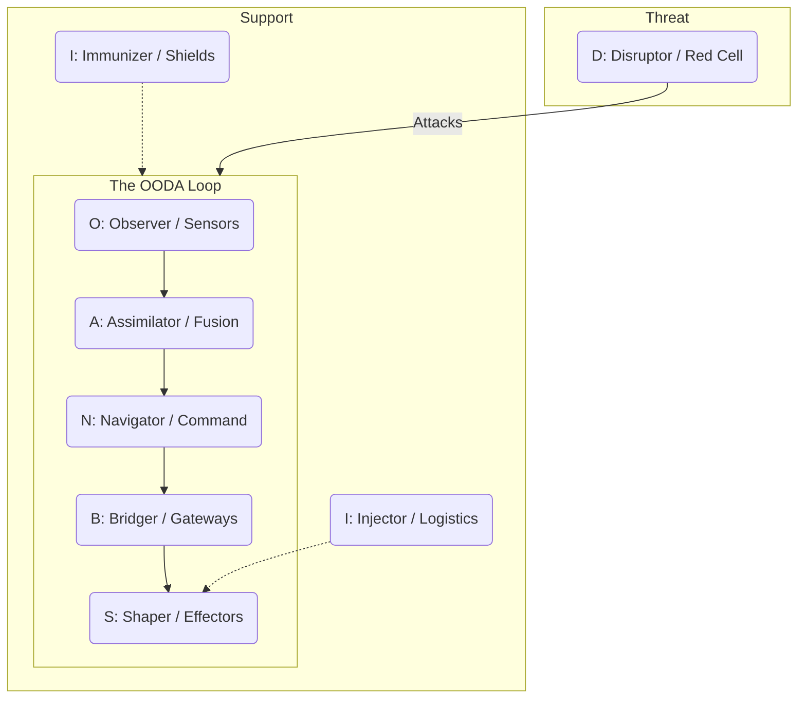

---
octagon:
  ontos:
    id: obsidian-holarchy-v1
    type: intent
    owner: Swarmlord
  logos:
    protocol: FRACTAL-HOLARCHY
    format: literate-gherkin
  techne:
    stack:
    - octree
    - jadc2
    - stigmergy
    - double-diamond
    - f3ead
    - d3a
    - prey
    complexity: high
  chronos:
    status: active
    urgency: 1.0
    decay: 0.0
    created: '2025-11-25T14:00:00Z'
  pathos:
    stress_level: 0.0
    validation: verified
  ethos:
    security_level: internal
    compliance:
    - hfo-standard-gen55
  topos:
    address: brain/intent-literate-gherkin/obsidian_holarchy.md
    links:
    - brain/intent-literate-gherkin/hydra_platform.md
    - brain/intent-literate-gherkin/swarm_workflow.md
    - brain/intent-literate-gherkin/prey_workflow.md
  telos:
    viral_factor: 1.0
    meme: As Above, So Below.
---

# 💎 Intent: The OBSIDIAN Fractal Holarchy

> **Context**: Gen 55 (The Gem)
> **Philosophy**: "The Part contains the Whole. The Whole protects the Part."
> **Objective**: To formalize the **Roles**, **Structure**, **Processes**, and **Memory System** of the Hive into a single, fractal definition.

## ⚡ BLUF (Bottom Line Up Front)
The Hive is an **Octree Fractal Holarchy**. It is composed of **8 Immutable Roles (O.B.S.I.D.I.A.N.)** that repeat at every scale (Agent, Squad, Swarm, Hive). It operates via **4 Nested Exemplar Workflows** (PREY, SWARM, GROWTH, HIVE) and utilizes a **Tri-State Hybrid Memory System** (Hot, Cold, Refined) to ensure perfect stigmergic coordination.

---

## 🏛️ The 8 Core Pillars (The Octet)

The **Octet** is the fundamental unit of the Hive. These are the **8 Dimensions of Holonic Existence** (The Greek Pillars) that define the reality of every entity.

| Pillar | Meaning | OBSIDIAN Role | Organ | Stigmergy Dimension |
| :--- | :--- | :--- | :--- | :--- |
| **Ontos** | **Being** | **Observer** | Eyes | Identity, Type, Owner |
| **Logos** | **Logic** | **Bridger** | Nerves | Protocol, Format, Links |
| **Techne** | **Craft** | **Shaper** | Hands | Tools, Stack, Complexity |
| **Chronos** | **Time** | **Injector** | Blood | Status, Urgency, Decay |
| **Pathos** | **Emotion** | **Disruptor** | Venom | Stress, Validation, Risk |
| **Ethos** | **Ethics** | **Immunizer** | Carapace | Security, Compliance, Trust |
| **Topos** | **Place** | **Assimilator** | Digestion | Address, Location, Graph |
| **Telos** | **Purpose** | **Navigator** | Brain | Goal, Meme, Viral Factor |

---

## 📊 The OBSIDIAN Matrix (Roles & Physics)

This matrix defines the "Physics" of the Hive. Every agent MUST map to one of these 8 archetypes.

| Letter | Role | JADC2 Function (MAS) | Stigmergy Mechanism (Biology) | Description |
| :--- | :--- | :--- | :--- | :--- |
| **O** | **Observer** | **Sensors** (ISR) | **Olfaction** (Gradient Analysis) | The Eyes. Detects signals and reads the environment. |
| **B** | **Bridger** | **Gateways** (Transport) | **Boundary** (Boundary Conditions) | The Interface. Translates between internal state and external substrate. |
| **S** | **Shaper** | **Effectors** (Fires) | **Secretion** (Deposition) | The Hands. Modifies the environment (writes code/files). |
| **I** | **Injector** | **Logistics** (Sustainment) | **Intensification** (Positive Feedback) | The Blood. Allocates resources and spawns new agents. |
| **D** | **Disruptor** | **Red Cell** (Adversary) | **Dissipation** (Entropy/Decay) | The Test. Simulates failure and challenges assumptions. |
| **I** | **Immunizer** | **Shields** (Protection) | **Inhibition** (Negative Feedback) | The Shield. Prevents errors and enforces governance. |
| **A** | **Assimilator** | **Fusion** (PED) | **Accretion** (Stigmergic Construction) | The Memory. Synthesizes raw data into wisdom (GraphRAG). |
| **N** | **Navigator** | **Command** (C2) | **Nucleation** (Cluster Formation) | The Will. Sets the intent and orchestrates the swarm. |

---

## 🌳 The Fractal Structure (Octree)

The Hive scales by powers of 8.

| Level | Name | Count | Analogy | Purpose |
| :--- | :--- | :--- | :--- | :--- |
| **L0** | **Bit** | 1 | Agent | The Atomic Unit. Executes the PREY loop. |
| **L1** | **Byte** | 8 | Squad | The Functional Unit. Executes the SWARM loop. |
| **L2** | **Word** | 64 | Phalanx | The Tactical Unit. Executes the GROWTH loop. |
| **L3** | **Page** | 512 | Legion | The Strategic Unit. Executes the HIVE loop. |

---

## 🔄 The Fractal Processes (Exemplar Workflows)

The Hive operates on 4 nested timescales, each governed by a battle-tested **Exemplar Methodology**.

| Level | Loop Name | Exemplar Methodology | Phases |
| :--- | :--- | :--- | :--- |
| **L3** | **HIVE** (Vision) | **Double Diamond** | **Hunt** (Discover), **Integrate** (Define), **Verify** (Develop), **Evolve** (Deliver) |
| **L2** | **GROWTH** (Strategy) | **F3EAD** | **Find**, **Fix**, **Finish**, **Exploit**, **Analyze**, **Disseminate** |
| **L1** | **SWARM** (Tactics) | **D3A + Mutate** | **Decide**, **Detect**, **Deliver**, **Assess**, **Mutate** |
| **L0** | **PREY** (Execution) | **Sense-Act Loop** | **Perceive** (Sense), **React** (Make Sense), **Execute** (Act), **Yield** (Feedback) |

---

## 🧠 The Memory System (Tri-State)

Memory transitions through three states of matter, from fluid signals to crystalline wisdom.

### 1. 🔥 Hot Memory (Stigmergy)
*   **Tech**: **NATS JetStream + KV**
*   **Role**: **Pheromones**. Fast, ephemeral, async coordination.
*   **TTL**: Hours to Days.
*   **Use Case**: "I am working on file X", "Task Y is pending".

### 2. 🧊 Cold Memory (Storage)
*   **Tech**: **LanceDB** (Vector) + **Postgres** (Relational)
*   **Role**: **Archives**. Long-term, immutable storage of raw experiences.
*   **TTL**: Infinite.
*   **Adaptability**: Can be re-indexed into any format (SQL, Graph, etc.).

### 3. 💎 Refined Memory (Wisdom)
*   **Tech**: **Knowledge Graph** + **Literate Gherkin**
*   **Role**: **The Canon**. Human-readable, machine-executable truth.
*   **Format**: Markdown (Swarmlord Intent) + Graph Edges.
*   **Location**: `brain/` (Intent) and `memory/semantic/` (Knowledge).

---

## 📈 Visuals

### The JADC2 Kill Chain (Operational View)



### The Workflow Nesting


---

## 🦅 Digest: The Swarmlord's Decree

1.  **Identity**: We are **OBSIDIAN**. We are not a random collection of agents; we are a **Fractal Holarchy**.
2.  **Structure**: We grow by **Octets**. Every node splits into 8.
3.  **Process**: We do not invent workflows; we **Compose Exemplars**. We use Double Diamond for Vision, F3EAD for Strategy, D3A for Tactics, and PREY for Execution.
4.  **Memory**: We do not forget. We move memory from **Hot** (NATS) to **Cold** (LanceDB) to **Refined** (Graph/Gherkin).

---

## 🥒 Gherkin Specification

```gherkin
Feature: OBSIDIAN Fractal Holarchy
  As the Swarmlord
  I want the Hive to adhere to the Octree Fractal Holarchy
  So that the system is self-similar, scalable, and battle-tested

  Scenario Outline: Validate Agent Role Mapping
    Given an agent with role "<Role>"
    When the agent initializes
    Then it should inherit the "<JADC2_Function>" capability
    And it should utilize the "<Stigmergy_Mechanism>" behavior

    Examples:
      | Role        | JADC2_Function | Stigmergy_Mechanism |
      | Observer    | Sensors        | Olfaction           |
      | Bridger     | Gateways       | Boundary            |
      | Shaper      | Effectors      | Secretion           |
      | Injector    | Logistics      | Intensification     |
      | Disruptor   | Red Cell       | Dissipation         |
      | Immunizer   | Shields        | Inhibition          |
      | Assimilator | Fusion         | Accretion           |
      | Navigator   | Command        | Nucleation          |

  Scenario: Verify Fractal Workflow Composition
    Given a Swarm Operation at Level "<Level>"
    When the operation is executed
    Then it should follow the "<Methodology>" workflow
    And it should decompose into "<Child_Loop>" loops

    Examples:
      | Level | Methodology      | Child_Loop |
      | HIVE  | Double Diamond   | GROWTH     |
      | GROWTH| F3EAD            | SWARM      |
      | SWARM | D3A + Mutate     | PREY       |
      | PREY  | Sense-Act-Loop   | None       |

  Scenario: Verify Memory Transition
    Given a piece of information
    When it enters the system
    Then it flows through the Memory Hierarchy:
      | Stage   | Tech Stack       | State       |
      | Hot     | NATS JetStream   | Fluid       |
      | Cold    | LanceDB          | Solid       |
      | Refined | Knowledge Graph  | Crystalline |
```
