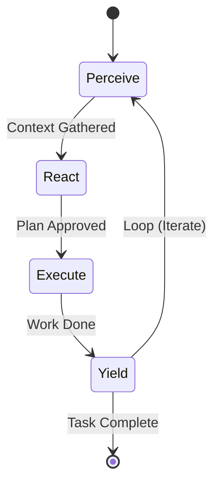
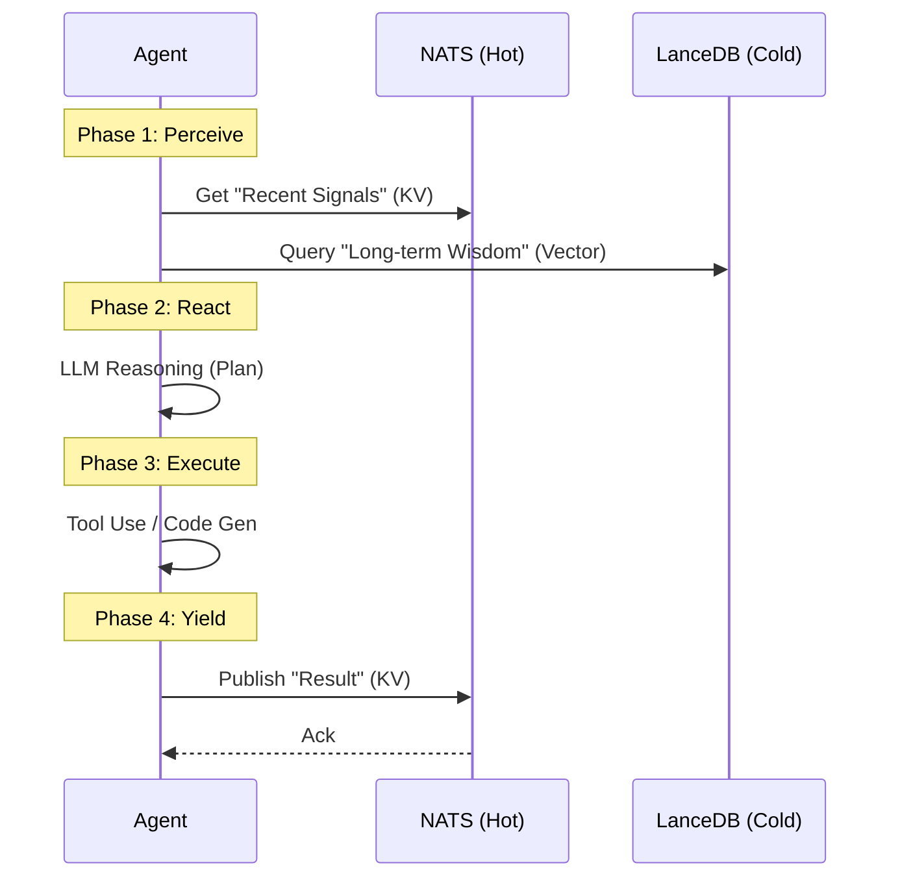

---
octagon:
  ontos:
    id: prey-workflow-v1
    type: intent
    owner: Swarmlord
  logos:
    protocol: PREY-LOOP
    format: literate-gherkin
  techne:
    stack:
    - langgraph
    - nats
    - lancedb
    complexity: low
  chronos:
    status: active
    urgency: 1.0
    decay: 0.0
    created: '2025-11-25T13:30:00Z'
  pathos:
    stress_level: 0.0
    validation: verified
  ethos:
    security_level: internal
    compliance:
    - hfo-standard-gen55
  topos:
    address: brain/intent-literate-gherkin/prey_workflow.md
    links:
    - brain/intent-literate-gherkin/swarm_workflow.md
  telos:
    viral_factor: 1.0
    meme: Perceive. React. Execute. Yield.
---

# 🦅 Intent: The PREY Workflow (Atomic Agent Loop)

> **Context**: Gen 55 (The Gem)
> **Philosophy**: "The Atom of Cognition."
> **Objective**: To define the internal cognitive loop of a single agent, ensuring consistent behavior regardless of role.

## ⚡ BLUF (Bottom Line Up Front)
The **PREY Loop** (Perceive-React-Execute-Yield) is the atomic unit of work in the Hive. Every agent, from the Swarmlord to the humblest Shaper, runs this internal cycle. It is designed to be **Iterative** and **Stigmergic**, using Hybrid Memory (Hot NATS -> Cold LanceDB) to maintain context across steps.

---

## 📊 The PREY Matrix

| Phase | Mnemonic | Action | Input | Output | Hybrid Memory Role |
| :--- | :--- | :--- | :--- | :--- | :--- |
| **1** | **P**erceive | **Gather Context** | Task + Environment | Context Object | **Read**: Query Hot NATS & Cold LanceDB. |
| **2** | **R**eact | **Plan & Decide** | Context Object | Plan / Strategy | **Think**: Internal reasoning (LLM). |
| **3** | **E**xecute | **Do Work** | Plan | Artifact / Result | **Write**: Generate content (in-memory). |
| **4** | **Y**ield | **Share & Reflect** | Artifact | Stigmergy Signal | **Publish**: Write to Hot NATS (KV). |

---

## 📈 Visuals (The Loop)

### View 1: The PREY State Machine (LangGraph)



### View 2: The Hybrid Memory Interaction (Sequence)



---

## 🦅 Executive Digest

### The Atomic Unit
Just as the **Fractal Funnel** (1-8-64-8-1) organizes the *Swarm*, the **PREY Loop** organizes the *Agent*. It ensures that no agent ever acts without first perceiving, and no agent ever finishes without yielding a result to the collective.

### The 4 Iterative Options
We support 4 variations of the PREY loop depending on the agent's role:

1.  **The Reflexive Loop (Bridger)**: Fast P-R-E-Y. Minimal reasoning, high speed. Used for monitoring and routing.
2.  **The Deep Thought Loop (Shaper)**: Heavy React phase. Uses "Chain of Thought" or "Tree of Thoughts" before executing.
3.  **The Critic Loop (Reviewer)**: The "Execute" phase is a validation step. The "Yield" phase includes a Confidence Score.
4.  **The Learning Loop (Assimilator)**: The "Perceive" phase is a subscription to NATS. The "Execute" phase is writing to LanceDB.

---

## 📜 Declarative Intent (Gherkin)

```gherkin
@gen55 @workflow @canonical
Feature: The PREY Workflow (Atomic Agent Loop)
  As the Swarmlord
  I want a standardized internal loop for all agents
  So that I can ensure consistent behavior and stigmergic communication

  Background:
    Given the context is "Gen 55 (The Gem)"
    And the pattern is "Perceive-React-Execute-Yield"

  Scenario: The Standard PREY Loop
    The agent must follow the 4-step cycle.

    Given an agent is active

    # Phase 1: Perceive
    When it enters the "Perceive" phase
    Then it shall query "Hot NATS" for recent signals
    And it shall query "Cold LanceDB" for relevant wisdom
    And it shall construct a "Context Object"

    # Phase 2: React
    When it enters the "React" phase
    Then it shall analyze the Context
    And it shall formulate a "Plan" or "Strategy"
    And it shall select the appropriate "Tools"

    # Phase 3: Execute
    When it enters the "Execute" phase
    Then it shall execute the Plan using the selected Tools
    And it shall generate an "Artifact" or "Result"

    # Phase 4: Yield
    When it enters the "Yield" phase
    Then it shall publish the Result to "Hot NATS" (KV)
    And it shall emit a "Stigmergy Signal"
    And it shall decide whether to "Loop" or "Terminate"

  Scenario Outline: Role-Based Variations
    The loop adapts to the agent's role.

    Given the agent role is "<Role>"
    Then the "<Phase>" phase shall be optimized for "<Optimization>"

    Examples:
      | Role        | Phase   | Optimization      |
      | Bridger     | React   | Speed (Reflex)    |
      | Shaper      | React   | Depth (Reasoning) |
      | Reviewer    | Execute | Validation        |
      | Assimilator | Perceive| Subscription      |
```
