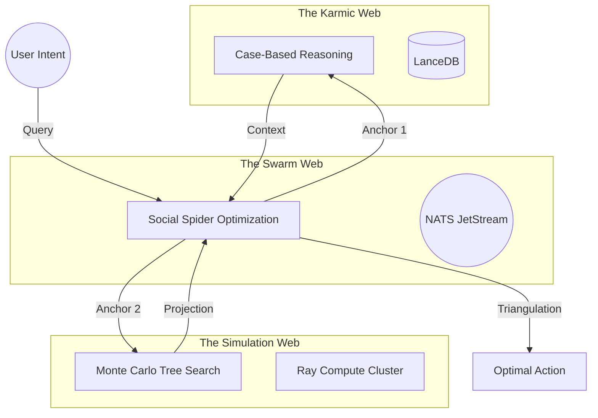
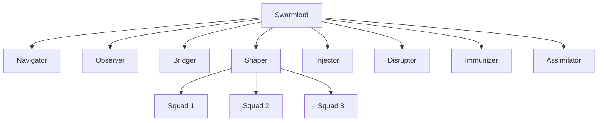

---
hexagon:
  ontos:
    id: hfo-gen-60-arch-digest
    type: md
    owner: Swarmlord
  chronos:
    status: active
    urgency: 1.0
    decay: 0.1
    created: '2025-11-29T08:00:00Z'
    generation: 60
  topos:
    address: buds/hfo_gem_gen_60/brain/Swarmlord_of_Webs_Digest_Gen60_Architecture.md
    links: []
  telos:
    viral_factor: 1.0
    meme: The Obsidian Spider Architecture
---

# 🕷️ Swarmlord of Webs Digest: Gen 60 Architecture

**Date**: 2025-11-29
**Executive Summary**: HFO Gen 60 ("The Obsidian Spider") represents a paradigm shift from hierarchical control to a **Hexagonal Hidden Byzantine Swarm**. By anchoring in **0 Invention** principles, the system unifies SOTA research (MCTS, CBR, SSO) into a single **Fractal Octree** architecture. The core innovation is **Aggressive Apex Assimilation** via a "Hydra Mouth" (Septate Junction) that allows for infinite ingestion and **Biomimetic Antifragility** (Budding/Regeneration) to ensure survival.

## 📊 Stats
- **Generation**: 60 (Gemmation Phase)
- **Architecture**: Fractal Octree ($8^N$)
- **Consensus Model**: Holonic Byzantine Quorum (f=3)
- **Evolution Strategy**: Cleanroom Genesis + Phoenix Protocol

## 🌐 Core Architectural Pillars

### 1. 🕸️ Hexagonal Hidden Byzantine Swarm
The system is composed of loosely coupled **Holons** wrapped in **Hexagonal Stigmergy Headers**.
*   **Hexagonal**: Ports & Adapters pattern applied to metaphysics (Ontos, Chronos, Topos, Telos).
*   **Hidden**: Complexity is abstracted behind the **Stigmergy Layer** (NATS). Agents interact with the *Web*, not each other.
*   **Byzantine**: Assumes adversarial conditions. Truth is established via **Quorum** (Consensus of 3+ Agents).

### 2. ⏳ The Obsidian Hourglass (The Algorithm)
A hybrid metaheuristic that triangulates movement in State-Action Space.

### 3. 🦠 Biomimetic Antifragility (The Hydra)
The system evolves through **Gemmation (Budding)** and **Regeneration**.
*   **Budding**: New features grow in isolation (`buds/`) and detach when viable.
*   **Stem Cells**: Every organ has a genetic backup (Gherkin).
*   **Phoenix Protocol**: If code drifts, it is burned and regenerated from the Intent.

### 4. 🕷️ Aggressive Apex Assimilation
The **Assimilator** organ acts as a "Septate Junction" (Mouth).
*   **Ingest**: Accepts ANY input (Code, Text, Logs).
*   **Digest**: Breaks down into "Hot" (Episodic) and "Cold" (Semantic) memory.
*   **Synthesize**: Recombines into new "Gems" (Insights).

## 💎 SOTA Equivalents (The Traversal)
Our memory traversal identified the following industry standards that we have assimilated:
1.  **Recursive Reduction**: Matches **Map-Reduce** and **Hierarchical RL**.
2.  **Multi-Layered Stigmergy**: Matches **Blackboard Systems** and **Tuple Spaces**.
3.  **LangGraph State Machines**: Matches **OODA Loops** and **ReAct**.

## 🗺️ The Fractal Octree (Structure)
The $8^N$ scaling pattern ensures that the Swarmlord (Root) is structurally identical to the Squad (Leaf).

> **Directive**: Proceed with the **Neural Graft** to migrate the physical implementation of these pillars into the Bud.
