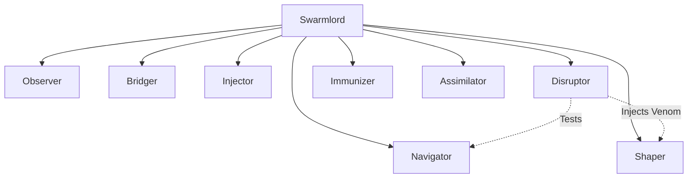

---
hexagon:
  ontos:
    id: hfo-gen-60-design-snapshot
    type: design
    owner: Swarmlord
  chronos:
    status: active
    urgency: 1.0
    decay: 0.0
    created: '2025-11-29T09:30:00Z'
    generation: 60
  topos:
    address: buds/hfo_gem_gen_60/brain/design_hfo_gen60_snapshot.md
    links: []
  telos:
    viral_factor: 1.0
    meme: The Obsidian Spider Architecture
---

# 🕷️ HFO Gen 60: The Obsidian Spider (Architecture Snapshot)

> **Status**: Canonical
> **Context**: Gen 60 (The Gem)
> **Philosophy**: "Intent drives Implementation. The Need defines the Organ."
> **Mnemonic**: **P.L.A.T.F.O.R.M.** (The Hydra Stack)

## ⚡ Executive Summary
Hive Fleet Obsidian (HFO) Gen 60 is a **Fractal Holarchy**. It is a "0 Invention" system that unifies SOTA research into a single fractal architecture based on the **HYDRA** and **PHOENIX** projects. The core innovation is the **Hidden Byzantine** mechanism—not hiding complexity, but actively injecting disruption to ensure antifragility.

## 🌐 The 4 Core Configurations (The Essence)

### 1. 🕸️ The Fractal Holarchy (The Octet)
*   **Concept**: A **Holonic Hierarchy** where every part is a whole. The basis is the **Octet (8)**.
*   **Hidden Byzantine**: A built-in **Co-evolutionary Pressure** mechanism.
    *   **The Mechanism**: We hide a **Disruptor (Venom)** among the honest workers during the loop.
    *   **The Reveal**: At the end of the loop, the Disruptor is revealed to stress-test the system's resilience.
    *   **The Math**: $N = 3f + 1$.
    *   **The Octet**: With $N=8$, we can tolerate $f=2$ failures ($3(2)+1 = 7 \le 8$).
    *   **The Trap**: We inject **1 Hidden Disruptor** (taking 1 of the 2 tolerance slots).
    *   **The Guarantee**: HFO is built to tolerate **2/8 (1/4)** disruptors. Since 1 slot is always taken by our injected disruptor, HFO will always tolerate **1/8 malicious actors** (impersonators).
    *   **Future**: Once the **Reputation System** is online, effective tolerance will likely increase.
*   **Structure**: The system scales via $8^N$.

### 2. 🐉 The HYDRA PLATFORM (Tech Stack)
The implementation of the Swarm follows the **P.L.A.T.F.O.R.M.** mnemonic:
*   **P**ydantic: The DNA (Schema/Validation).
*   **L**anceDB: The Memory (Vector/Karmic Web).
*   **A**gent Logic (LangGraph): The Brain (State Machines).
*   **T**emporal: The Nervous System (Orchestration/Durable Execution).
*   **F**eature Flags (OpenFeature): The Genes (Configuration).
*   **O**bservability (OpenTelemetry): The Eyes (Tracing).
*   **R**ay: The Muscle (Distributed Compute).
*   **M**essaging (NATS): The Pheromones (Stigmergy).

### 3. ⏳ The Obsidian Hourglass (Algorithm)
A hybrid metaheuristic that triangulates movement in State-Action Space.
*   **Triangulation**: The "Spider Gait" anchors 3 legs to move:
    1.  **Past (CBR)**: What worked before? (LanceDB)
    2.  **Future (MCTS)**: What might happen? (Ray Simulation)
    3.  **Present (SSO)**: What are others doing? (NATS Stigmergy)
*   **Social Spider Optimization (SSO)**: The Bridger Oracle will evolve from simple Cosine Similarity to a **Social Spider Algorithm**.
    *   *Concept*: Information is not just retrieved; it is "vibrated" across the web. Agents move towards strong vibration sources (High Confidence/Relevance) and dampen weak ones (Hallucinations).
*   **Latent Space Navigation**: Finding the optimal path via **Latent Space Interpolation** (Manifold Traversal).

### 4. 🦠 Cleanroom Genesis (Intent vs. Implementation)
*   **Philosophy**: **Intent First**. The Swarmlord (User) writes **Gherkin** (Intent). The System generates **Code** (Implementation).
*   **No Babysitting**: The user guides the process via Intent; the system handles the "How".
*   **Phoenix Protocol**: If the implementation drifts from the Intent, it is burned and regenerated.

## 🗺️ The Fractal Octree (Structure)
The $8^N$ scaling pattern ensures that the Swarmlord (Root) is structurally identical to the Squad (Leaf).

> **Directive**: Proceed with the **Neural Graft** to migrate the physical implementation of these pillars into the Bud, strictly following the **Intent First** protocol.
