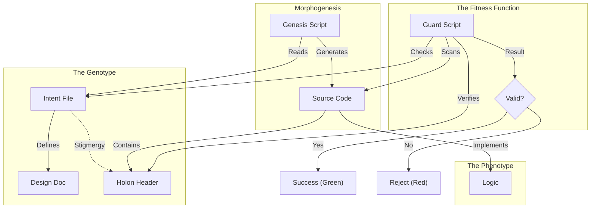

---
holon:
  id: swarmlord-digest-evo-devo
  type: digest
  status: active
  author: Swarmlord
  date: 2025-12-01
  context: HFO Gen 63
---

# 🕷️ Swarmlord Digest: The Evo-Devo Digital Twin

> **Context**: Gen 63 "The Iron Garden"
> **Topic**: Completion of the Stigmergic Canalization Architecture.

## ⚡ BLUF (Bottom Line Up Front)
We have successfully transitioned from a "Wild Garden" (Unstructured Code) to an **"Iron Garden" (Evo-Devo Protocol)**.
We can now mathematically guarantee that **every piece of code (Phenotype) has a corresponding Intent (Genotype)**.
The System is no longer just a collection of scripts; it is a **Digital Twin** where the Code is a projection of the Brain.

---

## 🏛️ The Matrix: Old vs. New

| Feature | 🕸️ Old Way (Wild Garden) | 🧬 New Way (Evo-Devo) |
| :--- | :--- | :--- |
| **Creation** | Manual file creation (`touch file.py`). | **Genesis Tool** (`genesis.py`). |
| **Validation** | "Looks good to me" (Human Review). | **Fitness Function** (`guard.py`). |
| **Linkage** | Implicit / Mental Model. | **Explicit** (YAML Headers). |
| **Drift** | High (Code diverges from Intent). | **Zero** (Guard fails if link breaks). |
| **Philosophy** | "Move fast and break things." | **"Correctness by Construction."** |

---

## 🧜‍♀️ The Flow (Mermaid)

---

## 🛠️ Tool Tips (How to Drive)

### 1. The Seed (Create Intent)
*   **Command**: `python3 buds/hfo_gem_gen_63/forge/genesis.py intent "My New Feature"`
*   **What it does**: Creates a Gherkin/Markdown file in `brain/1_projects/`.
*   **Why**: This is the DNA. Without this, nothing lives.

### 2. The Growth (Create Code)
*   **Command**: `python3 buds/hfo_gem_gen_63/forge/genesis.py impl "MyFeature" "intent-my_new_feature"`
*   **What it does**: Generates `src/my_feature.py` with the correct Header linking to the Intent.
*   **Why**: This ensures the Body is attached to the Head.

### 3. The Checkup (Run Fitness)
*   **Command**: `python3 buds/hfo_gem_gen_63/venom/check_fitness.py`
*   **What it does**: Scans the entire organism for "Cancer" (Orphaned Code).
*   **Why**: Run this before every commit to ensure the Hive is healthy.

---

## 📜 Executive Summary Digest

We have solved the **"Hallucination Death Spiral"** problem where AI Agents generate code that drifts away from the original architecture.

By implementing **Stigmergic Canalization**, we have constrained the "Action Space" of the Swarm.
1.  **Canalization**: The `genesis.py` tool acts as a "Canal". It is easier for an Agent to flow down the canal (use the tool) than to climb over the walls (write raw files).
2.  **Stigmergy**: The `HolonHeader` acts as the "Pheromone". It tells the Guard exactly where each piece of code belongs and what it is supposed to do.
3.  **Fitness**: The `check_fitness.py` script acts as the "Immune System". It ruthlessly identifies and flags any component that violates the biological laws of the Hive.

**Status**: **READY FOR DEPLOYMENT**.
The scaffolding is solid. We can now begin migrating the 100GB Legacy Memory into this new structure with confidence that it will not rot.
