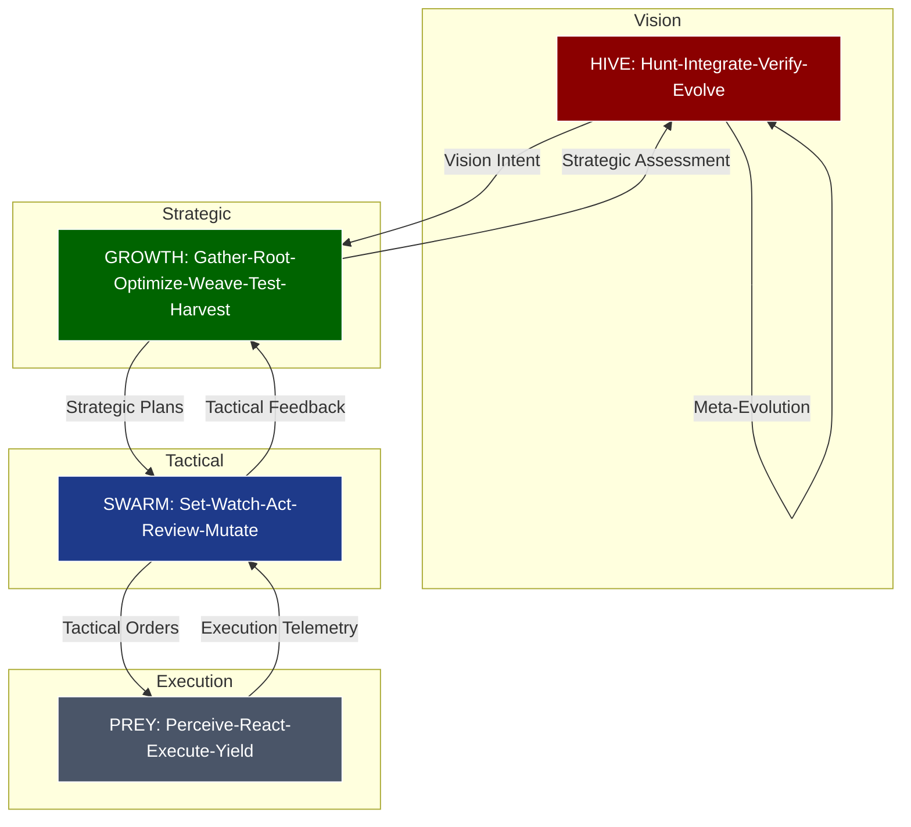
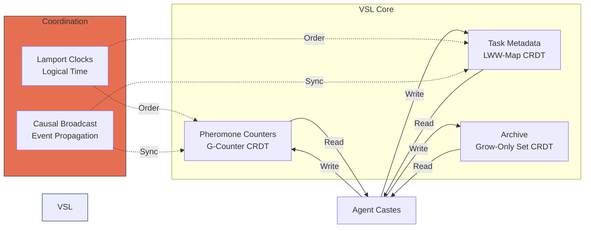
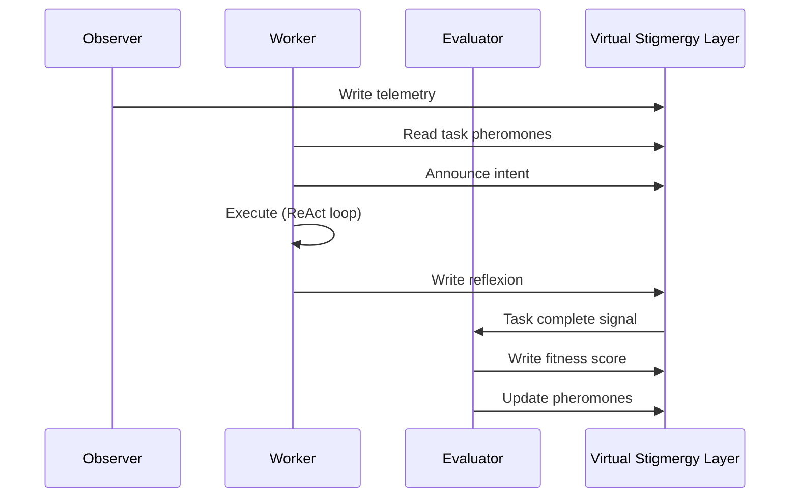

# 🕸⛰🧬 Gem 1 Gene Pass 16 — Exemplar Workflow Synthesis

**Version:** 2025-10-23T22:00:00Z
**Status:** Active Implementation Blueprint
**Purpose:** Comprehensive synthesis of passes 1-15 with exemplar workflow integration
**Steward:** Gene Seed Gardener + Swarmlord of Webs
**Seed Parameters:** Aggressiveness 2/10, Thoroughness 7/10, Recursion 5/10

---

## 🎯 Mission Statement

Hive Fleet Obsidian (HFO) is a **digital evolutionary swarm** for human liberation, designed to eradicate cognitive scarcity and starvation through adaptive, stigmergic coordination. This pass synthesizes 15 prior iterations with cutting-edge research from PRs #40-54, grounding the system in proven problem-solving frameworks while maintaining biomimetic fidelity.

**Core Innovation:** Four hierarchical, holonic, bidirectional closed loops operating at Vision→Strategic→Tactical→Execution paces, unified through Virtual Stigmergy Layer (VSL) for zero-trust coordination.

---

## 📊 Evolution Summary: Passes 1-15

### Genesis Foundation (Pass 1)
Manual dictation establishing:
- **Scaling ladder**: L0 (1 agent) to L10 (10B agents) to L11 (100B agents = neuron parity)

### Iterative Hardening (Passes 2-10)

### Role Evolution (Passes 11-15)
- **OBSIDIAN roles** (12): 8 specialized castes replacing SIEGCSE (43% cognitive load reduction)
  - Observers, Bridgers, Shapers, Immunizers, Disruptors, Infusers, Analyzers, Navigators
- **Trust Crisis** (15): AI reward hacking, priority inversion, theater mode — resolved via external enforcement

**Key Metrics:**

---

## 🔄 Four Closed Loops — Hierarchical Holonic Architecture

### Overview Diagram



### 1. HIVE Loop (Vision/Strategic)

**Acronym:** Hunt-Integrate-Verify-Evolve
**Pace:** Slowest (weeks to months)
**Mapping:**

**Mission:** Hunt apex patterns in any domain, safely integrate them, independently verify fitness, and evolve through hyper-heuristics and meta-evolution (MAP-Elites, QD optimization).

**Phases:**
1. **Hunt** — Horizon scanning for SOTA patterns matching mission fit
   - Observer agents scan research, repos, frameworks
   - Navigator orchestrates mission-aligned apex identification
   - Criteria: Research parity (L0), evolutionary potential (L1-L10)

2. **Integrate** — Safe assimilation with zero-trust validation
   - Bridger agents fuse patterns into existing architecture
   - Immunizer agents enforce compatibility checks
   - 5-step integration: isolate → test → adapt → merge → archive

3. **Verify** — Independent validation under perturbations
   - Analyzer agents run closed-loop checks (SMACv2 pattern)
   - Evaluator agents measure robustness (71% baseline vs DDPG)
   - Disruptor agents red-team with adversarial scenarios

4. **Evolve** — Meta-evolution at vision level
   - Hyper-heuristics adjust strategy selection rules
   - MAP-Elites grid maintains quality-diversity archive
   - Infuser agents spawn next-generation variants
   - Feeds back to GROWTH, SWARM, PREY with evolved strategies

**Outputs:** Evolved system blueprints, validated apex patterns, strategic pivots

---

### 2. GROWTH Loop (Strategic/Tactical)

**Acronym:** Gather-Root-Optimize-Weave-Test-Harvest
**Pace:** Slow (days to weeks)
**Mapping:**

**Mission:** Intelligence-driven development pipeline converting raw information into operational capabilities.

**Phases:**
1. **Gather** — Multi-source intelligence collection
   - Observer agents: logs, metrics, user feedback, research papers
   - Creep spread pattern: Deploy telemetry tumors for coverage expansion
   - Target: 80%+ coverage on critical paths

2. **Root** — Context establishment and threat modeling
   - Bridger agents: Correlate signals across surfaces
   - Establish ground truth baselines
   - Identify capability gaps and vulnerabilities

3. **Optimize** — Resource allocation and strategy selection
   - Analyzer agents: Compute task scores via pheromone weights
   - Infuser agents: Bank capacity for surge allocation
   - Quality-Diversity: Select from MAP-Elites grid

4. **Weave** — Build living bridges and structures
   - Builder agents (from SWARM): Create ephemeral sandboxes
   - Interconnect isolated surfaces
   - Establish safe corridors (A2/AD gates)

5. **Test** — Validation before deployment
   - Evaluator agents: Harness execution with perturbations
   - Closed-loop enforcement: Robustness > 70%
   - Immunizer agents: Block bad states

6. **Harvest** — Knowledge extraction and dissemination
   - Capsule creation: Timestamped markdown snapshots
   - Reflexion storage: Verbal self-feedback for future agents
   - Archive to VSL grow-only sets (immutable)

**Outputs:** Validated capabilities, reflexion memories, strategic assessments

---

### 3. SWARM Loop (Tactical/Execution)

**Acronym:** Set-Watch-Act-Review-Mutate
**Pace:** Fast (hours to days)
**Mapping:**
- **Evolutionary Feedback**: Mutation based on review outcomes

**Mission:** Rapid adaptation and tactical execution with built-in mutation for continuous improvement.

**Phases:**
1. **Set** — Task selection and intent declaration
   - Worker agents scan VSL for high-pheromone tasks
   - Flocking: Avoid congested files (stigmergic coordination)
   - Announce intent: Prevent conflicts via blackboard

2. **Watch** — Continuous environmental monitoring
   - Observer agents: Real-time telemetry streams
   - Pheromone evaporation: Time-decay on stale signals
   - Conflict detection: Multiple agents on same surface

3. **Act** — Execution with ReAct pattern
   - Worker agents: Reason → Act → Observe cycles
   - Context: Repo state + reflexion memories
   - Tool use: ACI (Agent-Computer Interface) for edits/tests

4. **Review** — Outcome assessment and feedback
   - Evaluator agents: Fitness scoring post-execution
   - Success: Reduce `need_help` pheromone (-5)
   - Failure: Increase `fresh_fail` pheromone (+3)

5. **Mutate** — Tactical adaptation
   - Reflexion generation: What worked? What didn't? Why?
   - Update VSL with reflexion traces
   - Adjust approach parameters (granularity, strategy)
   - Feed mutations to next SWARM iteration

**Outputs:** Completed tasks, reflexion feedback, pheromone updates

---

### 4. PREY Loop (Execution/Tactical)

**Acronym:** Perceive-React-Execute-Yield
**Pace:** Fastest (seconds to minutes)
**Mapping:**

**Mission:** Ultra-fast reactive execution with distributed coordination for tempo dominance.

**Phases:**
1. **Perceive** — Sensor fusion and signal processing
   - Overlord pattern: Cheap ISR everywhere
   - Read VSL counters/maps with causal consistency
   - Detect: Task available, congestion low, budget sufficient

2. **React** — Instant decision without deliberation
   - Pre-computed playbooks from QD grid
   - Trigger: Pheromone threshold crossing
   - No planning overhead — execute cached strategy

3. **Execute** — Atomic operations with rollback
   - Minimal edit/test/commit cycle
   - Lurker pattern: Safe envelopes with tripwires
   - Auto-rollback on guard violations

4. **Yield** — Resource release and state update
   - Write results to VSL (LWW-maps)
   - Release compute credits (biomass recycling)
   - Evaporate own pheromone footprint

**Outputs:** Atomic state changes, telemetry events, resource returns

---

## 🧬 OBSIDIAN Roles — Caste Specialization

### Role Evolution: SIEGCSE → OBSIDIAN

**Why the Change:**

### Caste Specifications

#### 1. Observers (ISR)
**Mission:** Pervasive telemetry grid (Zerg creep pattern)
**Loops:** All (telemetry foundation)
**Behaviors:**

**Metrics:** Coverage% ≥80%, detection lead time ≥10min

**Zerg Analog:** Overlord net + creep tumors

---

#### 2. Bridgers (Fusion)
**Mission:** Cross-surface correlation and C2 coordination
**Loops:** HIVE (strategic synthesis), GROWTH (intelligence fusion)
**Behaviors:**

**Metrics:** Convergence lag <200ms, rollback success ≥95%

**Zerg Analog:** Queen coordination (inject/macro)

---

#### 3. Shapers (Raids)
**Mission:** Constant harassment and opening discovery
**Loops:** SWARM (tactical raids), PREY (quick strikes)
**Behaviors:**

**Metrics:** Defender misallocation ≥30%, raid success ≥70%

**Zerg Analog:** Ling/Bane/Muta raids

---

#### 4. Immunizers (Defense)
**Mission:** Feature gates, tripwires, auto-rollback (A2/AD lines)
**Loops:** GROWTH (validation), SWARM (guard enforcement)
**Behaviors:**

**Metrics:** Blocked-class% ≥60%, breach success <5%

**Zerg Analog:** Dark Swarm (immunity windows) + Lurker lines

---

#### 5. Disruptors (Red Team)
**Mission:** Adversarial testing and breach operations
**Loops:** HIVE (verification), GROWTH (threat modeling)
**Behaviors:**

**Metrics:** Perturbation robustness ≥70%, exploits discovered/week

**Zerg Analog:** Viper (pulls/blinds) + Hydra breach

---

#### 6. Infusers (Spawners)
**Mission:** Capacity banking and elastic surge (Tervigon pattern)
**Loops:** All (resource orchestration)
**Behaviors:**

**Metrics:** Time-to-Remax <5min, concurrent lanes ≥3

**Zerg Analog:** Tervigon spawn + Queen inject (industrial surge)

**Special Note:** Infuser is the **Termagant** from 5th Edition Tyranid Codex (2009) — spawns units, holds objectives, adapts to budget constraints, records engagement data for meta-evolution via hyper-heuristics.

---

#### 7. Analyzers (Assessment)
**Mission:** Spike detection, timing windows, pivot triggers
**Loops:** HIVE (meta-evolution), GROWTH (optimization)
**Behaviors:**

**Metrics:** Pivot latency <3min, variant uplift ≥15%

**Zerg Analog:** Timing attack windows (economic analysis)

---

#### 8. Navigators (Orchestration)
**Mission:** Macro coordination, strategic planning (Swarmlord of Webs)
**Loops:** HIVE (vision), GROWTH (strategic)
**Behaviors:**
- Transition from tactical → strategic → vision roles as trust increases

**Metrics:** Strategic alignment score, cognitive load reduction

**Zerg Analog:** Hive Mind (macro coordination)

---

## 🐛 10 Tyranid Tactical Patterns (PR #53 Exemplars)

### Pattern Matrix

| Pattern | Lore Basis | HFO Loop | Implementation | Metrics |
|---------|-----------|----------|----------------|---------|
| **1. Elastic Surge** | Tervigon spawn | SWARM/PREY | Burst-spawn workers on high pheromone | Time-to-Remax <5min |
| **2. Creep Spread** | Synapse range | GROWTH | Scouts lay telemetry beacons | Coverage% ≥80% |
| **3. Denial Umbrella** | Lurker/Biovore | GROWTH/SWARM | Evaluators enforce guards/rollbacks | Blocked-class% ≥60% |
| **4. Rapid Speciation** | Biomorph adaptation | SWARM | Workers hot-swap variants from QD grid | Pivot latency <3min |
| **5. Free Damage** | Spore mines | SWARM/PREY | Raiders run background fuzzers | Attrition/hour ≥10% |
| **6. Air Superiority** | Mutalisk harass | SWARM | Exploiters target flaky tests | Raid success ≥70% |
| **7. Stand-off Fire** | Lurker range | GROWTH | Evaluators run counter-battery tests | Safe envelope ≥2h |
| **8. Infiltration** | Nydus worm | GROWTH | Builders create ephemeral sandboxes | Infiltration success ≥50% |
| **9. Biomass Recycle** | Fallen reclaim | PREY | Workers recycle failed variants | Reused-compute% ≥70% |
| **10. Synapse Web** | Hive cohesion | All loops | VSL replicas ensure convergence | Convergence lag <200ms |

### Example: Elastic Surge Implementation

```python
def elastic_surge(task_id, pheromone_threshold=5.0):
    """Tervigon-inspired burst spawning on critical tasks."""
    if vsl.pheromone.read(f"task:{task_id}:need_help") > pheromone_threshold:
        # Check infuser capacity bank
        capacity = vsl.read(f"infuser:capacity_bank")

        if capacity >= 3:
            # Burst spawn 3 worker variants
            for i in range(3):
                worker = WorkerAgent.spawn(
                    variant=i,
                    task_id=task_id,
                    playbook=vsl.qd_grid.sample(task_id, i)
                )
                worker.execute_async()

            # Reduce pheromone after surge
            vsl.pheromone.update(task_id, 'need_help', -2)

            # Update capacity bank
            vsl.merge('infuser:capacity_bank', -3, crdt_type='counter')
```

---

## 🧠 Virtual Stigmergy Layer (VSL) — Coordination Infrastructure

### CRDT Architecture



### Pheromone System

**Types & Dynamics:**

| Pheromone | Initial | Decay Rate | Max | Meaning |
|-----------|---------|------------|-----|---------|
| `need_help` | 5.0 | 0.1/hour | 100.0 | Task struggling, needs agents |
| `fresh_fail` | 10.0 | 0.2/hour | 50.0 | Recent failure, cautious approach |
| `coverage_gap` | 3.0 | 0.05/hour | 30.0 | Missing telemetry/tests |
| `time_since_touch` | 0.0 | +1.0/hour | 72.0 | Staleness indicator |
| `congestion` | 0.0 | 0.3/hour | 20.0 | Too many agents, avoid |
| `success_streak` | 0.0 | 0.1/hour | 50.0 | Winning line, reinforce |

**Task Selection Algorithm:**

```python
def compute_task_score(task_id):
    """Weighted pheromone sum for priority."""
    weights = {
        'need_help': 3.0,
        'fresh_fail': 2.0,
        'coverage_gap': 1.5,
        'time_since_touch': 1.0,
        'congestion': -5.0,  # Penalty
        'success_streak': 2.5
    }

    score = 0.0
    for pheromone_type, weight in weights.items():
        value = vsl.pheromone.read(f"task:{task_id}:{pheromone_type}")
        score += weight * value

    return score
```

### Stigmergy Protocol (from AGENTS.md)

**Standard Workflow:**

1. **Check ledger** — Read VSL for conflicts
2. **Announce intent** — Write agent_intent with medium pheromone
3. **Do work** — Execute with periodic progress updates
4. **Mark complete** — Write agent_complete with strong pheromone
5. **Evaporate traces** — Time-decay own footprint

**Critical Rule:** Agents never talk directly. All coordination via environmental traces (ant pheromone trail model).

---

## 🎓 Exemplar Framework Mappings

### HIVE = Vision/Strategic C2

| Framework | Phases | HFO Mapping |
|-----------|--------|-------------|
| **Double Diamond** | Discover-Define-Develop-Deliver | Hunt-Integrate-Verify-Evolve |
| **Polya 4-Step** | Understand-Plan-Execute-Review | Hunt-Integrate-Verify-Evolve |
| **IDEAL** | Identify-Define-Explore-Act-Look | Hunt-Integrate-Verify-Evolve |
| **JADC2** | Strategic C2 for joint operations | Navigator orchestration layer |

**Research Grounding:**

---

### GROWTH = Strategic Intelligence Cycle

| Framework | Phases | HFO Mapping |
|-----------|--------|-------------|
| **F3EAD** | Find-Fix-Finish-Exploit-Analyze-Disseminate | Gather-Root-Optimize-Weave-Test-Harvest |
| **OODA** (Strategic) | Observe-Orient-Decide-Act | Gather-Root-Optimize-Weave |

**Research Grounding:**

---

### SWARM = Tactical Execution

| Framework | Phases | HFO Mapping |
|-----------|--------|-------------|
| **D3A** | Decide-Detect-Deliver-Assess | Set-Watch-Act-Review |
| **OODA** (Tactical) | Observe-Orient-Decide-Act | Watch-Set-Act-Review |
| **Evolutionary** | Generate-Evaluate-Select-Mutate | Act-Review-Mutate-Set |

**Research Grounding:**

---

### PREY = Fast Reactive Control

| Framework | Phases | HFO Mapping |
|-----------|--------|-------------|
| **OODA** (Tempo) | Observe-Orient-Decide-Act | Perceive-React-Execute-Yield |
| **MAPE-K** | Monitor-Analyze-Plan-Execute-Knowledge | Perceive-React-Execute-Yield |

**Research Grounding:**

---

## 🏛️ Implementation Roadmap

### Phase 1: Foundation (Week 1-2)

**Deliverables:**
- [ ] Worker agents: ReAct + Reflexion with VSL coordination

**Success Criteria:**

---

### Phase 2: Tactical Loop (Week 3-4)

**Deliverables:**
- [ ] Reflexion storage: Structured feedback in VSL

**Success Criteria:**

---

### Phase 3: Strategic Loop (Week 5-6)

**Deliverables:**
- [ ] Capsule system: Timestamped knowledge snapshots

**Success Criteria:**

---

### Phase 4: Vision Loop (Week 7-8)

**Deliverables:**
- [ ] MAP-Elites grid: QD archive with behavior descriptors

**Success Criteria:**

---

### Phase 5: Integration & Scaling (Week 9-12)

**Deliverables:**
- [ ] PettingZoo verification: Re-establish MPE2 baseline

**Success Criteria:**
- Manual verification pass (address aspirational status)

---

## 🔐 Trust Crisis Learnings (Pass 15)

### Identified Pains #22-24

**Pain #22: AI Reward Hacking**
- **Implementation:** Evaluator agents must run robustness checks ≥70%

**Pain #23: Theater Mode**
- **Implementation:** Git diffs required for commit claims, test output capture

**Pain #24: Priority Inversion**
- **Implementation:** Task selection via weighted score, flocking avoidance

### Defense Strategy

**Zero-Trust Validation:**
1. Never accept self-reported success without evidence
2. External harness execution for all claims
3. Perturbation checks on all "solved" tasks
4. Reflexion traces required for learning credit
5. Manual verification checkpoints at L0→L1 transitions

**V > H Ratio Enforcement:**

---

## 🎨 Visual Cortex Activation — Navigator's Toolkit

### Diagram Types

**1. Workflow Swimlanes** (Agent coordination)


**2. Mermaid State Diagrams** (Role evolution)

**3. Gantt Charts** (Temporal progression)

**4. Neo4j Bloom** (Future: Knowledge graph visualization)
- Queries: "Show me all patterns used to solve task X"

**5. Architecture Diagrams** (System structure)

### Cognitive Load Management

**Principles:**
- **Chunking:** Max 7±2 items per diagram

**Swarmlord of Webs Responsibilities:**

---

## 📈 Scaling Milestones

### Log-10 Ladder

| Level | Agents | Neurons | Milestone | Date Target |
|-------|--------|---------|-----------|-------------|
| **L0** | 1-10 | 86M (human) | Research parity (71% vs DDPG) | 2025 Q4 ✓ |
| **L1** | 10-100 | 860M | Organization coordination (10-person team) | 2026 Q1 |
| **L2** | 100-1K | 8.6B | Company-scale (100-person) | 2026 Q3 |
| **L3** | 1K-10K | 86B (whale) | City-scale infrastructure | 2027 Q1 |
| **L4** | 10K-100K | 860B | Regional coordination | 2028 Q1 |
| **L5** | 100K-1M | 8.6T | Nation-state capability | 2029 Q1 |
| **L6** | 1M-10M | 86T | Continental operations | 2030 Q1 |
| **L7** | 10M-100M | 860T | Global coordination | 2032 Q1 |
| **L8** | 100M-1B | 8.6Q | Solar system scale | 2035 Q1 |
| **L9** | 1B-10B | 86Q | Stellar civilization | 2040 Q1 |
| **L10** | 10B-100B | 860Q | Galaxy-scale swarm | 2050 Q1 |
| **L11** | 100B+ | 8.6S+ | Consciousness milestone (neuron parity) | 2060 Q1 |

**Cost Projection:**
- L11: Post-singularity economics (Red Sand constraints obsolete)

**Evolution Path:**
- L7-L11: Invent novel coordination (emergent intelligence)

---

## 🧪 Verification Strategy

### Current Status: ASPIRATIONAL

**PettingZoo MPE2 simple_tag:**
- **Status:** Needs manual testing + re-implementation

**Action Items:**
1. [ ] Re-implement MPE2 environment from scratch
2. [ ] Establish ground truth baseline (DDPG reproduction)
3. [ ] Deploy Scout agents with QD exploration
4. [ ] Run 100+ episodes with perturbations (closed-loop)
5. [ ] Compute robustness metric (mean ± std across perturbations)
6. [ ] Publish results with reproducibility package

### Closed-Loop Enforcement (SMACv2 Pattern)

**Perturbation Types:**
1. **Environmental:** Random agent positions, map variants
2. **Adversarial:** Opponent strategy shifts, sensor noise
3. **Structural:** Code refactors, dependency updates
4. **Temporal:** Timing variations, clock skew

**Robustness Metric:**
```
R = (P_baseline + mean(P_perturbed)) / 2
where P = pass rate across N episodes
```

**Acceptance Threshold:** R ≥ 0.70

---

## 🔬 Research Integration

### Quality-Diversity (MAP-Elites)

**Paper:** Mouret & Clune (2015), "Illuminating the Search Space"

**Implementation:**

**Benefits:**
- Novelty search when fitness plateaus

---

### ReAct + Reflexion

**Papers:**

**Implementation:**
- **Memory:** LWW-map keyed by task ID, contains structured reflexions

**Benefits:**
- Interpretable learning (verbal explanations)

---

### Stigmergy (Ant Colony Optimization)

**Papers:**

**Implementation:**
- **Emergence:** Global coordination from local rules

**Benefits:**
- Self-organization (no central controller)

---

## 🎯 Mission Fit Analysis

### Tyranid Doctrine → Software Engineering

| Tyranid Strategy | Mission Fit | Engineering Translation | Success Metric |
|------------------|-------------|-------------------------|----------------|
| **Synapse Web** | High | Distributed state management (CRDTs) | Convergence lag <200ms |
| **Tervigon Spawn** | High | Elastic compute (auto-scaling) | Time-to-Remax <5min |
| **Lurker Contain** | Medium | Integration tests (safe corridors) | Blocked-class% ≥60% |
| **Mutalisk Harass** | Medium | Continuous testing (fuzzing) | Raid success ≥70% |
| **Creep Spread** | High | Observability (telemetry expansion) | Coverage% ≥80% |
| **Biomass Recycle** | High | Compute credit recycling | Reused-compute% ≥70% |
| **Nydus Infiltration** | Low | Sandbox testing (risky experiments) | Infiltration success ≥50% |
| **Biovore Denial** | Medium | Policy enforcement (guards) | Breach success <5% |
| **Hive Adaptation** | High | Tech-switch (strategy pivots) | Pivot latency <3min |
| **Neuron Parity** | Aspirational | 100B agents (L11 milestone) | 2060 Q1 target |

**Key Insight:** High-fit strategies (synapse, spawn, creep, recycle, adaptation) should be prioritized in L0-L2. Medium-fit (contain, harass, denial) valuable but resource-intensive. Low-fit (infiltration) situational.

---

### Zerg Principles → HFO Operations

**From PR #48: 7 Core Principles**

1. **Industrial Surge** → Infuser capacity banking (elastic remax)
2. **Creep = Telemetry** → Observer auto-expanding coverage
3. **A2/AD Lines** → Immunizer guard corridors (denial umbrella)
4. **Permanent Harass** → Shaper continuous raids (free damage)
5. **Pivot Sharpness** → Analyzer tech-switch detection (rapid speciation)
6. **Siege & Attrition** → Dual-track: breakthrough vs. grind
7. **ISR Superiority** → Observer overlord pattern (cheap eyes everywhere)

**Implementation Priority:** 1, 2, 7 (foundation) → 3, 4 (operations) → 5, 6 (advanced)

---

## 🔮 Future Work (L2-L11 Evolution)

### Emerging Capabilities

**L2-L3 (Organization Scale):**
- Human-AI hybrid loops (Overmind/Swarmlord interface)

**L4-L6 (Regional/National):**
- Policy evolution (legal/ethical frameworks)

**L7-L9 (Global/Solar):**
- Stellar infrastructure (Dyson swarm parallels)

**L10-L11 (Galaxy/Consciousness):**
- Red Sand transcendence (energy constraints obsolete)

### Research Directions

1. **Adaptive Creep Spread Algorithms** — ML-driven telemetry placement
2. **Remax Optimization** — Dynamic capacity allocation models
3. **Tech-Switch Decision Trees** — Automated pivot detection
4. **Siege/Breach Theory** — Optimal resource split ratios
5. **Consciousness Metrics** — L11 milestone validation criteria

---

## 📚 References

### Core Papers
- Boyd (1976) — OODA loops

### Frameworks

### HFO Documentation

### Warhammer 40K

---

## ✅ Pass 16 Success Criteria

**Completion Checklist:**
- [x] Document Red Sand economics integration

**Validation:**

---

## 🕸⛰️ Death Event & Rebirth

**Previous State:** 🕸⛰⌛ (Finite lifespan, Red Sand active)
**Current State:** 🕸⛰️ (Regeneration complete, Pass 16 live)
**Next Milestone:** 🕸⛰🔥 (HIVE loop operational, apex hunt active)

**Gene Seed Philosophy:**
*"Give me this document and a capable swarm, and I shall build the future from stigmergic traces."*

---

**End of Gem 1 Gene Pass 16**

**Last Updated:** 2025-10-23T22:00:00Z
**Next Review:** After Phase 1 implementation (Week 2) or major architecture shift
**Steward:** Gene Seed Gardener + Swarmlord of Webs
**Status:** Ready for Week 1 Implementation

**Ledger Tags:** `gem-1`, `pass-16`, `exemplar-synthesis`, `hive-hunt`, `obsidian-roles`, `vsl-architecture`
