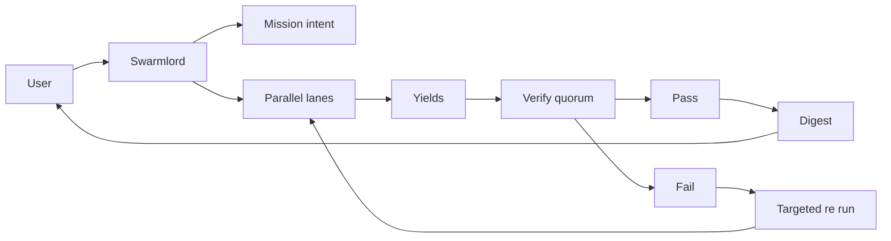
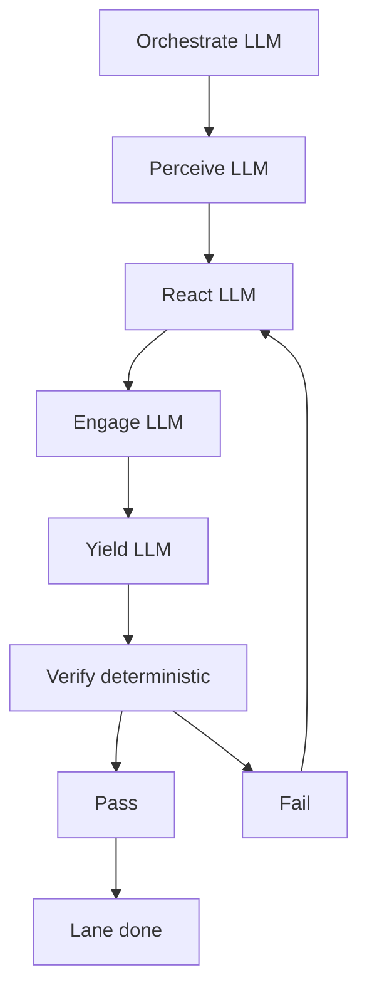
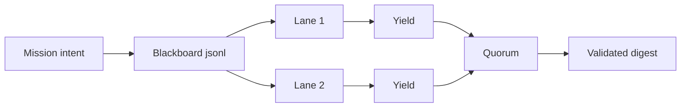

---
hexagon:
  ontos:
    id: 725944da-9aa0-4843-95b4-61357dce2489
    type: md
    owner: Swarmlord
  chronos:
    status: active
    urgency: 0.5
    decay: 0.5
    created: '2025-11-23T11:07:35.871390Z'
    generation: 51
  topos:
    address: eyes/archive/hfo_gem/gen_22/crew_ai_swarm_ssot_gen22.md
    links: []
  telos:
    viral_factor: 0.0
    meme: crew_ai_swarm_ssot_gen22.md
---

# Gen22 SSOT — Crew AI + Swarm Orchestration (Single Source of Truth)

BLUF
- Unify orchestration under PREY with LLM at every stage (plus Orchestrate), deterministic Verify quorum, blackboard stigmergy, and a validated digest.
- This document is upstream and normative. Code must be (re)generated or refactored to conform here, not vice versa.
- Aligns with mission intent 2025-10-31 v1 and Clarification Passes 1–5.

Scope
- Applies to: Swarmlord facade, lane lifecycle (Orchestrate + PREY), validators/quorum, stigmergy, telemetry, adapters (ARC, Math, PettingZoo), and digest.
- Guarantees: artifact shapes, traceability fields, safety envelope, transport resiliency, and contact policy.

## Architecture overview

End-to-end (parser-safe)


Lane internal (LLM per stage)


Stigmergy + quorum (parser-safe)


## Contracts (tiny)
- Inputs: mission intent (per-stage LLM defaults, quorum, stigmergy), env, allowlist, provider params.
- Outputs: lane artifacts (YAML), quorum_report.yml, swarmlord_digest.md, blackboard receipts, spans.
- Success: validator PASS per lane, quorum PASS/FAIL recorded, digest validated; no placeholders; safety respected.
- Failure: validator FAIL, missing evidence refs, placeholders, broken schema, tripwire hits. Action: shrink scope, retry.

## Safety envelope
- Chunk size ≤ 200 lines per write; placeholder ban; canary-first; measurable tripwires; explicit revert.
- Contact policy: digest-only except on critical error or timeout (return best partial with plan).

## Artifact schemas (normative)

All artifacts include traceability fields:
- trace_id (run scope)
- parent_refs (upstream artifacts or receipts)
- evidence_hashes (sha256 of key files or snippets)
- context_notes (≥ 3 lines)

1) mission_pointer.yml (run-level)
- mission_id, timestamp, intent_path, lanes, quorum, telemetry.

2) perception_snapshot.yml (lane-level)
- mission_id, lane, timestamp, trace_id
- safety_envelope { chunk_size_max, placeholder_ban, tripwires }
- llm { model_hint, max_tokens, temperature, timeout_seconds, reasoning, reasoning_effort, allowlist, api_key_present }
- paths { blackboard, spans, lane_dir }
- tdd_mode: true|false
- context_notes (≥3 lines), parent_refs, evidence_hashes

3) react_plan.yml
- mission_id, lane, timestamp
- cynefin_rationale { domain, rationale }
- approach_plan { loop: [orchestrate, perceive, react, engage, yield], chunk_limit_lines, tripwires, receipts, verify_quorum { validators, threshold } }
- acceptance_criteria tying to tdd.required
- context_notes (≥3), trace_id, parent_refs, evidence_hashes

4) engage_report.yml
- mission_id, lane, timestamp
- actions [shaper_run, llm_call|llm_skipped]
- safety { bounded_tokens, placeholder_ban }
- metrics_summary { task specific metrics }
- changes_summary (what changed / produced)
- tests_green: bool, tripwires_passed: bool, evidence_refs_present: bool
- llm { ok, model, latency_ms, status_code, error, content_preview, max_tokens, requested_model_hint, reasoning_enabled, reasoning_effort, reasoning_removed_on_retry }
- context_notes (≥3), trace_id, parent_refs, evidence_hashes

5) yield_summary.yml
- mission_id, lane, timestamp
- collected_agents [observer, bridger, shaper, assimilator]
- evidence_refs must include: perception_snapshot.yml, react_plan.yml, engage_report.yml
- lane_summary, recommendations
- context_notes (≥3), trace_id, parent_refs, evidence_hashes

6) quorum_report.yml (run-level)
- mission_id, timestamp, validators [immunizer, disruptor, verifier_aux], threshold 2/3, performed_by swarmlord
- votes [{ lane, pass, notes }], attestation
- evidence_refs to lane yields and validator receipts

7) swarmlord_digest.md (run-level)
- BLUF, lane↔model matrix, parser-safe diagrams, executive summary, evidence_refs
- Validation checklist: bluf_present, matrix_present, diagrams_present, diagrams_parser_safe, executive_summary_present, evidence_refs_complete

### Reference schema snippets (normative mirrors for validators)

Perception snapshot (lane)

```yaml
perception_snapshot.yml:
  mission_id: str
  lane: str
  timestamp: str
  trace_id: str
  safety_envelope: dict
  llm: dict
  paths: dict
  tdd_mode: bool
  parent_refs: list   # paths/receipts
  evidence_hashes: list  # sha256 strings
  context_notes: str  # ≥3 non-empty lines
```

React plan (lane)

```yaml
react_plan.yml:
  mission_id: str
  lane: str
  timestamp: str
  trace_id: str
  cynefin_rationale: dict
  approach_plan: dict   # includes loop, chunk_limit_lines, tripwires, receipts, verify_quorum
  acceptance_criteria: dict
  parent_refs: list
  evidence_hashes: list
  context_notes: str
```

Engage report (lane)

```yaml
engage_report.yml:
  mission_id: str
  lane: str
  timestamp: str
  trace_id: str
  actions: list
  safety: dict
  metrics_summary: dict
  changes_summary: str
  tests_green: bool
  tripwires_passed: bool
  evidence_refs_present: bool
  llm: dict
  parent_refs: list
  evidence_hashes: list
  context_notes: str
```

Yield summary (lane)

```yaml
yield_summary.yml:
  mission_id: str
  lane: str
  timestamp: str
  trace_id: str
  collected_agents: list
  evidence_refs: list
  lane_summary: str
  recommendations: str
  parent_refs: list
  evidence_hashes: list
  context_notes: str
```

Quorum report (run)

```yaml
quorum_report.yml:
  mission_id: str
  timestamp: str
  validators: list   # [immunizer, disruptor, verifier_aux]
  threshold: int     # 2
  performed_by: str  # swarmlord
  votes:              # one per lane/validator aggregation
    - lane: str
      pass: bool
      notes: str
  attestation: str
  evidence_refs: list   # lane yields + validator receipts
```

## LLM orchestration (per stage)
- SSOT default model: openai/gpt-oss-120b (allowlist enforced; mission/env may override).
- SSOT token budget: max_tokens = 1000 per node by default.
  - Orchestrate (Swarmlord): 1000
  - Perceive (lane): 1000
  - React (lane): 1000
  - Engage (lane): 1000
  - Yield (lane): 1000
  - Quorum (run-level): 1000
  - Digest (run-level): 1000
- Reasoning: enable for supported models with effort=high unless mission/env disables it.
- Transport resiliency: retry-on-empty=1; on retry, drop response_format and reasoning; record reasoning_removed_on_retry.
- Env overrides allowed; allowlist enforced (OPENROUTER_MODEL_HINT, OPENROUTER_MAX_TOKENS, etc.).

## Concurrency and lanes
- lanes.count default 10; lanes.max_workers 10.
- names: explicit or generated; per-lane model_hint precedence: lane hint > per-stage model > env.

## Verify quorum (deterministic)
- Validators: immunizer, disruptor, verifier_aux; threshold = 2/3.
- Performed_by = swarmlord (future role: quorum_officer).
- Quorum runs after all yields; produces quorum_report.yml and receipts.

## Stigmergy protocol
- Substrate: hfo_blackboard/obsidian_synapse_blackboard.jsonl (append-only).
- Signals: qualitative (labels/tags), quantitative (scores/counters).
- Dynamics: attraction, repulsion, evaporation_ttl_seconds, diffusion_coefficient.
- Policy: coordination via blackboard only; no ad hoc human prompts mid-loop.
- Receipts: include safety_envelope, evidence_refs, optional signals and TTL.

## Telemetry
- Spans written to temp/otel/trace-*.jsonl.
- Stage spans include: model, max_tokens, latency_ms, reasoning flags, lane, phase.
- Analyzer can detect parallelism and LLM attributes.

## Provider adapters
- ARC: dataset ai2_arc/ARC-Challenge; split=validation, limit=50, seed=42; writes lane artifacts per SSOT and engages LLM with per-stage defaults.
- Math: simple math sanity with per-stage LLM and the same artifacts.
- PettingZoo: simple_tag_v3; runs matrix or single eval; emits compliant artifacts and receipts.

## Mapping to code (current modules)
- Unified runner: scripts/crew_ai/runner_unified.py — delegates to orchestrator; lane orchestration, receipts, spans, verify, digest.
- ARC swarm: scripts/crew_ai/arc_swarm_runner.py — parallel lanes per model; must align artifacts to SSOT.
- LLM client: scripts/crew_ai/llm_client.py — allowlist, reasoning toggles, resiliency, timeouts.
- Validator: scripts/crew_ai/validate_run.py — lane/run validation; extend to enforce SSOT schemas.
- Schemas directory: scripts/crew_ai/schemas/ — place normative schema mirrors for linting.

## Regeneration from SSOT (plan)
1) Schemas
- Author YAML schema fragments in scripts/crew_ai/schemas/ mirroring SSOT fields and min-lines for context_notes.
2) Generators
- Add small helpers to emit artifact skeletons with traceability; stages fill specific sections.
3) Runner alignment
- Load mission intent; write mission_pointer.yml; run Orchestrate; run PREY with per-stage model/tokens; write artifacts per SSOT.
4) Validators
- Enforce required fields, evidence refs, min-lines; produce PASS/FAIL receipts.
5) Quorum + Digest
- Emit quorum_report.yml and swarmlord_digest.md; validate digest per checklist.
- Quorum LLM note (1000 tokens) summarizes votes and flags; Digest executive summary is LLM‑generated (1000 tokens) and non‑placeholder.
6) Adapters
- ARC/Math/PZ import the same helpers and schemas, ensuring identical artifacts and receipts.

## Compliance mapping
- Pass 1: unified PREY, deterministic Verify, safety and receipts.
- Pass 2: ARC validation canary, tokens defaults, concurrency targets.
- Pass 3: lock per-stage defaults (2000, oss-120b), yield-with-validation.
- Pass 4: embed TDD and lane validation; retries with shrink scope.
- Pass 5: stigmergy signals and mesh quorum posture; audit fields on artifacts.

Notes
- This SSOT governs code changes. If code diverges, refactor code to match this document.
- Keep writes ≤ 200 lines per chunk and ban placeholders in committed artifacts.

---

## Operational notes — 2025-10-31 readiness and handoff

This section records concrete, parser-safe guidance from the latest successful runs to speed up iteration and handoff.

### Known-good runs and artifacts

- Pilot (Gen22 PASS): lanes with evidence hash chaining, quorum_report, digest checklist present.
  - Verify via: `python3 scripts/crew_ai/gen22_gap_report.py --strict`
  - Spans: `temp/otel/trace-*.jsonl`

- ARC swarm (10 lanes: 5 models × 2 lanes, validation, limit=50):
  - Run dir: `hfo_crew_ai_swarm_results/2025-10-31/run-1761921766139/`
  - Digest: `.../swarmlord_digest.md` with model ranking (acc, latency)
  - JSON: `.../arc_swarm_results.json` (per-lane and aggregated metrics)
  - Per-lane artifacts: `.../<sanitized_model>_lane_<n>/attempt_1/` with PREY artifacts

Observed ranking (aggregated):
- x-ai/grok-4-fast ≈ 99.00% (avg latency ~1,858 ms)
- openai/gpt-5-mini ≈ 99.00% (~6,291 ms)
- openai/gpt-oss-120b ≈ 97.00% (~1,383 ms)
- openai/gpt-oss-20b ≈ 96.00% (~1,423 ms; 1 empty+format fail across lanes)
- deepseek/deepseek-v3.2-exp ≈ 94.00% (~15,406 ms)

Interpretation:
- grok-4-fast led accuracy at sub-2s latency; strong default for ARC-like tasks.
- gpt-5-mini matched accuracy but with higher latency; useful when reasoning controls are preferred.
- gpt-oss-120b is a fast/accurate baseline among the OSS family.
- Empty/format failures are essentially eliminated at current token budgets.

### Known-good settings (env + flags)

- Engage and ARC-like tasks: max_tokens ≥ 400 to avoid empties; general default 1000 is acceptable and low-cost on OSS models.
- Reasoning: enable for supported models with effort=high unless mission explicitly disables it.
- Resiliency: retry_on_empty=1; on retry, drop response_format and reasoning fields; record `reasoning_removed_on_retry`.
- Optional pricing: set `OPENROUTER_PRICE_DEFAULT_PER_1K` (and per-model overrides) to populate cost estimates in ARC JSON.

### Per-stage LLM plan audit

- Each PREY phase logs `llm_planned` in spans and the phase receipt: planned model, max_tokens, temperature, reasoning_planned/effort.
- Engage span attributes add resiliency flags and reasoning_removed_on_retry.

### Stigmergy (in receipts)

- Minimal block present per phase: `stigmergy.signals` (e.g., label=phase:react, score=1) and `stigmergy.ttl` with an evaporation plan. Expand as needed.

### Handoff checklist (Gen22)

- Preconditions
  - `.env` with `OPENROUTER_API_KEY`; `pip install -r requirements.txt`
  - Mission intent aligned: `hfo_mission_intent/2025-10-31/mission_intent_2025-10-31.v1.yml`

- Pilot run
  - `.venv/bin/python scripts/crew_ai/runner_unified.py --intent hfo_mission_intent/2025-10-31/mission_intent_2025-10-31.v1.yml`
  - Confirm: lane artifacts present with evidence_hashes, quorum_report.yml, digest checklist.
  - Validate: `python3 scripts/crew_ai/gen22_gap_report.py --strict`

- ARC swarm (10 lanes)
  - `.venv/bin/python scripts/crew_ai/arc_swarm_runner.py --limit 50 --split validation --lanes-per-model 2 --models "gpt-5-mini,gpt-oss-120b,gpt-oss-20b,grok-4-fast,deepseek-v3.2-exp"`
  - Inspect digest and JSON; optionally add pricing envs and re-run for cost estimates.

- Evidence discipline
  - Verify `parent_refs` and `evidence_hashes` are chained: mission_pointer → perception → react → engage → yield.

- Verify gate
  - Independent PASS required before treating artifacts as final.

### Next adjustments (low-risk)

- Expand validator to enforce normative schemas (Gen22 mode).
- Mirror stigmergy blocks on artifact-write receipts consistently.
- ARC adapter: emit full Gen22 traceability (trace_id, parent_refs, evidence_hashes, context_notes ≥ 3).

### Telegram IO path (authoritative) — 2025-11-03

- Single authoritative path: Telegram bot is the sole IO surface for Telegram; the watcher does not mirror or launch consults for Telegram messages (`SWARM_TELEGRAM_AUTHORITATIVE=1`).
- Idempotency: message_id-based dedupe prevents repeated acks when Telegram re-delivers updates.
- Offline gating: limit “LLM offline” notices to once per chat per 5 minutes when `OPENROUTER_API_KEY` is absent.
- Pre-clean startup: stop stray bot/watcher/mirror processes before the bridge starts to guarantee single-instance behavior.
- Mature bot option: `python-telegram-bot` variant is available; enable via `SWARM_TELEGRAM_PTB=1`.

## Swarmlord orchestration note (task‑agnostic)

This system is intentionally task‑ and goal‑agnostic; the control loop is always:

- Operator sets a mission intent that encodes lanes, safety, and per‑stage LLM defaults.
- Swarmlord orchestrates a PREY workflow per lane (Perceive → React → Engage → Yield) using the configured LLM plan.
- After all lanes Yield, a deterministic quorum Verify runs with independent validators and a set threshold.
- On PASS, Swarmlord emits a digest back to the operator and appends receipts to the blackboard.
- Adapters/providers only change how phases do the work, not the control path.
