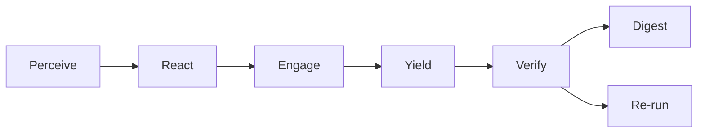

---
hexagon:
  ontos:
    id: 56012365-0c1b-42c1-b160-eee1e19388f9
    type: md
    owner: Swarmlord
  chronos:
    status: active
    urgency: 0.5
    decay: 0.5
    created: '2025-11-23T11:07:35.875744Z'
    generation: 51
  topos:
    address: eyes/archive/hfo_gem/gen_23/HFOMBSE_Gen23_Roadmap_2025-11-05T00:00:00Z.md
    links: []
  telos:
    viral_factor: 0.0
    meme: HFOMBSE_Gen23_Roadmap_2025-11-05T00:00:00Z.md
---

# HFOMBSE — Gen23 MBSE Roadmap (Single‑Source Guide)

BLUF: This is the one place to understand and advance Hive Fleet Obsidian’s MBSE path (Gen23). Start with a single YAML model, generate all diagrams (Mermaid C4), mirror to SysML v2 text, and enforce drift with CI. Short tutorials and examples included to get you moving fast.

---

## 1) What this is (and isn’t)
- Single source of truth for the Gen23 architecture and modeling workflow (HFOMBSE = Hive Fleet Obsidian MBSE).
- Practical: YAML write‑surface → generated diagrams → SysML v2 mirror (no hand‑edited diagrams).
- Scope: Orchestration (Swarmlord), PREY lanes, quorum verify, blackboard receipts, ARC lanes, Telegram path.
- Not a rewrite: We adopt Option‑C Hybrid (YAML + SysML mirror) with minimal friction.

References
- Gen22 SSOT contract: `hfo_gem/gen_22/`
- Gen23 research set: `hfo_gem/gen_23/research_*`
- Operational guide: `AGENTS.md`

---

## 2) Tiny contract (for everything we generate)
- Inputs: models/hfo.yml (Blocks, Interfaces, Allocations, Relationships, Tags, Provenance)
- Outputs: diagrams/*.md (Mermaid C4 views), sysml/*.sysml (mirror), drift report
- Success: Diagrams render; CI drift PASS; no placeholders; receipts intact
- Failure: Missing links/paths; diagrams drift; CI FAIL; placeholders left

---

## 3) Five‑minute quickstart
1. Create `models/hfo.yml` (see Minimal Model below).
2. Generate views (planned): `scripts/mbse/gen_views.py models/hfo.yml > diagrams/context.md`.
3. Mirror to SysML v2 (planned): `scripts/mbse/gen_sysml.py models/hfo.yml > sysml/hfo.sysml`.
4. Validate (planned): `scripts/mbse/validate.py --model models/hfo.yml` → PASS gates commit.

Note: Until generators land, use the examples here and the Gen23 research diagrams for grounding.

---

## 4) Minimal Model (YAML SysML‑lite example)
Save as `models/hfo.yml` (starter):

```yaml
model:
  id: hfo.gen23
  name: Hive Fleet Obsidian
  version: 0.1.0
  doctrine_tags: [HIVE, GROWTH, SWARM, PREY]
  provenance:
    sources:
      - hfo_gem/gen_23/research_ssot_diagrams_2025-11-05T00:00:00Z.md
      - AGENTS.md

blocks:
  - id: swarmlord
    title: Swarmlord Orchestrator
    kind: service
    paths: [scripts/swarmlord/telegram_bot.py, scripts/swarmlord/repo_consult.py]
    provides: [consult_api]
    consumes: [blackboard_jsonl, mission_intent]

  - id: telegram_bot
    title: Telegram Bot
    kind: gateway
    paths: [scripts/swarmlord/telegram_bot.py]
    provides: [chat_in]
    consumes: [consult_api]

  - id: prey_lane
    title: PREY Lane
    kind: worker
    provides: [lane_artifacts]
    consumes: [mission_intent, stigmergy_field]

  - id: quorum
    title: Verify Quorum
    kind: validator
    provides: [quorum_report]
    consumes: [lane_artifacts]

  - id: blackboard
    title: Blackboard (JSONL)
    kind: datastore
    paths: [hfo_blackboard/obsidian_synapse_blackboard.jsonl]
    provides: [blackboard_jsonl]

interfaces:
  - id: consult_api
    from: telegram_bot
    to: swarmlord
    note: Repo‑aware consults with bounded memory

  - id: lane_out
    from: prey_lane
    to: quorum
    note: Artifacts per lane feed quorum verify

relationships:
  - type: uses
    from: swarmlord
    to: prey_lane
    note: Orchestrates lanes per mission intent

  - type: writes
    from: swarmlord
    to: blackboard
    note: Append receipts (JSONL)

  - type: reads
    from: quorum
    to: blackboard
    note: Record PASS/FAIL receipts

allocations:
  - block: prey_lane
    paths: [scripts/crew_ai/runner_unified.py, scripts/crew_ai/analyze_traces.py]
  - block: quorum
    paths: [scripts/crew_ai/validate_run.py]
```

Why this shape?
- Blocks name stable subsystems (service/worker/validator/datastore).
- Interfaces define directional intent.
- Relationships declare broader couplings (uses/writes/reads).
- Allocations bind model blocks to concrete repo paths.

---

## 5) Example generated views (Mermaid, parser‑safe)
Context (top‑level):


PREY lifecycle (lane‑internal):



---

## 6) Tutorials (do once, repeat safely)

Add a new lane type
- Extend `blocks` with a new worker (e.g., `arc_lane`).
- Add `allocations` pointing to runner and validator scripts.
- Add `relationships` from Swarmlord to your lane; from lane to quorum.

Wire a new model (provider)
- Add a doctrine tag (e.g., `model:gpt-oss-120b`).
- Place it under `blocks` or as a tag in `prey_lane` if shared.
- Record price/latency hints under `note` until a metrics schema is added.

Enforce drift (CI idea)
- Validate all `paths` exist.
- Reject PRs if any `relationships` refer to unknown blocks.
- Regenerate diagrams; fail when git diff shows manual diagram edits.

---

## 7) Repo paths and quick runs
- PREY pilot: `scripts/crew_ai/runner_unified.py`
- Trace analyzer: `scripts/crew_ai/analyze_traces.py`
- ARC swarm: `scripts/crew_ai/arc_swarm_runner.py`
- One‑click ARC sanity: `scripts/crew_ai/auto_arc_limit50.sh` (VS Code task available)

Tip: Keep `OPENROUTER_MAX_TOKENS≈1000` for OSS models to reduce empty responses.

---

## 8) Safety and receipts (operational)
- ≤200 lines per write; no placeholders; explicit revert.
- Append receipts to `hfo_blackboard/obsidian_synapse_blackboard.jsonl`.
- Verify is independent; PASS gates persistence and digest claims.

---

## 9) Roadmap (phased)
- Phase 0 (now): Author `models/hfo.yml` using the Minimal Model. Adopt generated views as canonical.
- Phase 1: Land generators (views + sysml) and a validator; wire a CI job that fails on drift.
- Phase 2: Enrich schema (tokens, pricing, latency, stigmergy bias). Persist per‑item predictions for ARC.

Acceptance
- Diagrams render from YAML; SysML mirror builds; CI drift PASS; receipts recorded.

---

## 10) Pointers and evidence
- Gen23 research diagrams: `hfo_gem/gen_23/research_ssot_diagrams_2025-11-05T00:00:00Z.md`
- Gen22 contract notes: `hfo_gem/gen_22/`
- Ops and safety: `AGENTS.md`

When generators land, this file stays the cognitive scaffolding; the YAML model becomes the only write‑surface for architecture.

---

## 11) Transition to MBSE and SysML v2

Goal
- Move from “documents-as-code” to a model-first workflow: YAML SSOT → generated views → SysML v2 mirror → CI drift enforcement.

Mechanics
- Author YAML as the single write-surface (Blocks, Interfaces, Relationships, Allocations, Tags, Provenance).
- Generate Mermaid C4 views for day-to-day reading; never hand-edit diagrams.
- Emit a textual SysML v2 mirror from the YAML model for rigor and future tool interop.

Mapping (concept → SysML v2)
- Block → part definition; Interface → interface/port; Relationship (uses/writes/reads) → dependency/association; Allocation → satisfy/trace notes.

Acceptance
- SysML mirror compiles in a linter/parser; round-trips key names; diagrams match the YAML.

---

## 12) GitOps layer (environments, policy, delivery)

Intent
- Keep environment state declarative in-repo and reconcile via GitOps. Apply policy-as-code for safety.

Shape
- ops/gitops/<env>/ holds desired state (manifests, tasks). Policy in ops/policy/ (OPA/Conftest).
- CI validates manifests and policy before merge; optional Flux/ArgoCD reconciles out-of-band.

Model hooks (YAML additions)
```yaml
capabilities:
  ops:
    gitops:
      enabled: true
      environments: [dev, staging, prod]
      policy: { tool: opa, path: ops/policy }
```

Acceptance
- Manifests validate; policy checks PASS; dry-run reconcile shows no drift.

---

## 13) Observability and feature flags (OpenTelemetry + OpenFeature)

Intent
- Standardize traces/metrics/logs and progressive control via feature flags.

Today
- Traces already exist under `temp/otel/trace-*.jsonl` with per-lane spans and model hints.

Next
- Define stable span names and attributes (lane, phase, model, tokens, latency). Emit resource attributes (service.name, version).
- Introduce OpenFeature flags for toggles (e.g., reasoning, per-phase notes, lanes-per-model); wire a file or env provider first.

Model hooks (YAML additions)
```yaml
capabilities:
  telemetry:
    opentelemetry: { enabled: true, resource_attrs: { service.name: hfo, service.version: 0.1.0 } }
  feature_flags:
    openfeature: { enabled: true, provider: env }
```

Acceptance
- Spans present across phases with required attributes; flags can switch behaviors without code edits.

---

## 14) Simulation and model exchange (FMI)

Intent
- Enable model-in-the-loop and exchange with external tools via FMI (FMU packages).

Minimal path
- Start with a stub “simulation” block that exposes inputs/outputs and tick timing; later package as FMU.

Model hooks (YAML additions)
```yaml
blocks:
  - id: sim_stub
    title: Simulation Stub
    kind: simulator
    provides: [state_out]
    consumes: [events_in]
capabilities:
  simulation:
    fmi: { enabled: true, level: 2.0 }
```

Acceptance
- Stub can run a closed-loop dry-run; later FMU packaging produces a valid descriptor.

---

## 15) Supply chain security (SLSA + SBOM)

Intent
- Make builds attestable and artifacts auditable.

Shape
- Generate SBOM (e.g., CycloneDX/SPDX) per build; sign releases and produce SLSA attestations.

Model hooks (YAML additions)
```yaml
capabilities:
  security:
    slsa: { level_goal: 2 }
    sbom: { format: cyclonedx, path: sbom/ }
```

Acceptance
- SBOMs exist for key artifacts; CI publishes provenance/attestations; verification steps documented.

---

## 16) Piecewise build-and-verify (operator-in-the-loop)

Principle
- Reduce hallucination risk by authoring one small piece at a time; you verify each step before moving on.

Loop per piece
1) Define: a tiny slice (e.g., add `quorum` relationships; add `telemetry` attributes).
2) Generate: views + SysML mirror.
3) Validate: run validators (paths exist, relationships resolved, diagrams render). No placeholders.
4) Record: append a blackboard receipt with evidence_refs to the changed files.
5) Gate: independent Verify PASS (lane validator or CI) before claiming done.

Suggested sequence
- Core blocks/relationships → PREY lane allocations → Quorum & receipts → Telemetry spans → Feature flags → GitOps skeleton → SBOM/SLSA baseline → Simulation stub/FMI.

---

## 17) Getting started (piecewise checklist)

Do this now
- Create `models/hfo.yml` using the Minimal Model and add `capabilities.telemetry` and `capabilities.feature_flags`.
- Add one acceptance rule to the validator spec: “all `paths` must exist”.
- Generate views locally (script placeholder ok) and sanity-check against Gen23 research diagrams.

Next small pieces
- Add `capabilities.ops.gitops` with environments; create `ops/gitops/dev/` skeleton.
- Expand spans to include `reasoning_enabled` and `reasoning_effort` as standard attributes.
- Add `security.sbom` entry and a placeholder generation step in CI (dry-run ok).

Definition of done (per slice)
- Verified by you (manual check), validated by a script (PASS), receipt appended; no placeholders; ≤200 lines per write.
