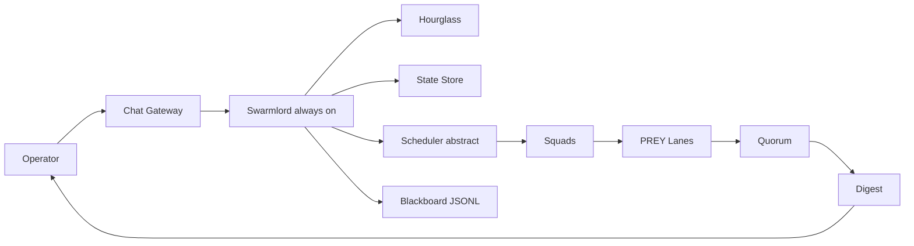
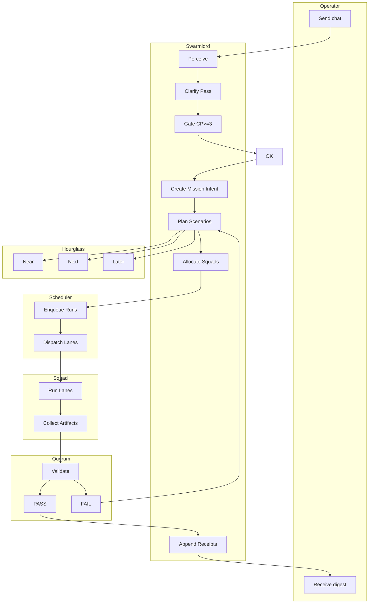
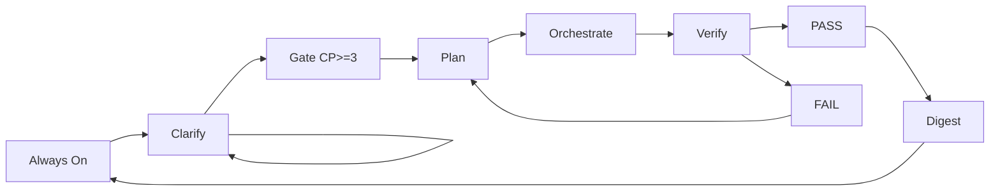
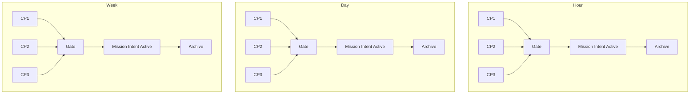
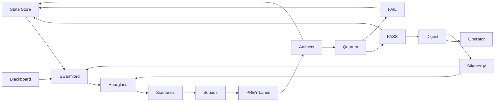
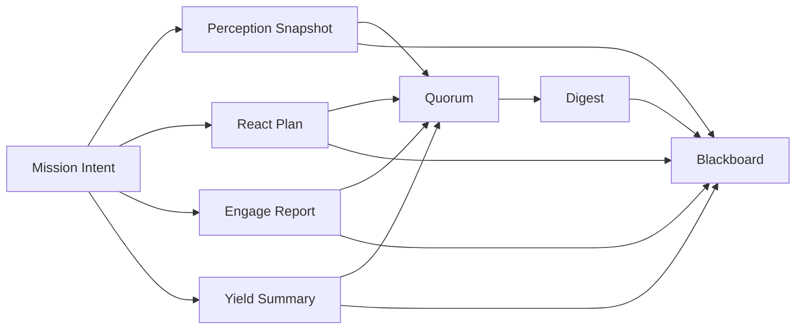

# Diagrams — Swarmlord of Webs (Gen23, T‑Gamma) — 2025‑11‑05

Note
- Research views for confirmation. SSOT remains the YAML model. Labels use plain language; diagrams are parser‑friendly.
- Assumptions: CP≥3 gate, one active Mission Intent per timeframe, squads (topic × horizon), Hourglass tool, Verify/Quorum, single Digest.

## 1) Context view (C4‑style)

## 2) Swimlane flow (actors across steps)

## 3) Swarmlord state life‑cycle (graph fallback)

## 4) Timeframe gate (single active intent per bucket)

## 5) Feedback mesh (memory, stigmergy, scenarios, results)

## 6) Artifact and evidence flow

Acceptance
- Diagrams render; labels match: CP>=3 gate, single intent per timeframe, squads (topic × horizon), Hourglass, Quorum, Digest, blackboard receipts.
- If you want these committed as generated views later, we will mirror from the YAML SSOT rather than maintain them by hand.
