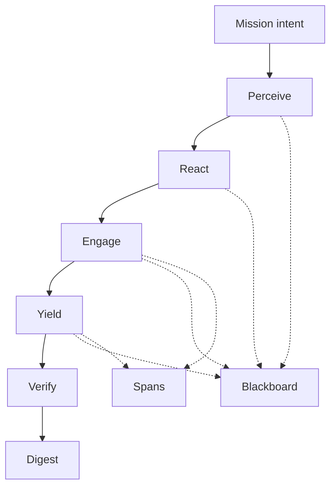
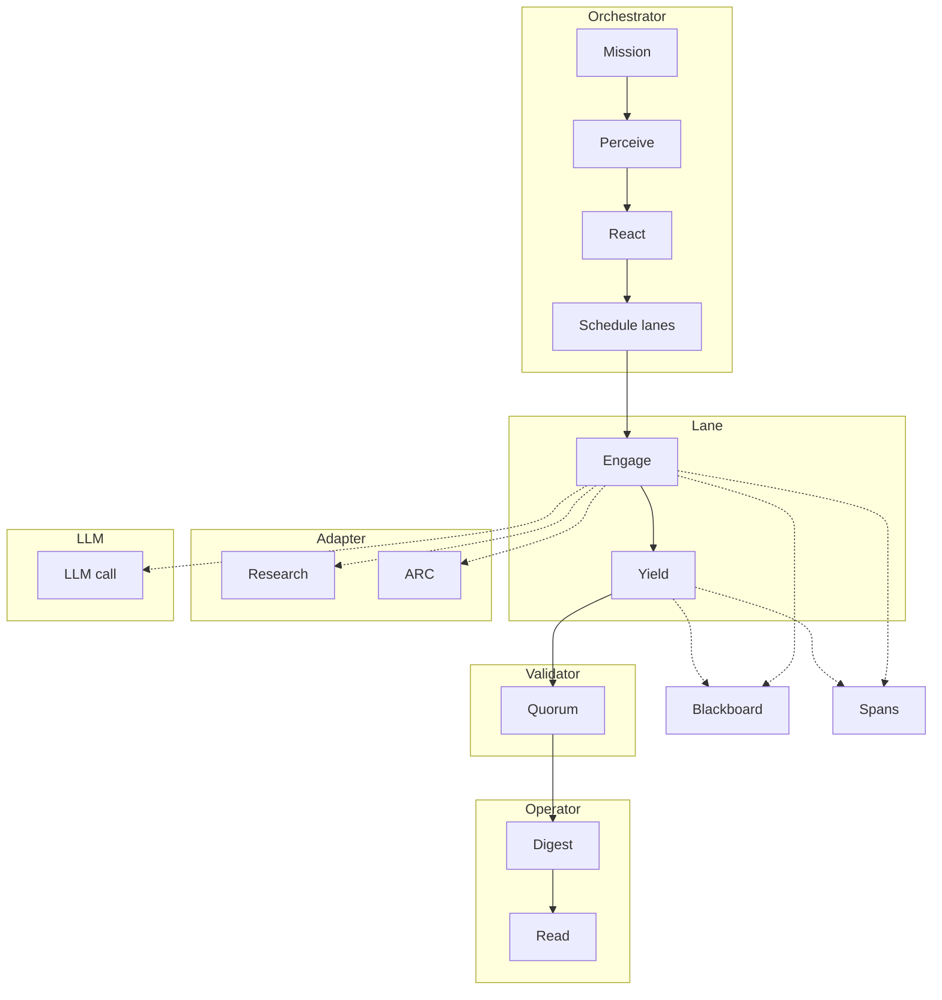
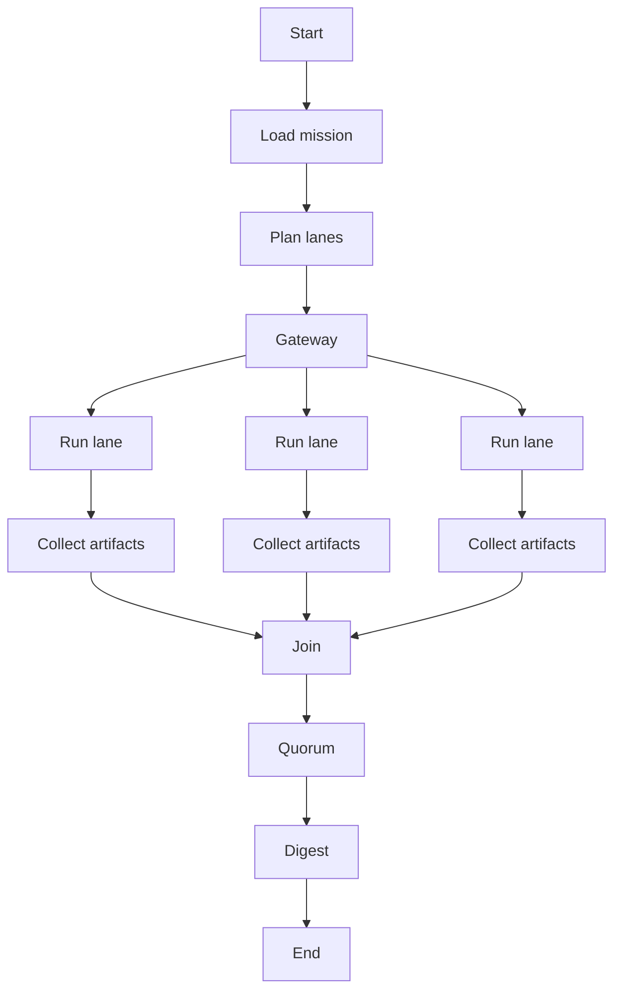
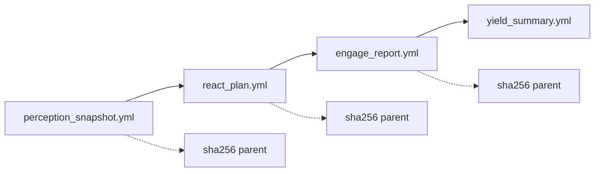
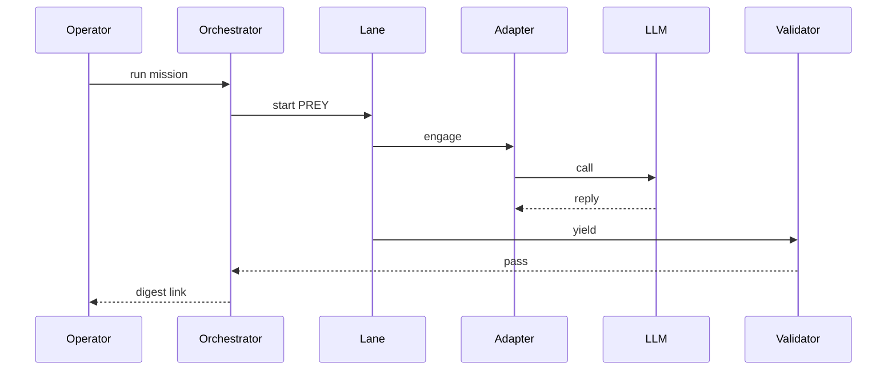

---
hexagon:
  ontos:
    id: c07d5df2-695d-4e78-80e6-81d19b4e485a
    type: md
    owner: Swarmlord
  chronos:
    status: active
    urgency: 0.5
    decay: 0.5
    created: '2025-11-23T11:07:35.881793Z'
    generation: 51
  topos:
    address: eyes/archive/hfo_gem/gen_23/research_architecture_diagram_2025-11-05T00:00:00Z.md
    links: []
  telos:
    viral_factor: 0.0
    meme: research_architecture_diagram_2025-11-05T00:00:00Z.md
---
# Hive Fleet Obsidian — Gen23 Architecture SSOT

Date: 2025-11-05 (UTC)
Updated: 2025-11-05 (UTC)
Branch: feat/telegram-topic-research-digest

## BLUF
- The system orchestrates multi-lane PREY (Perceive, React, Engage, Yield) in parallel, validates with quorum, and compiles a single operator-facing digest.
- The 100-lane research run completed with Verify PASS and true parallelism confirmed by span analysis.
- Evidence is traceable: per-lane artifacts with hash chaining, append-only blackboard receipts, spans, and a digest.

## Executive summary
- Control loop: Mission intent → Orchestrator → Parallel PREY lanes → Quorum → Digest.
- Core components: Runner/Orchestrator, Adapters (Research/ARC), LLM client (allowlist + reasoning), Receipts + Artifacts, Trace analyzer.
- Safety envelope: ≤200 lines per write; placeholder ban; canary-first; measurable tripwires; explicit revert.
- Evidence: JSONL blackboard, per-lane YAMLs (perception_snapshot.yml, react_plan.yml, engage_report.yml, yield_summary.yml), spans, digest.
- Validation: Quorum PASS required; parallelism verified via engage_llm spans.

References (evidence)
- Digest (100 lanes): `hfo_crew_ai_swarm_results/2025-11-05/run-1762313606858/swarmlord_digest.md`
- Trace analyzed: `temp/otel/trace-mi_architecture_100lanes_2025-11-04-1762313606858.jsonl`
- Blackboard: `hfo_blackboard/obsidian_synapse_blackboard.jsonl`

---

## Matrix (lane ↔ model schema)
This schema shows how lanes map to LLM models under the allowlist. Consult the run digest for the actual lane↔model matrix for a given run.

| Lane | Model (allowlisted substring) |
|---|---|
| lane_n | model_hint or default from mission/env |

Notes
- Per-model orchestration is supported (one lane per allowlisted model, or filtered set). Mission/env can bias selection.
- Engage uses bounded tokens and optional reasoning; retries on empty content; response_format dropped on retry when needed.

---

## Diagram 1 — PREY control flow

## Diagram 2 — Swimlanes (current runtime)

## Diagram 3 — BPMN-like flow (parser-safe)

## Diagram 4 — Evidence chain per lane

## Diagram 5 — UML sequence (current path)

---

## Verification summary (current snapshot)
- Parallelism: confirmed by spans on latest architecture run (Parallel detected: True).
- Quorum: PASS recorded in digest for the referenced run.
- Branch at snapshot: feat/telegram-topic-research-digest.

---

## Notes on safety and validation
- Chunking: write in chunks ≤200 lines; avoid truncation; scan for placeholder terms.
- Tripwires: line counts, placeholder scan, test gates, JSON/JSONL validators.
- Verify: independent quorum; PASS required before persistence and claims.
- Parallelism: engage_llm spans show overlap; analyzer reports Parallel detected: True for the 100-lane run.

## Minimal acceptance checklist (Gen23)
- Digest present with matrix and compiled sections (Key findings, Top references, Recommendations).
- Per-lane artifacts present and referenced in yield_summary.
- Quorum report present; PASS/FAIL recorded.
- Spans present; analyzer reports Parallel detected: True.
- Blackboard receipts appended with evidence_refs; no placeholders.
