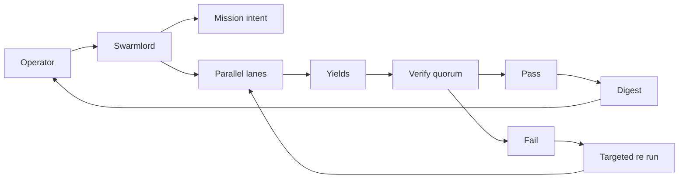
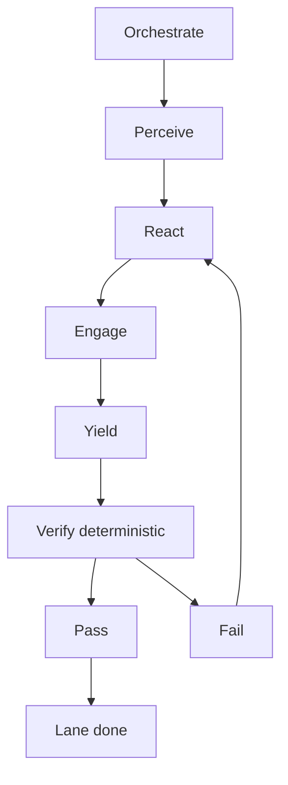
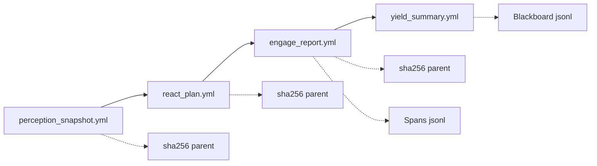
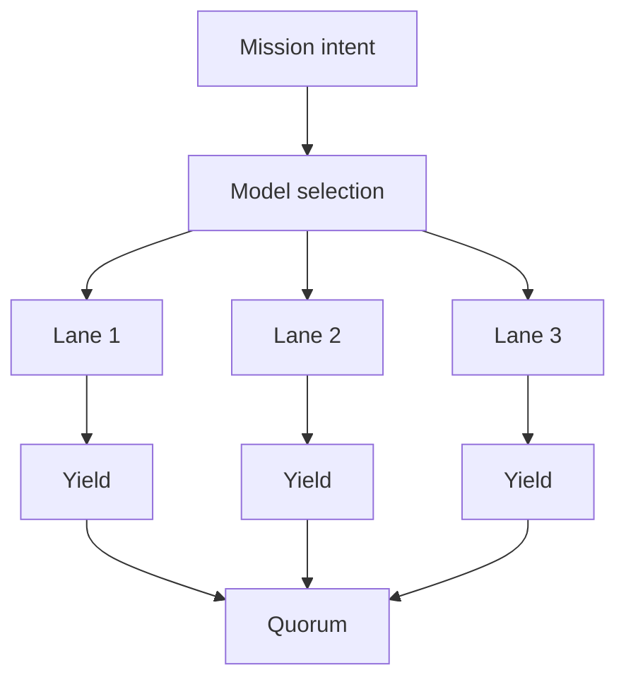
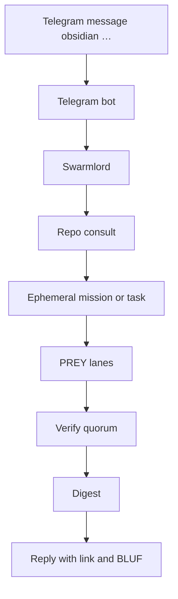
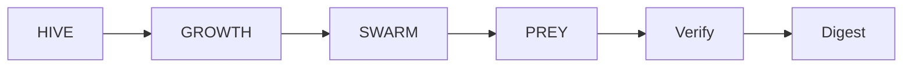

---
hexagon:
  ontos:
    id: 9098a047-9bfc-4b33-b1f9-9a3e23721fbb
    type: md
    owner: Swarmlord
  chronos:
    status: active
    urgency: 0.5
    decay: 0.5
    created: '2025-11-23T11:07:35.886778Z'
    generation: 51
  topos:
    address: eyes/archive/hfo_gem/gen_23/research_ssot_diagrams_2025-11-05T00:00:00Z.md
    links: []
  telos:
    viral_factor: 0.0
    meme: research_ssot_diagrams_2025-11-05T00:00:00Z.md
---
# Hive Fleet Obsidian — Gen23 SSOT Diagrams (single source of truth)

Date: 2025-11-05 (UTC)
Branch: feat/telegram-topic-research-digest

BLUF
- This file consolidates the architecture and workflow diagrams across gens 1–22 (favoring Gen21–Gen22) into one parser-safe source you can build from as code.
- Control path is invariant: Mission intent → Orchestrate → PREY lanes → Quorum Verify → Digest. Evidence is chained and observable.

References (upstream SSOTs)
- gen_22: `hfo_gem/gen_22/crew_ai_swarm_ssot_gen22.md`
- gen_21: `hfo_gem/gen_21/gpt5-attempt-3-gem.md`, `hfo_gem/gen_21/crew_ai_swarm_pilot_2025-10-30.md`
- repo SSOT: `AGENTS.md`

Notes
- Diagrams follow Mermaid parser-safe conventions (graph LR/TB; simple labels; one arrow per line).
- Names align with Gen21/22: HIVE/GROWTH/SWARM/PREY labels persist; “Swarmlord” is the sole operator facade.

---

## Diagram A — End-to-end orchestration

Key points
- Single facade (Swarmlord) runs PREY across lanes, then Verify gates Digest.
- Retry is targeted and scoped; success requires quorum PASS.

---

## Diagram B — Lane lifecycle (Orchestrate + PREY + Verify)

Key points
- LLM may be used at each phase (per Gen22 defaults: max_tokens≈1000; reasoning=high where supported).
- Failure loops back to React with a smaller chunk and tighter tripwires.

---

## Diagram C — Evidence chain and observability (per lane)

Key points
- Each artifact includes trace_id, parent_refs, evidence_hashes, and context_notes (≥3 lines).
- Blackboard is append-only; spans live under `temp/otel/`.

---

## Diagram D — Lanes per model and concurrency

Key points
- One lane per allowlisted model (or filtered set) is supported; env and mission can bias selection.
- Parallelism is validated by engage_llm span overlap (analyzer: “Parallel detected: True”).

---

## Diagram E — Telegram consult to digest (authoritative path)

Key points
- Bot is authoritative; watcher does not mirror when bot is active.
- One ack, then one digest reply with BLUF and next steps.

---

## Diagram F — HIVE → GROWTH → SWARM → PREY (label map)

Key points
- Use these exact labels in code, docs, and receipts to stay aligned with Gen21/22.

---

## Minimal acceptance checklist (for builds from these diagrams)
- Mission intent loads; lanes planned; PREY runs; quorum PASS recorded; digest present.
- Per-lane artifacts exist and chain via parent hashes; blackboard receipts appended; spans present.
- Parser-safe diagrams render; no placeholders; ≤200 lines per write respected.

---

Provenance
- Consolidated from gens 1–22 with emphasis on Gen21–Gen22 diagrams and contracts.
- This file is normative for Gen23; refactor code to conform to these flows.
