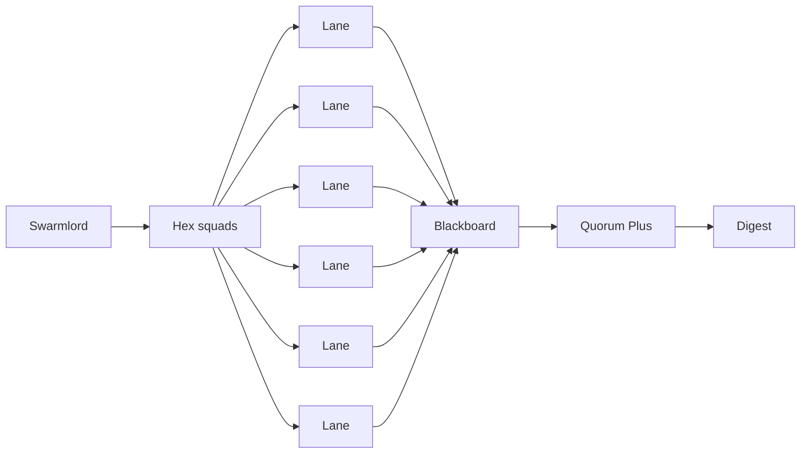

# Gen24 - 100-Swarm Orchestration Guide + MBSE SSOT

BLUF
- One SSOT for architecture (YAML -> SysML) and one swarm pattern: Swarmlord orchestrates hexagonal squads running multi-round PREY. Every artifact is LLM-generated, signals go to the blackboard, and quorum uses virtual stigmergy to converge on high-quality outputs.

What this folder provides
- models/*.yml - Gen24 MBSE SSOT: blocks, interfaces, allocations, tags
- scripts/mbse/gen_sysml.py - generator for a textual SysML mirror
- sysml/hfo.sysml - generated, read-only

Why Gen24 now
- You want 100 swarms (squads) to iterate rapidly with minimal cost, full telemetry, and auditable receipts. Gen24 standardizes the contracts and surfaces for that system-of-swarms.

## Architecture outline - 100-swarm, hexagonal squads

Concepts
- Swarmlord of Webs: the orchestrator and only human-facing facade.
- Hex squad: 6 worker lanes + optional coordinator operating on the same mission slice.
- PREY: Perceive -> React -> Engage -> Yield, repeated for R rounds per lane.
- Stigmergy: shared, append-only signals (JSONL + DuckDB views) that bias future lane behavior.
- Quorum+: artifact completeness + preview coverage + cross-evidence checks -> PASS/FAIL.

Parser-safe diagram (conceptual)

## PREY multi-round contract (LLM at every artifact)

Per round r = 1..R, per lane:
- Perceive -> perception_snapshot.yml (LLM: yes; restate mission, safety, paths)
- React -> react_plan.yml (LLM: yes; cynefin rationale, chunk limits, tripwires, quorum)
- Engage -> engage_report.yml (LLM: yes; perform task, produce content_preview)
- Yield -> yield_summary.yml (LLM: yes; synthesize evidence_refs, next hints)
- Stigmergy -> lane_findings.jsonl (machine step; extract {source_path, title, snippet})

Signals (append-only)
- Blackboard JSONL: receipts per phase/agent with evidence_refs
- Spans JSONL: OTEL-like spans per phase and per LLM call (trace-correlated)
- Findings JSONL: per-lane signals for virtual stigmergy and quorum

Cost knobs
- llm.max_tokens, temperature, timeout_seconds, reasoning/effort (mission/env)
- rounds_per_lane, lanes_per_squad, squads_count, concurrency (mission)

## Virtual stigmergy (Gen24 default)

- Per-lane: write lane_findings.jsonl during Engage from mission source_documents.
- Run-level: aggregate to RESCUE_INDEX.jsonl and RESCUED_SUMMARY.md.
- DuckDB mirror: maintain views over blackboard + findings for consensus, overlap, and drift.
- Weighting: agreement x recency x preview_quality; decay old signals.

## Quorum+ (lane and run)

- Artifacts: all four artifacts per lane present.
- Coverage: at least X% lanes with non-empty content_preview.
- Cross-evidence: references to >= M distinct mission sources across lanes.
- Report: quorum_plus_report.yml; result surfaced in digest.

## Telemetry, IDs, and audit

- Trace id: trace-<mission_id>-<ts> linked across all spans and receipts.
- Spans: one per PREY phase, agent role, and each LLM call.
- Receipts: never rewrite history; include evidence_refs and safety status.

## MBSE SSOT (YAML -> SysML)

- Inputs (author-only):
	- models/blocks.yml - services, workers, validators, datastores
	- models/interfaces.yml - edges (from->to, relation)
	- models/allocations.yml - block->repo paths
	- models/tags.yml - labels
- Generated (read-only):
	- sysml/hfo.sysml (textual SysML-like mirror)
	- future: diagrams/*.md (parser-safe Mermaid)
- Generate:
	- python3 scripts/mbse/gen_sysml.py --model-dir hfo_gem/gen_24/models --out sysml/hfo.sysml

## Cost and concurrency (rule-of-thumb)

- Budget scales with lanes x rounds x tokens_per_call x calls_per_round.
- With fast/cheap models (sub-$1 per million tokens), 100 squads x 6 lanes x 2-3 rounds is feasible.
- Use mission/env to push reasoning high when needed; otherwise keep tokens modest and let rounds drive quality.

## Prioritized TODO (Gen24)

P0 - wire for immediate value
- [ ] Move lane_findings.jsonl into Engage (RepoScannerAgent) and add to evidence_refs
- [ ] Run harvester + quorum_plus automatically and append to digest
- [ ] Add rounds_per_lane in mission and loop PREY per lane
- [ ] Add distinct sources + preview coverage thresholds to default mission

P1 - stronger stigmergy and views
- [ ] DuckDB views over blackboard + findings; top-K sources and consensus
- [ ] Emit stig/index.jsonl and stig/summary.md in each run
- [ ] Generator for diagrams from the YAML SSOT (parser-safe Mermaid)

P2 - orchestration and scale
- [ ] Temporal/Prefect wrapper for scheduling, retries, lineage
- [ ] OpenTelemetry Collector + dashboard; retain JSONL for local audit
- [ ] Knowledge base ingestion from RESCUE_INDEX with provenance and drift checks

## Recommended stack (SOTA path)

- Crew AI (current runner/agents) for lane logic and PREY artifacts.
- Temporal (workflows) to orchestrate squads, rounds, retries, and budgets at scale.
- Virtual stigmergy (JSONL + DuckDB views) for biasing and quorum evidence.
- OpenTelemetry (JSONL now, Collector later) for spans and latency/coverage charts.
- GitOps: commit mission + generated outputs; CI gates validate JSON/JSONL, spans, quorum+.
- MBSE Gen24: YAML SSOT + generated SysML; treat generated outputs as read-only.

## Acceptance (this doc)

- Outlines 100-swarm hex-squad architecture and multi-round PREY with LLM at every artifact.
- Defines stigmergy, quorum+, telemetry, MBSE, and cost/concurrency knobs.
- Provides a prioritized TODO to make this real in the repo immediately.
