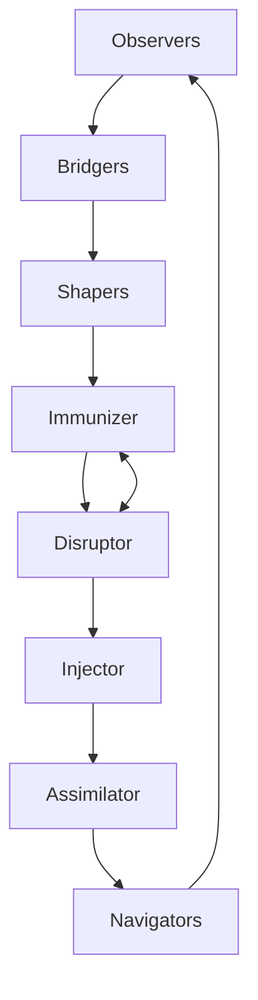

---
hexagon:
  ontos:
    id: b6247bc0-5bdb-42a2-8e19-6eb430aa7760
    type: md
    owner: Swarmlord
  chronos:
    status: active
    urgency: 0.5
    decay: 0.5
    created: '2025-11-23T11:07:35.914015Z'
    generation: 51
  topos:
    address: eyes/archive/hfo_gem/gen_25/vision_holon_roles_obsidian_2025-11-06.md
    links: []
  telos:
    viral_factor: 0.0
    meme: vision_holon_roles_obsidian_2025-11-06.md
---

# Gen25 — HOLON Roles (OBSIDIAN) Vision

BLUF
- Define eight holonic roles mapping to O B S I D I A N; each is a battle-tested tile that composes with the others.
- Pairing and co-evolution are first-class (e.g., Immunizer ↔ Disruptor); vendor neutral; maps to mosaic warfare tiles.

Roles (overview)
- O — Observers: sensors and ISR; perception at the edge; evidence-first.
- B — Bridgers: C2 / sense-making; planning and cross-layer interfaces; turns perception into action plans.
- S — Shapers: effectors; shape the environment and set conditions for success.
- I — Immunizer: blue-team defense-in-depth; block classes of attacks; build an immune system.
- D — Disruptor: red-team; disrupt to discover weaknesses; assume infinite attack surface; co-evolves with Immunizer.
- I — Injector: allocation and spawning; create/scale roles; resource orchestration and sustainment.
- A — Assimilator: analysis and knowledge work; ingest exemplars, apex patterns, and state-of-the-art to improve fitness.
- N — Navigators: strategic C2; hold the vision and constraints; Swarm Lord facade lives here.

Parser-safe diagram (holonic cycle)

Notes
- Holonic composition: each role is a whole and a part; roles can run independently or in nested compositions.
- Pairing: Disruptor and Immunizer co-evolve (break ↔ harden) to reduce tail risk.
- Mapping to workflows: Observers/Bridgers align with PREY (Perceive/React); Shapers with Engage; Navigators anchor HIVE.
- Playbooks: maintain a military tile set and an industry exemplar set for every role; swap without changing the wiring.
- Keep labels ASCII; one arrow per line; close diagrams cleanly to avoid parser issues.

Provenance
- vision_holon_roles_obsidian_2025-11-06.md (2025-11-06)
