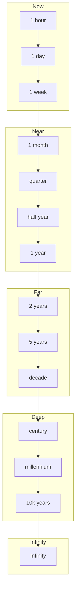

---
hexagon:
  ontos:
    id: 77147659-04c2-41c4-a095-cc7253bc66b0
    type: md
    owner: Swarmlord
  chronos:
    status: active
    urgency: 0.5
    decay: 0.5
    created: '2025-11-23T11:07:35.915355Z'
    generation: 51
  topos:
    address: eyes/archive/hfo_gem/gen_25/vision_north_star_2025-11-06.md
    links: []
  telos:
    viral_factor: 0.0
    meme: vision_north_star_2025-11-06.md
---
# Gen25 — North Star Horizons (Vision)

BLUF
- Nested time horizons align goals from "now" to "infinity"; each horizon has an N-star (North Star) that coherently rolls up to the next.
- Keep it abstract and durable; details can evolve while alignment stays consistent.

Parser-safe diagram (nested horizons)

Notes
- Each node represents an N-star at that horizon; inner horizons align upward to outer horizons.
- You can add or rename horizons without breaking the pattern; keep labels simple ASCII.
- Avoid edge labels; use one arrow per line for compatibility. Close every subgraph.
