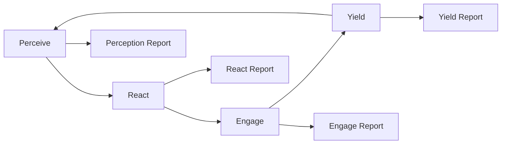

---
hexagon:
  ontos:
    id: 25e30971-2b13-4b54-b619-db76434923ad
    type: md
    owner: Swarmlord
  chronos:
    status: active
    urgency: 0.5
    decay: 0.5
    created: '2025-11-23T11:07:35.916590Z'
    generation: 51
  topos:
    address: eyes/archive/hfo_gem/gen_25/vision_prey_workflow_2025-11-06.md
    links: []
  telos:
    viral_factor: 0.0
    meme: vision_prey_workflow_2025-11-06.md
---
# Gen25 — PREY Workflow (Vision)

BLUF
- Closed-loop PREY: Perceive → React → Engage → Yield, then Yield feeds the next Perceive.
- Each step emits a report (four artifacts per round). Run solo or with specialist roles. Memory threads across rounds via virtual stigmergy.

Parser-safe loop diagram

Roles (default mapping)
- Perceive → Observers
- React → Bridgers
- Engage → Shapers
- Yield → Assimilators

Artifacts per round
- Perception Report: snapshot of inputs, constraints, safety, context
- React Report: plan, tripwires, quorum settings
- Engage Report: actions taken, evidence refs, LLM metadata when applicable
- Yield Report: summary, evidence refs to the three core artifacts, next-round pointers

Rounds and memory
- Multi-round: run several loops; Yield feeds next Perceive (attempt k links to k-1).
- Virtual stigmergy: store lightweight cues and findings to guide the next round without heavy coupling.

Notes
- Inspirations: OODA and AMAPE-K; here simplified as Sense → Make Sense → Act with feedback.
- Solo agent or team: a single agent can iterate, or roles can collaborate per step.
- Vendor neutral: wiring stays the same regardless of orchestration backend.

Provenance
- vision_prey_workflow_2025-11-06.md (2025-11-06)
