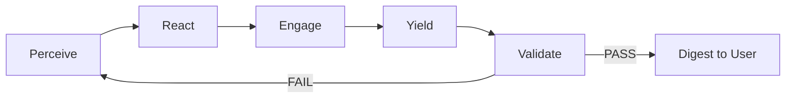

---
hexagon:
  ontos:
    id: 51e0a87e-d410-4ec0-858e-07733910d577
    type: md
    owner: Swarmlord
  chronos:
    status: active
    urgency: 0.5
    decay: 0.5
    created: '2025-11-23T11:07:35.921292Z'
    generation: 51
  topos:
    address: eyes/archive/hfo_gem/gen_25/vision_solo_ai_swarm_lord_of_webs_2025-11-06.md
    links: []
  telos:
    viral_factor: 0.0
    meme: vision_solo_ai_swarm_lord_of_webs_2025-11-06.md
---

# Gen25 — Solo AI: Swarm Lord of Webs (Vision)

BLUF
- A single, always-on operator available 24/7 on Telegram with durable memory and virtual stigmergy to minimize hallucinations.
- Conversational by default; when asked to work, it runs a PREY (Sense → Make Sense → Act → Yield) anytime loop with reports at each stage.
- Every stage uses an LLM call except validation in Yield, which is deterministic and non-LLM.

Parser-safe overview
```mermaid
graph LR
  U[User] --> TG[Telegram]
  TG --> SL[Swarm Lord of Webs]
  SL --> MEM[Durable Memory]
  SL --> VS[Virtual Stigmergy]
  SL --> CHAT[Chat]
  SL --> WORK[/work]
  WORK --> PREY[PREY Loop]
  PREY --> P[Perceive]
  PREY --> R[React]
  PREY --> E[Engage]
  PREY --> Y[Yield]
  Y --> V[Validate]
  V -->|PASS| D[Digest]
  V -->|FAIL| P
```

## 24/7 Telegram solo operator
- Interface: Telegram bot as the only human-facing facade; workers never DM the user.
- Presence: Health checks and auto-restart; degraded mode falls back to local-only memory.
- Commands: Free chat; /work to enter task mode; /status, /stop, /revert for control.
- Identity & safety: Onboarding message with capabilities and guardrails; receipts to blackboard.

## Durable memory and virtual stigmergy
- Memory: Conversation state and mirrors under `swarmlord_chat/` (JSON + DuckDB).
- Virtual stigmergy: Layered task context from lane findings, receipts, consensus bundles, and chat transcripts.
- Recall: Stage-aware retrieval prefers latest attempt and verified receipts; excludes stale or unverifiable sources.
- Drift control: Append-only receipts in `hfo_blackboard/obsidian_synapse_blackboard.jsonl` for material actions.

## PREY anytime loop (Sense → Make Sense → Act → Yield)
- Trigger: User says /work (or equivalent). Loop runs until Verify PASS or budget/time cap.
- Anytime behavior: Can yield intermediate results at any point; continues refining on request.
- Artifacts per stage (pilot-aligned):
  - Perceive → `perception_snapshot.yml` — mission, safety, inputs, sources.
  - React → `react_plan.yml` — cynefin, playbooks, approach, tripwires.
  - Engage → `engage_report.yml` — actions, evidence, metrics.
  - Yield → `yield_summary.yml` — result, links, conversation_trace, PASS/FAIL.

PREY wiring (parser-safe)


### Perceive (Sense)
- Inputs: chat intent, repo files, prior attempts (k-1), local or allowed search.
- Ops: collect signals, de-duplicate, note constraints and safety, produce snapshot.
- Artifact: `perception_snapshot.yml` with mission_id, lane, timestamp, safety, llm, paths.
- LLM: summarize inputs, list sources, propose focus areas; include evidence_refs.

### React (Make Sense)
- Inputs: `perception_snapshot.yml`, constraints, playbook library.
- Ops: classify with Cynefin; choose playbooks; define steps, tripwires, budgets.
- Artifact: `react_plan.yml` with cynefin, approach, chunk limits, tripwires, links.
- LLM: produce a rationale-backed plan with measurable gates.

### Engage (Act)
- Inputs: `react_plan.yml`; for attempt>1 also prior `yield_summary.yml`.
- Ops: execute steps with tools/code; capture evidence and metrics.
- Artifact: `engage_report.yml` with actions, evidence_refs (lane_findings, diagrams when present), links.
- LLM: used for drafting, transformations, or reasoning under safety.

### Yield (Validate and loop)
- Inputs: `engage_report.yml`, run outputs.
- Ops: run non-LLM validators (linters, tests, schema checks, CI); prepare summary.
- Artifact: `yield_summary.yml` with PASS/FAIL, links, conversation_trace; set regen_flag on FAIL.
- Looping: FAIL → shrink scope and return to Perceive; PASS → digest to the user and archive receipts.

## LLM call policy and safety
- Stages: LLM at Perceive/React/Engage; Yield uses deterministic validators and may LLM-summarize after PASS.
- Transport resiliency: one retry on empty; drop strict response_format on retry; timeout ≤ 30s.
- Allowlist: bound to repo allowlist; reasoning=high when supported; record reasoning flags in receipts.
- Budgets: max tokens per stage configurable; line-count and placeholder tripwires enforced for writes.

## Tiny contract
- Inputs: chat intent, repo state, allowed tools, budgets.
- Outputs: four PREY artifacts per attempt, receipts, digest to chat.
- Success: validator PASS; receipts with evidence_refs; hallucinations minimized via evidence-first recall.
- Failure: tripwire trigger or validation FAIL; auto-regenerate with narrower scope.

## Acceptance checklist
- Telegram facade responds 24/7 and enters /work mode on demand.
- Durable memory under `swarmlord_chat/` used across attempts.
- PREY artifacts written per attempt with links and conversation_trace.
- Yield uses non-LLM validation; receipts recorded to blackboard with evidence_refs.
- Allowlisted models, reasoning flags, and retry metadata captured in Engage receipts.

## Interfaces and allocations (initial)
- Telegram facade → `swarmlord_chat/` (session state and gateway docs)
- PREY runner → `scripts/crew_ai/runner.py`
- Validators → `scripts/crew_ai/validate_run.py`, `scripts/ci/validate_blackboard.py`
- SSOT and mirror → `hfo_gem/gen_25/README.md`, `sysml/hfo.sysml`
